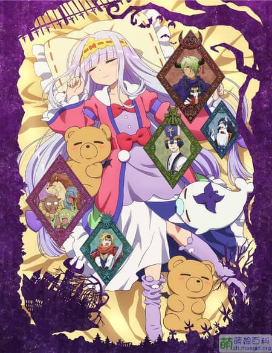
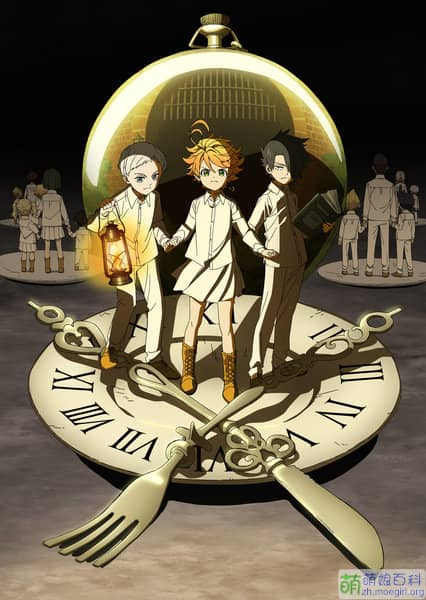
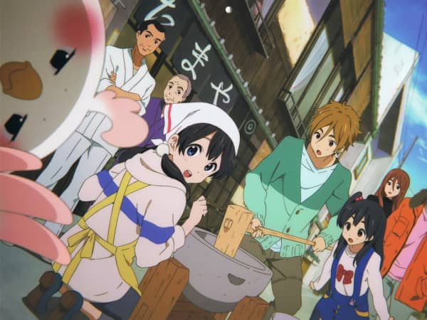
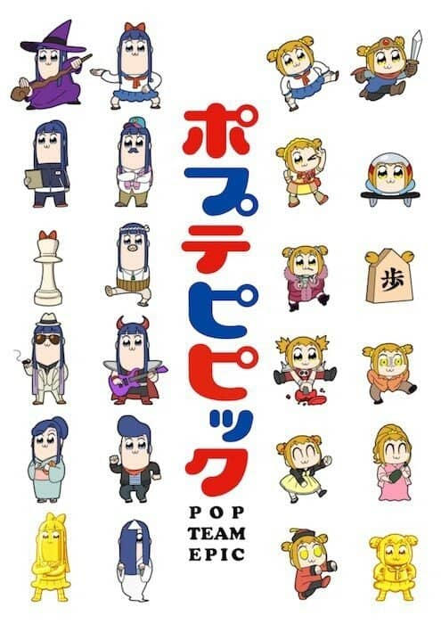
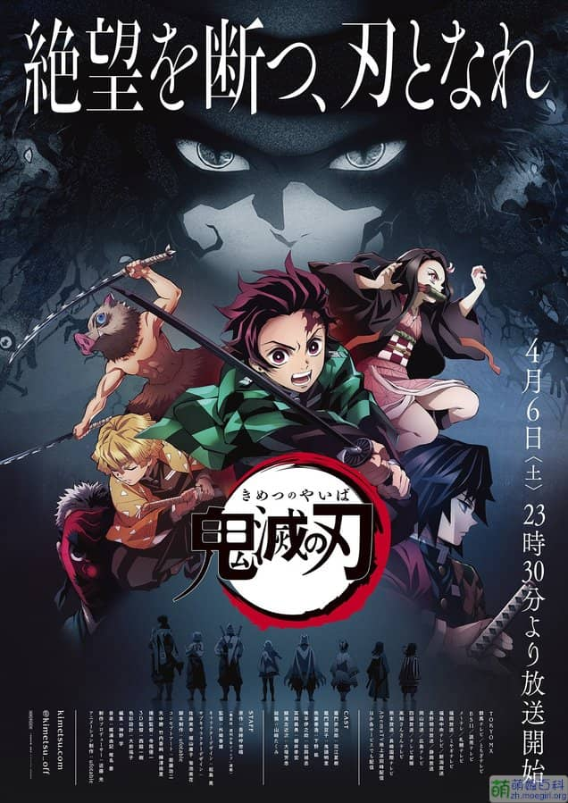
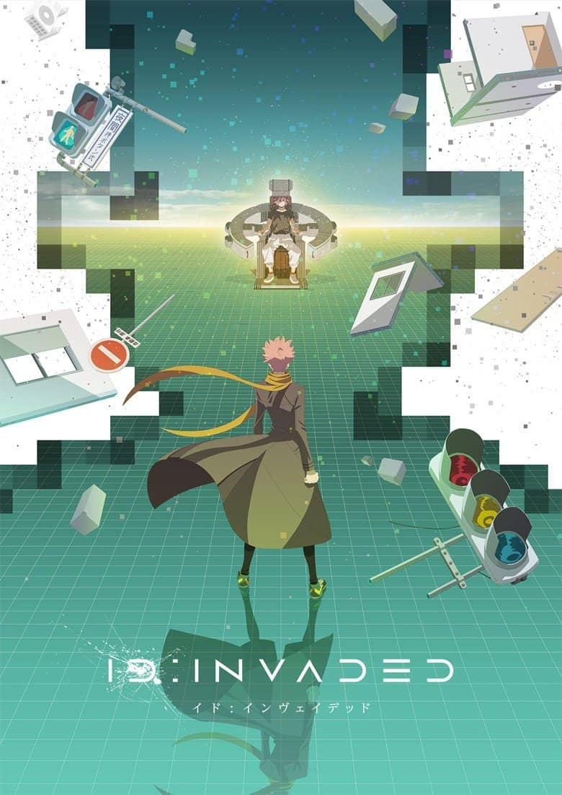
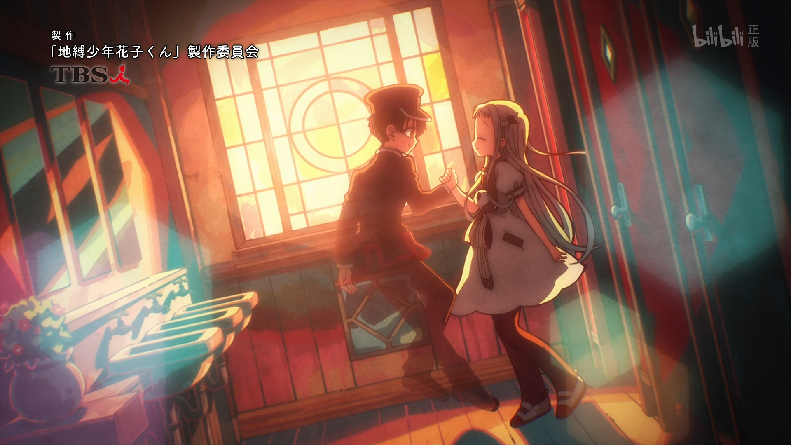
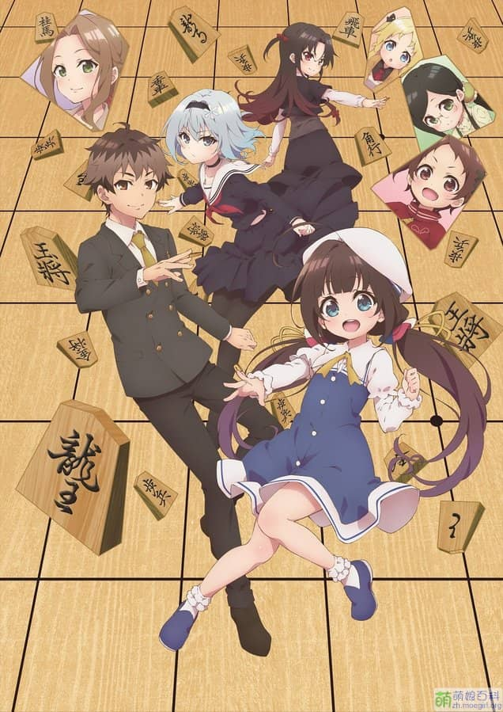
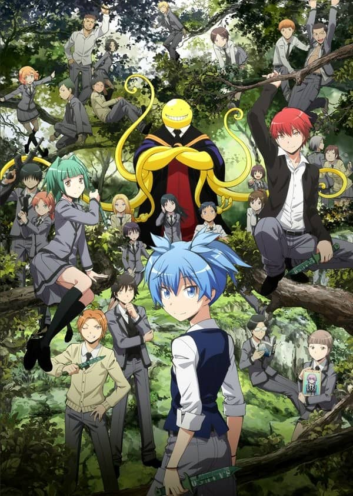

# 本界面已经停止更新！

由于实现方式过于混乱、代码低效等原因，《追番日记》自 2022 年起不再记录。最新相关追番记录已迁移至 [Magma 的动画 (bgm.tv)](https://bgm.tv/anime/list/magma)。本界面等待重新开发。

2024 年 6 月 30 日更新：本站由早期的 WordPress 迁移至 Astro。本文彻底崩坏了，等待重新开发。

关于本页面的历史可以在 [互联网档案馆](https://web.archive.org/web/20230605181841/https://magma.ink/fan/) 中查看。

---

_[小林](https://dylanlynn.top/)为本界面提供弹性排版支持_

## 2022 年及以后

\[su_spoiler title="未上映内容（点击查看）" icon="chevron"\]

\[sc name="liststart"\]\[sc name="fanstart"\]\[su_image_carousel source="media: 2846" max_width="80%" crop="3:4" spacing="no" align="center" dots="no" autoplay="0" image_size="full"\]\[sc name="fanbili" title="天使降临到我身边 剧场版" mark="" fan="天使降临到我身边" from="已追作品续作" type="漫画改" origin="" produced="动画工房" 1="" 2="" 3="" 4="" 5="" alert="" start="" end=""\]

```
2021年2月6日，宣布完全新作动画剧场公开决定。
2020年11月24日，已公布新Project始动
```

\[sc name=fanend\]\[sc name="fanstart"\]\[su_image_carousel source="media: 2847" max_width="80%" crop="3:4" spacing="no" align="center" dots="no" autoplay="0" image_size="full"\]\[sc name="fanbili" title="咒术回战 剧场版" mark="" fan="咒术回战" from="已追作品续作" type="" origin="" produced="MAPPA" 1="" 2="" 3="" 4="" 5="" alert="" start="" end=""\]

```
2021年3月27日 公布制作决定
```

\[sc name="fanend"\]\[sc name="fanstart"\]\[su_image_carousel source="media: 1642" max_width="80%" crop="4:3" spacing="no" align="center" dots="no" autoplay="0" image_size="full"\]\[sc name="fanbili" title="熊熊勇闯异世界 第二季" mark="" fan="熊熊勇闯异世界" from="" type="" origin="" produced="" 1="" 2="" 3="" 4="" 5="" alert="" start="" end=""\]

\[sc name=fanend\]\[sc name="fanstart"\]\[su_image_carousel source="media: 1526" max_width="80%" crop="3:4" spacing="no" align="center" dots="no" autoplay="0" image_size="full"\]\[sc name="fanbili" title="宇崎学妹想要玩！ 第二季" mark="" fan="宇崎学妹想要玩" from="已追作品续作" type="漫画改" origin="" produced="" 1="" 2="" 3="" 4="" 5="" alert="" start="" end=""\]

\[sc name=fanend\]\[sc name="fanstart"\]\[su_image_carousel source="media: 1528" max_width="80%" crop="3:4" spacing="no" align="center" dots="no" autoplay="0" image_size="full"\]\[sc name="fanbili" title="虚构推理 第二季" mark="" fan="虚构推理" from="已追作品续作" type="" origin="" produced="" 1="" 2="" 3="" 4="" 5="" alert="" start="" end=""\]

\[sc name=fanend\]\[sc name="fanstart"\]\[su_image_carousel source="media: 1126" max_width="80%" crop="3:4" spacing="no" align="center" dots="no" autoplay="0" image_size="full"\]\[sc name="fanbili" title="鬼灭之刃 无限列车篇" mark="" fan="鬼灭之刃" from="已追作品续作" type="" origin="" produced="" 1="" 2="" 3="" 4="" 5="" alert="" start="" end=""\]

```
10.16上映（日本），10.30（中国台湾），11.12（中国香港），大陆暂无。
已准备发售BD
```

\[sc name=fanend\]\[sc name="fanstart"\]\[su_image_carousel source="media: 2860" max_width="80%" crop="3:4" spacing="no" align="center" dots="no" autoplay="0" image_size="full"\]\[sc name="fanbili" title="工作细胞 强「菌」来袭!人体肠道大骚动!" mark="" fan="工作细胞" from="已追作品续作" type="" origin="" produced="" 1="" 2="" 3="" 4="" 5="" alert="" start="" end=""\]

```
20.9.5已上映（日本），20.10.8已上映（中国台湾），大陆暂无
已准备发售BD
```

\[sc name=fanend\]\[sc name=fanend\]\[/su_spoiler\]

## **2021 年**

\[su_spoiler title="未放送内容（点击查看）" icon="chevron"\]

还没有年内即将放送的已追作品续作。

\[/su_spoiler\]

\[sc name="liststart"\]

\[sc name="fanstart"\]\[su_image_carousel source="media: 3882" max_width="80%" crop="3:4" spacing="no" align="center" dots="no" autoplay="0" image_size="full"\]\[sc name="fanbili" title=" 国王排名 ⏩" mark="" fan="国王排名" from="10 月新番" type="漫画改" origin="十日草輔（KADOKAWA 刊）" produced="WIT STUDIO" 1="治愈" 2="励志" 3="奇幻" 4="" 5="" alert="" start="12.9" end=""\]\[sc name="fanend"\]

\[sc name="fanstart"\]\[su_image_carousel source="media: 3488" max_width="80%" crop="3:4" spacing="no" align="center" dots="no" autoplay="0" image_size="full"\]\[sc name="fanbili" title="白砂的水族馆 ⏸" mark="" fan="白砂的水族馆" from="7 月新番" type="原创" origin="" produced="P.A.WORKS" 1="青春" 2="日常" 3="励志" 4="治愈" 5="" alert="" start="7.9 → 12.1" end=""\]\[sc name="fanend"\]

\[sc name="fanstart"\]\[su_image_carousel source="media: 3466,2841" max_width="80%" crop="3:4" spacing="no" align="center" dots="no" autoplay="0" image_size="full"\]\[sc name="fanbili" title="我立于百万生命之上 第二季?" mark="" fan="我立于百万生命之上" from="已追作品续作" type="漫画改" origin="讲谈社《别册少年 Magazine》" produced="MAHO FILM" 1="" 2="" 3="" 4="" 5="" alert="" start="尚未观看" end=""\]\[sc name="fanend"\]

\[sc name="fanstart"\]\[su_image_carousel source="media: 3319" max_width="80%" crop="3:4" spacing="no" align="center" dots="no" autoplay="0" image_size="full"\]\[sc name="fanacfun" title="佐贺偶像是传奇?" mark="⭐4.5" fan="佐贺偶像是传奇" from="AC 猴推荐" type="" origin="原创企划" produced="MAPPA" 1="喜剧" 2="偶像" 3="沙雕" 4="" 5="" alert="" start="5 月十几来着" end=""\]\[sc name="fanend"\]

\[sc name="fanstart"\]\[su_image_carousel source="media: 3158" max_width="80%" crop="3:4" spacing="no" align="center" dots="no" autoplay="0" image_size="full"\]\[sc name="fanbili" title="宇宙兄弟?" mark="⭐**6** 不可错过 ?励志、宇宙题材类推荐 ?喜爱" fan="宇宙兄弟" from="好友推荐" type="漫改" origin="小山宙哉 講談社「モーニング」" produced="A-1 Pictures" 1="科幻" 2="励志" 3="宇宙" 4="亲情" 5="2012 年 4 月 1 日放送" alert="" start="5 月 7 日" end=""\]

```
相关原创长评：《宇宙兄弟》“一部来自十年前的宝藏”，我们对星空的追寻从未停止。
```

\[sc name="fanend"\]

\[sc name="fanend"\]

\[su_spoiler title="已搁置的未看完番剧（点击查看）" icon="chevron"\]

\[sc name="liststart"\]

\[sc name="fanstart"\]\[su_image_carousel source="media: 3271,3270" max_width="80%" crop="3:4" spacing="no" align="center" dots="no" autoplay="5" image_size="full"\]\[sc name="fanacfun" title="不要欺负我，长瀞同学 ⏸" mark="⭐3 不尽人意" fan="不要欺负我，长瀞同学" from="21 年 4 月新番" type="" origin="漫画改 ナナシ 讲谈社『Magazine Pocket』" produced="Telecom Animation Film" 1="喜剧" 2="恋爱" 3="校园" 4="" 5="" alert="口味较重，不推荐" start="5 月 17 日" end=""\]

```
前两话SM比较猛，喜剧效果爆棚
看弹幕说后面糖分很高，不过我的确是感觉到了
算是比较有特点的恋爱喜剧
部分剧情个人还是不太能接受...
```

\[sc name="fanend"\]

\[sc name="fanstart"\]\[su_image_carousel source="media: 3152" max_width="80%" crop="3:4" spacing="no" align="center" dots="no" autoplay="0" image_size="full"\]\[sc name="fanbili" title="致不灭的你 ⏸" mark="" fan="致不灭的你" from="21 年 4 月新番" type="漫改" origin="讲谈社《周刊少年 Magazine》" produced=Brain's Base"" 1="奇幻" 2="催泪" 3="旅行" 4="" 5="" alert="" start="四月" end=""\]\[sc name="fanend"\]

\[sc name="fanstart"\]\[su_image_carousel source="media: 3026" max_width="80%" crop="3:4" spacing="no" align="center" dots="no" autoplay="0" image_size="full"\]\[sc name="fanbili" title="青梅竹马绝对不会输的恋爱喜剧 ⏸ " mark="⭐3.5 不尽人意" fan="青梅竹马绝对不会输的恋爱喜剧" from="21 年 4 月番" type="" origin="二丸修一 (電撃文庫刊)" produced="动画工房" 1="恋爱" 2="校园" 3="喜剧" 4="后宫" 5="" alert="" start="2021 年 4 月 16 日" end=""\]

```
动画工房的崩坏形态
```

\[sc name="fanend"\]

\[sc name="fanstart"\]\[su_image_carousel source="media: 1907" max_width="80%" crop="3:4" spacing="no" align="center" dots="no" autoplay="0" image_size="full"\]\[sc name="fanbili" title="堀与宫村 ⏸" mark="⭐4.5 值得一看" fan="堀与宫村" from="21 年 1 月新番" type="网络漫画改" origin="HERO、萩原ダイスケ" produced="CLOVERWORKS" 1="恋爱" 2="校园" 3="日常" 4="" 5="" alert="" start="连载" end=""\]

\[sc name="fanend"\]\[sc name="fanstart"\]\[su_image_carousel source="media: 1844" max_width="80%" crop="3:4" spacing="no" align="center" dots="no" autoplay="0" image_size="full"\]\[sc name="fanbili" title="约定的梦幻岛 第二季 ⏸" mark="" fan="约定的梦幻岛" from="已追作品续作" type="漫画改" origin="《周刊少年 JUMP》 " produced="CLOVERWORKS" 1="奇幻" 2="冒险" 3="智斗" 4="" 5="" alert="" start="21 年 1 月 7 日" end=""\]

```
第四话我裂开了在这部作品的世界观中，人类并非食物链的顶级。鬼在猎杀着人类，但人类同时也在猎杀着其他生物。这其实都是弱肉强食罢了，但不吃的话却无法继续活下去.. 这不得不让我们对动物的情感产生思考，但到头来却又没什么意义… 毕竟不吃就无法活下去梦幻岛二期他来了！这一季应该会少一些智斗的情节了，据说战斗和冒险会多一些，不太清楚能不能达到第一季的水准。
```

\[sc name="fanend"\]\[sc name="fanstart"\]\[su_image_carousel source="media: 321" max_width="80%" crop="3:4" spacing="no" align="center" dots="no" autoplay="0" image_size="full"\]\[sc name="fanbili" title="工作细胞 BLACK⏸" mark="⭐4.5 值得一看" fan="工作细胞 BLACK" from="已追作品衍生" type="漫画改" origin="讲谈社" produced="DAVID PRODUCTION" 1="科普" 2="暗黑" 3="战斗" 4="" 5="" alert="" start="21 年 1 月 9 日" end=""\]

\[sc name="fanend"\]\[sc name="fanstart"\]\[su_image_carousel source="media: 320" max_width="80%" crop="3:4" spacing="no" align="center" dots="no" autoplay="0" image_size="full"\]\[sc name="fanbili" title="工作细胞！！（第二季）⏸" mark="⭐4.5 值得一看" fan="工作细胞" from="已追作品续作" type="漫画改  " origin="讲谈社" produced="DAVID PRODUCTION" 1="科普" 2="萌系？" 3="治愈" 4="" 5="" alert="" start="21 年 1 月 9 日" end=""\]

\[sc name="fanend"\]\[sc name="fanstart"\]\[su_image_carousel source="media: 1625" max_width="80%" crop="3:4" spacing="no" align="center" dots="no" autoplay="0" image_size="full"\]\[sc name="fanbili" title="弦音－风舞高中弓道部－⏸" mark="" fan="弦音 -风舞高中弓道部-" from="京阿尼作品列表" type="轻小说改" origin="KA Esuma 文库" produced="京都动画" 1="校园" 2="运动" 3="社团" 4="" 5="" alert="" start="2020 年 12 月" end=""\]

\[sc name="fanend"\]

\[/su_spoiler\]

\[admonition title="下方为已完结、补完的作品喔?" icon="check" color="green"\]\[/admonition\]

\[sc name="liststart"\]

\[sc name="fanstart"\]\[su_image_carousel source="media: 3701" max_width="80%" crop="3:4" spacing="no" align="center" dots="no" autoplay="0" image_size="full"\]\[sc name="fan404" title="无职转生 ～在异世界认真地活下去～ 后半 ✅" mark="" fan="无职转生" from="已追作品" type="轻小说改" origin="理不尽な孫の手" produced="Studio Bind" 1="异世界" 2="奇幻" 3="后宫" 4="冒险" 5="" alert="" start="20.10.9" end="22.1.19"\]

```
21话：这一话真的是个人追番最强了属于是；
这表现力 从来没有看过这么厉害的 今天见识到了。
Bangumi 第一个9星送上
```

追番总量个数达到**100**！  
2021 年 10 月 10 日

\[sc name="fanend"\]

\[sc name="fanstart"\]\[su_image_carousel source="media: 3645" max_width="80%" crop="3:4" spacing="no" align="center" dots="no" autoplay="0" image_size="full"\]\[sc name="fan404" title="迦希女王不会放弃 ✅" mark="" fan="迦希女王不会放弃" from="7 月新番" type="漫改" origin="昆布わかめ" produced="SILVER LINK." 1="喜剧" 2="日常" 3="萌系(大概)" 4="" 5="" alert="" start="9.14" end="12.21"\]\[sc name="fanend"\]

\[sc name="fanstart"\]\[su_image_carousel source="media: 3618" max_width="80%" crop="3:4" spacing="no" align="center" dots="no" autoplay="0" image_size="full"\]\[sc name="fanbili" title="Love Live! Superstar!!✅" mark="" fan="Love Live! Superstar" from="二创" type="原创偶像企划" origin="原创" produced="日升" 1="偶像" 2="音乐" 3="校园社团" 4="" 5="" alert="" start="8.16" end="10.23"\]\[sc name="fanend"\]

\[sc name="fanstart"\]\[su_image_carousel source="media: 3676" max_width="80%" crop="3:4" spacing="no" align="center" dots="no" autoplay="0" image_size="full"\]\[sc name="fanbili" title="向山进发 第三季 ✅" mark="⭐5.5 ?超爱 ?日常萌系类推荐" fan="向山进发" from="续作" type="漫画改" origin="しろ" produced="eight bit" 1="轻百合" 2="治愈" 3="萌" 4="日常" 5="" alert="" start="9.25" end="10.7"\]

```
看完第二季，这部太喜欢了，有望能成为个人2021最佳番剧！
这个ED也很不错，和第二季的第二个ED一起循环了很久了，来感受一下：?
第三季ED：《色違いの翼 (异色的羽翼) - 井口裕香 (いぐち ゆか) /阿澄佳奈 (あすみ かな)》
第二季ED2：Cocoiro Rainbow - 鳴海杏子 (なるみ きょうこ)
```

\[sc name="fanend"\]

\[sc name="fanstart"\]\[su_image_carousel source="media: 3468,1125" max_width="80%" crop="3:4" spacing="no" align="center" dots="no" autoplay="0" image_size="full"\]\[sc name="fan404" title="小林家的龙女仆 S 第二季 ✅" mark="⭐5.5 ?超爱 ?日常类推荐" fan="小林家的龙女仆 " from="已追作品续作" type="漫画改" origin="" produced="" 1="日常" 2="喜剧" 3="" 4="" 5="" alert="" start="8.3" end="9.23"\]\[sc name="fanend"\]

\[sc name="fanstart"\]\[su_image_carousel source="media: 3677" max_width="80%" crop="3:4" spacing="no" align="center" dots="no" autoplay="0" image_size="full"\]\[sc name="fanbili" title="向山进发 回忆的礼物 ✅" mark="**⭐5.5 ?超爱 ?日常萌系类推荐**" fan="向山进发" from="续作" type="漫画改" origin="しろ" produced="eight bit" 1="轻百合" 2="治愈" 3="萌" 4="日常" 5="" alert="" start="9.24" end="9.25"\]

\[sc name="fanend"\]

\[sc name="fanstart"\]\[su_image_carousel source="media: 3639" max_width="80%" crop="3:4" spacing="no" align="center" dots="no" autoplay="0" image_size="full"\]\[sc name="fanbili" title="向山进发 第二季 ✅" mark="**⭐5.5 ?超爱 ?日常萌系类推荐**" fan="向山进发" from="已追续作" type="漫画改" origin="泰文唐、尖端出版社 しろ 荒海阳太" produced="8-bit" 1="日常" 2="萌系" 3="运动/兴趣" 4="轻百合" 5="泡面" alert="" start="8.31" end="9.24"\]

```
很不错的日常番，13分钟左右每天中午补一话感觉很不错！美好纯真的友情，虽然说是登山，但实际上还是日常，同时也带了些轻百合（太对我口味了）。补番渐入佳境后也对登山产生了兴趣，感觉就像看《摇曳露营》、《恋爱小行星》时对露营和星空产生浓厚兴趣那样，可能这就是我喜欢此类番剧的原因吧！
Bangumi番组计划上本作的评分为7.6高分，标准差仅为1.01，这意味着大部分看过的观众评价均分布在7-8。
唯一想吐槽的一点是本作的原画画风总在变动，经常出现上集和下集不是一种画风的情况...这点有点影响观感。不过总体来说还是非常优秀的！最近觉得这个系列有望成为2021年个人最佳番剧！
```

\[sc name="fanend"\]

\[sc name="fanstart"\]\[su_image_carousel source="media: 3614" max_width="80%" crop="3:4" spacing="no" align="center" dots="no" autoplay="0" image_size="full"\]\[sc name="fanbili" title="开挂药师的休闲生活～异世界里开药店～ ❌" mark=" ⭐3 " fan="开挂药师的悠闲异世界生活" from="七月新番导视 凉风" type="漫改" origin="ケンノジ著（Brave 文库）" produced="EMT SQUARED" 1="异世界" 2="日常" 3="" 4="" 5="" alert="" start="8.11" end="10.1"\]

```
不推荐，可能是我看过的最崩的番，第一话就很劝退我
2021.10.1 已放弃
```

\[sc name="fanend"\]

\[sc name="fanstart"\]\[su_image_carousel source="media: 2317,2144" max_width="80%" crop="3:4" spacing="no" align="center" dots="no" autoplay="0" image_size="full"\]\[sc name="fanacfun" title="摇曳露营 △ 第二季 ✅" mark="⭐5.5 表现优秀 ?喜爱 ?日常类推荐" fan="摇曳露营" from="21 年 1 月新番" type="漫改" origin="  芳文社" produced="C-STATION" 1="日常?" 2="露营?" 3="轻百合" 4="旅行" 5="" alert="" start=3.16 end=9.29\]

```
因为本季度有第二季，所以去补第一季了~
这么棒的日常番现在实在是少见啊，什么时候再安排一季w
最后一话等了大半年终于补完了，剧场版见！
扩展阅读：
科技真伟大
```

\[sc name="fanend"\]

\[sc name="fanstart"\]

\[su_image_carousel source="media: 3507" max_width="80%" crop="3:4" spacing="no" align="center" dots="no" autoplay="0" image_size="full"\]\[sc name="fanbili" title="精灵幻想记 ✅" mark="⭐4" fan="精灵幻想记" from="哔哩哔哩番剧推荐" type="小说改" origin="北山結莉 『精霊幻想記』（HJ 文庫／ホビージャパン）" produced="TMS 娱乐" 1="异世界转生" 2="后宫" 3="奇幻" 4="" 5="" alert="" start="7.20." end="9.21"\]

```
被白毛骗进来...第一话感觉剧情挺老套的
当爽番看看吧没什么价值...
```

\[sc name="fanend"\]

\[sc name="fanstart"\]\[su_image_carousel source="media: 3450" max_width="80%" crop="3:4" spacing="no" align="center" dots="no" autoplay="0" image_size="full"\]\[sc name="fanbili" title="干物妹小埋 S✅" mark="" fan="干物妹小埋" from="续作" type="漫画改" origin="集英社" produced="动画工房" 1="日常" 2="喜剧" 3="萌系" 4="" 5="" alert="" start="6.29" end="9.17"\]\[sc name="fanend"\]

\[sc name="fanstart"\]\[su_image_carousel source="media: 3023" max_width="80%" crop="3:4" spacing="no" align="center" dots="no" autoplay="0" image_size="full"\]\[sc name="fanbili" title="影宅 ✅" mark="⭐5 优秀 ?推荐 ?喜爱" fan="影宅" from="21 年 4 月新番" type="漫画改" origin="集英社《周刊 YOUNG JUMP》" produced="CloverWorks" 1="奇幻" 2="悬疑" 3="宫斗？" 4="" 5="" alert="" start="4.15" end="9.5"\]

```
又是集英社+CloverWorks的组合，感觉制作水准不输梦幻岛第一季
剧情、画面、分镜都很优秀 推荐看一看~
```

\[sc name="fanend"\]

\[sc name="fanstart"\]\[su_image_carousel source="media: 3497" max_width="80%" crop="3:4" spacing="no" align="center" dots="no" autoplay="0" image_size="full"\]\[sc name="fanbili" title="向山进发 ✅" mark="⭐**5.5** ?喜爱 ?萌系推荐" fan="向山进发" from="摇曳露营的弹幕们" type="漫改" origin="泰文唐、尖端出版社しろ（荒海阳太）" produced="eight bit" 1="轻百合" 2="萌系" 3="爱好/社团" 4="日常" 5="" alert="" start="7.7" end="8.28"\]

```
萌系日常不可错过的良心作，第一季是泡面番，但是值得一看！
```

\[sc name="fanend"\]

\[sc name="fanstart"\]\[su_image_carousel source="media: 3478" max_width="80%" crop="3:4" spacing="no" align="center" dots="no" autoplay="0" image_size="full"\]\[sc name="fanbili" title="因为太怕痛就全点防御力了 ✅ " mark="" fan="因为太怕痛就全点防御力了" from="《能力要平均值》相似作品" type="轻小说改" origin="夕蜜柑 KADOKAWA 刊" produced="SILVER LINK." 1="凤傲天" 2="异世界" 3="游戏" 4=萌系 5="" alert="" start="7.2" end="9.3"\]

```
感觉是个人目前看过最优秀的异世界龙/凤傲天题材的动画！虽然不完全是异世界...
```

\[sc name="fanend"\]

\[sc name="fanstart"\]\[su_image_carousel source="media: 3048" max_width="80%" crop="3:4" spacing="no" align="center" dots="no" autoplay="0" image_size="full"\]\[sc name="fan404" title="剃须。然后捡到女高中生 ✅" mark="⭐4.5 值得一看" fan="剃须。然后捡到女高中生" from="21 年 4 月新番" type="轻小说改" origin="しめさば" produced="project No.9" 1="日常" 2="恋爱" 3="喜剧" 4="未确定" 5="" alert="含有争议情节" start="4 月连载" end="7 月 6 日"\]

```
完结撒花！尽管是小说改，但是动画的整个故事还是挺完整的，结尾意外的收得非常棒。如果前几话少一些肉，我应该是能打五分的~
本季度的争议大作，国内自然是404。
有不少人不太喜欢人设...的确男主有些过于正直。但我个人认为女主人设并没有太大问题...因为她的确是代表了日本社会的一种现状，也只有男主这样正直的人才能【拯救】她。
我个人认为本作还是有其意义所在的，它的确传达了“关于像沙优这样的女高中生离家出走后，如何生活？能这样一直生活多久？社会会如何看待？”的思考，并随着剧情的推进而提出了更多的诸如此类的实际性问题。
对于离家出走啊，我认为作为一个不具有独立生活能力的人来说，这一选择终究是没有意义的，离开家庭后，我们的一切都成问题，迟早要回去，不如出发前好好想想，不过这又成了家庭上的问题了。
怎么想都是问题，这部番剧的话题讨论度和争议一定不会小...还是不要想太多好了。
```

\[sc name="fanend"\]

\[sc name="fanstart"\]\[su_image_carousel source="media: 2315" max_width="80%" crop="3:4" spacing="no" align="center" dots="no" autoplay="0" image_size="full"\]\[sc name="fanab" title="打了 300 年的史莱姆，不知不觉就练到了满级 ✅" mark="⭐4.5 值得一看 ?萌系喜剧推荐 ?喜爱" fan="打了 300 年的史莱姆，不知不觉就练到了满级" from="GA 魔女之旅动画化联动 / 21 年 4 月新番" type="轻小说改" origin="森田季节（GA NOVEL／SB Creative 刊）" produced="REVOROOT" 1="日常" 2="异世界" 3="喜剧" 4="轻百合" 5="" alert="" start=4.12 end=7.1\]

```
摩多摩多~日常轻喜剧
日常喜剧类番，可以完全放下心来看，不会有跌宕起伏的剧情，也不用怕突然发刀。主要的剧情就是日常，最难能可贵的也是日常！为美好的生活献礼~
"转生至此已有300年，自从知道自己满级之后，我的生活突然发生变化。按照这个状态，今后恐怕也会发生许多热闹的事吧。不过我能自信地说，之前的300年和最近相比，还是最近这段短暂的时光更加快乐。一个人的悠闲生活很不错，但和大家一起度过的悠闲生活也别有风味。打了300年史莱姆，快乐的一天又开始了！"
```

\[sc name="fanend"\]

\[sc name="fanstart"\]\[su_image_carousel source="media: 3385" max_width="80%" crop="3:4" spacing="no" align="center" dots="no" autoplay="0" image_size="full"\]\[sc name="fanbili" title="我，不是说了能力要平均值么！✅" mark="⭐4.5 ?喜爱?异世界、萌系、龙傲天类推荐" fan="我不是说了能力要平均值吗" from="哔哩哔哩番剧推荐" type="轻小说改" origin="成为小说家吧 FUNA" produced="project No.9" 1="轻百合" 2="风傲天" 3="萌系" 4="喜剧" 5="异世界" alert="" start="6.16" end="6.30"\]

```
19年的一部异世界转生风傲天轻改，和我前面追过的几部不同的是，《平均值》的故事背景实际上还蛮复杂的，但是这点动画基本上没怎么讲，终于在最终话提到一点却又完结了，十分难受！！据原作党介绍，动画版的剧情实际上已经进行了较大改动，已经变成了沙雕萌系番的样子了。而动画版的监督，之前曾在动画工房工作，因此这部作品也有一股动工的味道。喜欢动工萌番还是白毛萝莉控的最好不要错过，比如说我，竟然14天就补完了
```

\[sc name="fanend"\]

\[sc name="fanstart"\]\[su_image_carousel source="media: 3184" max_width="80%" crop="3:4" spacing="no" align="center" dots="no" autoplay="0" image_size="full"\]\[sc name="fanab" title="干物妹小埋 ✅" mark="⭐5 值得一看?萌系日常类推荐" fan="干物妹小埋" from="动工作品列表" type="" origin="漫改集英社" produced="动画工坊" 1="日常" 2="喜剧" 3="校园" 4="" 5="" alert="" start="四月末" end="6.22(TV)➡️6.27(OAD)"\]

```
一部很独特的日常番。比较令人意外的是，原作是集英社杂志连载的漫画，动画由动画工房制作，个人认为是动工萌系日常番里又一部比较出色的作品（集英给的经费应该不少）。
和许多优秀的日常作品一样，本作也有不少对亲情与友情的描写，主要篇幅在小埋和哥哥、小埋和不同好友之间的日常。最终一话的剧情将前面不少埋下的伏笔都一一解开，同时进行了升华，给动画画了一个圆满的句号。
```

\[sc name="fanend"\]

\[sc name="fanstart"\]\[su_image_carousel source="media: 3006,3007" max_width="80%" crop="3:4" spacing="no" align="center" dots="no" autoplay="5" image_size="full"\]\[sc name="fanab" title="烧窑的话也要马克杯 ✅" mark="⭐4 还行 " fan="烧窑的话也要马克杯" from="21 年 4 月新番" type="岐阜县多治见市城市振兴企划" origin="漫画改 Planet" produced="日本动画公司" 1="艺术" 2="日常" 3="社团" 4="陶艺" 5="" alert="" start="4.15" end="6.23"\]

```
罕见的旅游宣传番呢...是岐阜县多治见市城市振兴企划的一部分。
借此动画应该能了解到很多当地的特色。没想到会有通过动画宣传地方的方法呢，应该是当地政府推行的，还挺有心意的~ 什么时候也能看到宣传我们自己传统文化的国漫呢？
```

\[sc name="fanend"\]

\[sc name="fanstart"\]\[su_image_carousel source="media: 2932,2929,2935" max_width="80%" crop="3:4" spacing="no" align="center" dots="no" autoplay="0" image_size="full"\]\[sc name="fanbili" color=0041f1 title="奇蛋物语 / WONDER EGG PRIORITY✅" mark="⭐5.5 超出预期 ?一月宝藏 ?推荐" fan="奇蛋物语" from="21 年 1 月新番" type="原创" origin="原案 野岛伸司" produced="CLOVERWORKS" 1="奇幻" 2="战斗" 3="心理" 4="新颖作品" 4color=red 5="" alert="" start="2021 年 1 月 12 日" end="2021 年 4 月 8 日"\]

```
五星就放在这了，希望能稳当的走下去
B 站找一月番时偶然发现的宝物～感觉有些像声之形，也是部原创番。第一话看完给我一种耳目一新的感觉～据说原案之前是拍日剧的，怪不得看起来有一股轻日剧的味道。目前看起来，也许是心理治愈题材吧～
刀刀刀刀刀
十二话看完了！不过明显感觉。。。故事没讲完，期待6月29日的特别篇！
```

\[sc name="fanend"\]\[sc name="fanstart"\]\[su_image_carousel source="media: 2426" max_width="80%" crop="3:4" spacing="no" align="center" dots="no" autoplay="0" image_size="full"\]\[sc name="fanab" title=珈百璃的堕落 ✅ mark="⭐5 值得一看 ?喜爱?日常喜剧推荐" fan="珈百璃的堕落" from="动画工房作品补" type="漫改" origin="《Comic 电击大王 G》うかみ" produced="动画工房" 1="喜剧" 2="萌系" 3="日常" 4="" 5="" alert="" start=3 月 29 日 end=4 月 27 日 ➡️6 月 11 日（SP）\]

\[sc name="fanend"\]\[sc name="fanstart"\]\[su_image_carousel source="media: 2318" max_width="80%" crop="3:4" spacing="no" align="center" dots="no" autoplay="0" image_size="full"\]\[sc name="fanacfun" title="里世界郊游 ✅" mark="⭐**4 值得一看**" fan="里世界郊游" from="Acfun 番剧推荐" type="小说改" origin="宫泽伊织（早川文库 JA／早川书房刊）" produced="LIDENFILMS×FelixFilm" 1="奇幻恐怖" 2="冒险" 3="轻百合" 4="" 5="" alert="" start="3 月 23 日" end="4 月 1 日"\]

```
看了两话感觉挺不错的...就是不太适合晚上看
```

\[sc name="fanend"\]\[sc name="fanstart"\]\[su_image_carousel source="media: 1600" max_width="80%" crop="3:4" spacing="no" align="center" dots="no" autoplay="0" image_size="full"\]\[sc name="fanbili" title="咒术回战 ✅" color=f44336 mark="⭐**5.5 值得一看 **?**热血少年漫、战斗类**热门" fan="咒术回战" from=" 20 年 10 月新番" type="  漫画改" origin="集英社《周刊少年 JUMP》" produced=" MAPPA" 1="热血" 2="战斗" 3="奇幻" 4="半年番" 5="" alert="" start="2020 年 12 月 19 日  " end="2021 年 4 月 1 日"\]

\[sc name="fanend"\]\[sc name="fanstart"\]\[su_image_carousel source="media: 2205" max_width="80%" crop="3:4" spacing="no" align="center" dots="no" autoplay="0" image_size="full"\]\[sc name="fanab" title="怪物事变 ✅" mark="⭐5 超出预期 ??奇幻类推荐" fan="怪物事变" from="21 年 1 月新番" type="" origin="蓝本松-集英社 JUMP SQ." produced="亚细亚堂" 1="奇幻" 2="战斗" 3="妖怪" 4="" 5="" alert="" start="放送三话后" end="2021 年 3 月 29 日"\]

```
最开始没有追这部番，放送三话后补了一下。感觉也蛮不错的！人设很讨喜，每个主角都有截然不同的性格。不同人物间的小冲突增强了很多的可观赏性和喜剧性~也算是比较有特色的一部集英社热血少年漫，也算是一月宝藏吧！推荐。
```

\[sc name="fanend"\]\[sc name="fanstart"\]\[su_image_carousel source="media: 2144" max_width="80%" crop="3:4" spacing="no" align="center" dots="no" autoplay="0" image_size="full"\]\[sc name="fanbili" title="摇曳露营 △✅" mark="⭐5 值得一看 ?喜爱 ?日常系推荐、优秀日常番剧" fan="摇曳露营" from="Acfun 番剧推荐/芳文社作品列表" type="" origin="漫改 芳文社" produced="C-Station" 1="日常?" 2="露营?" 3="轻百合" 4="旅行" 5="" alert="" start="2021 年 1 月" end="2021 年 3 月 11 日"\]

\[sc name="fanend"\]\[sc name="fanstart"\]\[su_image_carousel source="media: 1848" max_width="80%" crop="3:4" spacing="no" align="center" dots="no" autoplay="0" image_size="full"\]\[sc name="fanbili" title="转生成蜘蛛又怎样！（蜘蛛ですが、なにか？）❌" mark="" fan="转生成蜘蛛又怎样" from="21 年 1 月新番" type="" origin="轻小说改 KADOKAWA BOOKS" produced="Millepensee" 1="异世界" 2="奇幻" 3="喜剧" 4color=red 4="半年番" 5="" alert="" start="1 月 8 日" end="1 月 29 日 ❌ 已放弃"\]

\[sc name="fanend"\]\[sc name="fanstart"\]\[su_image_carousel source="media: 1851" max_width="80%" crop="3:4" spacing="no" align="center" dots="no" autoplay="0" image_size="full"\]\[sc name="fan404" title="无职转生～到了异世界就拿出真本事～ (前半)✅" mark="⭐5 超出预期 ??推荐" fan="无职转生" from="21 年 1 月新番" type="" origin="轻小说改 KADOKAWA" produced="STUDIO BIND" 1="异世界" 2="冒险" 3="成长" 4="奇幻" 5="" alert="含有部分不宜情节，可能不能被所有人接受" start="1 月 10 日" end="3 月 22 日"\]

```
完结撒花！艰苦的成长之路开始了...
质量的确很高，剧情也不差，就是总感觉制作组每话都会有办法恶心我一下...
这个质量不多说。
```

\[sc name="fanend"\]\[sc name="fanstart"\]\[su_image_carousel source="media: 1909" max_width="80%" crop="3:4" spacing="no" align="center" dots="no" autoplay="0" image_size="full"\]\[sc name="fanab" title="好比是最终迷宫前的少年到新手村生活一般的故事 ✅" mark="**⭐3.5 不及预期** / 值得一看" fan="好比是最终迷宫前的少年到新手村生活一般的故事" from="21 年 1 月新番" type="" origin="サトウとシオ（GA 文库／SB Creative 刊）" produced="LIDENFILMS" 1="喜剧" 2="冒险" 3="龙傲天" 4="" 5="" alert="" start="连载" end="3 月 26 日"\]

```
前几话剧情好快...有点跟不上，现在应该是习惯了吧，每周看看还是挺欢乐的。是一部还行的喜剧轻改。
完结撒花！这部番每周看看实际上挺欢乐的，喜剧效果很不错。看一乐就好了，属于看了还行不看也没关系的作品。整番剧情说实话刷的好快，有些剧情或设定前后加的太多就让人看不懂了...节奏安排不是很好。
```

\[sc name="fanend"\]\[sc name="fanstart"\]\[su_image_carousel source="media: 2842,1875" max_width="80%" crop="3:4" spacing="no" align="center" dots="no" autoplay="0" image_size="full"\]\[sc name="fanbili" title="笨拙之极的上野 ✅" mark="" fan="笨拙之极的上野" from="阅片无数" type="" origin="漫改 白泉社" produced="Lesprit" 1="喜剧沙雕" 2="无厘头" 3="恋爱" 4="" 5="" alert="ℹ️ 含有部分不宜内容，可能不能被所有人接受。" start="" end=""\]

```
这是一部B站隐藏番剧，点击这里打开。
奇怪的封面增加了
上野发明家想让我告白～直男与痴女的恋爱头脑战～很离谱的沙雕恋爱番，追了追了
```

\[sc name="fanend"\]\[sc name="fanend"\]

---

## **2020 年**（46 部）

2020 年是我追番的第一年，也是动画对我的价值观改变深刻的一年。由于年初的一次偶然机会，我踏入了这个独特而美好的虚幻世界，学到了很多关于影视的文化和知识，收获了不少感动，但同时也发现身边不少人对 “日本动漫” 和 “二次元” 有着不小的误解。在这一年中了解了许多构思新颖且质量优秀的作品，他们有的剑走偏锋但仍然弘扬着 “友情、努力、胜利” 的正能量，有的动用最朴素的画笔记录着我们每个人日常生活中的闪光，还有的构建出一个个幻想异世界让观众体验一把从未有过的奇幻冒险，这里并非是国内某些媒体所炒作的 “乌烟瘴气的不良之地”。同时在这里也希望国创动画能加快创新，出现更多与日本动画匹敌的好作品！

2020 年是真正入坑的一年。受[新冠病毒疫情](https://baike.baidu.com/item/2020%E5%B9%B4%E6%96%B0%E5%9E%8B%E5%86%A0%E7%8A%B6%E7%97%85%E6%AF%92%E7%96%AB%E6%83%85/24278151)的影响，寒假顺延近百天。无聊时在哔哩哔哩客户端推荐中看到了\[hidden type="blur"\]万恶之源\[/hidden\]：《埃罗芒阿老师》的相关二创视频，\[hidden type="blur"\]从此走上了不归路\[/hidden\]。


### 魔女之旅 ✅

> ⭐**5.5** **值得一看**?**超爱?旅行题材、萌系白毛控推荐**

\[label\]来源 20 年 10 月新番\[/label\] \[label\]小说改\[/label\] \[label\]动画制作 C2C\[/label\] \[label\]奇幻旅行\[/label\] \[label\]喜剧\[/label\] \[label\]萌系\[/label\] \[label\]轻百合\[/label\]

<figure>


<figcaption>

本年新番榜 1(个人)

</figcaption>

</figure>

**"操纵扫帚的是一位美丽的少女。她身穿漆黑长袍且头戴三角帽，灰色的发丝随风摇曳。具有如此美貌的她究竟是谁？没错，就是我。"可爱中带着一丝“屑”的伊蕾娜被观众们戏称为“屑魔女”。本番凭借着女主独特的性格、连连不断的喜剧剧情和美丽的风景在十月番中取得了不小的关注度。喜欢旅行和看风景的话一定不要错过，整体质量还是挺棒的。**

画面制作很棒，女主属于那种腹黑又可爱的，还是白毛，懂得都懂.jpg 有点中世纪风，满世界旅行，即使只看风景也挺好的

第五话看完了，心情非常舒畅啊。尽管三四话剧情有点致郁，但是整篇动画的画风，色彩，特效，人物动作，配乐，都可以算一流了，差不多能盖过这些小问题。旅行题材的番剧，视听体验好才是真好。

完结撒花！?大概是本季度（10 月）**个人心目中最强之作**了

- 已完结 ✅
- **连载中, 每周五 21:30 更新，正在追番**
- [萌娘百科](https://mzh.moegirl.org.cn/%E9%AD%94%E5%A5%B3%E4%B9%8B%E6%97%85)｜[B 站](https://m.bilibili.com/bangumi/play/ss34412)



### **在魔王城说晚安 ✅**

> ⭐**5.5 表现优秀**?**超爱?喜剧类推荐**

\[label\]来源 20 年 10 月新番\[/label\] \[label\]漫画改 小学馆\[/label\] \[label\]动画 动画工房\[/label\] \[label\]喜剧\[/label\] \[label\]魔幻\[/label\] \[label\]萌系\[/label\]

<figure>


<figcaption>

本年新番榜 2

</figcaption>

</figure>

“这都是为了睡个安稳觉，原谅我。”\--栖夜莉丝公主

很不错啊！喜剧番节奏很棒，OP 太洗脑了，有当年小埋那个感觉了｜这是一个人类公主占领魔王城关于睡眠的故事，老少皆宜，值得一看，siya——

- 2020 年 12 月 22 日 **已完结 ✅**
- **连载中，每周二 2:00 更新，正在追**
- [萌娘百科](https://mzh.moegirl.org.cn/%E5%9C%A8%E9%AD%94%E7%8E%8B%E5%9F%8E%E8%AF%B4%E6%99%9A%E5%AE%89) | [B 站连载中](https://www.bilibili.com/bangumi/play/ss34407)


### 无能的奈奈（无能力者娜娜）✅

> ⭐**5 值得一看**

\[label\]来源 20 年 10 月新番\[/label\] \[label\]漫画改 SQUARE ENIX\[/label\] \[label\]动画制作 Bridge\[/label\] \[label\]智斗\[/label\] \[label\]推理\[/label\] \[label color="red"\]越看越精彩\[/label\]

<figure>


<figcaption>

本年新番榜 3

</figcaption>

</figure>

绝对不是单纯的推理番，这十三集里剧情反转的次数难以想象，你永远不会猜到接下来会发生什么，远远超出我最开始的预期！结尾对我来说是 2020 年末的一把大刀...虽然剧情演绎非常棒，但是还是难受

- 已完结
- **连载中, 每周日 22:00 更新，**正在追番\*\*\*\*
- [萌娘百科](https://mzh.moegirl.org.cn/%E6%97%A0%E8%83%BD%E5%8A%9B%E8%80%85%E5%A8%9C%E5%A8%9C)｜[B 站连载中](https://m.bilibili.com/bangumi/play/ep339899)


### **安达与岛村（樱与抱月）**✅

> **⭐5 超出预期 **?**百合类推荐**

\[label\]来源 20 年 10 月新番\[/label\] \[label\]小说改 电击文库\[/label\] \[label\]动画 手冢 Production\[/label\] \[label\]百合\[/label\] \[label\]日常\[/label\] \[label\]校园\[/label\]

<figure>


<figcaption>

本年新番榜 7

</figcaption>

</figure>

真 · 百合，恋爱是主线，质量挺不错的，但是我有点受不住这种纯百合... 我可能还是适合芳文社和百合姬风格的轻百合 (更新)：越看越上头，你们不结婚很难收场啊啊啊啊啊啊啊

- 12 月 29 日 追完
- **11 月 27 日 B 站惨遭下架--果然没能撑到完结啊**
- **连载中，每周五 15:00 更新 **正在追番\*\*\*\*
- [萌娘百科](https://zh.moegirl.org.cn/安达与岛村)


### **熊熊勇闯异世界 ✅**

> **⭐4 不及预期?萌系推荐**

\[label\]来源 20 年 10 月新番\[/label\] \[label\]动画 EMT SQUARED\[/label\] \[label\]轻小说改\[/label\] \[label\]异世界\[/label\] \[label\]萌系\[/label\] \[label\]战斗*大概*\[/label\] \[label\]轻松\[/label\]

<figure>


<figcaption>

本年新番榜 8

</figcaption>

</figure>

女主神装穿越异世界的故事，很合适喜欢嗑萌系、?轻百合的观众～可可爱爱，新表情包预定！

感觉改编的有些剧情有些离谱，改的有些像子供向。甚至出现了一话流水线+意义不明的神奇操作...

萌系龙傲天，异世界番。喜欢萌系可以看看，但是由于动画制作组神奇操作，中间有几集剧情很差。

- 2020 年 12 月 23 日 已完结 ✅ **已公布第二季制作决定**
- **连载中, 每周三 21:30 更新，**正在追\*\*\*\*
- [萌娘百科](https://zh.moegirl.org.cn/%E7%86%8A%E7%86%8A%E5%8B%87%E9%97%AF%E5%BC%82%E4%B8%96%E7%95%8C) | [B 站连载中](https://www.bilibili.com/bangumi/play/ss34410)


### **我立于百万生命之上 ✅**

> ⭐**4.5 不错**

\[label\]来源 20 年 10 月新番\[/label\] \[label\]漫画改 讲谈社《别册少年 Magazine》\[/label\] \[label\]动画 MAHO FILM\[/label\]\[label\]异世界\[/label\] \[label\]游戏\[/label\]

<figure>


<figcaption>

本年新番榜 6

</figcaption>

</figure>

本作品由人气漫画改编，据说原作剧情还不错，但由于资金不足等重重问题，动画质量不足粉丝预期。甚至出现了一人原画的奇观...目前**B 站评分**已经跌破九分，有点可惜｜ 11 月 14 日：呀，跌到 7.4 分了｜第十一话制作组整了个活...总之这部番虽然比较穷，画面质量差，但是剧情演绎都还不错，观感尚可。

- 2020 年 12 月 19 日 已追完，已公布第二期制作决定！✅
- **连载中 **正在追番\*\*\*\*

[萌娘百科](https://zh.moegirl.org.cn/%E6%88%91%E7%AB%8B%E4%BA%8E%E7%99%BE%E4%B8%87%E7%94%9F%E5%91%BD%E4%B9%8B%E4%B8%8A) | [B 站连载中](https://www.bilibili.com/bangumi/play/ss34433/)


### **满溢的水果挞**✅

> ⭐**3.5 不及预期**
>
> 小众向，卖肉严重...不太推荐

\[label\]来源 20 年 10 月新番\[/label\] \[label\]漫画改 芳文社\[/label\] \[label\]动画 feel\[/label\] \[label\]轻百合\[/label\] \[label\]偶像\[/label\]

这，，感觉经费很吃紧啊，第一集效果都不咋样 后期可别翻车了

诶，你还别说，这番一直都挺稳当，倒也没有出现什么问题。手绘 LIVE 做得还挺不错\[表情\]\[表情\]

- 12 月 30 日 已追完
- **连载中, 每周一 21:30 更新 **正在追番\*\*\*\*

[萌娘百科](https://zh.moegirl.org.cn/满溢的水果挞)


### **成神之日**✅

> ⭐**4 不及预期**

\[label\]来源 20 年 10 月新番\[/label\] \[label color="red"\]Key 社\[/label\] \[label color="orange"\]动画 P.A.WORKS\[/label\] \[label color="green"\]原创动画\[/label\] \[label color="red"\]催泪\[/label\] \[label\]日常\[/label\] \[label color="orange"\]喜剧\[/label\] \[label color="red"\]⚠ 严重高开低走\[/label\]

目前开局剧情很不错，不过我已经感觉到刀了?，接着追吧

第九话：如果麻技准做个普通的喜剧日常番也许口碑也不错。。。感觉要翻车

第十话：感觉一言难尽 这集的情感渲染不怎么到位…画面镜头很多 但剧情过的太快了 没被刀到.. 还有两话，麻子不知道能不能把坑补回来了

第十一话：麻技准在开播前说：“《成神之日》是以世界上让人最难过的作品为目标制作的。”现在看来，某种意义上也的确挺令人难过。情感渲染不到位，再加上监督对剧情的删改，导致观众完全无法理解角色的行为以及想法。看来这一次麻子又翻车了。如果这部番是一个半年番，也许上述问题会有所改观，可惜没有如果。

完结：最终还是毫无悬念的结束了——总之，放送前本作的宣传带给观众的期望值过高，然而到了后半部分节奏还是太快，问题不断，完全没有传达出想要表达的内容...这部番留下了两个梗，麻将回的“无限立直”和对最终翻车结局的“这不比成神之日催泪？”。不过这个剧情实际上和麻技准自己有很多相似之处，可以去看看 B 站评论区的解读。大佬们的解读不比成神之日催泪？

- 12 月 29 日 已追完。
- **连载中 每周日 00：30 更新，**正在追番\*\*\*\*
- [萌娘百科](https://mzh.moegirl.org.cn/%E6%88%90%E7%A5%9E%E4%B9%8B%E6%97%A5) | [B 站](https://m.bilibili.com/bangumi/play/ss34402)


### **总之就是非常可爱 ✅**

> ⭐**4 还行**

\[label\]来源 20 年 10 月新番\[/label\] \[label\]漫画改 小学馆《周刊少年 Sunday》\[/label\] \[label\]动画 Seven Arcs\[/label\] \[label\]喜剧\[/label\] \[label\]恋爱\[/label\] \[label\]日常\[/label\]

我们仍未知道作者究竟经历了什么总之就是非常可爱

有点不及预期。。。在十月新番预热时本作在 B 站曾以“很甜的十月新番”和“过 50 万追番才能揭晓”的方式预热，提前获得了大量关注，开播几话后播放量就破千万了，目前经常冲上热度榜一。但目前实际水平个人觉得赶不上同期其他新番。不过当恋爱喜剧看看还是挺酸的

- 2020 年 12 月 20 日 **已追完**✅
- **连载中 **正在追番\*\*\*\*

[萌娘百科](https://zh.moegirl.org.cn/%E6%80%BB%E4%B9%8B%E5%B0%B1%E6%98%AF%E9%9D%9E%E5%B8%B8%E5%8F%AF%E7%88%B1) | [B 站连载中](https://www.bilibili.com/bangumi/play/ss34230/)


### 此花亭奇谭 ✅

> **⭐5.5 **?**超出预期/治愈良作**

\[label\]来源 哔哩哔哩推荐\[/label\] \[label\]漫画改\[/label\] \[label color=red\]动画制作 Lerche\[/label\] \[label color=orange\]题材 ⛩️ 日本神话\[/label\] \[label color=red\]**?**治愈\[/label\] \[label color=red\]萌系\[/label\] \[label color=orange\]轻百合\[/label\]

Lerche 动画制作，本来以为只是普通的萌系番，但看下来才发现是一部常有深度的治愈良作。就好像冬日里的一杯热茶，简单地温暖着我们那颗被现实磨平棱角的内心，却又不像乏味的鸡汤文一样闪着腻味的油光。力推（顺便提一下，经费很充足，片尾曲做了**五首**，分别对应春夏秋冬和最终话。画面精良，很有特色的萌系治愈）

\[su_quote cite="柚" url="https://zh.moegirl.org.cn/%E6%9F%9A(%E6%AD%A4%E8%8A%B1%E4%BA%AD%E5%A5%87%E8%B0%AD)#"\]世间万物就这样与我们毫无关联地独自变化；一眨眼，一低头，景色就会立刻不一样。没有觉察到这一点的话，就感觉很可惜呢。\[/su\_quote\]

- 已追完 ✅
- 2020 年 11 月 20 日 第三话 开始补番

[萌娘百科](https://zh.moegirl.org.cn/%E6%AD%A4%E8%8A%B1%E4%BA%AD%E5%A5%87%E8%B0%AD#%E5%8A%A8%E7%94%BB%E7%89%88)｜[B 站免费](https://www.bilibili.com/bangumi/media/md6425/)


### **恋爱小行星**✅

> ⭐**5.5 值得一看?超爱**?**萌系、轻百合优秀作品**

\[label\]来源 20 年 1 月新番补\[/label\] \[label\]漫画改 芳文社\[/label\] \[label color=red\]动画 动画工房\[/label\] \[label color=orange\]题材 天文＆地理\[/label\] \[label color=green\]社团\[/label\] \[label color=red\]**?**萌系\[/label\] \[label color=orange\]**?**轻百合\[/label\]

<figure>


<figcaption>

本年新番榜 5

</figcaption>

</figure>

一月的一部小众些的番剧，在萌系日常、轻百合分类里算是质量不错的作品。推荐**有过一定追番经验**并且喜欢上述分类的同学观赏~ 另外一提，本作在我心目中很完美的诠释了什么是“**星空**美学”


- 2020 年 11 月 20 日 补完（全 12 话+KiraKira 增刊号 ×12）
- 2020 年 11 月 6 日 重新开始补番
- 2020 5 已**放弃**，未来可能会重补

[萌娘百科](https://mzh.moegirl.org.cn/%E6%81%8B%E7%88%B1%E5%B0%8F%E8%A1%8C%E6%98%9F)｜[B 站会员](https://www.bilibili.com/bangumi/media/md28224128/)


### **鬼灭之刃中配版 ⏸**

\[label\]来源 已追作品衍生\[/label\] \[label\]动画制作 ufotable\[/label\] \[label\]原作 集英社《周刊少年 Jump》\[/label\] \[label\]战斗\[/label\] \[label\]励志\[/label\] \[label\]热血\[/label\]

- 2020 年 10 月 02 日开始更新。不定期看（≈ 二刷）

[萌娘百科](https://mzh.moegirl.org.cn/%E9%AC%BC%E7%81%AD%E4%B9%8B%E5%88%83)

.


### **ANIMAYELL!**✅

> ⭐**4 不错**
>
> 动工的动画制作的很不错...就是剧情略平淡

\[label\]来源 米神的剪辑（米神老二次元了）\[/label\] \[label\]漫改 芳文社\[/label\] \[label\]动画制作 动画工房\[/label\] \[label\]萌系\[/label\] \[label\]校园\[/label\] \[label\]运动\[/label\] \[label\]社团\[/label\]

- 2020 年 11 月 9 日 补完
- 2020 年 10 月 23 日 开始补番

[萌娘百科](https://zh.moegirl.org.cn/Anima_Yell!)｜[B 站大会员](https://www.bilibili.com/bangumi/media/md139392/)


### **少女终末旅行 ✅**

> ⭐**5 值得一看?末日主题推荐**

\[label\]来源 [电脑糕](http://diannaogao.magma.ink)推荐\[/label\] \[label\]漫画改\[/label\] \[label\]动画 白狐社\[/label\] \[label\]末日\[/label\] \[label\]萌系*大概*\[/label\] \[label\]反战*大概*\[/label\]

看了之后有些压抑...怎么说呢，即使是简单和无虑的日常，但表现的却是战争的残酷和人类文明的没落，令人心疼

- 2020 年 10 月 22 日 补完
- 2020 年 10 月 15 日 京吹完结后开始日补
- 2020 年 10 月 4 日 第三话

[萌娘百科](https://mzh.moegirl.org.cn/少女终末旅行) | [B 站免费](https://www.bilibili.com/bangumi/play/ss6463/)


### **吹响吧！上低音号 第二季 ✅**

> ⭐**6** **不可错过**?**超爱?励志系推荐**
>
> 京阿尼又一良心力作！（待补完后评价）

\[label\]来源 已追作品续作\[/label\] \[label\]小说改 宝岛社\[/label\] \[label\]动画制作 京都动画\[/label\] \[label\]音乐\[/label\] \[label\]励志\[/label\] \[label\]校园\[/label\] \[label\]轻百合\[/label\]

- 第二季 2020 年 10 月 14 日 补完！
- 第二季 2020 年 10 月 2 日 开始补番

[吹响吧！上低音号 专题](https://magma.ink/%e5%90%b9%e5%93%8d%e5%90%a7%ef%bc%81%e4%b8%8a%e4%bd%8e%e9%9f%b3%e5%8f%b7-%e7%b3%bb%e5%88%97/) | [萌娘百科](https://zh.moegirl.org.cn/%E5%90%B9%E5%93%8D!%E4%B8%8A%E4%BD%8E%E9%9F%B3%E5%8F%B7) | [B 站免费](https://www.bilibili.com/bangumi/play/ep28919)|[(持续更新) 京都动画描绘的美好梦想世界](https://magma.ink/kapic/)


### **花开伊吕波 ✅**

> ⭐**5 值得一看\*\***?\***\*治愈系推荐**
>
> 花开何时

\[label\]来源 哔哩哔哩推荐\[/label\] \[label color="orange"\]P.A.WORKS 十周年纪念作\[/label\] \[label color="green"\]原创动画\[/label\] \[label color="red"\]治愈\[/label\] \[label\]励志\[/label\]

- 2020 年 10 月 14 日 TV 版已补完
- 2020 年 9 月 20 日 开始补番
- [萌娘百科](https://zh.moegirl.org.cn/%E8%8A%B1%E5%BC%80%E4%BC%8A%E5%90%95%E6%B3%A2) |[B 站免费](https://www.bilibili.com/bangumi/play/ss845/)


### **吹响吧！上低音号 ✅**

> ⭐**6 不可错过?超爱\*\***?\***\*励志系推荐**
>
> 京阿尼又一良心力作！（待补完后评价）

\[label\]来源 京阿尼作品列表\[/label\] \[label\]小说改 宝岛社\[/label\] \[label\]动画 京都动画\[/label\] \[label\]音乐\[/label\] \[label\]励志\[/label\] \[label\]校园\[/label\] \[label\]轻百合\[/label\]

- 第一季 2020 年 10 月 1 日 补完
- 第一季 2020 年 9 月 18 日 （[轻音少女](https://magma.ink/k-on)TV 版补完后）开始补番
- [萌娘百科](https://zh.moegirl.org.cn/%E5%90%B9%E5%93%8D!%E4%B8%8A%E4%BD%8E%E9%9F%B3%E5%8F%B7) | [B 站免费](https://www.bilibili.com/bangumi/play/ep28919)|[(持续更新) 京都动画描绘的美好梦想世界](https://magma.ink/kapic/)


### **宇崎学妹想要玩！**✅

> ⭐**4 还行**

\[label\]来源 20 年 7 月新番\[/label\] \[label\]漫画改\[/label\] \[label\]动画 ENGI\[/label\] \[label\]喜剧\[/label\] \[label\]恋爱\[/label\]

- **已公布第二期制作决定！**
- 2020 年 9 月 26 日 已追完
- 2020 年七月新番 连载中（已完结） 每周五更新
- [萌娘百科](https://zh.moegirl.org.cn/%E5%AE%87%E5%B4%8E%E9%85%B1%E6%83%B3%E8%A6%81%E7%8E%A9%E8%80%8D%EF%BC%81) | [B 站大会员](https://www.bilibili.com/bangumi/media/md28229231)


### **学园孤岛 ✅**

> ⭐**4.5 值得一看**

\[label\]来源 芳文社作品列表\[/label\] \[label\]15 年 7 月\[/label\] \[label\]漫画改 芳文社\[/label\]  \[label\]丧尸\[/label\] \[label\]动画 Lerche\[/label\] \[label\]致郁\[/label\] \[label\]校园\[/label\] \[label\]萌系\[/label\] \[label\]末日\[/label\]

很有特点的一部作品，虽然有点掉 san...

- 2020 年 9 月 21 日 已补完 全 12 话
- 2020 年 9 月 13 日 开始补番
- [萌娘百科](https://zh.moegirl.org.cn/%E5%AD%A6%E5%9B%AD%E5%AD%A4%E5%B2%9B) | [B 站免费](https://www.bilibili.com/bangumi/play/ss2592/?from=search&seid=7997560714151607179)


### **轻音少女 K-ON!! (第二季)✅**

> ⭐**6 不可错过**?**超爱\*\***?\***\*萌系、日常系推荐** **经典日常系番剧**
>
> 不可错过的必看经典！

\[label\]来源 已追作品续作\[/label\] \[label\]2010 年 4 月番\[/label\] \[label\]漫画改 芳文社\[/label\] \[label\]动画制作 京都动画\[/label\] \[label\]监督 山田尚子\[/label\] \[label color=red\]日常**?**\[/label\] \[label\]音乐\[/label\]

**无论走到哪里，我们都是放課後ティータイム**！

- 第二季 2020 年 9 月 17 日 补番完成 ！TV 版全 41 话共计 40 天陪伴，K-ON！
  - 2020 年 9 月 14 日  **TV 第二季最终话放送十周年**！（2010 年 9 月 14 日 - 2020 年 9 月 14 日）
- 第二季 2020 年 8 月 22 日 开始补番 以每日一话的进度前进，尚未中断。
- [《七张图讲完轻音主线》台词截图](https://magma.ink/k-on-7/) | [萌娘百科](https://zh.moegirl.org.cn/%E8%BD%BB%E9%9F%B3%E5%B0%91%E5%A5%B3) | [B 站会员](https://www.bilibili.com/bangumi/play/ss1173/?from=search&seid=10696752780201574147)正版 | [AGE 动漫](https://www.agefans.tv/play/20100019)在线观看 | [樱花动漫](http://m.imomoe.ai/view/5827.html)在线观看


### **中二病也要谈恋爱！恋 ✅**

> ⭐**5 值得一看\*\***?\***\*喜剧、恋爱推荐**

\[label\]来源 已追作品续作\[/label\] \[label\]京都动画\[/label\] \[label\]轻小说改 KA Esuma 文库\[/label\] \[label\]喜剧\[/label\] \[label\]恋爱\[/label\] \[label\]校园\[/label\] \[label\]中二病\[/label\]

- 【第二季】2020 年 9 月 11 日 完结撒六花！
- 【第二季】2020 年 8 月 30 日 开始补番


### **中二病也要谈恋爱**✅

> ⭐**5 值得一看\*\***?\***\*喜剧、恋爱推荐**

\[label\]来源 京阿尼作品列表\[/label\] \[label\]京都动画\[/label\] \[label\]轻小说改 KA Esuma 文库\[/label\] \[label\]喜剧\[/label\] \[label\]恋爱\[/label\] \[label\]校园\[/label\] \[label\]中二病\[/label\]

- 【第一季】2020 年 8 月 30 日 补完
- 【第一季】2020 年 7 月 暂停 番剧太多了
- 【第一季】2020 年 6 月 开始看
- [萌娘百科](https://zh.moegirl.org.cn/%E4%B8%AD%E4%BA%8C%E7%97%85%E4%B9%9F%E8%A6%81%E8%B0%88%E6%81%8B%E7%88%B1)



### **约定的梦幻岛 ✅**

> ⭐**5.5 值得一看\*\***?\***\*推理类推荐**

\[label\]来源 萌百偶遇\[/label\] \[label\]漫画改 集英社《周刊少年 JUMP》\[/label\] \[label\]动画制作 CloverWorks\[/label\] \[label\]智斗\[/label\] \[label\]漫画改\[/label\] \[label\]励志\[/label\] \[label\]19 年 1 月番\[/label\]

- 2020 年 9 月 3 日 已补完！
- 2020 年 8 月 每天下午班里一块看
- [萌娘百科](https://zh.moegirl.org.cn/%E7%BA%A6%E5%AE%9A%E7%9A%84%E6%A2%A6%E5%B9%BB%E5%B2%9B#%E5%8A%A8%E7%94%BB%E7%89%88) | [B 站会员](https://www.bilibili.com/bangumi/play/ep259758)


### **轻音少女 K-ON! (第一季)✅**

> ⭐**6** **不可错过**?**超爱\*\***?\***\*萌系、日常系推荐?经典日常系番剧**
>
> 不可错过的必看经典！

\[label\]来源 京阿尼作品列表、哔哩哔哩推荐\[/label\] \[label\]09 年 4 月番\[/label\] \[label\]漫画改 芳文社\[/label\] \[label\]动画制作 京都动画\[/label\] \[label\]监督 山田尚子\[/label\] \[label color=red\]日常**?**\[/label\] \[label\]音乐\[/label\]

- 第一季 2020 年 8 月 21 日 补完 全 12 话 + 番外 2 话
- 第一季 2020 年 8 月 9 日 开始补番
- [萌娘百科](https://zh.moegirl.org.cn/%E8%BD%BB%E9%9F%B3%E5%B0%91%E5%A5%B3) | [B 站会员](https://www.bilibili.com/bangumi/play/ss1172/?from=search&seid=10696752780201574147)正版 | [AGE 动漫](https://www.agefans.tv/play/20090010)在线观看 | [樱花动漫](http://m.imomoe.ai/view/4992.html)在线观看


### **玉子爱情故事**?✅

> ⭐**5 值得一看**

\[label\]来源 已追作品续作\[/label\] \[label\]动画 京都动画\[/label\] \[label\]监督 山田尚子\[/label\] \[label\]剧本 吉田玲子\[/label\] \[label\]恋爱\[/label\]

- 剧场版 玉子爱情故事 2020 年 8 月 7 日 补完
- 剧场版 玉子爱情故事 2020 年 8 月 6 日 看了 24 分钟
- [萌娘百科](https://zh.moegirl.org.cn/%E7%8E%89%E5%AD%90%E5%B8%82%E5%9C%BA#%E5%89%A7%E5%9C%BA%E7%89%88%E5%8A%A8%E7%94%BB)


### **女高中生的虚度日常**✅

> ⭐**5 值得一看\*\***?\***\*日常、喜剧类推荐**

\[label\]来源 哔哩哔哩推荐\[/label\] \[label\]漫画改\[/label\] \[label\]动画制作：Passione\[/label\] \[label\]喜剧\[/label\] \[label\]日常\[/label\] \[label\]校园\[/label\]

**“那个 我想说件很厉害的事”**

推荐！如果你也喜欢日常番，那么这是一部你一定不能错过的作品。这部番剧从田中和朋友的高中生活讲起，真实展现了你我日常中各种搞笑无厘头的片段，搞笑之余，也能从中发现自己的影子。同时，本片对”成长“这一主题并没有过多的辞藻，一切变化尽在不言之中。

- 2020 年 8 月 13 日 补完！
- 2020 年 8 月 补番中
- [B 站会员](https://www.bilibili.com/bangumi/media/md28221415/?from=search&seid=5732231514756553617) | [萌娘百科](https://zh.moegirl.org.cn/%E5%A5%B3%E9%AB%98%E4%B8%AD%E7%94%9F%E7%9A%84%E8%99%9A%E5%BA%A6%E6%97%A5%E5%B8%B8)



### **玉子市场**✅

> ⭐**5 值得一看\*\***?\***\*日常、治愈推荐**

\[label\]来源 京阿尼作品列表\[/label\] \[label\]动画 京都动画\[/label\] \[label\]原创动画\[/label\]\[label\]监督 山田尚子\[/label\] \[label\]治愈\[/label\] \[label\]日常\[/label\]

很有爱的一部日常喜剧番～很有京阿尼轻音的特点！

- TV 动画 2020 年 8 月 6 日 补完
- TV 动画 2020 年 7 月 - 8 月 补番中
- [萌娘百科](https://zh.moegirl.org.cn/%E7%8E%89%E5%AD%90%E5%B8%82%E5%9C%BA)


### **齐木楠雄的灾难 等一系列作品 ✅**

**（含 4 部全 56 话 1344 分钟）**

> ⭐**5 值得一看**?**日常、喜剧类推荐**

\[label\]来源 好友推荐\[/label\] \[label\]漫画改 集英社《周刊少年 JUMP》\[/label\] \[label\]动画制作 J.C.STAFF\[/label\] \[label\]喜剧\[/label\] \[label\]日常\[/label\] \[label\]校园\[/label\]

拥有超能力？也可能是灾难！粉毛的齐木楠雄从出生就拥有各种常人梦寐以求的超能力，但是这也惹出了不少乱子。集英社《周刊少年 JUMP》人气经典漫画，像大多数的《JUMP》漫画那样，本作故事中也暗含着不少对青春少年们常有的友情和成长的心情描写，搞笑的背后藏着不少感动。动画版因为人气火爆，收到重视，一共做了 56 话，1344 分钟的时长，基本上全部漫画剧情都进行了动画化，不用担心不够看（实际上这么长也不够看）

- **始动篇** 2020 年 8 月 19 日 完结！全五十六话 （第一二季一天两话）近一个月时间的欢乐，完结撒花，感谢陪伴！
- **始动篇** 2020 年 8 月 14 日 开始
- **完结篇** 2020 年 8 月 12 日 补完
- **完结篇** 2020 年 8 月 12 日 开始
- **第二季** 2020 年 8 月 11 日（0 点）补完！
- **第二季** 2020 年 7 月 开始
- **第一季** 2020 7 补完
- [萌娘百科](https://mzh.moegirl.org.cn/%E9%BD%90%E6%9C%A8%E6%A5%A0%E9%9B%84%E7%9A%84%E7%81%BE%E9%9A%BE) | [B 站会员](https://search.bilibili.com/bangumi?keyword=%E9%BD%90%E6%9C%A8%E6%A5%A0%E9%9B%84%E7%9A%84%E7%81%BE%E9%9A%BE)


### **NEW GAME!! ✅**

> **⭐5.5 值得一看?超爱\*\***?\***\*萌系、**轻百合优秀作品\*\*\*\*

\[label\]来源 已追作品续作\[/label\] \[label\]漫画改 芳文社\[/label\] \[label\]动画工房\[/label\] \[label\]萌系\[/label\] \[label\]职场\[/label\] \[label\]轻百合\[/label\]

期待！第三季有望~不过应该是有生之年了

- 漫画 持续追更中！目前在八十话前后
- 动画第二季 2020 年 8 月 5 日 补完
- 动画第二季 2020 年 7 月 24 日 开补
- [萌娘百科](https://mzh.moegirl.org.cn/NEW_GAME!) | [B 站免费](https://www.bilibili.com/bangumi/play/ss5027/) | [A 站免费](https://www.acfun.cn/bangumi/aa5025182_0_330338) | [原作漫画(动漫之家)](https://manhua.dmzj.com/newgame/) | [腾讯 VIP](http://m.v.qq.com/cover/t/t2n662xtx8gef1h.html?vid=l0026l5abfj)


### **Re：从零开始的异世界生活 第二季**⏸

> **无评分\*\***?\***\*异世界、奇幻类推荐 知名出圈作品**

\[label\]来源 已追作品续作\[/label\]

- 20 年 7 月 **放弃** 四年了 剧情忘完了 以后再补吧

.


### **工作细胞**✅

> ⭐**5 值得一看**?**优秀科普类作品**

\[label\]来源 未知\[/label\] \[label\]讲谈社《月刊少年天狼星》\[/label\] \[label\]动画 david production\[/label\] \[label\]科普\[/label\] \[label\]战斗\[/label\]

- 第二季 2020 年 预定
- 第一季 2020 年 7 月 23 日 补完
  - 中途因未知原因暂停，受[2020 年疫情](https://baike.baidu.com/item/2020%E5%B9%B4%E6%96%B0%E5%9E%8B%E5%86%A0%E7%8A%B6%E7%97%85%E6%AF%92%E7%96%AB%E6%83%85/24278151)在家开始的补番热潮的影响——2020 年暑假初才将本作补完，这也是 2019 年唯一的一部番剧动画。
- 第一季 2019 年 开始追


### **NEW GAME! ✅**

> **⭐5 值得一看\*\***?\***\*超爱\*\***?\***\*萌系、**轻百合优秀作品\*\*\*\*

\[label\]来源 哔哩哔哩推荐\[/label\] \[label\]漫画改 芳文社\[/label\] \[label\]动画工房\[/label\] \[label\]萌系\[/label\] \[label\]日常\[/label\] \[label\]轻百合\[/label\]

职场新人凉风青叶，高中毕业后进入学生时期就梦寐以求的游戏公司，开始了职场生涯。在从小崇拜的设计师光和诸位前辈的照顾下，逐渐获得了成年人的成熟和稳重。她能否制作出内心中最满意的游戏呢？

- 动画第一季 2020 年 7 月 23 日 补完
- [萌娘百科](https://mzh.moegirl.org.cn/NEW_GAME!) | [B 站免费](https://www.bilibili.com/bangumi/play/ss5027/) | [A 站免费](https://www.acfun.cn/bangumi/aa5025182_0_330338) | [原作漫画(动漫之家)](https://manhua.dmzj.com/newgame/) | [优酷免费](https://m.youku.com/alipay_video/id_XMTYzMjkxOTQyNA==.html) | [腾讯 VIP](http://m.v.qq.com/cover/h/hdk2c5cvu5nlhaa.html?vid=g00269cjduv)


### **日常**✅

> **⭐6 **值得一看?**超爱**?**日常系推荐**
>
> [Bgm](http://bgm.tv/subject/9912) **8.4**  [豆瓣](https://movie.douban.com/subject/4848701/) **9.4** [B 站](https://www.bilibili.com/bangumi/media/md844/) **9.9** **超高分好评如潮！**

\[label\]来源 京阿尼作品列表\[/label\] \[label\]京都动画\[/label\] \[label\]漫画 2006-2015 改\[/label\] \[label\]2011 年 4 月\[/label\] \[label\]喜剧\[/label\] \[label\]日常\[/label\] \[label\]治愈\[/label\]

**我们所经历的每个平凡的日常，也许就是连续发生的奇迹。**日々私たちが過ごしている日常は、実は、奇跡の連続なのかもしれない。

早期经典日常喜剧，也许开创了一个时代（？）

- 2020 6-7 补完
- [萌娘百科](https://zh.moegirl.org.cn/%E6%97%A5%E5%B8%B8)|[B 站会员独播](https://www.bilibili.com/bangumi/media/md844/)



### **POP TEAM EPIC**（**POP 子与 PIPI 美的日常**）✅

> **⭐3 可能不适合圈外人**

\[label color=orange\]ℹ️ 含有部分不宜内容，可能不能被所有人接受。\[/label\] \[label\]来源 [电脑糕](http://diannaogao.magma.ink)推荐\[/label\] \[label\]漫画改\[/label\] \[label\]动画 神风动画\[/label\] \[label\]搞笑\[/label\] \[label\]梗\[/label\] \[label\]日常大概\[/label\] \[label\]霸权自称\[/label\] \[label\]神经病\[/label\] \[label\]\*作\[/label\] \[label\]AC 部警告\[/label\] \[label\]恋爱这个可以有\[/label\] \[label\]？？？？？？\[/label\]

屑番... 这是一部全程都在玩梗的番，搞怪猎奇，有大量影视作品、番剧动画、游戏、日本文化生活相关的梗的搞笑短剧。能看懂的能 Get 到笑点，不懂的话就会全程蒙。

- 2020 6 补完
- [萌娘百科](https://zh.moegirl.org.cn/POP_TEAM_EPIC)


### **境界的彼方**✅

> **⭐4.5 还行**

\[label\]来源 京阿尼作品列表\[/label\] \[label\]轻小说改 KA Esuma 文库\[/label\] \[label\]京都动画\[/label\] \[label\]恋爱\[/label\] \[label\]奇幻\[/label\]

- 2020 6 补完
- [萌娘百科](https://zh.moegirl.org.cn/%E5%A2%83%E7%95%8C%E7%9A%84%E5%BD%BC%E6%96%B9)


### **虚构推理**✅

> **⭐3.5 一般**

\[label\]来源 哔哩哔哩推荐\[/label\] \[label\]动画 NAS\[/label\] \[label\]轻小说改 讲谈社\[/label\] \[label\]恋爱\[/label\] \[label\]推理\[/label\] \[label\]奇幻\[/label\]

- 2020 5-7 补完
- [萌娘百科](https://zh.moegirl.org.cn/%E8%99%9A%E6%9E%84%E6%8E%A8%E7%90%86)

### **鬼灭之刃 ✅**

<figure>



<figcaption>

日版主视觉图

</figcaption>

</figure>

> **⭐5 值得一看\*\***?\***\*战斗、励志类推荐**

\[label\]来源 哔哩哔哩推荐\[/label\] \[label\]动画制作 ufotable\[/label\] \[label\]原作 集英社《周刊少年 Jump》\[/label\] \[label\]战斗\[/label\] \[label\]励志\[/label\] \[label\]热血\[/label\]

- 剧场版**《**鬼灭之刃 无限列车篇》 官方 pv 定档 2020 年 10 月 16 日（日本）
- 第一季 2020 年 5 月至 6 月 补完 全 24 话
- [萌娘百科](https://mzh.moegirl.org.cn/%E9%AC%BC%E7%81%AD%E4%B9%8B%E5%88%83) | [B 站会员独播](https://www.bilibili.com/bangumi/play/ss26801/)

.



### **异度侵入 ID:INVADED✅**

> **⭐5.5 值得一看\*\*\*\***?**\*\***推理类必看作品\*\*

\[label\]来源 [电脑糕](http://diannaogao.magma.ink)推荐\[/label\] \[label\]动画制作 NAZ\[/label\] \[label\]原创动画\[/label\] \[label\]推理\[/label\] \[label\]科幻\[/label\] \[label\]悬疑\[/label\]

<figure>


<figcaption>

[本年新番榜](https://magma.ink/fanshare-2020/) #4

</figcaption>

</figure>

这个是真的推理番，科幻主题，在一月季度中有相当大的讨论度，目前已破一亿播放。据说这十几集制作了八年，对推理感兴趣的话强推！

- 2020 5 补完
- [Bangumi](http://bgm.tv/subject/285776) | [萌娘百科](https://zh.moegirl.org.cn/ID:INVADED)


### **地缚少年花子君**✅\*\*\*\*

> ⭐**5 值得一看\*\***?\***\*恋爱、魔幻系推荐**

\[label\]来源 20 年 1 月新番补\[/label\] \[label\]动画 Lerche\[/label\] \[label\]漫画改\[/label\] \[label\]恋爱\[/label\] \[label\]校园\[/label\] \[label\]奇幻\[/label\]

<figure>



<figcaption>
%
[本年新番榜](https://magma.ink/fanshare-2020/) #9

</figcaption>

</figure>

超甜恋爱番，画面继承了原作漫画的独特艺术感。推荐喜欢看恋爱的女生看，漫画也很不错。

- 2020 5 补完
- [萌娘百科](https://zh.moegirl.org.cn/%E5%9C%B0%E7%BC%9A%E5%B0%91%E5%B9%B4%E8%8A%B1%E5%AD%90%E5%90%9B#%E5%8B%95%E7%95%AB%E7%89%88)

### **小林家的龙女仆 ✅**


> **⭐4.5 值得一看\*\*\*\***?**\*\***日常系推荐\*\*

\[label\]来源 哔哩哔哩推荐\[/label\] \[label\]原作 双叶社《月刊 Action》\[/label\] \[label\]京都动画\[/label\] \[label\]日常\[/label\] \[label\]喜剧\[/label\]

日常喜剧，推荐一看！温暖轻松的轻日常超现实喜剧，京阿尼入坑作！本以为在[京阿尼大火事件](https://zh.moegirl.org.cn/2019%E5%B9%B47%E6%9C%8818%E6%97%A5%E4%BA%AC%E9%83%BD%E5%8A%A8%E7%94%BB%E7%AC%AC%E4%B8%80%E5%B7%A5%E4%BD%9C%E5%AE%A4%E7%BA%B5%E7%81%AB%E4%BA%8B%E4%BB%B6)和新冠疫情的影响第二季会遥遥无期，没想到这么快就来了！

[萌娘百科](https://zh.moegirl.org.cn/%E5%B0%8F%E6%9E%97%E5%AE%B6%E7%9A%84%E9%BE%99%E5%A5%B3%E4%BB%86#%E5%8A%A8%E7%94%BB%E7%89%88) | [B 站会员独播](https://www.bilibili.com/bangumi/media/md5800/)

### **天使降临到我身边！**✅\*\*\*\*


> ⭐**5 值得一看**?**超爱?日常、萌系猛男必看**

\[label color=pink\]来源 哔哩哔哩推荐\[/label\] \[label color=orange\]漫画改 一迅社《Comic 百合姬》\[/label\] \[label color=red\]动画工房\[/label\] \[label color=blue\]萌系牢饭三部曲\[/label\] \[label color=green\]日常\[/label\] \[label color=yellow\]轻百合\[/label\]

**虽然不知道，但是我最喜欢[宫姐](/%E6%98%9F%E9%87%8E%E5%AE%AB%E5%AD%90)了！** 分かんないけど、みゃ姉が一番好き！

**你知道嘛？| 本作中的 [星野日向](https://zh.moegirl.org.cn/%E6%98%9F%E9%87%8E%E6%97%A5%E5%90%91) 是我使用头像最多、时间最长、\[hidden tip="你知道的太多了" type="background"\]**最喜欢**\[/hidden\]的角色**

- 2020 5 补完
- [萌娘百科](https://zh.moegirl.org.cn/%E5%A4%A9%E4%BD%BF%E9%99%8D%E4%B8%B4%E5%88%B0%E4%BA%86%E6%88%91%E8%BA%AB%E8%BE%B9!) | [B 站会员独播](https://www.bilibili.com/bangumi/play/ss26291/) | 【哔哩哔哩】[天使降临到我身边 NCOP&NCED\[BD1080P+\]](https://www.bilibili.com/video/av47912203?p=1)

不知道说什么，来一首《[気ままな天使たち](https://zh.moegirl.org.cn/%E8%87%AA%E7%94%B1%E8%87%AA%E5%9C%A8%E7%9A%84%E5%A4%A9%E4%BD%BF%E4%BB%AC)》吧！

### **龙王的工作！**✅\*\*\*\*



> ⭐**4.5 值得一看?**萝莉爱好者**励志系推荐**

\[label\]来源 哔哩哔哩推荐\[/label\] \[label\]轻小说改\[/label\] \[label\]动画制作 project No.9\[/label\] \[label\]萌系牢饭三部曲\[/label\] \[label\]励志\[/label\] \[label\]喜剧\[/label\]

本作以萝莉作为卖点，吸引了无数宅男。**但深入细看本作，其并非像许多人印象中那样是一部彻头彻尾的萝莉番。**作品对主角[雏鹤爱](https://mzh.moegirl.org.cn/%E9%9B%8F%E9%B9%A4%E7%88%B1)将棋技艺的成长刻画描写可谓淋漓尽致。同时，动画版的配乐由[川井宪次](https://mzh.moegirl.org.cn/%E5%B7%9D%E4%BA%95%E5%AE%AA%E6%AC%A1)完成，曾参与电影《叶问》，动画《[寒蝉鸣泣之时](https://mzh.moegirl.org.cn/%E5%AF%92%E8%9D%89%E9%B8%A3%E6%B3%A3%E4%B9%8B%E6%97%B6)》等多部知名作品的配乐。在恰到好处的音乐中，即使观众完全不了解本作的主题：日本将棋，也能在每一场如战争般的比赛中发出“妙啊”的赞叹。你可能没听说过这部番剧，但是[雏鹤爱](https://mzh.moegirl.org.cn/%E9%9B%8F%E9%B9%A4%E7%88%B1)的表情包和头像，以及相关的梗你肯定见过。  
是我比较喜欢的类型之一，日常+喜剧+励志+恋爱（尽管第一季剧情没体现）。  
推荐补一补，B 站免费。

- 2020 4 补完

（[萌娘百科](https://mzh.moegirl.org.cn/%E9%BE%99%E7%8E%8B%E7%9A%84%E5%B7%A5%E4%BD%9C) | [B 站免费](https://m.bilibili.com/bangumi/play/ss21554)）


### **埃罗芒阿老师**✅\*\*\*\*

> ⭐**4 不错**

\[label\]来源 哔哩哔哩相关二创\[/label\] \[label\]动画制作 A-1 Pictures\[/label\] \[label\]轻小说改\[/label\] \[label\]恋爱\[/label\] \[label\]喜剧\[/label\] \[label\]后宫\[/label\]

也许是万恶之源，自此之后进入了大量补番的状态。（有生之年不知道能不能等到第二季）

- 2020 4 补完

## **2019 年**（0 部）

> 2019 年几乎无追番

#### **工作细胞（前半）**✅\*\*\*\*

详见[2020 年记录](https://magma.ink/fan/#工作细胞)

---

## **2018 年**（1 部）


### **狐妖小红娘**⏸

> **⭐4 不错?恋爱系推荐?️ 优秀国漫**

\[label\]来源 好友推荐\[/label\] \[label\]国漫\[/label\] \[label\]漫画改\[/label\] \[label\]2015\[/label\] \[label\]搞笑\[/label\] \[label\]绘梦动画\[/label\] \[label\]腾讯\[/label\] \[label\]奇幻\[/label\] \[label\]恋爱\[/label\] \[label\]光合积木\[/label\]  
国创动画 腾讯动画版权方  
个人认为还算不错的一部国漫，只不过后来因为竹业篇（好像是吧）之后的话全部是腾讯视频独家就没有继续看。

- 2017-2018 追番，有生之年可能会继续补
- \[sc name=fanbili fan=狐妖小红娘\]

---

## **2017 年**（1 部）

### **声之形?✅**

京都动画 作品

- 2017 年 9 月前后 影院：未知
- \[sc name=fanbili fan=声之形\]

---

## **2016 年**（5 部）

### **你的名字。?✅**

新海诚导演动画

- 2016.12.02 影院：百度网盘
- \[sc name=fanbili fan=你的名字\]

### **Re：从零开始的异世界生活 ✅**

> **⭐5.5 值得一看?异世界、奇幻类推荐?️ 经典出圈日漫**

当年很火的一部番剧，影响力之大已经超出了 ACG 圈。

- 2016 追完
- \[sc name=fanbili fan=从零开始的异世界生活\]

### **暗杀教室 第二季 ✅**



**“您不是怪物，您是我们最好的老师！”**

> **⭐5.5 值得一看?喜剧，战斗类推荐**

\[label\]16 年 1 月\[/label\] \[label\]漫改 集英社《周刊少年 JUMP》\[/label\]\[label\]动画 Lerche\[/label\] \[label\]战斗\[/label\] \[label\]励志\[/label\] \[label\]喜剧\[/label\]

具有很深的教育意义！本作品除了搞笑和暗杀老师的主线，同时也对每一位学生的成长进行了细致的刻画，杀老师用自己的“超能力”无微不至地照顾着每一位学生，是本作最催泪的精彩之笔。  
这一季是真正追着追完的，个人感触也非常的深。  
“暗杀教室” 并非像其名字一样暴力，如果你曾了解过这部作品，反而会发现作品中师生间的情感刻画十分到位，杀老师对每位学生的关照也体现出这部作品满满的爱。  
而我最后一话当年看得也是泪流满面 —— 不只只是因为 E 班的学生们为杀老师 “送行” 的一刻很感动，更是因为本番在 16 年 6 月份时即将完结，而那时我恰好也将要毕业。每次番剧更新时，都会有一个和现实时间相对应的【毕业倒计时】，每个星期等更新，倒计时越来越近，同时我也将要毕业。大概是现实中将要离别的情绪与此产生了共鸣吧～  
但与这一片和谐美好的回忆完全不同的是：  
_2015 年 6 月 8 日，中华人民共和国文化部召开媒体通气会，通报了第二十三批违法违规互联网文化活动的查处工作情况，并通过央视发布了首批 38 部被列入 “黑名单” 的网络动漫产品。《东京食尸鬼》、《寄生兽》《进击的巨人》《Blood-C》、《学园默示录》、**《暗杀教室》**  等统统在列。（来源：萌娘百科  [中国大陆网络动漫产品黑名单](https://zh.moegirl.org.cn/%E4%B8%AD%E5%9B%BD%E5%A4%A7%E9%99%86%E7%BD%91%E7%BB%9C%E5%8A%A8%E6%BC%AB%E4%BA%A7%E5%93%81%E9%BB%91%E5%90%8D%E5%8D%95)）_  
在第二季《暗杀教室》放送前，第一季动画已经被文化部禁播。第二季更新时，标题在 B 站先是改为了 “极速老师 “，然后又变成” 三年 E 班 “，腾讯视频的标题改为了 “章鱼老师”。侥幸暂时躲过了检查并且完成了第二季的放送。但完结后，两个网站仍然因不明原因进行了下架。

- 第二季 2016 年 追完，一月番（半年番）六月左右完结
- \[sc name=fanbili fan=暗杀教室\]

### **暗杀教室 第一季 ✅**


> **⭐5.5 值得一看?喜剧，战斗类推荐**

\[label\]15 年 1 月\[/label\] \[label\]漫改 集英社《周刊少年 JUMP》\[/label\]\[label\]动画 Lerche\[/label\] \[label\]战斗\[/label\] \[label\]励志\[/label\] \[label\]喜剧\[/label\]

早年的入坑（入宅）作，先补完了第一季，紧接着就等来了第二季的预告。

- 第一季 2016 年 补完，时间不详
- \[sc name=fanbili fan=暗杀教室\]

### **我家有个狐仙大人 ✅**


> **因年代久远已无法评分**

这部番剧是真正意义上看过的第一部吧，很早了，小学的时候看的。由于年代久远现在已经记不清楚了。大概是日常系。

- 2016 年 已补完
- \[sc name=fanbili fan=我家有个狐仙大人\]
