从 2020 年疫情期间无意开始追番，如今就快要一年了。不禁感叹原来动画的画面也可以如此唯美。给我留下印象最深刻的基本上就是京阿尼(京都动画)的作品了。十年来对每部动画的画面细节都细心到“令人发指”的程度，不愧是“为了效果可以放弃预算”的动画公司。本文收藏一些京阿尼动画中优秀的镜头，完全可以拿来当壁纸或者什么[^1]。当然，业界还有其他很多公司的作品也非常优秀，但这里先记录一下京阿尼的作品。

[^1]: 请尽量不要用于商业用途，当然我也管不住你。

> 为了效果这些截图大多使用的是无损的蓝光原盘截取帧，图均 1~5MB，右键或长按可保存。为了本图集能让更多人看到，每次更新时会修改发布时间，本图集最早的创建时间为 2020 年 11 月 29 日下午 4:59。

## 吹响吧！上低音号

[我的追番记录界面](https://magma.ink/fan/#sound!) | [萌娘百科](https://zh.moegirl.org.cn/%E5%90%B9%E5%93%8D!%E4%B8%8A%E4%BD%8E%E9%9F%B3%E5%8F%B7#%E5%8A%A8%E7%94%BB%E7%89%88) | [B 站免费](https://www.bilibili.com/bangumi/play/ep28919)

<figure>
  <figcaption>一个非常??的久美子</figcaption>
</figure>

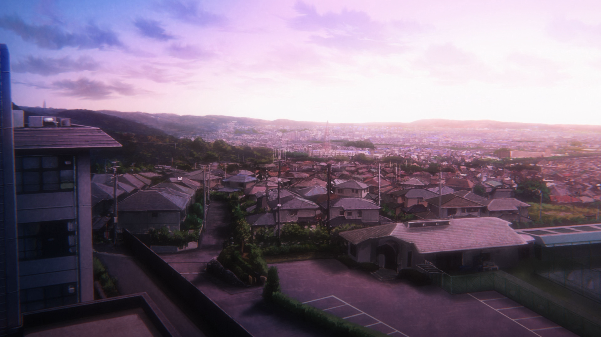

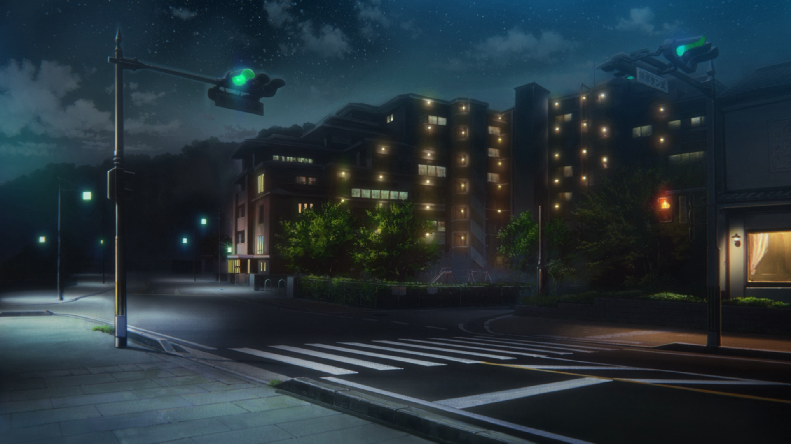

<figure>
  <figcaption>久美子的家，用作过场，据说每次出现这个镜头都会有一辆不同的车过去</figcaption>
</figure>

第二季 第四话 冲突与和解——整个故事的第一个高潮 本话出现多次的环境描写的镜头也暗示了角色的心情

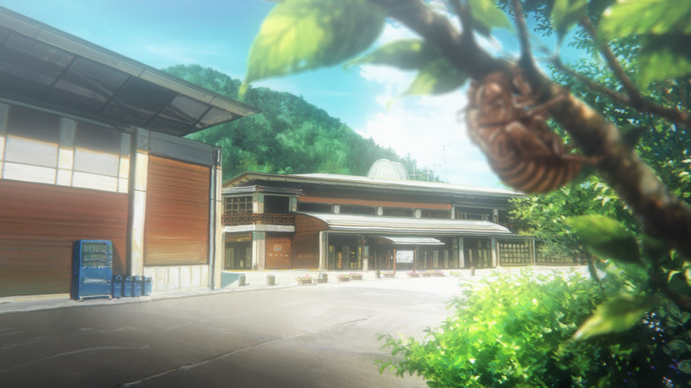

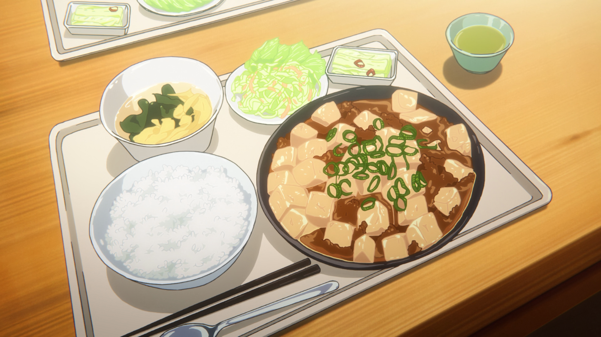

<figure>
  <figcaption>麻~婆~tou~fu</figcaption>
</figure>

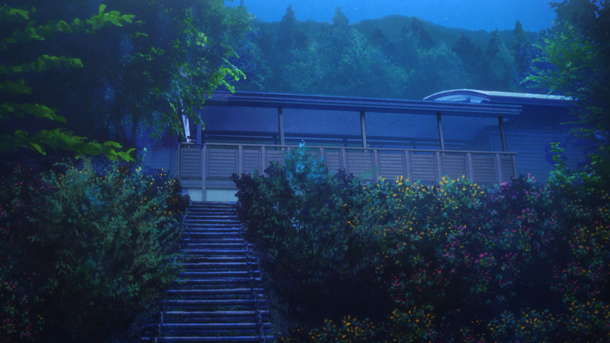
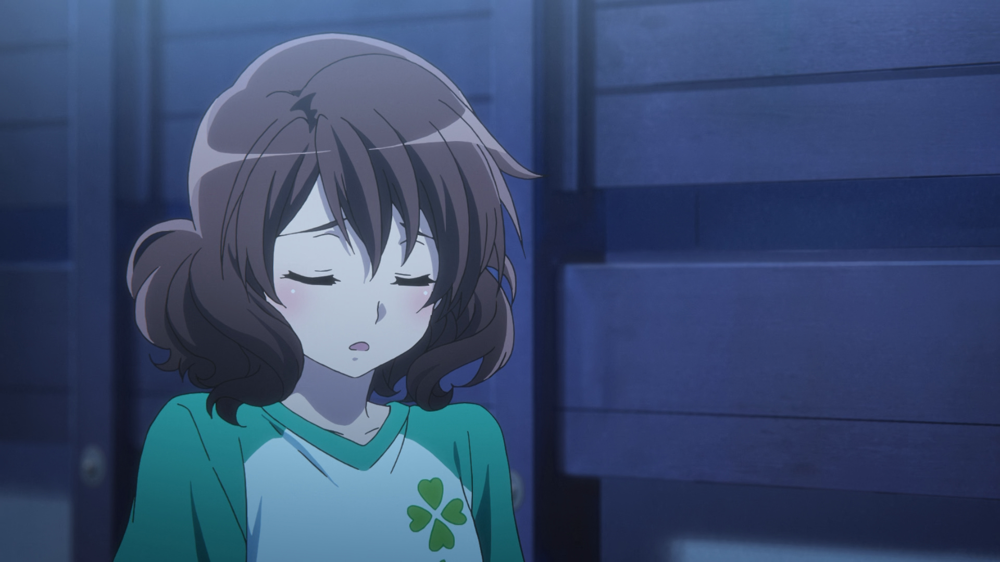
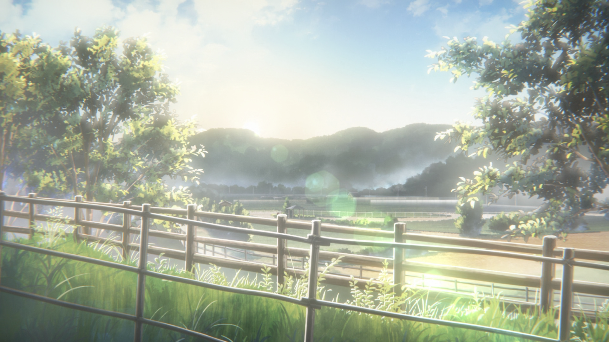
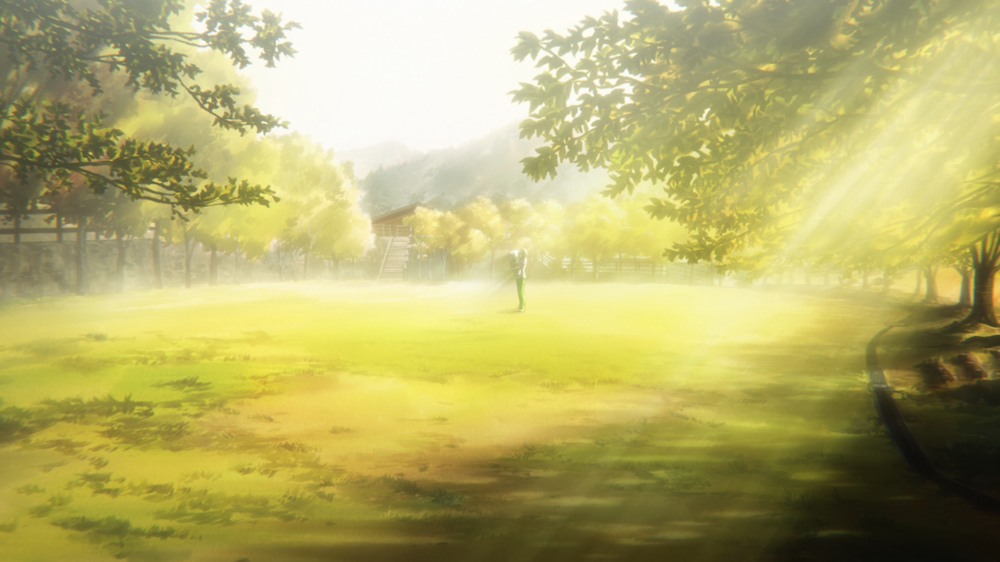
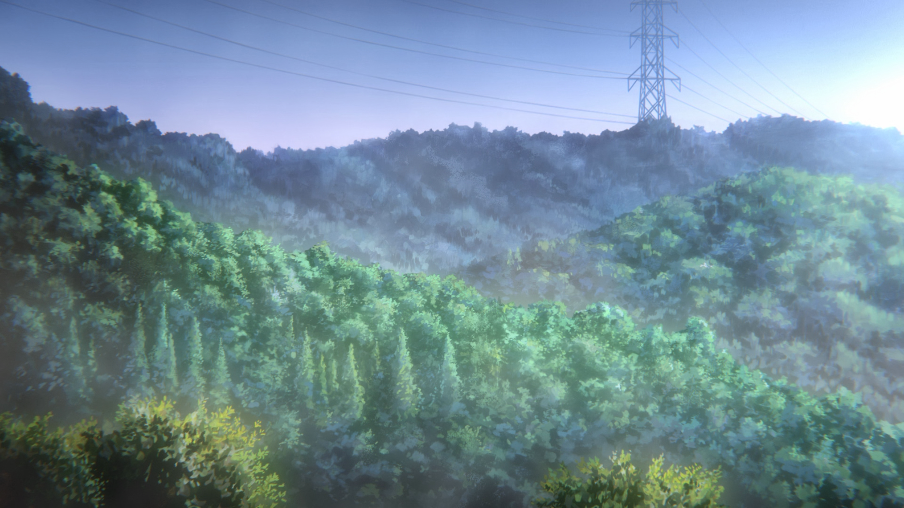

第二季 第三话 不得不赞同京阿尼的画面张张都是壁纸 赠一个叹气的黄大叔和明日香前辈的名场面

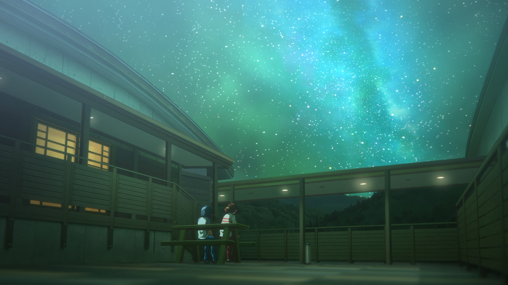

<figure>
  <figcaption>星空之下的久美子＆小天使</figcaption>
</figure>

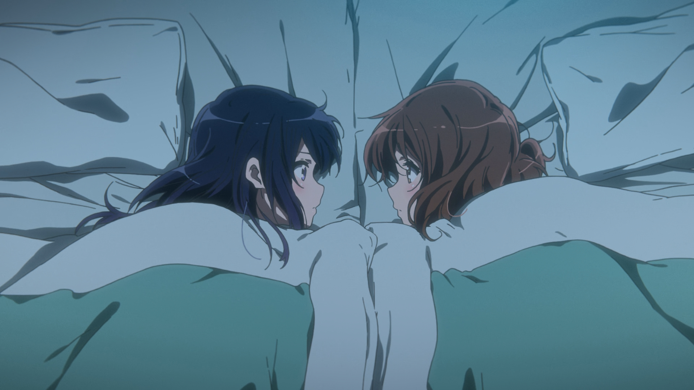

<figure>
  <figcaption>捉奸</figcaption>
</figure>

第二季 第二话 星空之下的久美子＆小天使 以及丽奈的捉奸

[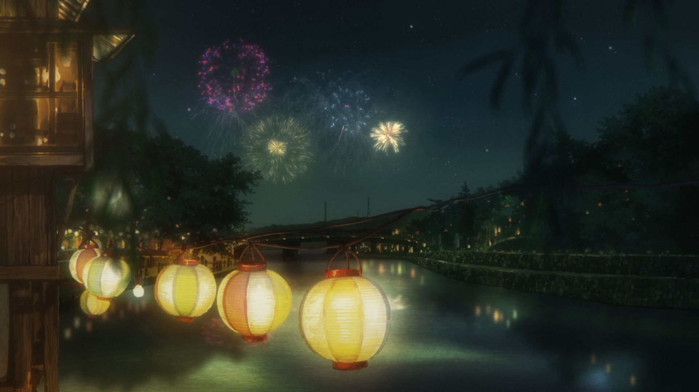](https://magma.ink/wp-content/uploads/2020/11/VCB-Studio-Hibike-Euphonium-2-01Ma10p_1080px265_flac_2aac.mkv_20201128_194059.570-1.png)
[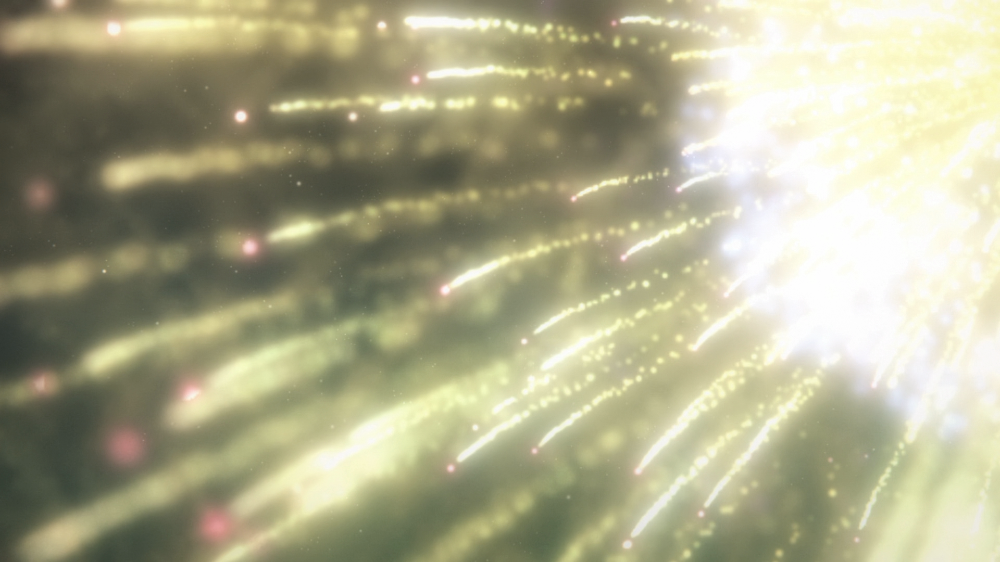](https://magma.ink/wp-content/uploads/2020/11/VCB-Studio-Hibike-Euphonium-2-01Ma10p_1080px265_flac_2aac.mkv_20201128_194316.627.png)

[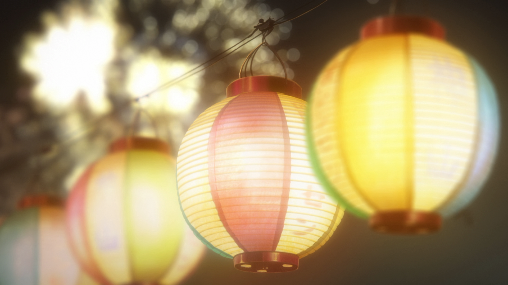](https://magma.ink/wp-content/uploads/2020/11/VCB-Studio-Hibike-Euphonium-2-01Ma10p_1080px265_flac_2aac.mkv_20201128_194139.964.png)

出自第二季第一话 盛夏的开场小号 这一话时常很长，后半部分是祭典和烟花，画面非常的赞

---

出自第一季第八话 祭典三角 久美子和丽奈登山那一段，当然也是第一季的高光情节
