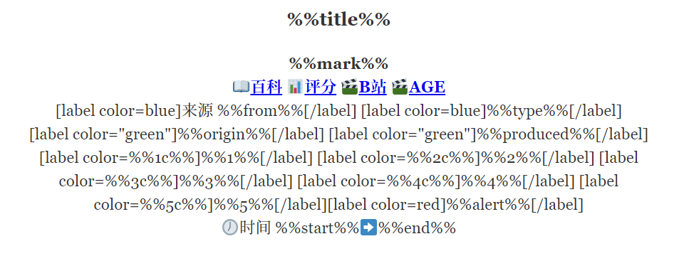
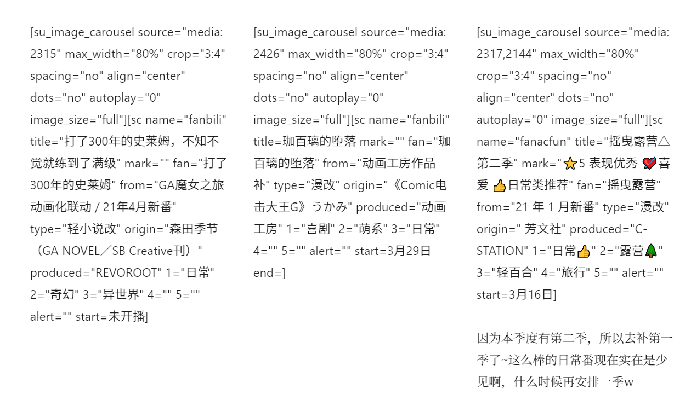

我从 20 年疫情期间开始掉入二刺螈 ACG 的坑，时至今日已经看了 79 部番剧了。因为想要记录下来这些作品的观感体验，甚至以此为动力创建了博客。  
现在全站最大的界面就是[《追番日记》](https://magma.ink/fan)。在前几天进行分割前已经达到了 10000 多字。不过，原有的排版方式无论是在手机端还是电脑端，阅读起来都有不少 BUG。  
如图：

  
  
重点不够突出，这种排版的番剧卡片给人的感觉就是一个记录追番时间的流水账，没什么意思。  
需要优化的一些东西：

- 下半部分的追番时间、状态  **占据了近一半的版面**  而相信不会有什么访客会关心你什么时候看了这部动画。
- 底部的相关导航【萌娘百科 | Bangumi 番组计划 | B 站】和时间记录**混在一起**  而且缺少一些易懂的**标识**。
- **一长排**番剧 Tag 眼睛需要从左跑到右才能看到可用的信息。
- **主视觉图不起眼**，既然插入了图片就不能浪费这份流量，我们追番大都会先看看主视觉图的画风合不合口味（而且如果左边的内容太少的话这个图片还会和上下其他番剧的图片卡在一起产生奇怪的 bug）。
- 碎碎念太多太乱了...

顺便一提，由于上面这种排版方式使用了过多的 Wordpress 区块编辑器区块，导致在编辑界面的时候就会变得**卡顿无比**。  
看来无论是 MediaWiki 还是别的什么网站程序，可视化的编辑器多数还是小白向的...一些深度的需求都没法满足比如说 RIAWiki 的可视化编辑器就写不了高级的东西 w。

经过了十几天的探索推敲，1 天的折腾 最终我终于推定了最新的排版方案...  
感觉要直观的多，这就是设计的魅力么？

如图 （桌面/手机）

- 将主视觉图拉到顶部占满，只要动画制作组认真设计，访客一眼就能了解到番剧的大致情况。
- 标题下面就是个人评价，评价下面就是四个快捷链接（对应） 很快就能对感兴趣的番进行了解或者白嫖观看。
- 番剧 Tag 分行分颜色 一目了然。
- 将原来浪费空间的时间记录和个人唠叨压分别缩成一行和一个框。

通过 WordPress 的 Shortcoder 插件实现了一种类似 Wiki 模板功能的自定义简码（不得不说还是 Wiki 适合做这种东西 x 模板什么的功能很强大）。  
因此这么多花哨的版式只需要两个短代码就能实现，**大幅降低记录追番的时间**，后台编辑器**只有文字**，应该能减缓不少卡顿。

<figure>

<figcaption>

单个番剧信息卡

</figcaption>

</figure>

<figure>

<figcaption>

简码使用的一个例子

</figcaption>

</figure>

**感觉这些经验后期可以用来帮助 RIA Wiki 优化排版（咕咕咕/也许吧）**  
自己做博客套这层模板应该也会方便不少。
