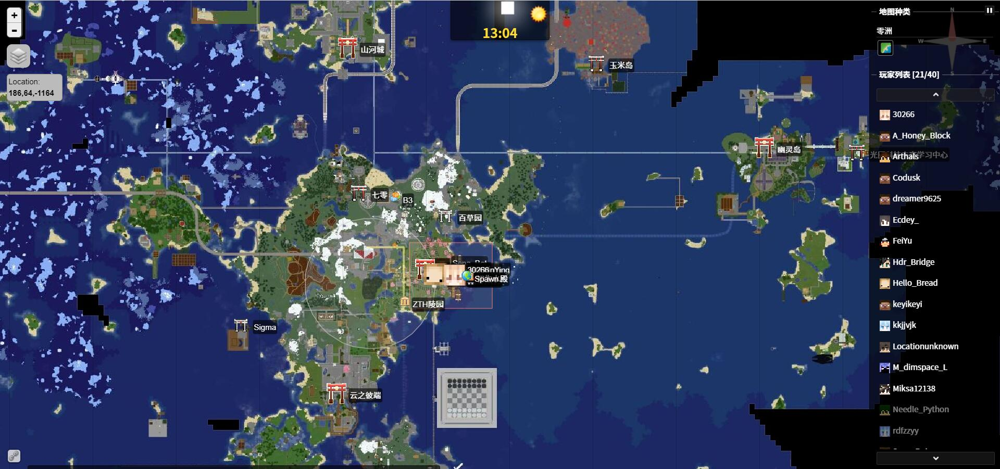
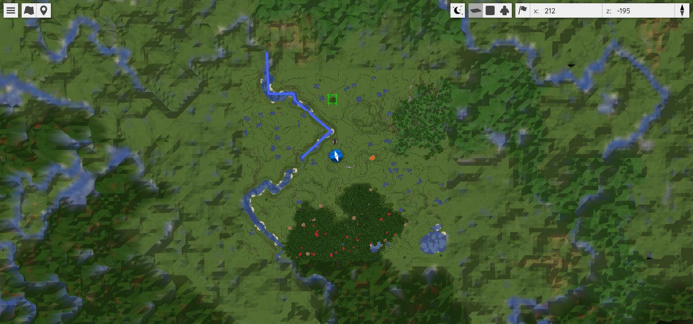
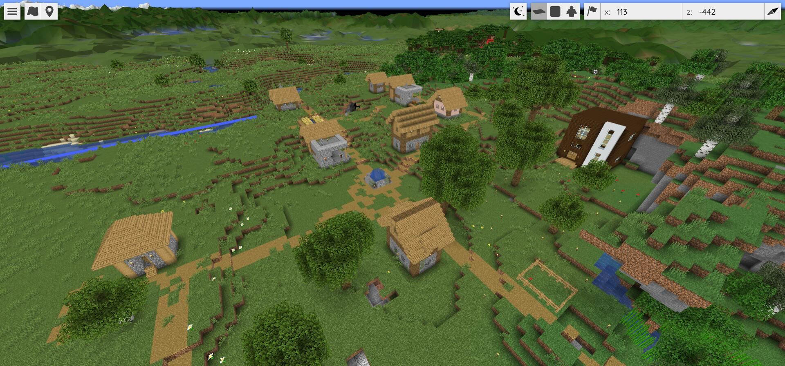
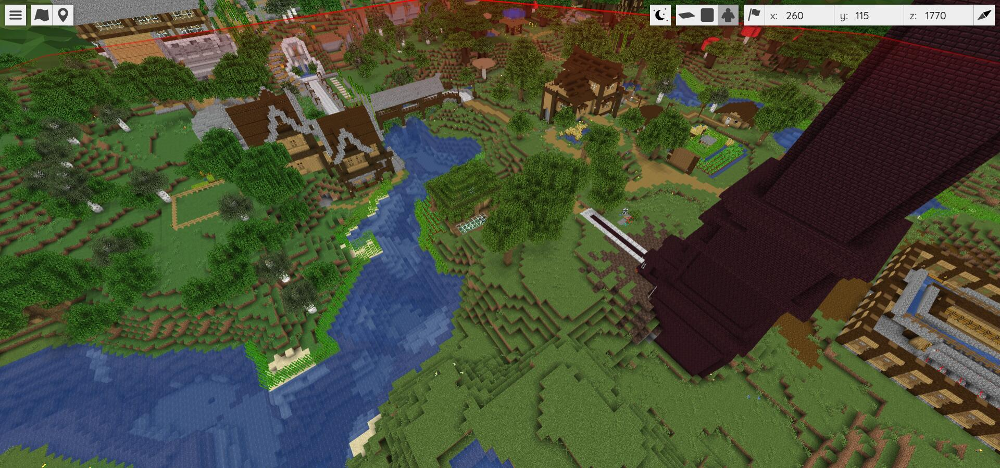
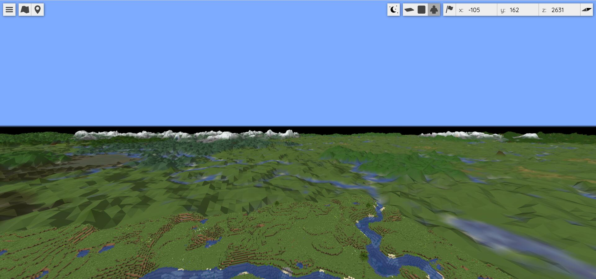
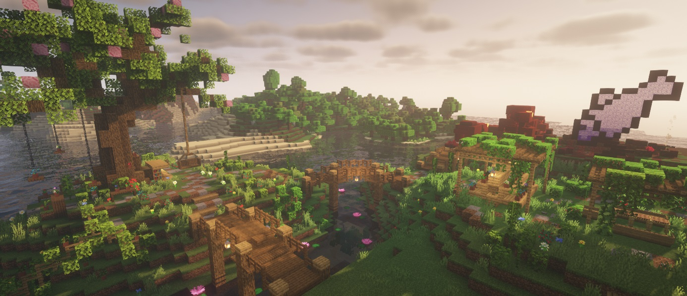

相信玩过 Minecraft 服务器的玩家都有见过如下图一般的网页地图，这是由[Dynmap](https://dev.bukkit.org/projects/dynmap)插件来实现的。Dynmap 也是 Bukkit 上一款人尽皆知的老牌插件了，目前使用的服务器和玩家也非常多，是一款广受欢迎的 Minecraft 在线地图生成器。

但前些天和群友聊天时，我又了解到了一款非常厉害的新网页地图插件。

<figure>



<figcaption>

截图，Zth 服务器网页地图。

</figcaption>

</figure>


[GitHub](https://github.com/ "Github")

[BlueMap-Minecraft/BlueMap](https://github.com/BlueMap-Minecraft/BlueMap)

BlueMap，一款来自开源社区的新 Minecraft 网页地图生成器。相较于前面的老牌 Dynmap，他的功能和实力都要强不少。我简单试用了一会这个程序，觉得只能用一个词来形容他——赛博朋克。

不同于 Dynmap 的二维图片格式，BlueMap 生成的在线地图是**三维**的——这意味着你可以直接在网页浏览器中以一种类旁观者模式的方式来预览 Minecraft 世界，比起传统的二维地图多了不少可探索性。无需多言，建议直接[体验这个官方的 Demo](https://bluecolored.de/bluemap)。

<figure>



<figcaption>

可这和 DynMap 看起来不也没什么不一样的嘛...

</figcaption>

</figure>

<figure>

<video controls muted>
  <source src="/videos/dynmap-演示.mp4" type="video/mp4" />
</video>

<figcaption>

视频体验效果

</figcaption>

</figure>



第一次体验这款地图时，我也一下被这种网页中就能预览游戏世界的奇妙感受震撼了。





同时，BlueMap 还支持比游戏中更远的超远（假）视距。

那么，这么厉害的软件，怎么样才能使用呢？

## 安装教程

BlueMap 作为一款现代的地图生成器，使用起来也十分简单，支持的平台也非常多，可以直接作为插件使用在 Sponge、Spigot/Paper 服务端，也可以作为模组使用 Forge、Fabric API 来载入。对于高级用户，也支持使用命令行渲染离线地图以便部署到网站空间。

### 使用环境需求

- Java 8 或更新的版本
- Minecraft Java 版
- (如果在服务器使用）在你的服务器上有第二个开放的端口

### 作为 [Sponge](https://www.spongepowered.org/) 插件

- 首先，你要下载 bluemap-jar。你可以从[这里](https://github.com/BlueMap-Minecraft/BlueMap/releases)或者[sponges 插件库](https://ore.spongepowered.org/Blue/BlueMap)中选择并下载一个版本，请确保下载的是 SpongeAPI 版本的!
- 将下载的 jar 放到你的服务器的**mods**文件夹中，然后重新启动服务器。
- BlueMap 现在会在./config/bluemap/ 生成配置文件，用你喜欢的编辑器打开这些配置文件，并阅读配置一章来学习如何配置 bluemap。
- 编辑完配置文件后，在服务器上使用/bluemap reload 命令或重新启动服务器。
- 现在 BlueMap 开始渲染你的地图。您可以到 http://<your-server-ip>:<port>/来查看地图。

### 作为 Spigot 插件

- 首先，你要下载 bluemap-jar。你可以从[这里](https://github.com/BlueMap-Minecraft/BlueMap/releases)或[spigotmc.org](https://www.spigotmc.org/resources/bluemap.83557/)选择和下载一个版本，请确保下载的是 SpigotAPI 版本的。
- BlueMap 现在会在./plugins/BlueMap/生成配置文件，用您喜欢的编辑器打开这些配置文件，并阅读配置一章，了解如何配置 bluemap。
- 编辑完配置文件后，在服务器上使用/bluemap reload 命令或重新启动服务器。
- 现在 BlueMap 开始渲染你的地图。你可以到 http://<your-server-ip>:<port>/来查看地图。

### 作为 Fabric 或是 Forge 的模组

- 首先，你要下载 bluemap-jar。你可以从[这里](https://github.com/BlueMap-Minecraft/BlueMap/releases)选择并下载一个版本。请确保下载的是 Forge/Fabric 版本的。
- 如果你是 Fabric 服务器，你还需要安装 Fabric API Mod。
- 将下载的 bluemap-jar 放到服务器的 mods-文件夹中，然后重新启动服务器。
- BlueMap 现在会在./config/bluemap/生成配置文件，用你喜欢的编辑器打开该配置，并阅读配置一章，了解如何配置 bluemap。
- 编辑完配置文件后，在服务器上使用/bluemap reload 命令或重启服务器。
- 现在 BlueMap 开始渲染你的地图。您可以访问 http://<your-server-ip>:<port>/来查看地图。

### 使用命令行，为存档生成静态网页

你可以使用命令行将 BlueMap 生成为一个独立的静态网页。这适用于你只有存档或不想建立服务器的情况下。

- 首先需要下载 bluemap-jar。你可以从[这里](https://github.com/BlueMap-Minecraft/BlueMap/releases)选择和下载一个版本，请确保它**是 CLI（命令行）版本**，并且与你想渲染的 Minecraft 存档版本兼容。
- 创建一个你想让 bluemap 运行的目录，并将你下载的 jar 存放在这个文件夹中。
- 打开命令行（Windows：运行-CMD），改变你的运行目录到包含 jar 的文件夹。(使用 cd <你的 BlueMap 运行文件夹>命令)
- 使用 java -jar BlueMap-cli.jar，这样 bluemap 就会在运行目录中生成配置文件。
- 现在用你喜欢的编辑器打开配置文件，并阅读配置一章，了解如何配置 bluemap。
- 编辑完配置文件后，运行 java -jar BlueMap-cli.jar -r 来启动渲染。
- 通过 java -jar BlueMap-cli.jar -w，您还可以启动内置的 web 服务器来查看您的地图。或者你可以阅读[这里](https://bluemap.bluecolored.de/wiki/webserver/ExternalWebservers)来了解如何为 BlueMap 设置 NGINX 或 Apache。

## 配置

建议使用  Visual Studio Code、Notepad 3 等软件打开配置，不推荐记事本。

更详细的配置教程请见：[Configuration - BlueMap](https://bluemap.bluecolored.de/wiki/getting-started/Configuration.html)，这里只写一个最常用的设置引导。

首先打开 `core.conf` ，将 `accept-download: false` 改为 `accept-download: true`。

这意味着您已经同意了[Mojang 的 EULA](https://account.mojang.com/documents/minecraft_eula)，因为 BlueMap 将要从官方下载 Minecraft 的材质资源文件。

接着进行渲染设置，打开 `render.conf`。

```
minX: -15600 #设定X轴最西的边界
maxX: 15600  #设定X轴最东的边界
minZ: -15600 #设定Z轴最北的边界
maxZ: 15600  #设定Z轴最南的边界
minY: 50     #设定最低的渲染高度，低于这个高度的地图将不会被渲染
```

翻到最低端，可以找到如下字段：

```
# Here another example for the End-Map
# Things we don't want to change from default we can just omit
{
	id: "end"
	name: "End"
	world: "world_the_end/DIM1"

	# We dont want a blue sky in the end
	skyColor: "#080010"

	# In the end is no sky-light, so we need to enable this or we won't see anything.
	renderCaves: true

	# Same here, we don't want a dark map. But not completely lighted, so we see the effect of e.g torches.
	ambientLight: 0.6
}
#
# Here another example for the Nether-Map
{
	id: "nether"
	name: "Nether"
	world: "world_nether/DIM-1"

	skyColor: "#290000"

	renderCaves: true
	ambientLight: 0.6

	# We slice the whole world at y:90 so every block above 90 will be air.
	# This way we don't render the nethers ceiling.
	maxY: 90
	renderEdges: true
}
```

此处定义了末地和地狱的地图渲染样式，如果你不需要末地或地狱，可以直接删除本段。（注意只能删除“{”和“}”及两个花括号之间的内容，不要删除最末尾的"\]"）

最后打开 `webserver.conf`，进行网页服务器的设置。

```
#是否启用内置网站服务器，默认启用。
enabled: true
网站文件根目录，一般不需要更改。
webroot: "bluemap/web"
网站服务器的IP，此项默认注释，如果你只是想把网站开在自己的Minecraft服务器上的话，请直接忽略本项。
#ip: "123.45.6.78"
#端口号，请改为你想要访问到网页地图的端口。
port: 8100
#最大连接数，控制能同时打开网页地图的人数上限。
maxConnectionCount: 100
```

配置完成后，请在服务器中使用`/bluemap reload`或重启你的服务器，BlueMap 将会默认开始渲染。可以使用`/bluemap`指令来查看渲染状态。现在请享受吧！

了解更多关于 BlueMap 的使用教程，可以参阅[Wiki - BlueMap](https://bluemap.bluecolored.de/wiki/)（英文）、[BlueMap —— 更高级的 3D 网页地图！](https://www.mcbbs.net/thread-1171609-1-1.html)（MCBBS）。

> 如果说 Dynmap 是 Google 地图，那么 BlueMap 就可以是 Google 地球。
>
> Magma

<figure>



<figcaption>

封面图片：Zth-奈落洲主城，摄：Magma

</figcaption>

</figure>
