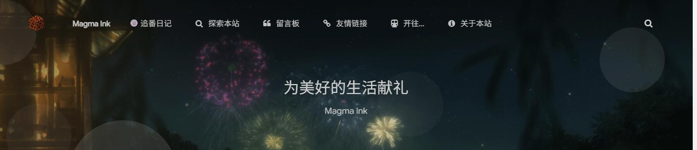
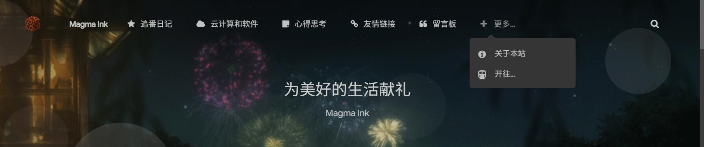
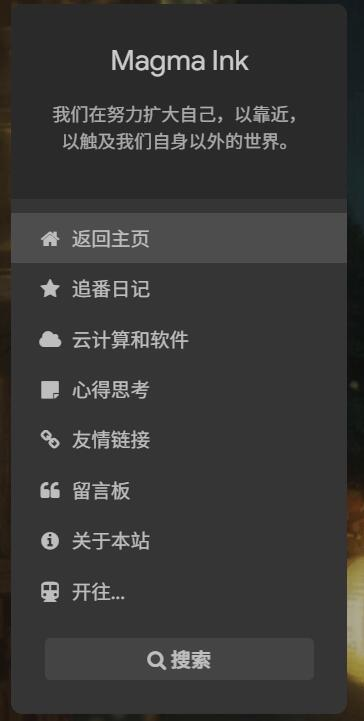

博客已经建立近半年多了，想写的内容一直在变来变去。最开始仅仅是为了记录追番而建立博客，那时的主页除了置顶的《追番记录界面》（现追番日记），就是一堆番剧相关的记录文章，没有什么可读性。当时建立这个网站可能只是为了自己而写的吧，名字还叫 Magma Wiki，就是一个记录自己的事情的“维基”。后来决定对外开放，也想开始自己写文章了，什么都会写点，虽然文笔并不怎么样，但在这半年左右的时间里我也因写博客而提升了不少表达水平。改版为 Magma Ink 后，博客的定位是番剧、软件记录与推荐，但是实际上还是没啥好看的，也就有几篇相关的文章而已。

最近一直在进行博客结构的优化和重构，逐渐敲定了三个分类板块。在原有番剧动画分享的基础上又加了“云计算与软件技术分享”、“个人心得思考记录”的分类。番剧动画分享的优化前段时间已经做好了，主要是把《[追番日记](https://magma.ink/fan/)》的排版和展示样式进行了大幅度的优化，**核心在于能够快速的让访客获取到相关番剧的主题特色和内容简评，让访客有内容可看。**

曾经英语卷子上有读过一篇文章，主题是“如何写你自己的博客”。那时我还根本没有建站的想法，但是作者的几个观点我现在还有印象。作者提到，写博客，如果想让别人来看，最忌讳的就是写一堆只与你自己相关的琐事记录，这样并不能激起访客的兴趣。因为你也不是什么大人物，**访客大概率并不想知道你这个与他并不熟悉的人早上吃了什么、中午干了什么、几点几分看了什么东西或是你多关心你身边的一个什么东西。**做博客的重点还是要让访客来这一趟有收获，能在你的网站找到自己感兴趣的内容，实际上也就是分享与收获的乐趣。因此，我又开设了两个新的分区。这俩分区一个分享一些有价值的好东西，另一个写一些我平时生活和折腾积累出来的经验和心得。希望对得上电波的人访问之后能有收获。

这里放一下改版前后的图：

<figure>

<figcaption>

before

</figcaption>

</figure>

<figure>

<figcaption>

after

</figcaption>

</figure>

<figure>

<figcaption>

左侧栏也进行了更改

</figcaption>

</figure>
