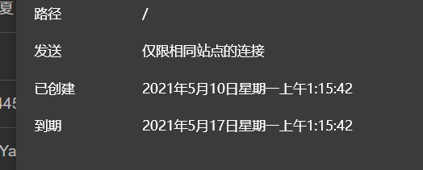

本来只是想把文件从外部导入到 Cloudreve，但是软件里没有提供任何合适的途径，研究了好久，试了好多好多种奇怪的方法...

最后发现，还是模拟 HTTP 请求来的快！

# 离线下载

想要模拟用户新建离线下载任务，首先要登录：

## 第一步 登录 Cloudreve

### 1) 请求地址

> http://155.94.144.40:5212/api/v3/user/session
>
> 先使用 http，毕竟我目前也不知道怎么用 https  
> 如果要在自己的 Cloudreve 使用请更换 ip。

### 2) 调用方式：HTTP post

### 3) 接口描述：

- 这个是从前端的 login 界面登录时会发送的请求。

### 4) 请求参数:

```
{"userName":"这里写邮箱","Password":"这里是密码.","captchaCode":""}
```

#### POST 参数:

| 字段名称    | 字段说明 | 类型 | 必填 | 备注       |
| ----------- | -------- | ---- | ---- | ---------- |
| userName    | 邮箱     | \-   | Y    | \-         |
| Password    | 密码     | \-   | Y    | \-         |
| captchaCode | 二步验证 | \-   | N    | 没开就不用 |

### 5) 请求返回结果:

```
{
    "code": 0,
    "data": {
        "id": "9lCQ",
        "user_name": "*******（你的账号）",
        "nickname": "番剧库",
        "status": 0,
        "avatar": "",
        "created_at": 1619172964,
        "preferred_theme": "",
        "anonymous": false,
        "policy": {
            "saveType": "onedrive",
            "maxSize": "0.00mb",
            "allowedType": [

            ],
            "upUrl": "/api/v3/file/upload",
            "allowSource": true
        },
        "group": {
            "id": 7,
            "name": "特殊",
            "allowShare": true,
            "allowRemoteDownload": true,
            "allowArchiveDownload": false,
            "shareDownload": true,
            "compress": true,
            "webdav": true
        },
        "tags": [

        ]
    },
    "msg": ""
}
```

### 6) 同时会返回 Header

```
Ip: 155.94.144.40
Request URL: http://155.94.144.40:5212/api/v3/user/session
Request Method: POST
Status Code: 200 OK
Request Proto: HTTP/1.1
Request HeaderResponse HeaderContent-Type:application/json; charset=utf-8;
Set-Cookie:cloudreve-session=MTYyMDU4MTA1OHxOd3dBTkZZMU4wNVBNazlUV0RKTFNUWlNWMHBLVlRORVNVODJUVXhWTTBsT1RGRk5EUk9ORnBEVEZaVVF6Wk5Na0U9fMydxX6tKCFY0u7dGqFaZAlIPLGyl3-zPvb0UX9wUD0x; Path=/; Expires=Sun, 16 May 2021 17:24:18 GMT; Max-Age=604800; HttpOnly;
Date:Sun, 09 May 2021 17:24:18 GMT;
Content-Length:468;
```

这里返回的 Cookie 就相当于你的密钥，有了 Cookie 就能在七天之内随便折腾。（不过最好还是先获取再进行你的操作）



## 第二步 提交离线下载请求

### 1) 请求地址

> http://155.94.144.40:5212/api/v3/aria2/url
>
> 如果要在自己的 Cloudreve 使用请更换 ip。

### 2) 调用方式：HTTP post

### 3) 接口描述：

- 相当于你在离线下载界面添加一个任务，需要 cookie

### 4) 请求参数:

```
{
    "url": "下载链接",
    "dst": "/下载目录"
}
```

#### POST 参数:

| 字段名称 | 字段说明 | 类型 | 必填 | 备注                                           |
| -------- | -------- | ---- | ---- | ---------------------------------------------- |
| url      | 下载链接 | json | Y    | 输入文件下载地址，支持 HTTP(s)/FTP/磁力链      |
| dst      | 下载目录 | json | Y    | 直接键入你想要的下载目录，必须是已经存在的目录 |

### 5) 请求返回结果:

```
{
"code": 0,
"msg": ""
}
//成功直接回复0

//填了不存在的路径
{"code":404,"msg":"存放路径不存在"}
//被Aria2拒绝的情况
{"code":-1,"msg":"任务创建失败"}
```

刚开始研究 HTTP，还是挺好用的。

感觉这样甚至还能用简简单单的 HTTP 请求做出来个 Cloudreve 的客户端出来。

# 文件夹操作

## 创建目录

### 1) 请求地址

> http://155.94.144.40:5212/api/v3/directory

### 2) 调用方式：HTTP put

### 3) 接口描述：

- 新建指定目录，可建多层，必须在请求标头中附加 Cookie。

### 4) 请求参数:

```
{
    "path": "/test/123123/哈哈哈/??/sad"
}
#可以写任何Cloudreve允许的字符
```

#### 参数:

| 字段名称 | 字段说明 | 类型   | 必填 | 备注 |
| -------- | -------- | ------ | ---- | ---- |
| path     | 路径     | string | Y    | \-   |

### 5) 请求返回结果:

```
{"code":0,"msg":""}

{"code":40004,"msg":"同名目录已存在"}
```
