## 序言

在本站建成的初期，我的第一篇博文就是《[大会员快到期了怎么追番，我打开了神秘新世界…](https://magma.ink/33-2/)》，当时那篇文章就提到了如何使用**弹弹 Play**这个软件看番并且带弹幕。2021 年的今天，在 B 站近乎垄断大陆番剧市场的背景下，许多身边的小白可能刚对某部番剧动画感到点兴趣，百度一搜，就发现是 B 站独播，而且又恰好是大会员专享，这一波就劝退了不少新人。

<figure>

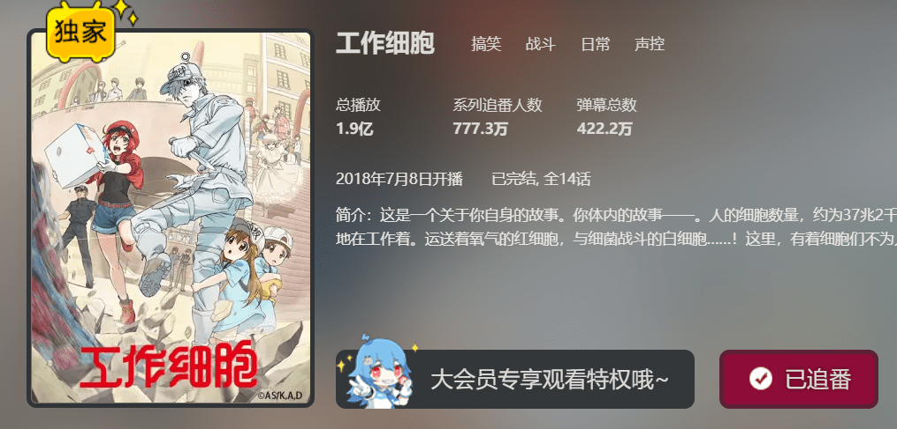

<figcaption>

《工作细胞》，2018 年开播时因为其独特的题材，成为了一部新兴的破圈动画，很多不了解日本动画的普通人也或多或少对其有所耳闻。本作在大陆地区也是一部哔哩哔哩独播且需要大会员的番剧。

</figcaption>

</figure>

根据 B 站 2020 年第四季度的财报，B 站月均付费用户数同比增长 89％，**达 1500 万**，付费率从去年同期的 6.2％提升至 7.6％。即使这个数字看起来很多，但事实上仍然有不少人不愿意付费，或者不愿给 B 站付费。有些经验的用户可能会知道一些免费看番的影视站或者资源站，如樱花动漫，仅仅一天就可达到上万次搜索量，且还在逐渐增长。这说明在大版权时代的今天，白嫖仍然会是不少人的选择。

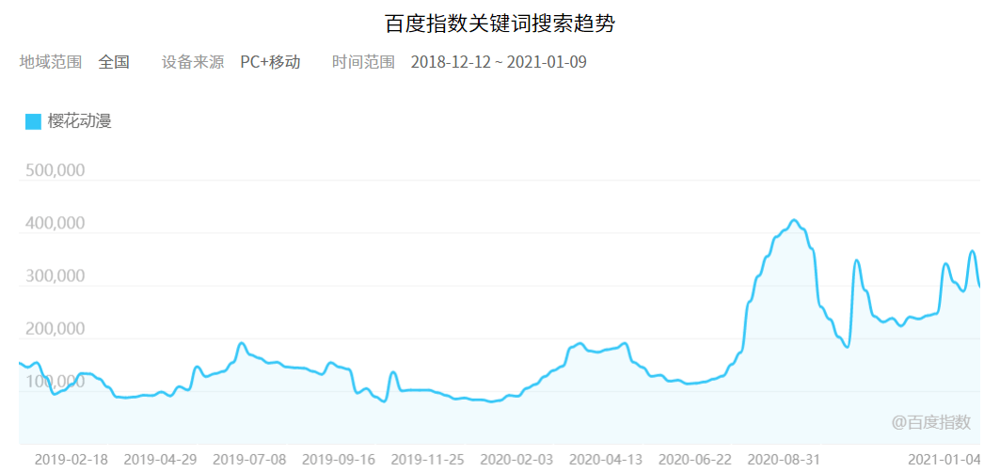

但是这些影视站都有一个共同的缺点，那就是看番没有弹幕。弹幕文化从 ACG 中诞生，并随着动画产业的壮大而不断深入人心。相信大部分年轻人尤其是喜欢追番的同学，应该都习惯了这种成千上万弹幕和自己一起追番的热闹氛围。那么今天这篇文章就介绍一下我是如何在动漫影视站追番还带弹幕的。

## 正文

首先介绍一下主角，**弹弹 Play**。这是一款老牌的弹幕播放器，顾名思义，就是把弹幕播放出来的播放器。

弹弹 Play 本身并不提供视频资源，需要在软件内打开视频，或是使用 BT 磁力下载（就像前些年看电影用迅雷那样）。但是在 2021 年的今天，BT 在国内的使用体验可以用绝望二字来形容。如果说把番剧下载到硬盘或手机上来看，相信一般人都会觉得太麻烦，毕竟流媒体已经成为了主流。好在弹弹 Play 还支持网络串流，也就是播放网络上的在线视频，相信大部分人都能接受。

我们要想把动漫影视站的在线视频播放下来，首先要做的第一件事就是把视频的直链搞到手，不懂什么是直链也没关系，这里给出常见的几个平台提取动漫影视站直链的方法，请根据你要看番的平台来选：

（这里的操作看起来很长很多，实际上也就点几下，只不过我写的太细了。做过一次后实际上以后很容易）

## 安卓手机

**使用安卓手机观看需要两款软件：弹弹 Play 和 Tita 搜索**

- 弹弹 Play [酷安下载](https://www.coolapk.com/apk/com.xyoye.dandanplay) [我的网盘](https://tbs.magma.ink/file/5f55c1b4a8483e2d673a0193/9ddd7838b38b852e103e3d2db81def69/com.xyoye.dandanplay.apk) [官方网站](http://www.dandanplay.com/) [Github](https://github.com/xyoye/DanDanPlayForAndroid/releases/tag/release-v3.5.5)
- Tita 搜索 下载链接 >> [so.tita.apk](http://tbs.magma.ink/file/5f55c1b4a8483e2d673a0193/218c73f586aaaa11812271e27878ca4e/so.tita.apk)
  - Tita 搜索是一款超级强大的影视 app。内置了十多个影视网站的源。一键添加即可随心观看最新最全的影视作品。同时也支持提取网站中视频的直链，

<figure>

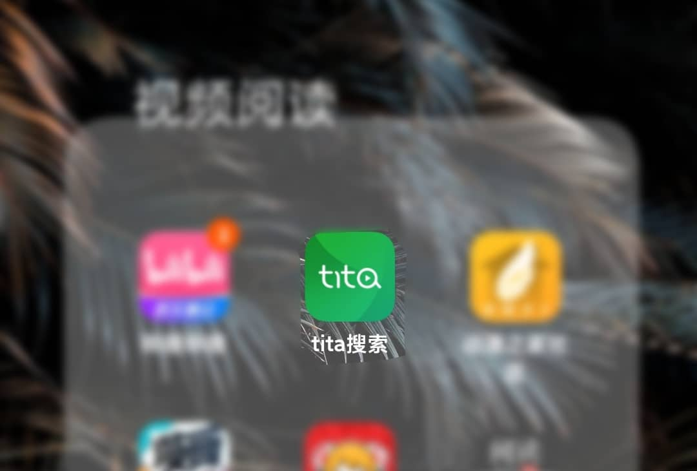

<figcaption>

（不是广告）这个软件的开发者有一个公众号，可以微信搜一下缇塔小报，一些与本文无关的使用教程和软件下载都可以看得到。配置得当任何电影电视剧动漫都可以免费看。

</figcaption>

</figure>

我们需要用到的，是 Tita 搜索的资源嗅探功能。

1. 打开 Tita 搜索，点击底栏的【发现】。
2. 在【发现】中可以 发现 找到【影视站点】这一功能。
3. 打开它，你可以把你已经有的动漫影视站添加进去，这个应该就不用我多说了。

<figure>

- <figure>
    
    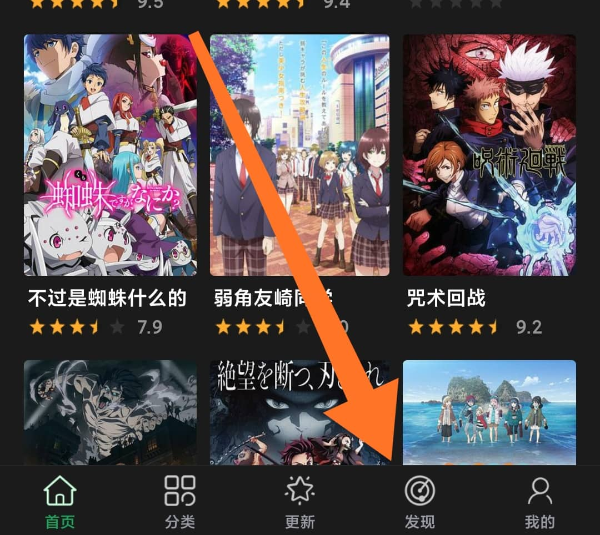
    
    <figcaption>
    
    第一步
    
    </figcaption>
    
    </figure>

- <figure>
    
    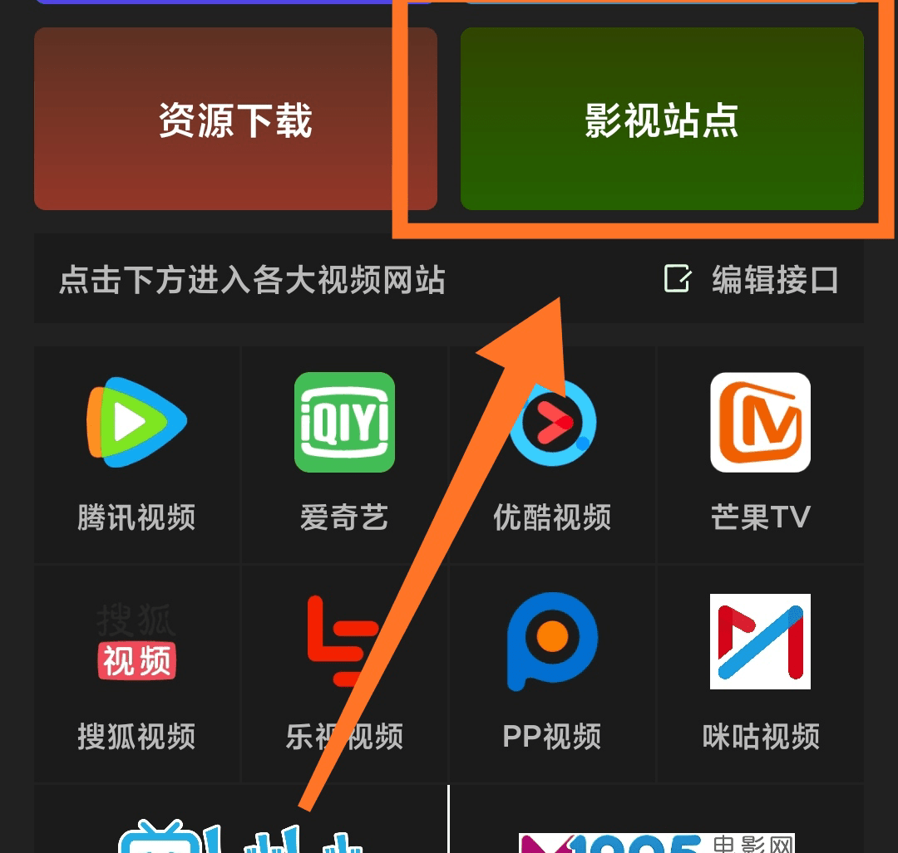
    
    <figcaption>
    
    第二步
    
    </figcaption>
    
    </figure>

</figure>

个人推荐两个不错的动漫站源，可以添加进去完美使用。

- 【Age 动漫】https://www.agefans.net （备用www.agefans.cc）
- 【樱花动漫(有一些网页上的广告)】http://m.imomoe.ai

1. 我们以 Age 动漫为例，点击按钮进入。
2. 在网页中找到你想看的番，进入播放状态。
3. 你会发现底部的播放按钮变红了，点击它。
4. 在打开的新界面中点击【复制链接】

- 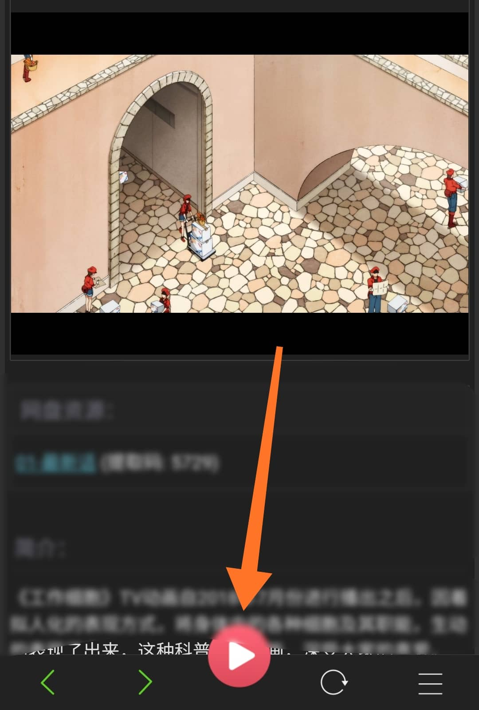
- 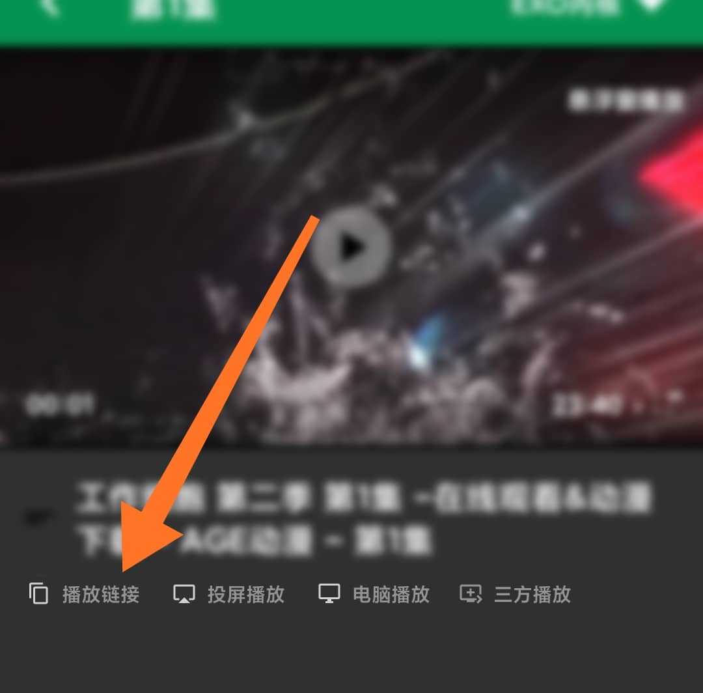

1. 接下来打开【弹弹 Play 概念版】
2. 在媒体库右上角菜单中选择【网络串流】
3. 粘贴你刚刚复制的链接
4. 提示无弹幕源，点击【选择弹幕】
5. 【搜索】番剧，最好带上集数，不然可能会很乱。
6. enjoy

\[collapse title="找不到某个番剧？"\]

某些番剧由于翻译名称可能有异，如果找不到可以换一换或者用日文原名。

部分刚放送的新番可能找不到弹幕，这时候就需要到主界面右下角【我的】里面找到【B 站弹幕下载】下载 B 站的弹幕。搜索弹幕时选择【本地弹幕】就可以。（如果 B 站没版权的话就暂时没有弹幕了）

\[/collapse\]

- 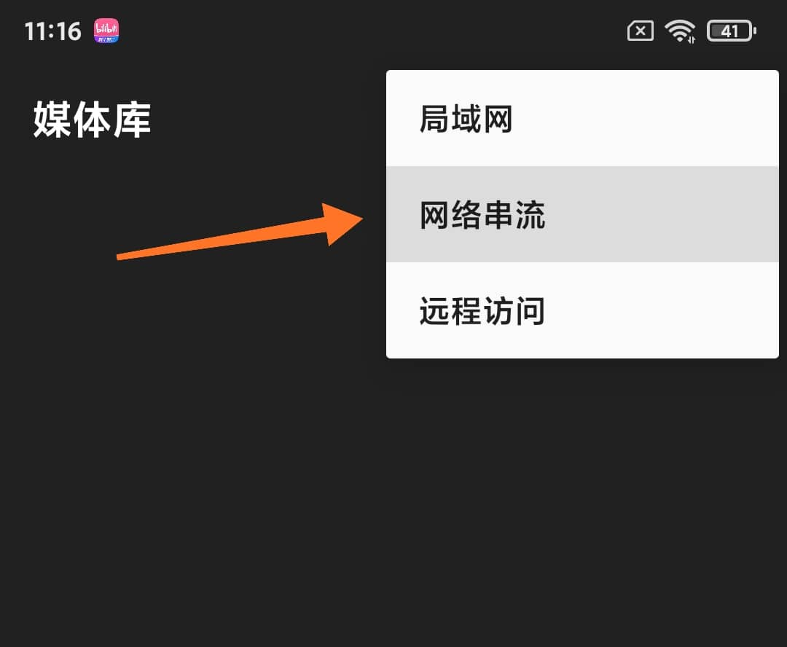
- 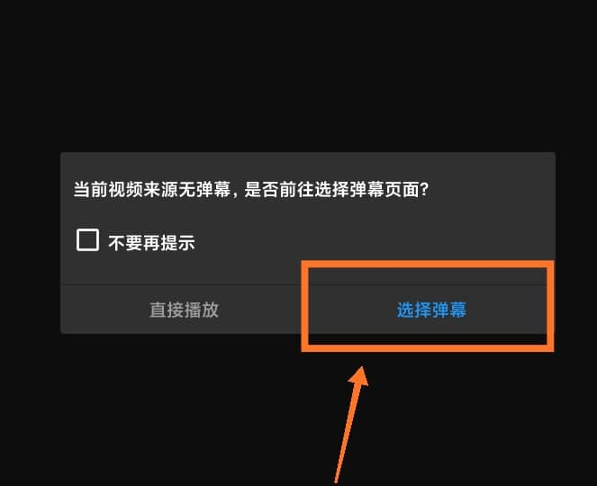
- 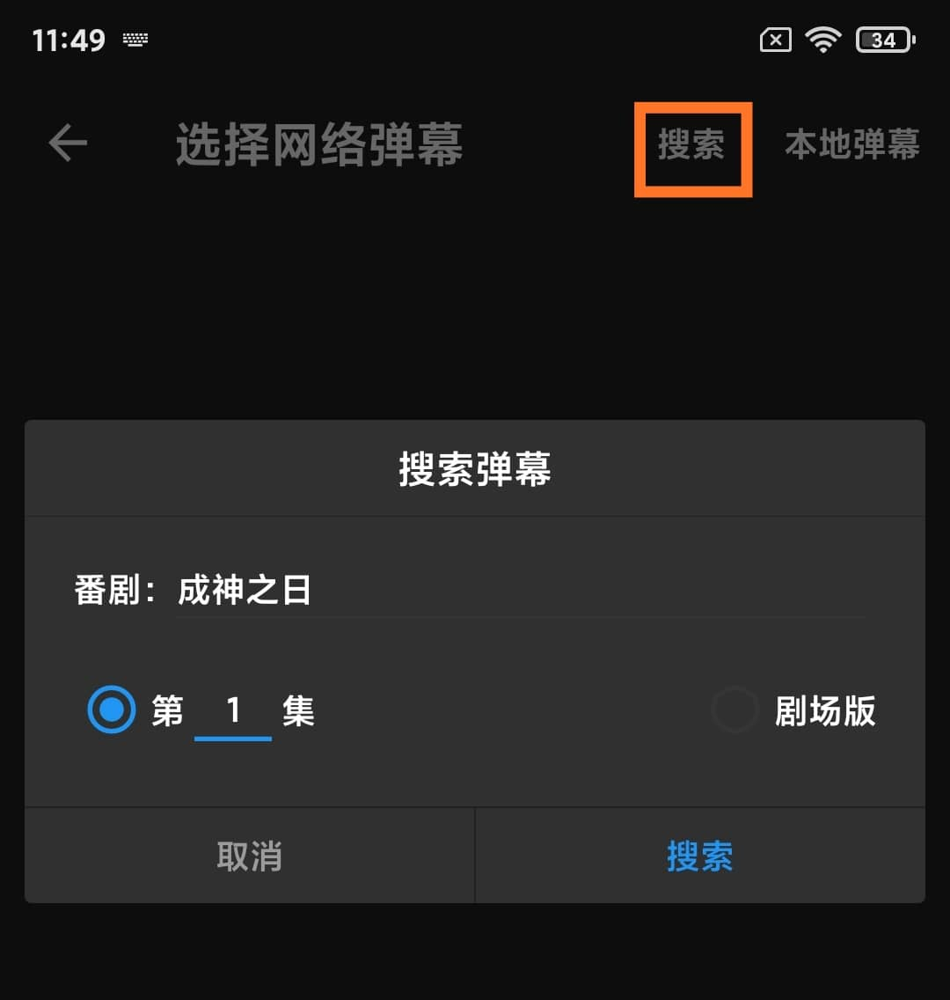
- 

进阶提示：获取视频的链接这段不一定非得用 Tita 搜索，某些浏览器也是支持的。

总之就是要把视频链接放到弹弹 Play 里。如果你愿意，把番剧下载到手机在用弹弹 Play 播放也没关系。

## Windows（电脑端）

Windows 下和手机端实际上并没有多大差距~

访问弹弹 Play 官网，下载 Windows 版的弹弹 Play：[http://www.dandanplay.com/](http://www.dandanplay.com/)

但是官网的下载速度，实在是小水管...

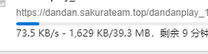

如果下载慢还没办法的话，这里我给出仨别的途径：

[微软应用商店](https://www.microsoft.com/en-us/p/%e5%bc%b9%e5%bc%b9play/9nwpvd7t1hpw#activetab=pivot:overviewtab)、加官方 QQ 群、或者是百度网盘...

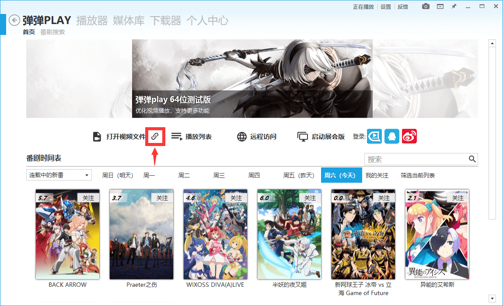

打开软件，使用【打开视频文件】旁边的**【打开 URL】**即可。

这时候，我们就需要获取影视网站番剧视频的直链了，电脑上怎么获取呢？这里我推荐一个 Chrome 插件**【猫抓】**

通过这个小插件，可以提取多数网站上的视频媒体资源，并进行复制链接、下载等操作。

如何安装它呢？

[Edge 插件商店](https://microsoftedge.microsoft.com/addons/detail/%E7%8C%AB%E6%8A%93/dbopnkgegdeahajfhboecpphnnoeaech?hl=zh-CN)、[Google Chrome 网上应用店](https://chrome.google.com/webstore/detail/%E7%8C%AB%E6%8A%93/jfedfbgedapdagkghmgibemcoggfppbb)，你可以直接在左边这里下载，前提是你使用的浏览器需要是**Edge 或者是 Chrome。**

如果不是上述两个浏览器的话，可以试试手动安装，在这里下载插件：[https://magma.lanzous.com/iN6Gdmlygcf](https://magma.lanzous.com/iN6Gdmlygcf)

然后参考这里的教程，安装插件（或者百度如何安装已解压的 Chrome 插件）[http://www.cnplugins.com/zhuanti/newinstall.html](http://www.cnplugins.com/zhuanti/newinstall.html)

如果成功的话，浏览器右上角会多出来一只猫

到前面安卓教程里面提到的番剧影视网站的播放界面就可以提取到直链了，如图

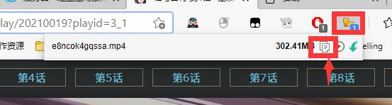

然后打开弹弹 Play，在**【打开 URL】**中输入网址

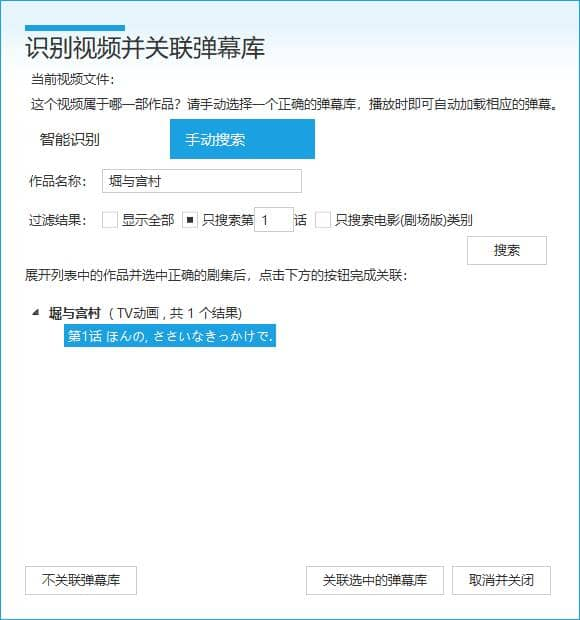

如图搜索弹幕库，Enjoy~
