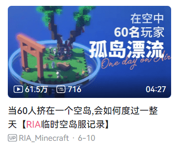
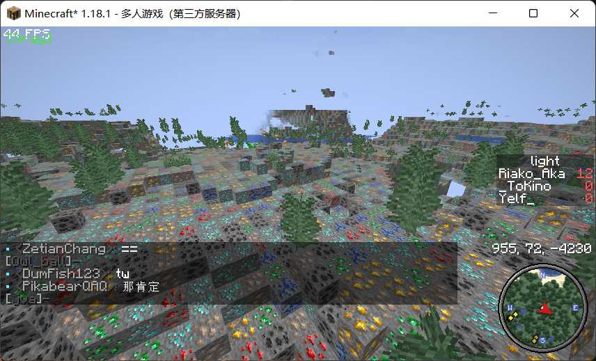
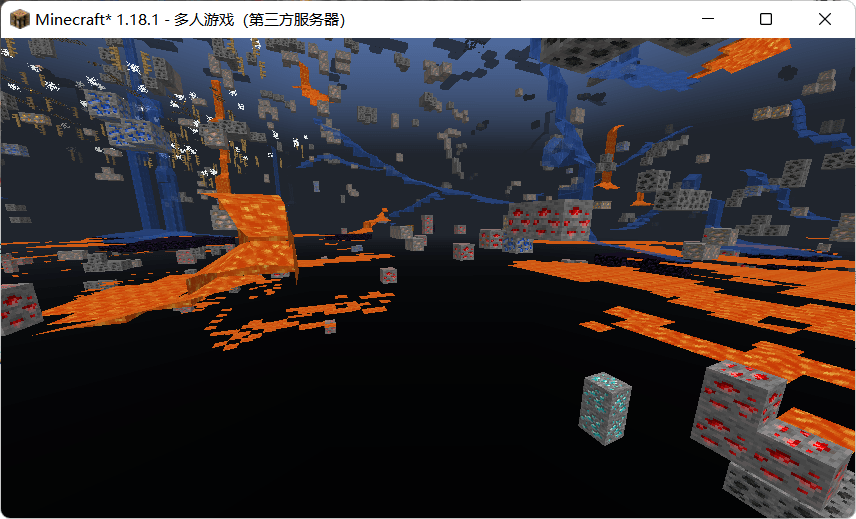
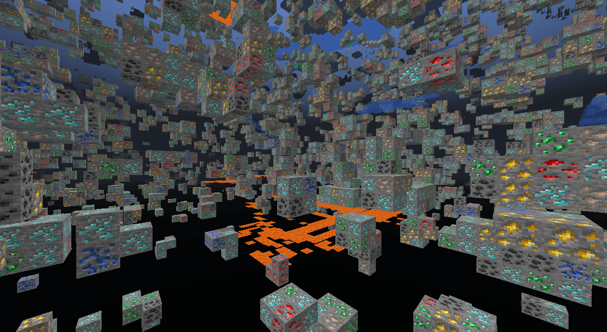

<figure>



<figcaption>

突然火起来的空岛小片

</figcaption>

</figure>

由于我所在的 MC 服务器前段时间因为 B 站视频的热门，新玩家如潮水般涌入服务器，一时间日常在线人数平均达到三十来人，人多的时候更能涨到六七十多人。如此多萌新的加入自然是为服务器增添了不少活力，但是人一多起来，就免不得出现一些作弊、盗窃的不良现象，像是矿透的情况就发生好几起。在此之前，ZTH 的反矿透手段只是简单的挖矿触发提示在线管理，管理发现异常手动确认，属于人工钓鱼式反作弊。但玩家量一多起来之后就处理不过来了。

一开始我们尝试使用比较常见的假矿，即很单纯的将石头和矿物全部混淆成矿物，效果是这样的：



矿物 100% 的被藏在了假矿里，效果非常好，还能顺带降低开 X-Ray 玩家的帧数。

但是这样的假矿用了两天后，我们发现了另一个问题。也许是因为假矿没有规律在地下随机生成，导致了服务端发送的区块数据包无法被压缩。每个玩家下载新区块的流量带宽翻了三四倍！

没办法，我们尝试把假矿模式换成隐藏矿物：



切换之后就变为带宽友好型了。图中能透出的矿物，实际上是暴露在空气、水或者岩浆中的小部分矿物。本以为只剩这些矿物矿透就没有什么意义了，但用了一段时间后发现，竟然有人开 Impact 的自动挖矿在夜深人静的时候自动挖钻石...... 无语。

既要带宽友好，又要能防止矿透和自动挖矿...... 经过一段时间的思考——比起隐藏矿物或者让石头盖住矿物，为什么不让矿物自身变成假矿呢？这种方案像是把前面两种常见反 X-Ray 结合起来：将已有的矿物替换成其他矿物，让矿透者不知道哪堆矿是真的钻石，让自动挖矿 AI 四处乱转到处抽奖。尽管这种方案会暴露矿物的位置，但实际上是一种折磨作弊者的方案：

<figure>



<figcaption>

矿透者即使知道了矿石的位置，也不能知道自己想要的矿物究竟在哪里

</figcaption>

</figure>

对于带宽，这种隐藏矿物的方案比起第一种方案来说，大大减少了无法被压缩的区域数量，其带宽消耗仅高出原版一点，比较省流量；对于矿透作弊者，他将找不到自己想要的矿物究竟在哪里，只能在一次又一次的挖掘后敲到假的矿物；对于自动挖矿 AI，由于其基于矿透寻找最近的目标矿物位置，因此其将四处碰壁，在地下无尽打转。

## 配置示例

如果你使用 Paper 提供的 Anti-Xray 功能，可以参考这个例子：

```
anti-xray:
      enabled: true
      use-permission: false
      engine-mode: 2 # 模式 2，将 hidden-blocks 用 hidden-blocks 打乱
      chunk-edge-mode: 1
      max-block-height: 72
      max-chunk-section-index: 3
      update-radius: 2
      lava-obscures: true
      hidden-blocks:
      - coal_ore
      - iron_ore
      - gold_ore
      - redstone_ore
      - lapis_ore
      - diamond_ore
      - emerald_ore
      - obsidian
      # 此处的配置文件使用后将会在主世界也出现一些下界矿，可自行使用 Paper 的分世界设置
      - nether_gold_ore
      - nether_quartz_ore
      - ancient_debris
      replacement-blocks: []
```

如果你使用 Orebfuscator 插件，可以参考此配置：

```
obfuscation-overworld: # 这里的示例是主世界的，下界同理
    enabled: true
    minY: -128
    maxY: 72
    worlds:
    - world
    hiddenBlocks:
    - minecraft:emerald_ore
    - minecraft:diamond_ore
    - minecraft:gold_ore
    - minecraft:iron_ore
    - minecraft:coal_ore
    - minecraft:lapis_ore
    - minecraft:redstone_ore
    randomBlocks: # 和上面的被隐藏的方块保持一致即可，即用矿物打乱矿物
      minecraft:coal_ore: 10
      minecraft:diamond_ore: 20
      minecraft:emerald_ore: 10
      minecraft:gold_ore: 10
      minecraft:iron_ore: 10
      minecraft:lapis_ore: 5
      minecraft:redstone_ore: 5
```
