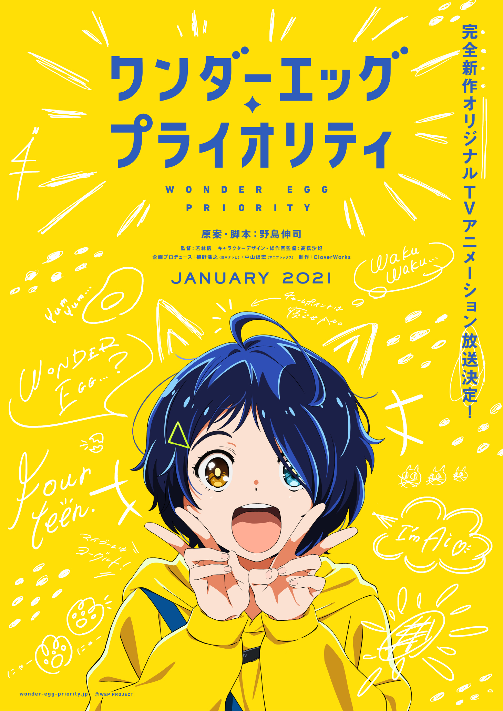

据说，封面头图的番剧或者其他什么都是一段时间内**最认可，画面最喜欢**的作品哦～

- 第五版 [恋爱小行星](https://magma.ink/fan/#laxxx) （二创图）（[(1) 村井村@5/1 メロンブックス超同人祭?超 45 在 Twitter: "みらあお私服デート https://t.co/wtDFq7VnwL" / Twitter](https://twitter.com/murairamuraiari/status/1224281752878735360)）

<figure>

<figcaption>

自己修改的封面图

</figcaption>

</figure>

- 第四版 [奇蛋物语/WONDER EGG PRIORITY](https://magma.ink/fan/#egg) [预告主视觉图](https://commons.moegirl.org.cn/File:Wonder_Egg_Priority_Anime_Teaser.jpg) (大户 爱)

- 第三版 [恋爱小行星](/fan/#laxxx) [动画版主视觉图](https://zh.moegirl.org.cn/File:Koisuru_Asteroid_Anime_KV.jpg)

[https://zh.moegirl.org.cn/File:Koisuru_Asteroid_Anime_KV.jpg](https://zh.moegirl.org.cn/File:Koisuru_Asteroid_Anime_KV.jpg)

- 第二版 [熊熊勇闯异世界](https://magma.ink/wp-admin/post.php?post=21&action=edit#bear) [动画化纪念插画](https://commons.moegirl.org.cn/File:Kuma_Kuma_Kuma_Bear.jpg)

原图链接 [动画化纪念插画](https://commons.moegirl.org.cn/File:Kuma_Kuma_Kuma_Bear.jpg)

- 第一版 轻音少女 轻音部合影

