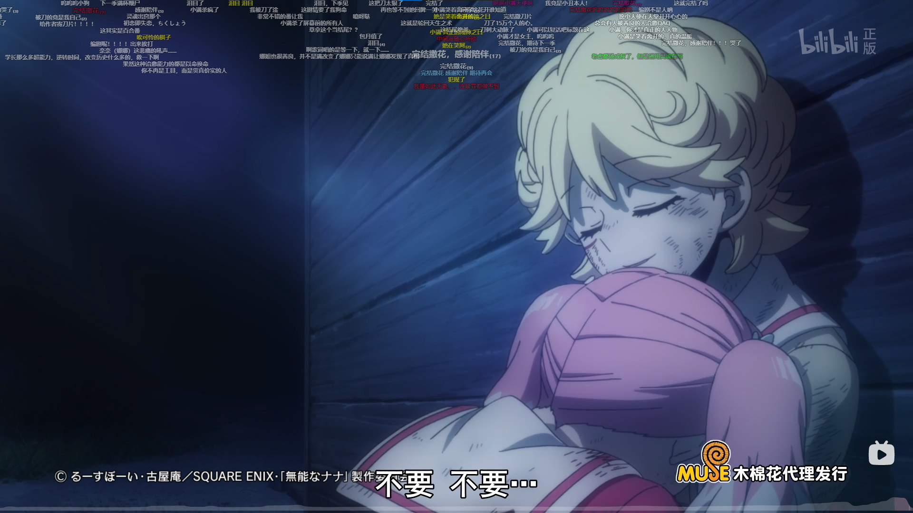
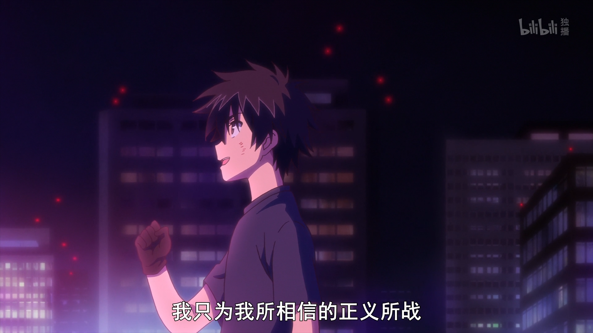
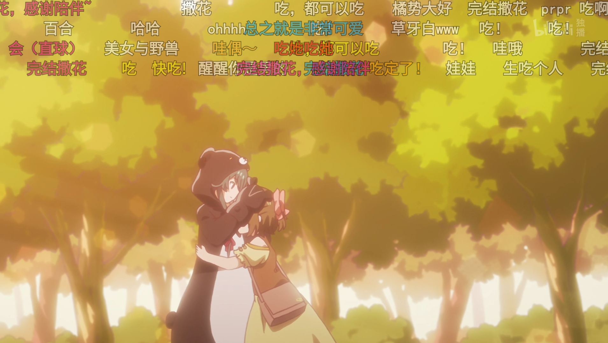
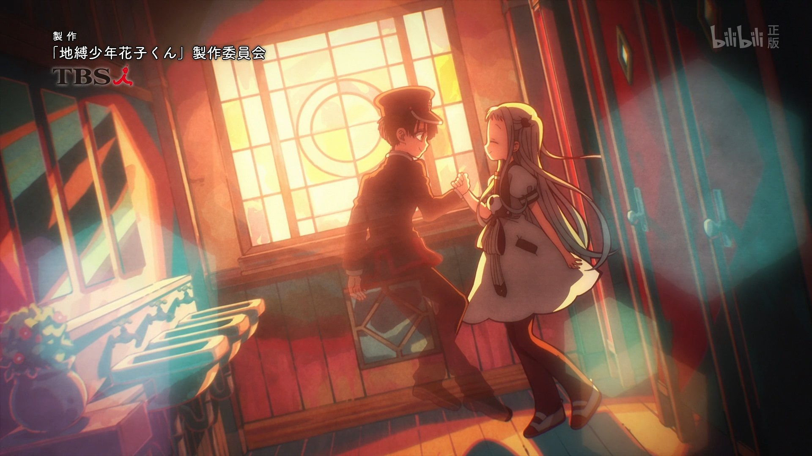

这篇文章推荐了 9 部我追过的 2020 年的新番动画，属于质量还算不错的部分。了解今年我的其他追番可以前往「[Magma 的追番日记 - 2020 年](https://magma.ink/fan/#header-id-13)」。

## 前言&一些琐事..

2020 年是我追番的第一年，也是动画对我的价值观改变深刻的一年。由于年初的一次偶然机会，我踏入了这个独特而美好的虚幻世界，学到了很多关于影视的文化和知识，收获了不少感动，但同时也发现身边不少人对“日本动漫”和“二次元”有着不小的误解。在这一年中了解了许多构思新颖且质量优秀的作品，他们有的剑走偏锋但仍然弘扬着“友情、努力、胜利”的正能量，有的动用最朴素的画笔记录着我们每个人日常生活中的闪光，还有的构建出一个个幻想异世界让观众体验一把从未有过的奇幻冒险，这里并非是国内某些媒体所炒作的“乌烟瘴气的不良之地”。同时在这里也希望国创动画能加快创新，出现更多与日本动画匹敌的好作品！一说就说多了

受到个人经验和爱好影响，这里罗列的并不是所有人都喜欢的作品。如果你也对日常、喜剧、推理、轻百合等这类非热血题材的偏小众题材感兴趣的话，不妨看看吧~（另外推荐一下咒术回战，本年新火起来的周刊少年 JUMP 热血漫，剧情打斗很棒，估计能和 19 年鬼灭之刃的人气打一打）

<figure>

<figcaption>

"操纵扫帚的是一位美丽的少女。她身穿漆黑长袍且头戴三角帽，灰色的发丝随风摇曳。具有如此美貌的她究竟是谁？没错，就是我。"可爱中带着一丝“屑”的伊蕾娜被观众们戏称为“屑魔女”。本番凭借着女主独特的性格、连连不断的喜剧剧情和美丽的风景在十月番中取得了不小的关注度。喜欢旅行和看风景的话一定不要错过，整体质量还是挺棒的 ，因此放在了第一个

</figcaption>

</figure>

### 魔女之旅

> ⭐**5.5** **值得一看**💘**超爱**👍**旅行题材、萌系白毛控推荐**

[来源 20 年 10 月新番] [小说改] [动画制作 C2C] [👍 奇幻旅行] [喜剧] [萌系] [轻百合]

某个地方有个正在旅行的魔女，她的名字是伊蕾娜。 身为旅人，在很长很长的旅途中，她与形形色色的国家与人们邂逅。 只允许魔法师入境的国家、 最喜欢肌肉的壮汉、 在死亡深渊等待恋人归来的青年、 独自留守国家早已灭亡的公主… 最后，还有她身为魔女的至今为止与从今以后。 和莫名其妙、滑稽可笑的人们相遇，接触某人美丽的日常生活，魔女日复一日编织出相逢与离别的故事。

---

<figure>

<figcaption>

很不错的喜剧番，每一集都能笑出来！

</figcaption>

</figure>

### **在魔王城说晚安**

> ⭐**5.5 表现优秀**💘**超爱**👍**喜剧类推荐**

[来源 20 年 10 月新番] [漫画改 小学馆] [动画 动画工房] [👍 喜剧] [魔幻] [萌系]

某一天，魔王黄昏突然抓走了人类统一国家「凯米恩国」的公主——**[栖夜莉丝公主](https://zh.moegirl.org.cn/%E6%AC%A7%E7%BD%97%E6%8B%89%C2%B7%E6%A0%96%E5%A4%9C%C2%B7%E8%8E%89%E4%B8%9D%C2%B7%E5%87%AF%E7%B1%B3%E6%81%A9)**，勇者拂晓随即踏上了拯救公主的旅途。与此同时，呆在魔王城无所事事的栖夜莉丝为了获得更加安稳的睡眠，开始了大闹魔王城的日常。

---

<figure>

<figcaption>

绝对不是单纯的推理番，这十三集里剧情反转的次数难以想象，你永远不会猜到接下来会发生什么，远远超出我最开始的预期！结尾对我来说是 2020 年末的一把大刀...虽然剧情演绎非常棒，但是还是难受

</figcaption>

</figure>

### 无能的奈奈（无能力者娜娜）

> ⭐**5.5 超出预期**💘**超爱**👍**智斗、推理类推荐**

[来源 20 年 10 月新番] [漫画改 SQUARE ENIX] [动画制作 Bridge] [👍 智斗] [推理] [越看越精彩]

在四周环海的孤岛上有一所学园。那里是为了对抗人类之敌，致力于训练年轻能力者的地方。  
然后，作为主人公的转学生，同样也抱持着“抹杀人类之敌”的心，展开了行动。  
辜负种种想象，正义与恶的智谋悬疑故事开幕！

---

<figure>

<figcaption>

这个是真的推理番，科幻主题，在一月季度中有相当大的讨论度，目前已破一亿播放。据说这十几集制作了八年，对推理感兴趣的话强推！

</figcaption>

</figure>

### **异度侵入 ID:INVADED**

**⭐5.5 值得一看 👍 推理类必看作品**

[来源 20 年 1 月新番补] [动画制作 NAZ] [原创动画] [👍 推理] [👍 科幻] [👍 悬疑]

利用杀意感知系统「罔象女」搜查犯罪事件的组织，通称「仓」。 以及，作为「罔象女」驾驶员，化身为名侦探酒井户进入犯人潜意识的杀意世界「井(ID)」，尝试解开少女死亡之谜的鸣瓢秋人。 他协助「仓」下属的「井端」工作人员们不断追寻着频繁发生、谜团重重的凶恶事件，以及在其中若隐若现的连环杀人魔制造者「约翰·沃克」的影子。

---

<figure>

<figcaption>

一月的一部小众些的番剧，在萌系日常、轻百合分类里算是质量不错的作品。推荐有过一定追番经验并且喜欢上述分类的同学观赏~ 另外一提，本作在我心目中很完美的诠释了什么是“**星空**美学”👍

</figcaption>

</figure>

### **恋爱小行星**

> ⭐**5.5 值得一看 💘 超爱 👍 萌系、轻百合优秀作品**

[来源 20 年 1 月新番补] [漫画改 芳文社] [动画 动画工房] [👍 题材 天文＆地理] [社团] [👍 萌系] [👍 轻百合]

以高中的地理学部为舞台，怀着寻找到小行星的梦想的主人公，与身边的地学系女子们的青春故事。

小时候，参加露营活动的木之幡米拉与一个名为苍的男孩子相遇了，在与少年的谈话中，米拉知道了有一种和自己的名字一样的星，但却没有叫“苍”的星。两人约定要一起找到叫“苍”的小行星。

直至米拉进入了星咲高中，为了完成儿时的约定而打算加入天文部，却得知了天文部和地质研并部成为了“地学部”。进入地学部的米拉却遇到了与她约定的、其实是女孩子的真中苍。

在作品中出现大量的地理学和天文学的杂学知识，在作品中使用的望远镜品牌及登场的诸多地理学相关场馆也是现实中存在的。

---

<figure>

<figcaption>

剧情还是蛮有意思的...我具体说不太清楚 这番因为比较穷画面很一般，重点在剧情

</figcaption>

</figure>

### **我立于百万生命之上**

> ⭐**4.5 不错**

[来源 20 年 10 月新番] [漫画改 讲谈社《别册少年 Magazine》] [动画 MAHO FILM][👍 异世界] [游戏]

重视合理、不交朋友的归宅部中学 3 年生四谷友助，突然穿越到异世界，并不得不与同班的两名女生并肩作战。最爱单独行动、以独特的视点走在我行我素道路上的四谷，作为主人公又将有何表现？

---

<figure>

<figcaption>

只推荐能接受百合的观众。质量不错

</figcaption>

</figure>

### **安达与岛村（樱与抱月）**

> **⭐5 超出预期 👍 百合类推荐**

[来源 20 年 10 月新番] [小说改 电击文库] [动画 手冢 Production] [👍 百合] [日常] [校园]

高一女学生安达与岛村是好朋友，她们总是腻在一起聊天，  
偶尔打桌球，培育着名为友情的情感。  
然而某天夜晚，安达梦见自己和岛村接吻，  
因此意识到了一份不一样的情感！？  
过着日常生活的女高中生 ── 安达与岛村。  
这一天，彼此的关系稍微起了改变。

---

<figure>

<figcaption>

萌系龙傲天，异世界番。喜欢萌系可以看看，但是由于动画制作组神奇操作，中间有几集剧情很差。

</figcaption>

</figure>

### **熊熊勇闯异世界**

> **⭐4 不及预期**👍**萌系推荐**

[来源 20 年 10 月新番] [动画 EMT SQUARED] [轻小说改] [异世界] [萌系] [战斗*大概*] [轻松]

请问您认为游戏比现实生活更有趣吗？──✓YES

请问您在现实世界有重要的人吗？──❌NO ……

我，「优奈」（ユナ）在线上游戏中如此回答问卷， 没想到却被送到了异世界（大概吧(ㅍ\_ㅍ)）。 我是家里蹲资历有三年的老练游戏玩家。 一开始穿在我身上的装备竟然是「熊熊套装」…… 这什么鬼啊啊啊 ──(\*ﾟﾛﾟ)!!kuma！

可是又强又方便，那就好吧(￣ ⊿ ￣)╭ 打倒野狼、驱除哥布林， 我就来当个最强的**「熊熊冒险者」**吧。…

---

<figure>

<figcaption>

超甜恋爱番，画面继承了原作漫画的独特艺术感。推荐喜欢看恋爱的女生看，漫画也很不错。

</figcaption>

</figure>

### **地缚少年花子君**

> ⭐**5 值得一看**👍**恋爱、魔幻系推荐**

[来源 20 年 1 月新番补] [动画 Lerche] [漫画改] [👍 恋爱] [校园] [👍 奇幻]

海鸥学园的奇妙传言之一。据说旧校舍三层女[厕所](https://zh.moegirl.org.cn/%E5%8E%95%E6%89%80)的第三间里的花子同学，会实现前来拜访者的愿望。非常喜欢巫术等超自然现象的少女八寻宁宁为了实现自己的愿望，将之托付给了学园怪谈…。新锐作家あいだいろ为您带来厕所轻喜剧狗粮虐番！

---

本文中的番剧介绍（即番剧标签下面的文段）全部**来自[萌娘百科](https://zh.moegirl.org.cn/Mainpage)**对应的词条中的剧情介绍，引用基于 [署名-非商业性使用-相同方式共享 3.0 协议](https://creativecommons.org/licenses/by-nc-sa/3.0/deed.zh) 。番剧的图片归属动画制作方所有。您可以在标注本文作者（[Magma.ink](https://magma.ink)或@岩浆块 Magma）的前提下遵循[署名-非商业性使用-相同方式共享 3.0 协议](https://creativecommons.org/licenses/by-nc-sa/3.0/deed.zh)对本文进行任意转载。
