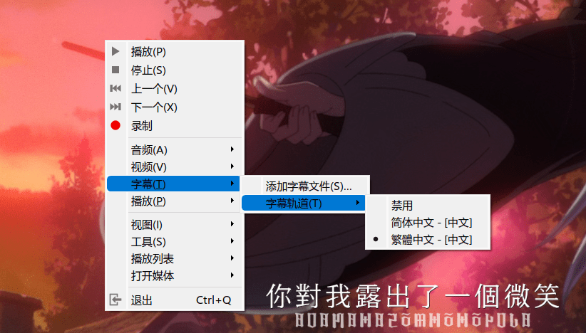

FFmpeg 是一个非常方便和强大的命令行视频媒体处理工具，可以对几乎任何常见的音视频文件进行转码压制。MKV 内封字幕，即使用 [Matroska](https://zh.wikipedia.org/zh-cn/Matroska) 封装格式将 ASS、SRT 等字幕封装进 .mkv 的单个文件。

MKV 这种封装格式在近年受到了不少青睐，因为它能在一个文件中塞下多个不同的字幕轨道、音频轨道、附件甚至视频轨道。当播放器播放时，用户可以根据自己的需求选择不同语言的字幕，甚至还能选择不同的配音。MKV 内封字幕对于字幕组来说也是福音，因为 MKV 的每个轨道独立，若要修改字幕，直接将源轨道的字幕文件替换即可，不需要花时间再次将字幕压制进视频。

<figure>



<figcaption>

多轨道字幕

</figcaption>

</figure>

但 MKV 也不能尽善尽美，和最常见的 MP4 相比，MKV 可能无法被一些兼容性不佳的播放器支持。且由于其多轨道的复杂性，若在浏览器中播放，将会出现很多意外。另外，各大字幕组（尤其是动漫的字幕组）更偏好制作 ASS/SSA 的特效字幕，其难以被一些操作系统自带的播放器或 Web 环境解析，这都让 MKV 的兼容性大打折扣。

尽管 MKV 有着许多先进的特性，但有时候我们却不得不考虑将字幕压制进视频——制作为硬字幕。例如 Web 播放。这篇教程简单写一下如何实现。

## 教程

要想用 FFmpeg 进行压制，你必须先已经安装 FFmpeg。打开系统当中的命令行，按照以下方法编写指令：

```
ffmpeg -i '.\input.mkv' -vf "subtitles='.\\input.mkv':si=0" -crf:18 -o result.mp4
```

下面简介每个参数的作用：

`-i '.\input.mkv'` 为你的输入视频文件

`-vf "subtitles='.\\input.mkv':si=0"` 代表了要选用的滤镜，请注意，这里 -vf 后面的参数是双引号之间的内容

`subtitles='.\\input.mkv'` 这里是字幕的来源，可以填写 mkv 文件

`:si=0` 代表指定选择第 0 个字幕轨道。实际上此参数可以不加，FFmepg 将选择默认的字幕轨道。关于字幕轨道的编号可以通过播放器或 mediainfo 来查看

`-crf:18` 这里简单指定了压制的质量，18 已经是画质较佳的选项。一般动画压制的范围在 16-23，可查找其他教程

`-o result.mp4` 这里指定了输出文件名，mp4 的后缀将会自动将视频压制为 H.264 / AVC 编码。若需要使用其他封装格式请手动指定编码器为 libx264

## 效果

如果一切设置正常，FFmpeg 将开始压制视频。压制完成后，用播放器打开成品，就可以看到字幕已经被压制进了视频里，ASS 字幕的样式，以及 MKV 内含的字体都完美的渲染了出来（FFmpeg 使用 libass  解析渲染 ASS / SSA 字幕）。

<figure>


<figcaption>

效果~

</figcaption>

</figure>
