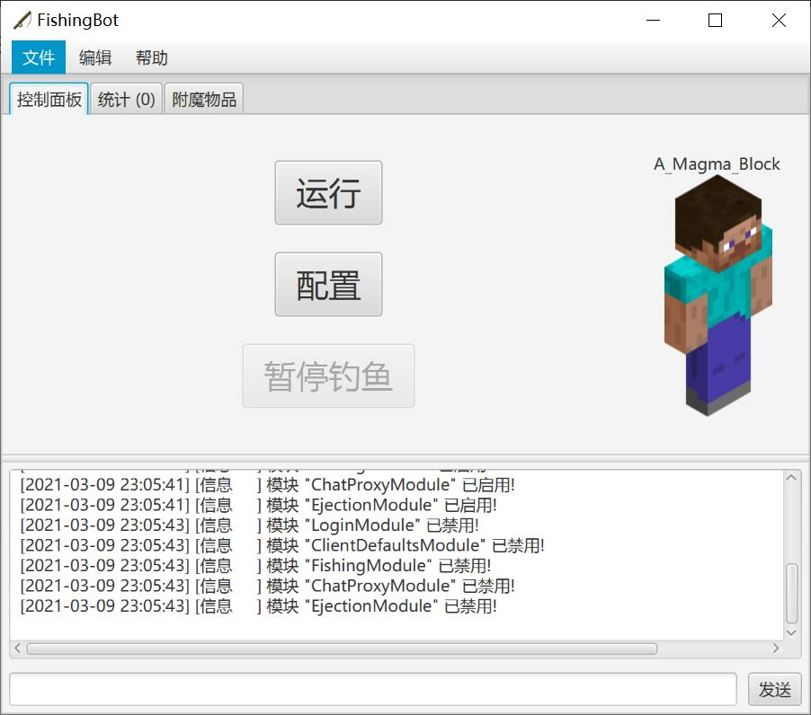
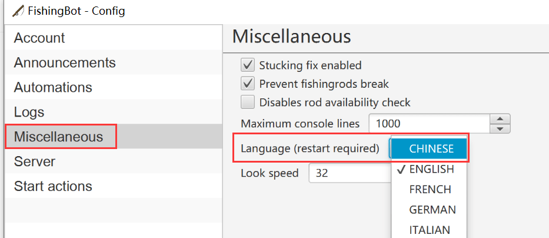
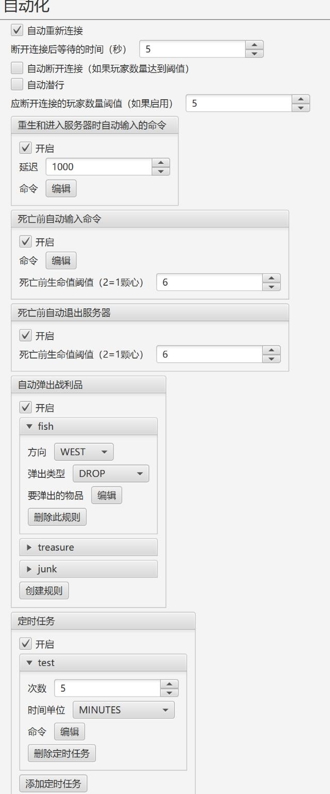
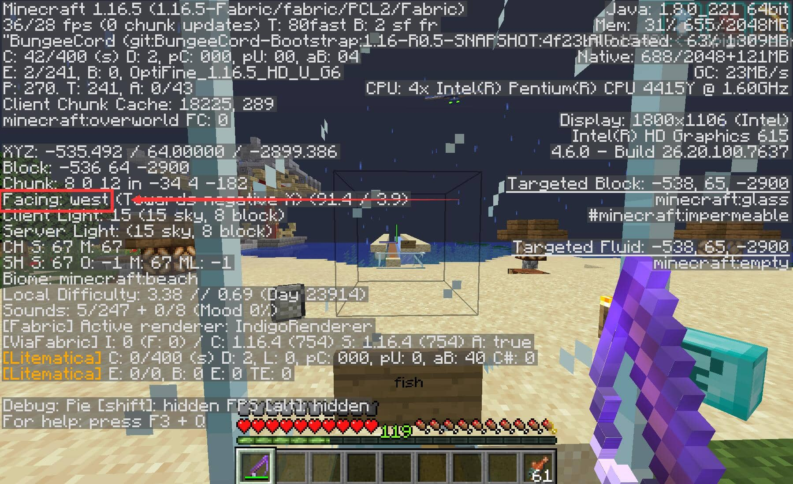
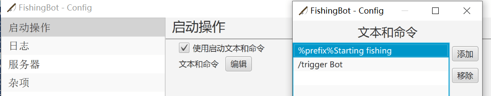
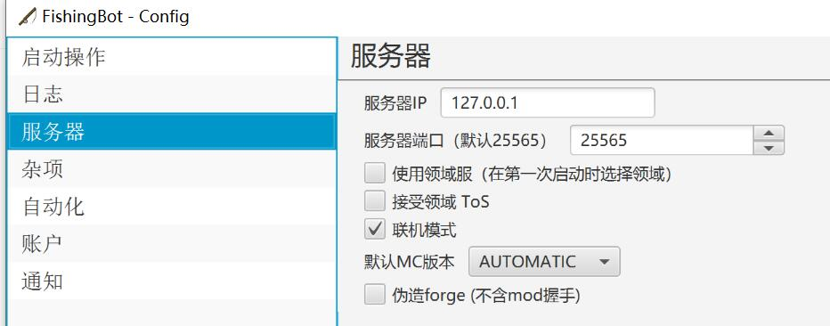
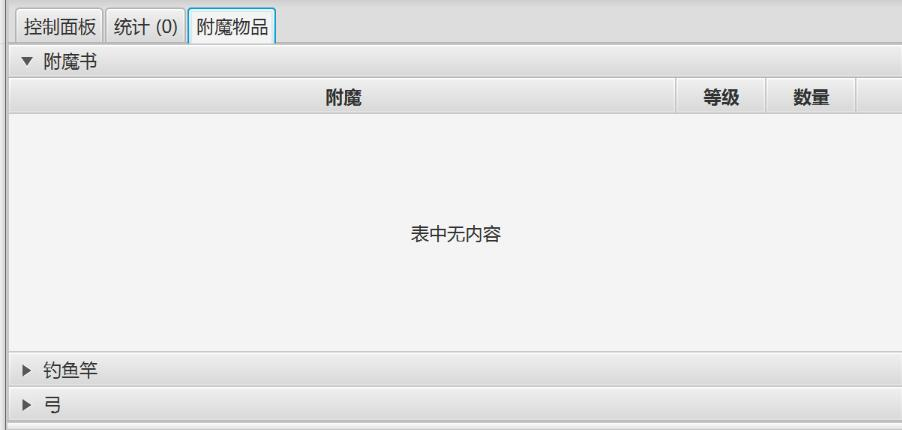

为了更好的利用起离开游戏时的时间，有时候我们会用钓鱼机或是自动钓鱼 Mod 类的方法来在 Minecraft 里挂机钓鱼。钓鱼对每一个阶段的原版生存玩家来说都很有用：初期可以解决食物问题；中期可以获得不少经验；后期钓鱼能产出不少的附魔书和命名牌。

<figure>


<figcaption>

钓鱼概率一览，来自 Minecraft 中文 Wiki

</figcaption>

</figure>

但是上面这两种挂机的方法都不太完美：钓鱼机需要鼠标一直右键，这下可能电脑就不能干别的事情了。钓鱼 Mod 尽管能后台运行，但是某些低配的电脑就会开始卡。（泪

这时候 Fishing Bot 就派上用场了！**一键后台运行、几乎不占用电脑资源、还能帮你自动分类钓鱼钓上来的物品。**如果有一台服务器的话，**甚至连电脑都不需要。**可谓是生存玩家的福音，我个人已经使用了将近半年多了，这篇文章介绍一下怎么使用它！

> **请确认您的服务器允许使用自动钓鱼类 Mod 和挂机！如果登陆的方式不是正版登录/指令登录可能无法登录。**

首先这是一款在 Github 上开源的程序，开发者[MrKinau](https://github.com/MrKinau)来自国外，软件正在积极更新，兼容目前几乎所有原版服务器。

[GitHub MrKinau/FishingBot](https://github.com/MrKinau/FishingBot)



在我一位好友的帮助下，最近软件已经内置中文操作界面！配置起来已经没有什么难度了。首先我们在[Release](https://github.com/MrKinau/FishingBot/releases)界面下载软件的最新版本，是一个 jar 包。正常情况下可作为 Java 程序直接双击打开，如果你的电脑不能双击打开的话，可以在 jar 包同目录下新建一个.bat 批处理文件，在里面打上这些东西：

```
java -jar [你下载的FishingBot.jar的文件名]
```

保存执行就能打开软件的 GUI 操作界面了。第一次使用，界面是全英文的，如果看不懂，可以点击【Settings】打开软件的设置，点击【Miscellaneous】【Language】【CHINESE】，重启软件就是中文了~



下面介绍一下每个栏的设置功能：

## 自动化

<figure>



<figcaption>

太长了点击查看大图

</figcaption>

</figure>

这一页可都是好东西啊！简单易懂的选项就不提了，讲讲自动化：一种可以帮你把钓鱼钓上来的战利品**自动分类存放**的策略。

- 【自动弹出战利品】点击每个规则的名字（如 fish）可以展开这一项设置。
  - 【弹出类型】表示弹出战利品的方式，DROP 为丢弃，FULL_CHEST 为填箱。箱子的方法经我测试似乎并不怎么好用，这里建议使用丢弃模式。
  - 【方向】代表你丢出/填箱的方向，东南西北。要在游戏里查看东南西北请打开 F3，如图所示：
  - 【要弹出的物品】这里写这一种规则所要弹出的物品列表，列表里面请写英文物品 ID。在游戏中按下 F3+H 可以打开物品高级提示框显示模式，把鼠标放在物品上就能看见物品的 ID 了。
- 如何使用这个功能呢？你可以在你钓鱼的位置旁边放上三个漏斗，如图所示


这里左边是水，也就是玩家面向钓鱼的地方，东西北三个方向分别放了三个漏斗，这三个漏斗分别对应上面【自动弹出战利品】的三个规则。挂机软件钓鱼钓到的不同战利品会分别分类丢在这些漏斗上面。


漏斗地下连接的是一些箱子，以及一个垃圾处理器，用来大量存储钓鱼的战利品。

这是我目前的设计思路，基本上也就是这种模式，你可以结合这种思路来自行安排你的自动化钓鱼~

## 启动操作



本栏的功能只有一个：就是启动文本和指令，这类的文本和指令实际上就是挂机软件登录后自动输入的聊天消息或者指令，这里我一般只填一个/login 的登录指令，可以实现离线服务器的自动登录。

## 服务器



在这里填写你服务器的地址。请注意，如果你要连接的服务器使用了 SRV 解析，软件不一定能连进去。（[什么是 SRV 解析？怎么解决这个问题？参考我之前的文章](https://magma.ink/nosrv/)）

- 【联机模式】请注意是正版登录的意思，翻译有误，已经在催了（
- 【伪造 Forge】这个功能可能适用于 Forge 模组的服务器，可以自己尝试一下。


## 杂项


- 【防止鱼竿断裂】不使用低耐久的鱼竿以免损坏。
- 【卡顿修复】有时候会因为服务器卡顿导致鱼竿没落在水里，开启这个功能后长时间钓不上鱼会自动重新抛竿。
- 【查看速度】是视角转动的速度（如果你开启了自动化的话），这个速度的计算公式是：角度 ÷【填入的值】×50ms。

## 通知


- **【通知类型（游戏内聊天）】这个建议直接设置为 NONE！**会在你钓出鱼、战利品的时候在聊天栏发送你钓到了什么。这个功能感觉没啥用还会让全服人都知道你在挂机= =
- **【宣布升级】这个也建议直接关掉！**会在你钓鱼升级之后向全服人发送你升到 xxx 级了！有些沙雕
- 【通知类型（机器人控制台）】建议设置为 ALL，这个是在你钓出鱼、战利品的时候在挂机软件的信息栏显示你钓到了什么。（仅你可见）
- 【Discord】这个功能会在挂机钓鱼遇到一些事件时往指定 DIscord 服务器或用户发送消息。由于国内用不了，不需要开启可自行研究。



顺便一提的是，如果你使用 Windows 电脑来挂机，GUI 界面还能显示你的“战功”，也就是战利品清单，可以看看挂这么久获得了什么。

## 将 Fishing Bot 挂在服务器上

实际上挂机的时候没必要一直开着电脑。如果你有一个服务器或者挂机宝的话，完全可以把 Fishing Bot 放在服务器上。操作也很简单，Windows 服务器直接挂即可，Linux 服务器的话就像运行 Minecraft 服务器那样使用脚本启动 jar 即可~只不过 Linux 服务器不能使用 GUI 界面，所以说可以提前在 Windows 上把配置文件 config 配置好，再丢到服务器上~

由于运行时并不需要渲染 3D，因此占用的资源很低，放在服务器上也不会占用过多的内存和 CPU。如果愿意和使用得当的话，使用此软件实现数日的挂机也不成什么问题~


> 你以为你很幽默？
>
> 鱼如此说道

> 封面截取自 https://youtu.be/Of\_JGw5oRy4。
