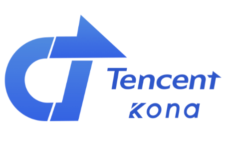

为了方便自己和他人快速获取 Java 运行环境，我在本界面提供了一些可靠的链接和信息。

## 常用链接导航

请根据你的需求在下面查找需要的环境和下载链接。

### 仅仅是玩 Minecraft 使用

#### 我是 Windows 系统

- **Minecraft 1.20.5 及以上版本**：使用 Java 21
  - [AdoptiumOpenJDK 21 清华源](https://mirrors.tuna.tsinghua.edu.cn/Adoptium/21/jre/x64/windows/)
- **Minecraft 1.18 - 1.20.4**：使用 Java 17
  - [AdoptiumOpenJDK 17 清华源](https://mirrors.tuna.tsinghua.edu.cn/Adoptium/17/jre/x64/windows/)
- **Minecraft 1.16.5 及以下**：使用 Java 8
  - [AdoptiumOpenJDK 8 清华源](https://mirrors.tuna.tsinghua.edu.cn/Adoptium/8/jre/x64/windows/)

#### 我是 macOS 系统

- **Minecraft 1.20.5 及以上版本**：使用 Java 21
  - [AdoptiumOpenJDK 21 清华源](https://mirrors.tuna.tsinghua.edu.cn/Adoptium/21/jre/x64/mac/)
- **Minecraft 1.18 - 1.20.4**：使用 Java 17
  - [AdoptiumOpenJDK 17 清华源](https://mirrors.tuna.tsinghua.edu.cn/Adoptium/17/jre/x64/mac/)
- **Minecraft 1.16.5 及以下**：使用 Java 8
  - [AdoptiumOpenJDK 8 清华源](https://mirrors.tuna.tsinghua.edu.cn/Adoptium/8/jre/x64/mac/)

---

## 其他有关 Java 运行环境的大陆镜像站

下面是一些不错的 OpenJDK (含) 中国大陆地区的镜像站。包含较为流行的 OpenJDK 发行版如 Adopt。

注：下列镜像站部分只收录 JDK，通常适合开发者使用。JDK 不但可以运行 Java 程序（如 Minecraft），还可以用于开发。

- [清华大学开源软件镜像站 - Adoptium 21](https://mirrors.tuna.tsinghua.edu.cn/Adoptium/21/)
- [清华大学开源软件镜像站 - Adoptium 17](https://mirrors.tuna.tsinghua.edu.cn/Adoptium/17/jre/)
- [清华大学开源软件镜像站 - Adoptium 8](https://mirrors.tuna.tsinghua.edu.cn/Adoptium/8/jre/)
- [injdk.cn 镜像站](https://www.injdk.cn/)
- [华为云开源镜像站 - OpenJDK](https://mirrors.huaweicloud.com/openjdk/)
- [编程宝库 OpenJDK 镜像下载（过时）](http://www.codebaoku.com/jdk/jdk-openjdk.html)
- [编程宝库 Oracle JDK 镜像下载（过时）](http://www.codebaoku.com/jdk/jdk-oracle.html)

---

### 更多特殊版本和情况

部分 1.16 及以前的模组客户端需要 Java 11 环境，可[点此下载 (Windows 安装包)](https://mirrors.tuna.tsinghua.edu.cn/Adoptium/11/jre/x64/windows/)。

实际上若您游玩纯原版，Minecraft 1.6.4 及以后的版本完全可以用 Java 17 运行。因此，Minecraft 1.17 同样兼容 Java 17。但若遇到了故障可以尝试[点此下载 Java 16](https://mirrors.huaweicloud.com/openjdk/16.0.2/openjdk-16.0.2_windows-x64_bin.zip)，不过还是建议更新游戏和 Java，因为 MC 1.17 和 Java 16 都是将过时的半成品；  
若您的客户端不是原版，建议使用此版本 Minecraft 发布时推荐的 Java 版本，或模组作者要求的 Java 版本。更多 ☕Java 可向下翻阅；  
若您正在使用官方启动器或是网易我的世界中国版，您不需要手动配置 Java，可以离开了；

---

## 什么是 OpenJDK

Java 是一种计算机编程语言，而 OpenJDK 是 Java 的开发环境的开源版本，完全自由，开放源码。Oracle JDK 则是 OpenJDK 的一个发行版，有部分高级功能不完全开源，属于商业性质，在生产环境中使用 Oracle JDK 要注意法律风险。不过几乎所有情况下 OpenJDK 即可满足开发者的所有需求。

## 更多 OpenJDK 发行版简介

OpenJDK 是一个开源项目，有许多组织和团体为其添砖加瓦修改优化后发布了自己的发行版。在这里提供一些优秀的 OpenJDK 发行版指路。

### 阿里龙井 —— Alibaba Dragonwell JDK

Alibaba Dragonwell 是一款免费的, 生产就绪型 Open JDK 发行版，提供长期支持，包括性能增强和安全修复。阿里巴巴拥有最丰富的 Java 应用场景，覆盖电商，金融，物流等众多领域，是世界上最大的 Java 用户之一。  
Alibaba Dragonwell 作为 Java 应用的基石，支撑了阿里经济体内所有的 Java 业务。Alibaba Dragonwell 完全兼容 Java SE 标准，您可以在任何常用操作系统（包括 Linux、Windows 和 macOS）上开发 Java 应用程序，运行时生产环境选择 Alibaba Dragonwell。

> Dragonwell 拥有较强的内存节省能力和 CPU 效率优化。据[不完全统计](https://www.mcbbs.net/thread-1232993-1-1.html)可减少 40% 的内存占用，提升 20% 以上的 CPU 效率（仅供参考）。 Alibaba Dragonwell 已在我们运营的 [RIA | Zth](http://ria.red/) 服务器生产环境运行了近半年，的确表现优秀。若您有大型应用正部署，可以尝试考虑使用它。
>
> _Magma 个人实际体验_

[Alibaba Dragonwell 官网](https://dragonwell-jdk.io/)

### 微软的 OpenJDK 构建 —— Microsoft Build of OpenJDK

Microsoft Build of OpenJDK：微软的 OpenJDK 构建，看起来感觉更像是给微软自家使用的感觉。据评论区一位老哥说还不错。

[微软 Microsoft Build of OpenJDK](https://docs.microsoft.com/zh-cn/java/openjdk/download)

### Adoptium（原 AdoptOpenJDK）

> 最流行的 OpenJDK 社区构建版本之一，前面已经介绍了，可以完全自由的使用。

[Apoptium 官网（新升级）](https://adoptium.net/)

[AdoptOpenJDK 官网（旧版）](https://adoptopenjdk.net/)

### Azul Zulu

Azul 专门为 JDK 提供专业的 Java 商业技术支持，在业界享有很高的声誉，并参与了各种工作组以发展 Java 平台。Azul 为许多操作系统和架构提供了名为 Azul Zulu 的开源 OpenJDK 构建。如果不想要比较花哨的 OpenJDK 构建，可以尝试一下。

[Azul Zulu Java Download](https://www.azul.com/downloads/)

### BellSoft Liberica

与 Azul 类似，BellSoft 专注于专业的 Java 技术以及对 JDK 的商业支持。在业界享有很高的声誉，并参与了各种工作组以发展 Java 平台。  
BellSoft 为几乎所有操作系统和架构提供了名为 Liberica JDK 的开源 OpenJDK 版本，如果不想要比较花哨的 OpenJDK 构建，可以尝试一下。

[BellSoft Liberica JDK](https://bell-sw.com/pages/downloads/?)

### 华为 —— 毕昇 JDK

华为毕昇 JDK 是华为内部基于 OpenJDK 定制的 Huawei JDK 的开源版本，它是一个高性能，可用于生产环境的 OpenJDK 发行版。  
Huawei JDK 运行在华为内部 500 多个产品上，积累了大量的使用场景，并通过收集 Java 开发者反馈的问题和诉求，解决了业务实际运行中遇到的很多问题，在 ARM 架构上进行了性能优化，毕昇 JDK 运行在大数据场景下可以获得更好的性能。

> 华为的这款 JDK 针对 ARM 指令集 CPU 的平台做了优化，由于手里没有 ARM 的桌面或服务器设备，所以说没法体验。听网友说这个 JDK 拿来在 ARM 电脑上玩 Minecraft 或者开服务器都不错。

[华为毕昇 JDK 官网](https://mirrors.huaweicloud.com/kunpeng/archive/compiler/bisheng_jdk/)

### Oracle OpenJDK

Oracle OpenJDK：不再赘述，是 Oracle 的商业发行版，现在一般不在 Minecraft 服务器的生产环境使用。

[Oracle 官网](https://www.oracle.com/java/technologies/downloads/)

### 亚马逊 AWS —— Amazon Corretto JDK

Amazon Corretto 是开放 Java 开发工具包 (OpenJDK) 的免费、多平台、生产就绪型发行版。Corretto 提供长期支持，其中包括性能增强和安全修复。亚马逊在内部的数千种生产服务上运行 Corretto，并且 Corretto 已被证明能够兼容 Java SE 标准。借助 Corretto，您可以在常用操作系统（包括 Linux、Windows 和 macOS）上开发和运行 Java 应用程序。

[Amazon Corretto JDK 官网](https://aws.amazon.com/cn/corretto/)

### 腾讯 —— Kona JDK

腾讯 Kona JDK 是腾讯内部基于 OpenJDK 定制的 JDK 发行版本。主要应用于腾讯云业务场景及其他 Java 应用场景，并且针对超大规模的大数据、机器学习和云计算进行了深度优化。  
Tencent Kona 是腾讯开源的、免费的、基于 OpenJDK 的发行版本，并且受腾讯长期支持（LTS）和季度更新。目前，Tencent Kona 只提供基于 OpenJDK 8 的 Linux 版本。

[Kona JDK 官网](https://github.com/Tencent/TencentKona-8)

---

本文最初发布于 2020 年 8 月 16 日 上午 4:00
