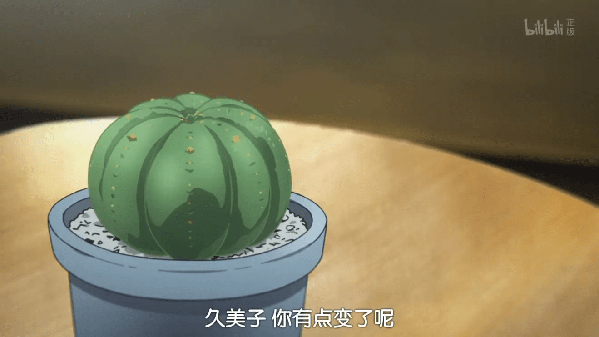
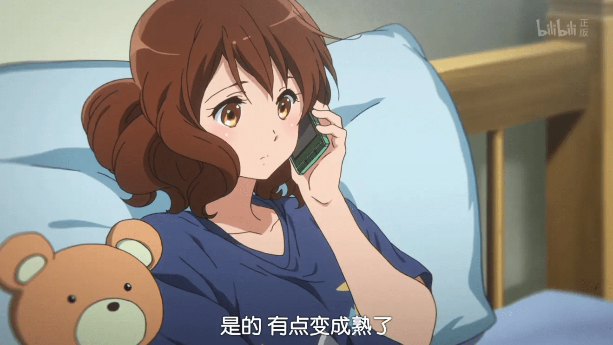
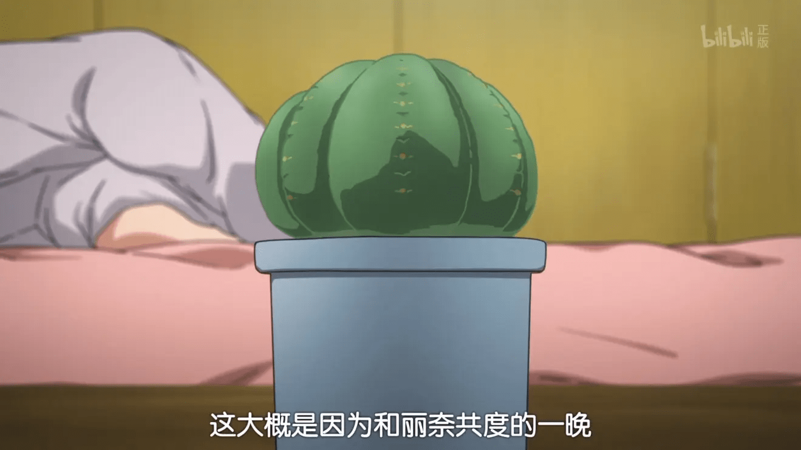

“吹响吧！上低音号~”

## 简介

[萌娘百科](https://zh.moegirl.org.cn/%E5%90%B9%E5%93%8D!%E4%B8%8A%E4%BD%8E%E9%9F%B3%E5%8F%B7) | [B 站免费](https://www.bilibili.com/bangumi/play/ep28919)）

> 《**吹响！上低音号**》（日语：**響け！ユーフォニアム**）是由武田绫乃创作的一部小说，并有漫画、动画等衍生作品。 亦有如《吹响！悠风号》或《吹响！次中音号》等不同的译名。
>
> 萌娘百科 [吹响!上低音号](https://zh.moegirl.org.cn/%E5%90%B9%E5%93%8D!%E4%B8%8A%E4%BD%8E%E9%9F%B3%E5%8F%B7)

## 评价摘录

### 哔哩哔哩 [＠留学生 BoBo](https://space.bilibili.com/246336) 的评论

“人真是单纯, 一旦知道有回报, 就会去努力. 倘若有成果, 就会加倍努力”---黄前久美子

“青春", 尤其是正值花季的高中时代, 早已成为了动画的主流王道题材. 不论是热血沸腾的体育竞技, 还是多愁善感的青涩恋情, 都让观众感到眼花缭乱. 然而, 看着这些光鲜亮丽的青春”礼赞”, 我们不禁要问: 这些经过艺术加工和夸大处理的作品, 真的能引起我们的共鸣吗?

所以, “吹响! 上低音号” 的出现无疑是值得我们感恩的. 它既不是博人眼球的校园偶像剧, 亦不是脱离现实的青春交响曲. 这部返璞归真的群像剧着重描写着那些看似不值一书, 但任何背景的观众都能多少带入的高中日常. 也许这些平淡无奇的事件注定与耀眼的"霓虹灯"格格不入, 但"吹响"正是这样一部写给我们这些"小人物"的情书, 让我们伴随着主人公的脚步, 回味着我们充斥着遗憾与惊喜, 失望与感动, 成功与失败, 疼痛与成长的百味青春.

不得不承认, 要讲好一部关于管弦乐团的故事绝非易事. 作为一个动辄上百人的大团体, 单凭几个天才或者部分人的努力很难带动整个乐团的质变. 然而每个成员亦是乐团不可或缺的"齿轮", 只有将他们个人的汗水高度融合,才能让管弦部这个如"洪流"般难以控制的机器正常运转. 而且任何有过音乐经验的人都知道, 表演前无数次的排练与个人修炼是极其枯燥乏味的, 有时为了练习时间还须做出必要的权衡与牺牲, 这些足以让初学者望而却步. 但是表演成功后的满足感与团队的归属感确是只有这些全心付出的人才能切身体会. 在这一点的描写上, "吹响"做的很成功.

群像剧最大的挑战就是如何在庞大的角色群中让每个人都活灵活现. "吹响"入木三分的人物刻画也很好地实现了这一点: 开始随波逐流, 得过且过, 但慢慢变的积极向上的久美子; 表面高冷, 实则内心缜密的高坂; 善解人意, 乐观外向的挚友叶月与绿辉; 非典型"男主"(喂) 与典型青梅竹马的秀一等等. 相信即使你没有在乐团的经历, 也能从他们身上或多或少地看到自己的影子.

感谢京都给我们带来如此耳目一新的作品, 也感谢大家的一路陪伴.你们真是太棒了!

我们有缘再相见.

2015-07-01 00:35

_摘录自哔哩哔哩[＠留学生 BoBo](https://space.bilibili.com/246336)_

### 第九话

京阿尼无限的脑洞：久美子房间里那盆植物不是仙人球，而是 Euphorbia（ユーフォルビア）——大戟科大戟属多肉植物的一种。看到这个名字大家应该都已经发现了，Eupho（ユーフォ）=悠风。

制作组特意选择了这盆与“悠风”相关的植物，用意相当明确，这颗 Euphorbia 象征的就是久美子这个吹悠风号、如悠风号般的女孩。  
对应小绿在电话中的“久美子你有点变了呢”这句台词，镜头对准了这盆植物。对比第一集可以发现，它确实发生了微妙的变化——这颗 Euphorbia 正在开花。“一切都源于与丽奈共度的那个夜晚”，可见丽奈对久美子的作用力。相信到最后一集这种变化会更为明显。

在搜索“Euphorbia”时发现了一个专门研究多肉植物的网站，经查找后发现，与片中最相似的是一棵品种未知的 Euphorbia，“光亮的表皮与均等分的球体”——这个最大的特征也十分吻合。同样是球状的 Euphorbia，为什么制作组不选择知一名度较高的布纹球（Euphorbia obesa）与贵青玉（Euphorbia meloformis），而偏偏选了这颗不知名的品种呢？这不禁让人联想到悠风号“不起眼、不为人知、不受欢迎”的一面。”

以上摘自豆瓣
