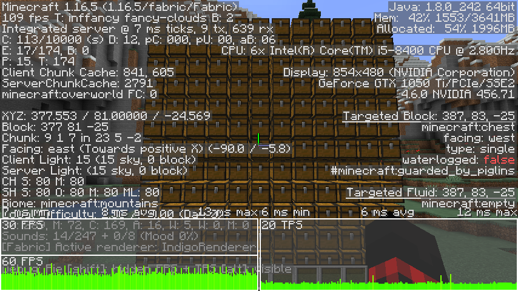
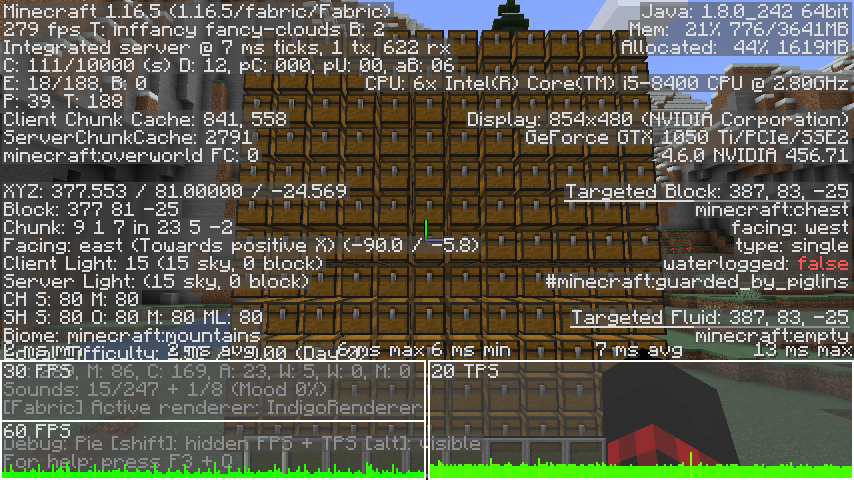
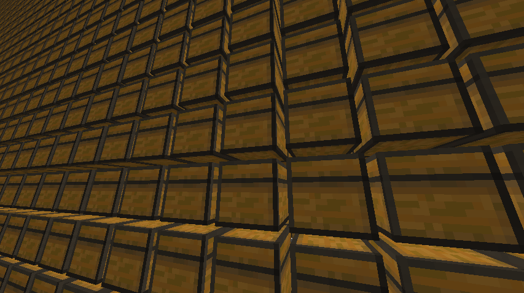
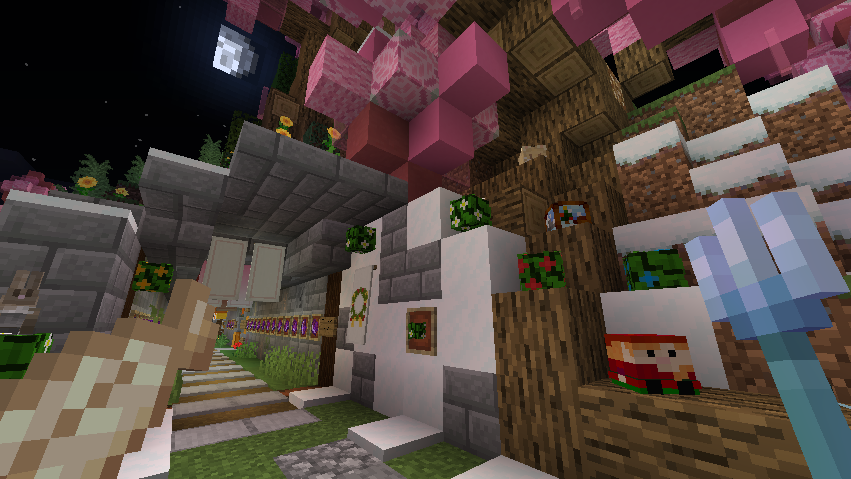
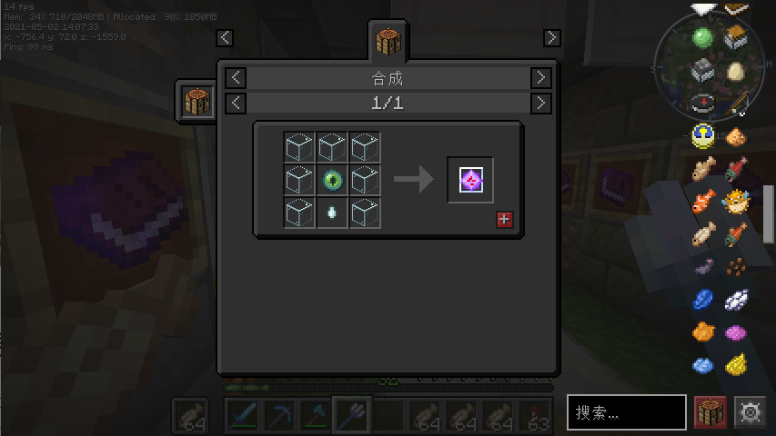
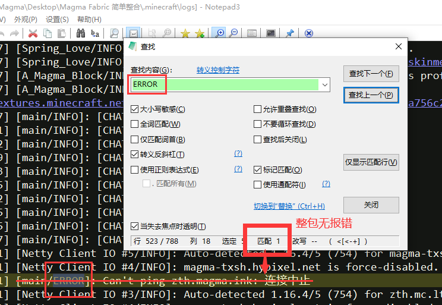

# 即将过时

由于个人精力有限，Magma Fabric 简单整合（1.16.5）、Magma 简单整合 3.0 （1.16.5） 将在 2022 年停止支持。  
最新 **[Magma Fabric 1.18.1](https://www.yuque.com/magma/board/fabric1.18.1)** 已经发布，十分建议您使用新版本。

## 更好的中文输入体验来了

打字的时候再也不用一直潜行了，当然，这需要一些时间来适应。

更惊喜的是，全屏时也能看到中文输入法候选了，就像这样。

<video muted autoplay loop>
  <source src="/videos/magma-fabric-3-srf.mp4" type="video/mp4" />
</video>

**兼容性提示：**  
此模组所依赖的 API 库 Satin 与 Optifine 的光影不兼容，如果你经常使用光影，那么只能关闭它了。  
兼容性不佳，若要禁用此模组，请禁用【Fabric Language Kotlin（前置）】、【Satin API（前置、与光影冲突）】以及【IngameIME（模组本体）】。本模组已于 3.1 版本移除，但 3.2 版本计划添加输入法自动禁用功能。

## 优化箱子渲染还能保留动画

得益于 **[Enhanced Block Entities](https://www.curseforge.com/minecraft/mc-mods/enhanced-block-entities)** ，我们能享受方块模型带来的高帧率，还能看到会张嘴的箱子。

<figure>

- 

  <figcaption>原版</figcaption>

- 

  <figcaption>优化后</figcaption>

- 

</figure>

## 长了手的 F1 视角

喜欢吗？不喜欢就再按一次。

## 咋合成来着？

我也不记得了，但是 REI 记得。REI 又回来了。

## 更加稳定的 3.0，离 ERROR 更远一点

测试启动并进行数分钟游戏，模组们都在好好的工作。没有潜在的报错 ERROR，可能我们离稳定 1.16 又近了一步。

## 体验最新版的稳定与畅快

下面是本次升级到**最新版本**的模组/组件列表，许多恼人的故障都在此得到解决了。

\[Masa 系列插件前置\] 、\[REI 物品管理器\]、\[万用皮肤补丁\]、\[体素地图\]、\[小工具集 X+C\] 、\[崩溃修复\] 、\[快速启动\] 、\[更好的 F3 界面\]、\[更好的雨\] 、\[模组菜单\]、\[潜影箱预览\]、\[聊天头像\] 、\[苹果皮\] 、\[血量显示\]、\[调低火焰遮挡\] 、\[跨版本\]、\[高清修复\] 、\[高清修复前置\] 、\[鼠标手势\]、\[崩溃修复\] 、\[Fabric-API\] 、\[Cloth Config API\] 。同时更新 Fabric Mod Loader 至最新稳定版 0.11.3。

## 主要更新内容

- 优化中文输入法使用体验，无文本框时自动禁用输入法。[详情](https://www.mcbbs.net/forum.php?mod=viewthread&tid=1158421)
- 现在在全屏时会使用内置输入法 UI 了。（仅支持微软拼音输入法）[详情](https://www.mcbbs.net/forum.php?mod=viewthread&tid=1158421)
- 优化箱子模型，保留动画的同时减缓大量箱子造成的渲染卡顿。[详情](https://www.bilibili.com/video/av375045000)
- 现在 F1 有了两种模式：隐藏 GUI 但不隐藏手中物品、隐藏手中物品（原版）。[详情](https://www.curseforge.com/minecraft/mc-mods/better-f1)
- 更新并重新启用 REI RoughlyEnoughItems 模组。
- 现在按 G 键可以刷新你周围的方块，这可以有效的避免网络延迟造成的幽灵方块。[详情](https://www.curseforge.com/minecraft/mc-mods/antighost)
- 优化原版手持物品模型，填补其缝隙。[详情](https://www.curseforge.com/minecraft/mc-mods/item-model-fix)
- 更新客户端跨版本 ViaFabric，修复之前不能使用的 BUG。注意，开启客户端跨版本可能导致无法兼容 Zth Plus 等多版本服务器。
- 更新 Fabric 底层至最新。
- 修复同一玩家发送多行消息时每行都会显示头像的问题。
- 优化主菜单及暂停界面菜单布局，不再凌乱。
- 修改启动界面配色及动画速度。
- 增大默认 Voxelmap 世界地图最小缩放比例。

## 旧版本更新须知

本次更新改动较大，涉及 70%以上的模组和整个游戏核心中 Fabric Loader 的升级。如果您已经对旧版本的整合包进行了大量改动，**增量更新可能会导致不可预料的故障，建议您备份旧版本目录后再尝试升级**。当然，欢迎您直接下载最新版本完整包后体验最稳定的 3.0 版本。

## 3.0 版本完整包

[点击下载](https://www.yuque.com/magma/board/oldmc#w8wKx)

本整合已经自带 Java Jre 8 运行环境，直接下载即可使用。默认自带 PCL II 公测版启动器。

请注意，此整合包是玩家 A_Magma_Block 的个人作品，并非 Zth 官方制作，不代表官方立场。本整合包在[知识共享 署名 - 非商业性使用 - 相同方式共享 3.0 (CC BY-NC-SA 3.0) 许可协议](https://creativecommons.org/licenses/by-nc-sa/3.0/deed.zh)下提供。如果您需要转载上述内容，请附带来源（Magma Ink、@岩浆块 Magma 或 原文链接），并且不可将其使用于商业用途。  
本整合包基于 1.16.5 Fabric，RIA Zth 服务器仅支持 1.13.2。服务器列表中预置了 [Zth Plus](https://magma.ink/plus/) 和 LongPLUS 版本转换服务器，可以兼容 1.13.2 以上的客户端。[Zth Plus](https://magma.ink/plus/) 和 LongPLUS 由服务器玩家自行建立并运营，与 Zth 官方无关，不代表 Zth 官方立场。即使您使用 1.16.5 客户端通过 [Zth Plus](https://magma.ink/plus/) 和 LongPLUS 进入 Zth，Zth 服务器也并不支持高版本的特性与方块，您仍然在游玩一个 1.13.2 的服务器。  
Minecraft 是瑞典公司 Mojang Studios 的游戏产品，版权归其所有。本整合包使用了大量开源软件与 Mod，在此统一表示感谢！模组作者信息请查阅游戏中“模组”菜单。

**AD | Magma 的网盘开始开放测试 点此获得真正属于你的免费 64GB 不限速空间 [Lava Bucket AD - 一个白板](https://board.magma.ink/lava-bucket-ad/)**

## 新增模组列表

- \[防幽灵方块\] antighost-1.16.5-fabric0.30.0-1.1.3.jar
- \[更好的 F1\] betterf1-fabric-1.16.4-1.0.0.jar
- \[手持物品模型修复\] item-model-fix-1.0.1.jar
- \[箱子优化\] enhancedblockentities-0.1--1.16.x.jar
- \[游戏内输入法\] IngameIME-fabric-1.16.5-1.5.jar
- \[前置 API 库\] fabric-language-kotlin-1.5.0+kotlin.1.4.31.jar
- \[前置 API 库\] satin-1.6.0-nightly.20w48a.jar

## 多余的部分，还是移除好了

删除了 自动汉化 i18nupdatemod、自动配置 autoconfig1u、cotton-client-commands、锂 lithium-fabric（与 Optifine 不兼容）。
