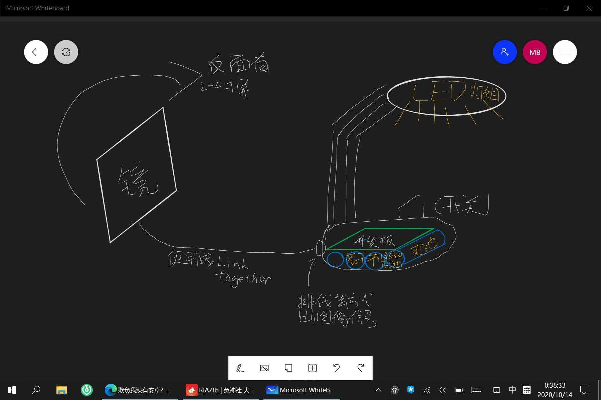

> 想起来树莓派（一种 arm 的开发板）可以装安卓
>
> 我萌生了一种插上镜子（装有触摸屏）就可以变成智能台灯的神必玩意
>
> 也许可以拯救广大学生与水火中
>
> 真是好草的设计呢
>
> 我称它为 Magma 智能台灯
>
> 2020 年 10 月 14 日 Magma 在兔神社群中兴奋的说道

<figure>

<figcaption>

草图

</figcaption>

</figure>
