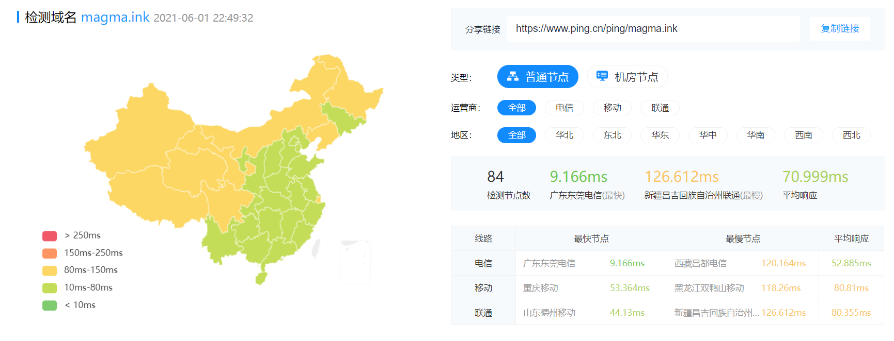

研究折腾开发近一年多，我已经在网络上搞出来了不少有用的小东西。搭建了网站，创建了一个特殊的 Minecraft 服务器，最近还在折腾视频点播。而它们无一例外都基于各种云服务。在云端探索的这段时间，我也发现许多朵方便好用的”云“，这里写一篇文章推荐一下~（无商业推广，咱还没这个能力）

## 主要建站服务器

### 腾讯云轻量应用服务器

我折腾出来不少网站——尽管大部分都是自用的。这些网站里最大的就是我们现在所在的地方——我的博客。我主力的建站服务器是腾讯云的香港轻量应用服务器，公众号领券后￥ 188 购买的。明年续费可能就要￥ 288 了。腾讯云香港的轻量目前用起来质量很不错，三网大部分时段连接速度都很快，基本上 CN2、GIA 什么的专线都有。全国 Ping 只比境内服务器慢一点，对于我这种还没有备案的站长来说可以是很舒适了。

<figure>

<figcaption>

腾讯云香港轻量应用 我的服务器的 Ping

</figcaption>

</figure>

<figure>

<figcaption>

腾讯云 轻量应用服务器

</figcaption>

</figure>

## 静态资源存储

### 多吉云 DogeCloud

为了更进一步加速博客访问体验，以及缓解诸如《[追番日记](https://magma.ink/fan/)》这种巨多图片的界面访问时服务器的 CPU 高占用情况，博客的静态资源诸如图片、视频，以及一些 JavaScript 和 CSS 都由 CDN 负责。我目前在用多吉云（DogeCloud）的对象存储来分发图片视频，jsDelivr 来加速网页静态资源。博客启用了 WP Super Cache 插件来缓存界面。当访问博客时，基本上服务器只需要提供一份缓存的 HTML 文件（不过目前还有些插件的 JS 没搞进 CDN）。

<figure>

<figcaption>

WP Super Cache 插件缓存的网页

</figcaption>

</figure>

DogeCloud 是一家提供对象存储，CDN 和视频点播的云服务商。对大部分个人博客站长来说，对象存储这种服务”只用一点点，不能用多了“。去用一流厂商的对象存储来加速，不走 CDN，流量 1GB 就收费 0.5 元，实在是有些烧钱。我就用过腾讯云的 COS 来存博客的图片，的确超好用，但余额掉的也老快了。我也不知道在哪看到了 DogeCloud 的链接，点进去发现定价还蛮便宜的。

<figure>

<figcaption>

DogeCloud CDN 定价

</figcaption>

</figure>

经过研究，发现这家的对象存储和 CDN 实际上仍然是腾讯云。了解得知，阿里云、腾讯云等等这类云服务的厂商，实际上对大流量用户是有很大幅度的优惠的，DogeCloud 相当于作为一个巨大需求的客户，找腾讯云取得了极其优惠的价格，然后又自己开发了一套系统来二次售卖。0.11/GB 的流量对于普通站长来说实际上已经不算贵了，更何况他们每个月还赠送 20GB 的流量和 10GB 的存储，以及 20GB 的视频存储空间。自从我搬到 DogeCloud 之后，博客的图片存储目前是没花过钱了。感觉比又拍云的联盟还要香好多。

<figure>

<figcaption>

DogeCloud 每个月免费送不少资源包 用了半年只花了 0.25

</figcaption>

</figure>

<figure>

<figcaption>

博客的图片资源 CDN 全国 Ping

</figcaption>

</figure>

<figure>

<figcaption>

DogeCloud 官网宣传

</figcaption>

</figure>

美中不足的是，DogeCloud 的第三方兼容性可以说是几乎没有。因此你不能很方便的将 DogeCloud 引入到你的项目里。官方目前仅仅给出了一个不太完美的 WordPress 插件（会让全站始终加载 Dplayer 的 Js，即使界面上没有视频），我的博客也有使用。

作为一个除了 HTML 不会任何语言的菜鸟，最近刚搞懂 HTTP-API。DogeCloud 官方倒是有给[API 使用方法](https://docs.dogecloud.com/api-access-token)，但是这必须要对你想接入的程序进行二次开发。在学了在学了，毕竟 0.11 元/GB 还是腾讯云的 CDN 太香了实在太想用了。

### 又拍云的对象存储

对于我们这种需求量极小网站崩了都不一定有人发现的普通站长，实际上也不一定要用一流的云服务厂商。国内的大部分有提供对象存储的厂商我都有了解过，后来发现又拍云的性价比也还不错。对象存储或者 CDN 国内是 0.29/GB，虽然有些小贵，但是目前来看不少程序都是支持又拍云的，算是买个体验吧。

<figure>

<figcaption>

又拍云 官网价格 1GB 存储每日 1GB 流量

</figcaption>

</figure>

又拍云这边还对个人开发者提供的有“又拍云联盟”的计划。每个月免费 10GB 存储和 15GB CDN，需要在网站底部加一个又拍云的图标。我没整过这个，不过对于个人开发者来说还是有些实惠的吧。吃人嘴软，拿人手短

说起来，又拍云实际上找代理购买的话也是能更便宜的。我找代理购买的对象存储价格压到了 0.1/GB，这个价格已经比 DogeCloud 便宜了，不过代理商感觉买起来也有点小麻烦，我拿来存正在开发的番剧库的番剧视频资源，全国 CDN 速度稳定。不过比起上面腾讯云或者多吉云的 CDN，又拍云的全国延迟稍高一点点，不知道为什么我又拍云的 CDN 总不能精准的使用离用户最近的节点。

<figure>

<figcaption>

我的又拍云对象存储全国 CDN Ping

</figcaption>

</figure>

<figure>

<figcaption>

我的使用情况 目前流量只花了一块多

</figcaption>

</figure>

## 结语

云服务技术的发展进步让更多人能够更简单的拥抱开发，这使得互联网的门槛进一步降低。无论是个人开发者还是大型企业，在这个互联网的时代都一定需要服务器等计算资源，比起传统的计算解决方案，集中化的云服务带给所有人更简洁高效的体验，使我们不需要考虑服务器维护的琐事。我使用云服务的这一年多，最大的感受就是方便。只需要在控制台点点鼠标交出钱包就能获得属于你的计算资源，打开手机，每个联网的 App，背后都少不了云服务的加持，才发现现今的云计算已经如此强大。
