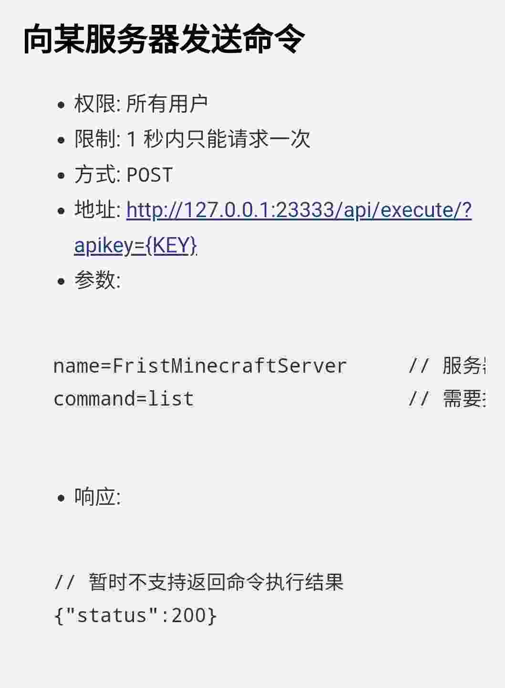

我最常驻的 Minecraft 服务器：[RIAZth](http://ria.red)，总是会有人莫名其妙的在地狱门里下线或掉线，感觉每半个月就能碰见一个。

问题是，Zth 这边用了登录插件，未登录的时候不允许移动，而 Minecraft 又不允许在地狱门中打开游戏的 GUI。

这是离线服务器众所周知的老 bug 了，解决方法也多种多样，通过 Mod、聊天器都可以自助解决，如果没有还可以找其他玩家帮忙拆了地狱门。

服务器里有很多玩家制作的整合包，但是并不是人人都会去使用= =。

本着研究的精神，我又整出来一个解决方法，虽然实现方法有点多此一举了。

最近[ZthPlus](http://zthplus)加了一个叫 BungeeSudo 的插件，可以在后台代玩家执行指令或者聊天，灵机一动想起来这个东西好像可以解决地狱门打不了指令的问题。有什么办法能让玩家把登录指令发到后台呢？让玩家登录后台去操作有点不现实，略繁琐了。看看有没有什么远程执行指令的 API 或者插件吧。

Bungeecord 的插件相对 Spigot 比较贫瘠，那种远程管理的插件也不好用。找来找去也没发现合适的。翻来覆去，突然想起来，我管理服务器的面板 MCSM 好像自带一套 API。



由于在此之前没有任何关于 HTTP 协议的概念，因此除了最简单的 GET\[ref\]直接用浏览器打开即为 GET\[/ref\]之外都不了解，这次算是好好查了查。

最后写出来个 bat 脚本，用 cmd 实现 POST 发送，但是由于 Win7 不自带 curl 导致只支持新系统。

## 原理

使用 cmd 脚本调用 curl.exe 进行 HTTP 的 POST，向 MCSManger 的 API 发送数据，在指定服务器后台执行指令：/bungeesudo <player> <command>。为了安全，这里我又开了一个淦地狱门专线，和其他玩家和服务器隔离开。

## 效果

CMD 窗口相当于一个外置聊天框，可以代玩家执行任何指令或者发送聊天。

实际上不是什么高技术力东西，只是个小脚本，只是为了学习研究做出来的。

以此记录。

## 附

- [MCSMAPI](https://board.magma.ink/mcsmapi/)原文
- 发布界面：[https://board.magma.ink/portal/](https://board.magma.ink/portal/)
- 程序大致源码：

```
@ECHO OFF
title 淦地狱门 - Zth Plus
mode con cols=85 lines=15
if not exist "C:\Windows\System32\curl.exe" goto old
curl -s -v -- "http://zth.magma.ink:23333/api/start_server/NoPortal?apikey=114514（"
echo.
echo.
echo.
echo.
echo      欢迎使用本程序。                                By Magma
echo      如果您在地狱门下线再次上线后无法使用指令登录，本程序可能会解决你的困扰。
echo.
echo.
echo      请使用 IP [zth.magma.ink:25555] 进入游戏！（重要）
echo.
echo.
echo.
echo.
echo.
SET /P  id= 请输入你的游戏名 / Please enter your ID :
echo.
echo.
echo      游戏名已设置为 %id%，请使用此游戏名进入 [zth.magma.ink:25555]
echo.
echo.
echo.
echo.
echo.
echo.
echo.
echo.
echo      现在此窗口就是您的 Minecraft 外置聊天框，可以使用 /login 或者聊天了。
echo      (登录 Zth 后可 /server n 切换到奈落)
:start
echo.
SET /P  pw=
echo.
echo.
curl --data "name=NoPortal&command=bungeesudo %id% %pw%" http://zth.magma.ink:23333/api/execute/?apikey=114514（
echo.
echo.
echo 显示{"status":200}即为指令执行成功。
echo.
echo.
echo.
echo.
echo.
echo.
echo.
echo.
echo.
goto start
:old
echo.
echo.
echo   发现您可能正在使用旧版本的 Windows，缺失本程序所依赖的 "curl" 指令。
echo   很抱歉，经过多次研究，您只能使用备选方案。
echo   按任意键打开教程
echo.
echo.
pause
explorer https://board.magma.ink/curl/
```
