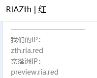
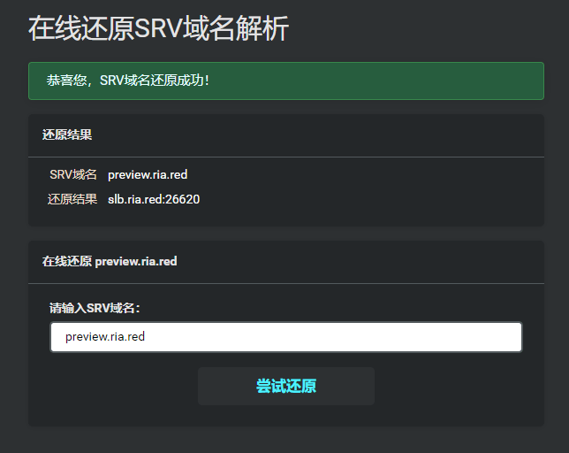

为了美观和方便，许多的 Minecraft 服主都会把自己服务器的 IP 地址加上一层 SRV 解析，这样服务器的端口就能被隐藏，也可以让自己服务器看上去更加整洁。

<figure>

<figcaption>

Like this

</figcaption>

</figure>

因为成本只需要在域名中添加一份记录，所以很多服务器（没有独立 IP25565 端口的）都进行了 SRV 解析。数量多到孕育出了一些 Minecraft 服务器端口隐藏的服务。但 SRV 解析也同时造成了一些问题，尽管 Minecraft 本身已经支持 SRV 解析，但是还有好多第三方聊天器、挂机器等软件，仍然不支持 SRV 解析的 IP 连接。而且更让人难受的是：**如果玩家的 DNS 服务器不给力，有时候使用了 SRV 解析的服务器经常会出现无法连接的情况**，我常驻的 RIAZth 服务器的 QQ 群里经常能看见出现这种问题的玩家。

为了自己的游戏体验，我们可以将经过 SRV 解析的服务器 IP 手动还原成普通的数字 IP 或 CNAME 解析状态，这样在任何情况下都能和服务器畅通无阻的对话。偶然发现，洛神云数据这边有一个 SRV 解析还原的小工具，只需要输入服务器 IP，就能直接还原，用起来很方便，推荐一下。

> **在线还原 SRV 域名解析**
>
> [https://mc.iroselle.com/apps/srv_parse](https://mc.iroselle.com/apps/srv_parse)

<figure>

<figcaption>

很简单

</figcaption>

</figure>

同时洛神云数据还有服务器监控的功能，我现在就拿这个来做[Zth Plus](https://magma.ink/plus/)的状态统计（实际上统计的是 Zth 的人数），能显示服务器的历史人数，状态，可惜不支持 html 嵌入。我在 Zth Plus 的说明界面里嵌入了人数统计图片和 namemc 的服务器卡片，还挺好用的。（本文无推广内容）

---

人数统计示例：（那个卡片式的信息是 namemc 的）

查看 Zth Plus 是否在线（能检测到 Zth 服务器信息即在线）

<iframe style="width:728px;height:90px;max-width:100%;border:none;display:block;margin:auto" src="https://namemc.com/server/zth.magma.ink/embed" width="728" height="90"></iframe>

历史数据观测：

> (年代久远已经失效)
