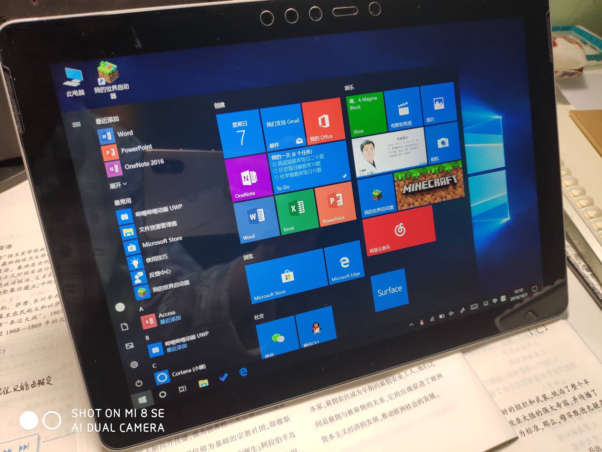
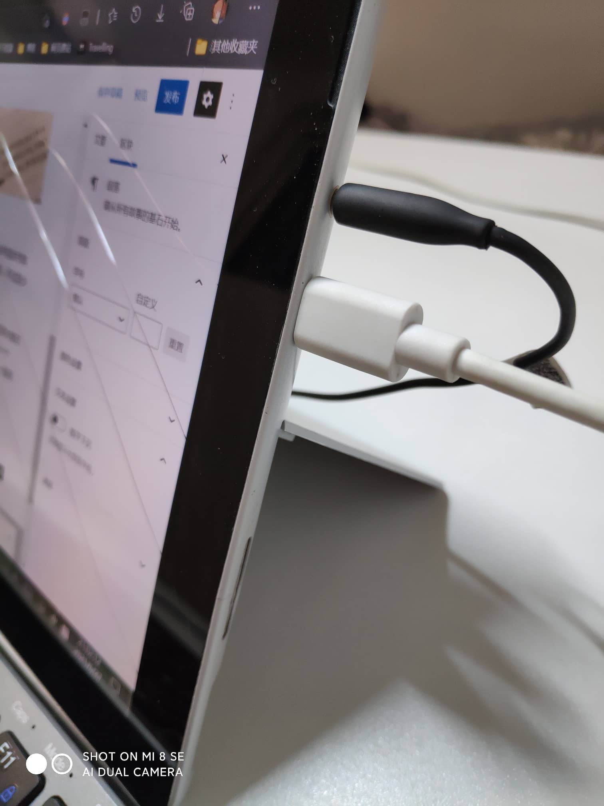
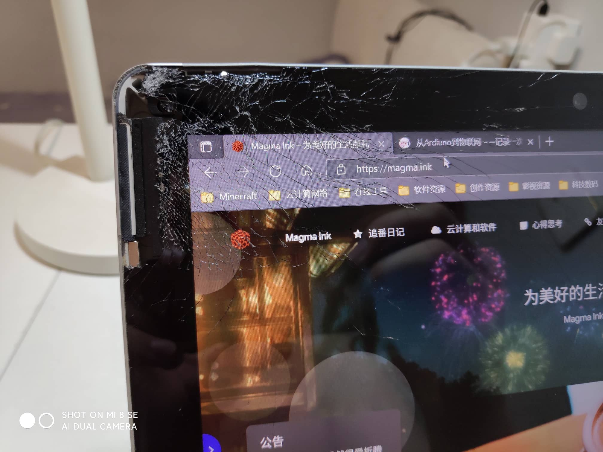
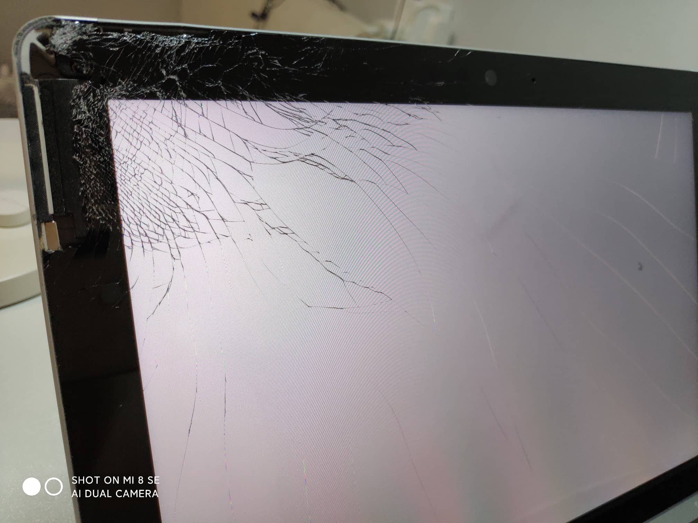

<figure>

<figcaption>

拍摄于 2018 年 10 月 7 日上午 10:10

</figcaption>

</figure>

这是我最常用来做网站、浏览网页、看视频的一个 Windows 平板，是第一代的最低配 Surface Go。于 2018 年国庆节购买，花费 2600+大洋。虽然是平板但是是纯正的 x86 桌面级 Windows 系统，可以当一个上网本使用。是丐版，不过至少是微软家的硬件，质量还说得过去。

Surface 系列的充电口一直使用的都是磁吸式，一扯即掉。据说这样的设计能避免线被人撞到之后酿成惨剧。但是大概在 19 年年末，我的这个磁吸接口开始接触不良...\[ref\]埋下伏笔，为后续剧情做铺垫\[/ref\]突然想起来 Surface Go 还有一个 Type-C 接口，上网查了查，发现是支持 PD 协议的充电的，为此我还专门买了一个 PD 的充电器，充电又稳定了，一直用了一年多。

<figure>

<figcaption>

Type-C

</figcaption>

</figure>

## 惨剧的发生

最近家里在搞装修。昨天晚上我把充电器插在墙上正常充电，由于刚装修好，桌子什么的都是临时摆到这里的。我也不知道为啥我当初买充电线的时候，整了一个一米五的长线，说实话，这线可以拿来跳绳了= =。充电的时候就把线拖在了地上，我也没多想，结果一个起身

我一脚，墙上的充电器和桌上的平板直接被狠狠的扯到地上，充电器完好无损，颤抖的双手捡起平板，就有了今天这篇文章了。

平常都是贴着钢化膜在用，几乎 0 划痕的全新屏，上面开了一朵硕大的玻璃花

悲

不过还好，只是屏碎了

显示触摸以及其他功能都没问题

## 美图欣赏?

<figure>

<figcaption>

清理过玻璃渣的样子

</figcaption>

</figure>

<figure>

<figcaption>

白色屏幕效果

</figcaption>

</figure>

## 事发聊天记录

顺便问一下，有没有人会 SQLite 转 MySQL 啊（小声）
