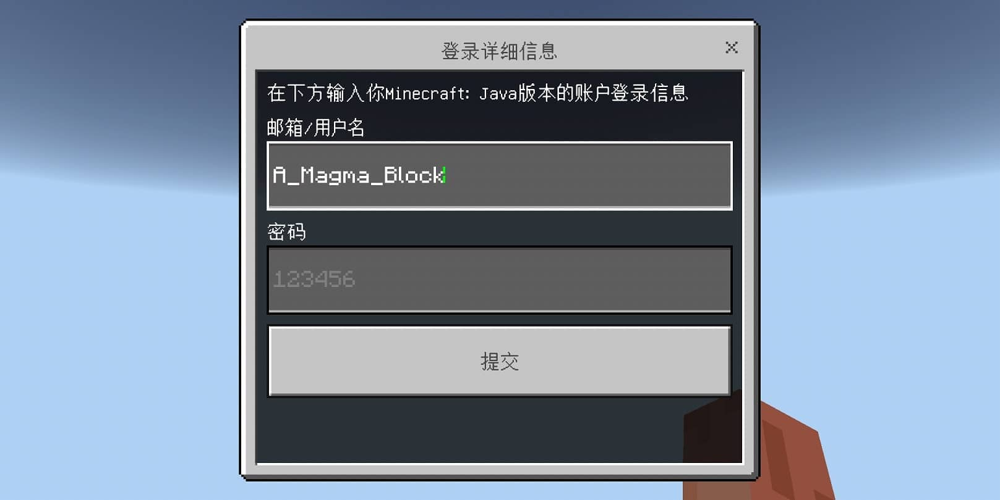
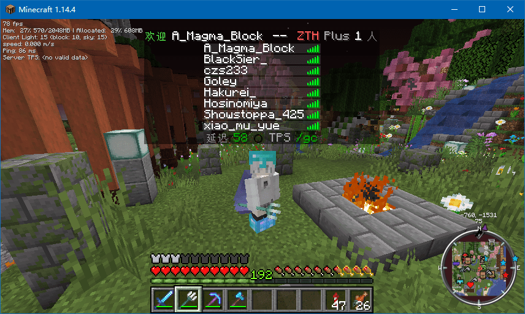
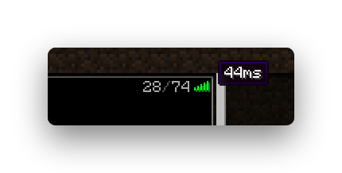
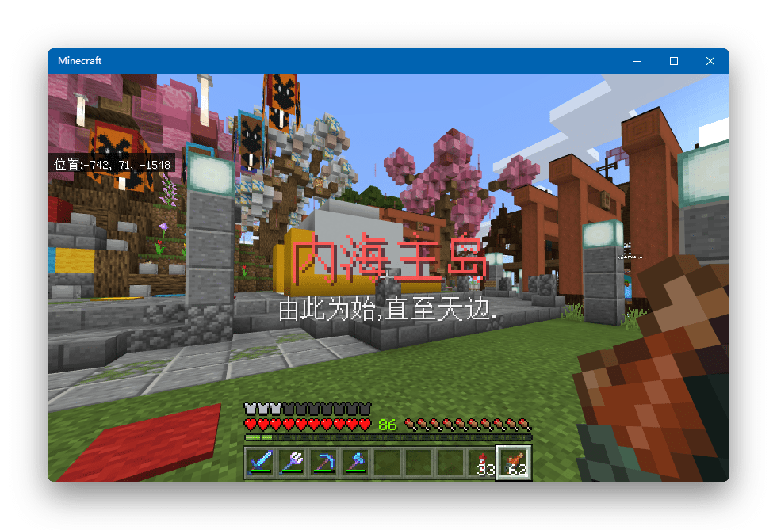

> 本界面已不再更新，若要获取最新内容请访问 [RIA | Zth Wiki 上关于 Zth Plus 的界面](https://wiki.ria.red/wiki/Zth_Plus)。

## 旧内容

### 什么是 Zth Plus ?

通过 Zth Plus，您可以使用 **Java 1.7 以上** （推荐使用 1.13+）版本以及**最新基岩版**游玩 Zth 和 奈落州 服务器。

**提示**：Zth Plus 是一个由玩家 A_Magma_Block 开设并管理的**非官方代理服务器**。服务器资源由 @[Longtianmu](https://wiki.ria.red/Longtianmu) 提供支持。

点击这里前往 [RIA | Zth Wiki 上关于 Zth Plus 的界面](https://wiki.ria.red/index.php?title=Zth_Plus)。

### 如何开始使用？

任何受支持的客户端直接连接下方 IP 即可使用 Zth Plus。

<figure>

|       | Java 版       | 基岩版        | 奈落洲      |
| ----- | ------------- | ------------- | ----------- |
| IP    | zth.magma.ink |
| 25565 | zth.magma.ink |
| 19132 | 进入游戏后/n  |
| 版本  | 1.7+          | 基岩版 1.16.1 | Java/基岩版 |

<figcaption>

基岩版教程见下方，注：基岩版可能会出现死亡无法复活的 BUG

</figcaption>

</figure>

您也可以使用 naraku.magma.ink 在 Java 版快速进入奈落州。

查看 Zth Plus 是否在线（能检测到 Zth 服务器信息即在线）

<iframe style="width:728px;height:90px;max-width:100%;border:none;display:block;margin:auto" src="https://namemc.com/server/zth.magma.ink/embed" width="728" height="90"></iframe>

历史数据观测：

(年代久远已经失效)

---

### 如何使用基岩版进行游戏？

有一些奇妙的小 BUG，可以参考 Zth Wiki 上的“[BUG 与故障](https://wiki.ria.red/Zth_Plus#BUG.E4.B8.8E.E6.95.85.E9.9A.9C)”章节。

不需要 Java 或 基岩版 的正版。

#### 一、首先要下载游戏

**Android 设备（推荐）**

前往 Magma Wiki 下载去验证版，如果你没有的话 [https://magma.ink/mcbe/](https://magma.ink/mcbe/)  
如果您有 Google Play 的基岩版正版游戏，请保证游戏是从 Google Play 下载的。（有能力的玩家请支持正版，尽管非常难买）

**Windows 10 系统的电脑、平板电脑和手机等设备（推荐）**

打开 Microsoft Store， 搜索 Minecraft 并按照指引进行安装或购买。 您可以购买游戏或去淘宝等神奇的地方寻找激活码。 **2018 年 10 月前购买 Java 游戏**的玩家可能会附送 Win10 激活码，可前往 [mojang.com](http://www.mojang.com/) 瞧一瞧。 您也可以尝试安装 Windows 10 Minecraft 的破解版，可自行进行搜索。

**iOS （iPad OS）操作系统设备（iPhone、iPad 和 iPod）（不推荐）**

未经测试，因为没用过 iOS。推荐有经验的玩家使用。 在网易购买中国大陆 MC 代理权后，iOS 这类相对封闭的平台下载 MC 变得更加困难了。 您需要更换一个至中国大陆以外的，有 MC 国际版上架的区域的 Apple 账号，在没有任何经验的情况下，这一过程很可能很麻烦并且可能需要您科学上网（翻墙），这一行为不被大陆法律所允许。 由于没有用过 iOS，不太清楚能否通过第三方助手安装的方式下载盗版游戏。如果您真的想要尝试，可以去互联网搜索教程，国内安装国际版游戏理论上是可以实现的。 请注意：最好不要登录来自陌生人的 Apple 账号，登录未知来源的账号，可能会被不法分子恶意锁机，一旦被锁，您可能只能支付赎金或被迫换机。Magma 建议您转至其他平台进行游戏。

**不支持的平台：主机和 Fire OS 等一些奇怪平台**

XBOX、任天堂系列主机和 PS4 等主机平台可能不能使用 IP 加入服务器，故不支持使用 Zth Plus。 Fire OS 是啥，求科普（？Wiki 说支持这个）

#### 二、进入基岩版后的操作

- 在游戏中登录或注册 Xbox，登不上可以换个时间试试。
- **请 Xbox 生日设置满十八岁，否则无法加入多人服务器。**
- 使用下方的基岩版 IP 加入服务器即可。
- **轻轻滑动屏幕，您会看到一个登录框，直接在第一栏输入 ID 后点击登录，不需要输入密码。（也可正版登录）如图**

| **基岩版**    | **奈落新洲**  |
| ------------- | ------------- |
| zth.magma.ink | zth.magma.ink |
| 默认：19132   | 19133         |

---

### 功能与特性

#### Zth Plus 额外提供了一些 Zth 没有的特性：

- 设定了自定义的 TAB 界面。
- 使用了 Viaversion 插件以及其附属插件，使 Zth 兼容 1.7-1.16.3 协议版本。
- 使用了 Geyser，使 Zth 兼容基岩版加入 ，有少量 BUG，详见基岩版教程。

## 图片集

一份 Zth Plus 的 TAB 界面截图，提供了一些没卵用的花哨功能和延迟显示。

服务器列表中的延迟信息（河南电信），2020 年 5 月 1 日更新后，已经可以显示绿色信号和人数了。

使用基岩版（Windows 10）进入 Zth 的截图。

### BUG 与故障

[参见此处](https://wiki.ria.red/index.php?title=Zth_Plus#BUG.E4.B8.8E.E6.95.85.E9.9A.9C)

### 讨论与反馈

如果有使用上的问题，可以在 [RIA BBS](https://bbs.ria.red/) 联系 @Magma 进行反馈。

您也可以在此界面回复，或者通过 [\[Q](http://wpa.qq.com/msgrd?v=3&uin=823202450&site=qq&menu=yes)[Q\]](http://wpa.qq.com/msgrd?v=3&uin=823202450&site=qq&menu=yes) 等社交媒体联系我。

### 数据及其他信息

#### 版权与信息来源

Zth Plus 由 [Magma](https://wiki.ria.red/Magma) 拼出来开发，服务器由 [Longtianmu](https://wiki.ria.red/Longtianmu) 提供。在软件层面的实现使用了不少免费且开源的软件，在此一并表示感谢！

下面是可列出的使用到的开源软件列表，排名不分先后。

[BungeeCord](https://github.com/SpigotMC/BungeeCord/)的分支[WaterFall](https://github.com/PaperMC/Waterfall)、[ViaVersion](https://github.com/ViaVersion/ViaVersion)、[CustomTabBungee](https://github.com/ate47/CustomTabBungee)、[Geyser](https://github.com/GeyserMC/Geyser)、[SkinsRestorer](https://github.com/SkinsRestorer/SkinsRestorerX)、[BungeePluginManager](https://github.com/Shevchik/BungeePluginManager)、[mc-motdpass](https://github.com/hazae41/mc-motdpass)、[MCSManager](https://github.com/Suwings/MCSManager)

#### 数据安全

Zth Plus 是一个依赖且用于 Zth 服务器的服务器。其游戏数据均来自 Zth 服务器且经过翻译后得到。

不可避免的，您潜在的敏感信息和密码会经过我的服务器。

理论上，我有办法能获取到这些密码信息，但是已经使用的软件中并没有也不提供获取上述信息的功能。

Magma 承诺，不会也不想私自劫取您的敏感信息内容，目前后台仅可看到玩家的公网 IP、进入和退出/掉线的消息，除此之外什么也没有记录。

#### 其他

感谢 [Codusk](https://wiki.ria.red/%E7%94%A8%E6%88%B7:Codusk) 等几位服务器运维以及诸位议员，一直使用自己的业余时间维护着 Zth 社区和服务器，共同创建了崇尚自由创造的良好社区环境体系。

Zth Plus 的诞生离不开官方的允许和各位的支持，感谢一直在为社区贡献力量的各位。

Zth Plus 如同服务器一样，都是完全公益的项目，由兴趣驱动，维护和服务器等开支目前也由我们自己承担。

### 更新记录

[参见此处](https://wiki.ria.red/index.php?title=Zth_Plus#.E6.9B.B4.E6.96.B0.E8.AE.B0.E5.BD.95)
