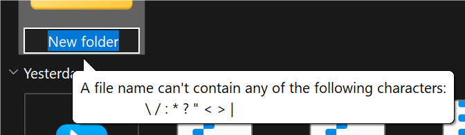

在使用 rclone 自动化同步文件时，我发现 rclone 对于部分含有全角符号的文件名有意外行为。

举例，你的源文件夹名称：`尼尔：自动人形 Ver1.1a 第2部分 446618`。经过 rclone 的复制，在目标目录，变成了 `尼尔‛：自动人形 Ver1.1a 第2部分 446618`。

仔细看，这两个文件名是不一样的，因此，这在其他程序中，将成为两个不同的文件夹。

这一行为十分意外，经过数次的研究，我终于理解了原因，在此小记一下。

## 文件系统之间的差异

rclone 是一个支持多种后端存储服务的文件管理软件，因此，rclone 不得不内建一些方法来处理不同存储服务之间的差异。

在不同的存储服务上，文件名的要求也不尽相同。

我们以 Windows 举例，在 Windows 操作系统中，由于微软的历史遗留原因，不允许使用半角的左、右斜杠（`/` `\`），以及半角的冒号（`:`）、问号（`?`）、星号（`*`）、双引号（`"`）等。

当你尝试将此类的字符输入到重命名框中时，Windows 会显示如下警示：



因此，对于 rclone 来说，Windows 的存储实现，文件名中无法存储此类符号。

但是，可能别的存储器却支持此类型的文件名。如腾讯云的 COS。


当某种目标存储器要接收带有不支持符号的文件时， rclone 就需要选择一种方法来处理这种不兼容。

rclone 没有选择报错，而是将不支持的符号转换（Encoding）为其他受支持的字符。

在 rclone 中，有一套字符映射表，当有字符需要被转换时，rclone 查找此映射表，然后将其转换。

这个表格可以在官方文档中查询到。[Overview of cloud storage systems (rclone.org)](https://rclone.org/overview/#restricted-characters)

因此，如果你有一个来自 S3 的文件 `MagmaBlock: the hotest block in the Minecraft.mp4`，当你将其复制到 Windows 中，文件名会变成：`MagmaBlock： the hotest block in the Minecraft.mp4`。

## 坑的产生

对于以上这种转义行为，有其一定的代价。rclone 的文件名映射表是双向的，如果我要将文件再复制回去，你会发现 `MagmaBlock： the hotest block in the Minecraft.mp4` 变回了 `MagmaBlock: the hotest block in the Minecraft.mp4`。

那如果我的文件名中本来就含有映射表中的结果呢？

我是说，我可以在 S3 中存在一个文件名，其中包含了全角符号（`：`）。理论上，这个文件在复制到 Windows 时，不会转变为其他的什么东西——因为两种存储器都应支持此符号。

但是如同文章开始的那样，源文件夹名称：`尼尔：自动人形 Ver1.1a 第2部分 446618` 经过 rclone 的复制，在目标目录变成了 `尼尔‛：自动人形 Ver1.1a 第2部分 446618`。

这是 rclone 为了将文件名中本就有转义结果的字符，和原来的不受支持而被转义的字符做出的区分。

这种转义导致了中文文件夹名经常被误伤。

## 解决方案

根据官方给出的解决方法，我们可以通过 `--backend-encoding None` 来关闭这种转义。这样 rclone 对文件名的处理就将是完全原文的。不过，这也可能会导致因文件名而产生一些失败复制。

这个参数应在使用 `copy`、`sync` 或 `ls` 等 rclone 二级指令的时候添加。注意，参数中的 “`backend`” 意思是存储器的名称，如本地应该是 `--local-encoding None`，OneDrive 应该是 `--onedrive-encoding None` 。其他存储器以此类推。如果我要将文件从本地复制到 OneDrive，那么指令应该是这样的：

```bash
rclone copy "D:\Downloads\LavaAnimeLib\2024年\7月夏\尼尔：自动人形 Ver1.1a 第2部分 446618\[Up to 21°C] 尼爾：自動人形 Ver1.1a - 14 (Baha 1920x1080 AVC AAC MP4) [BAB30C90].mp4" "2AG:\LavaAnimeLib\2024年\7月夏\尼尔p：自动人形 Ver1.1a 第2部分 446618" --local-encoding None --onedrive-encoding None -P
```

## 相关阅读

[Cannot correctly handle filenames with "：" (U+FF1A full-width colon) - Suspected Bug - rclone forum](https://forum.rclone.org/t/cannot-correctly-handle-filenames-with-u-ff1a-full-width-colon/26698/18)

[Overview of cloud storage systems (rclone.org)](https://rclone.org/overview/#restricted-filenames)
