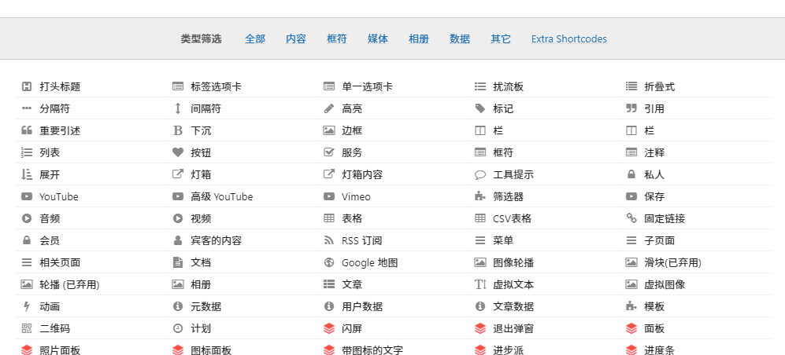
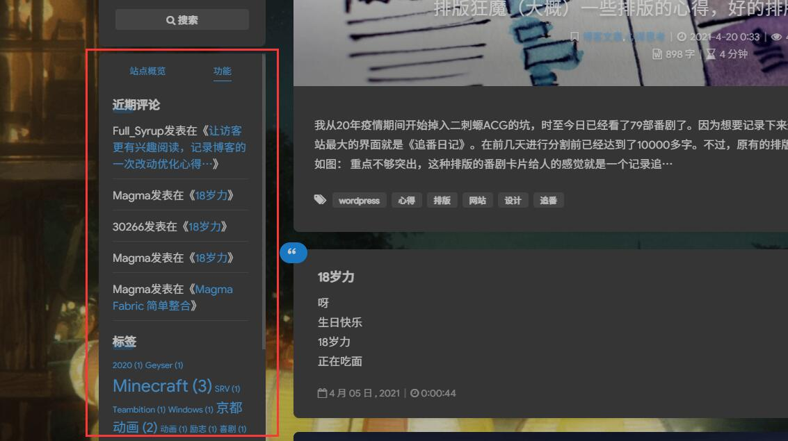
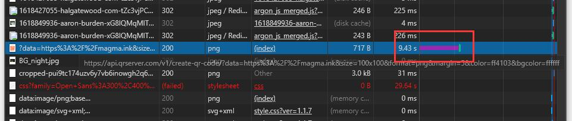

我的博客一直在使用一款叫做【终极简码】的一款插件，的确很好用，通过 Wordpress 的短代码功能引入了不计其数的小部件。功能大概有这么多：

我的《追番日记》也用了不少这个插件的简码，的确很方便。就在前不久我心血来潮排版了一下主页的小工具栏，就是这里。

加入了一个【二维码】的插件，本以为他这个二维码实现的方式是插件在服务器上直接生成的，毕竟也没啥难的。

但是最近却发现打开网站无比的卡，首页都得加载 20 多秒。

我去看了看服务器，似乎也没出什么问题。莫非是我没开缓存的缘故？试着打开了【WP Super Cache】的缓存功能，但是也没啥用。

我无奈打开 F12，检查一下是什么东西耗了这么长时间，然后就发现了如此离谱的一个长条条...

惊人的九秒钟...

原来这插件调用了一个二维码生成网站【http://qrserver.com/】的API，但是由于众所周知的原因我们在大陆用外网的资源总会是非常慢的= =

原来每访问一次网站，就得等待这个 API 响应一次，怪不得卡成那样，直接把二维码给扬了换成了一个带链接的图片。

看来这个插件优化并不行啊，或者说可能没人会在大陆用这个吧（

说起来，我《追番日记》访问的时候也挺卡的，会不会是这个插件的锅...

不说了，现在就去排查一下。
