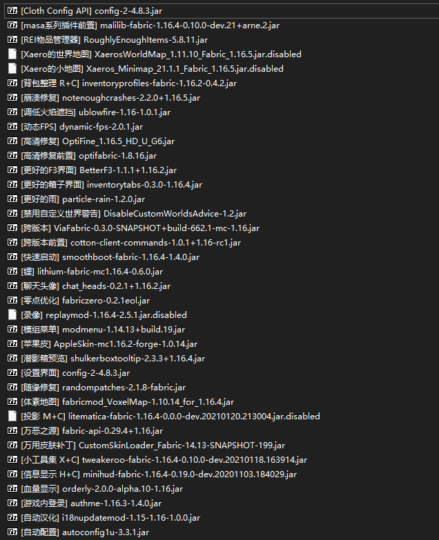
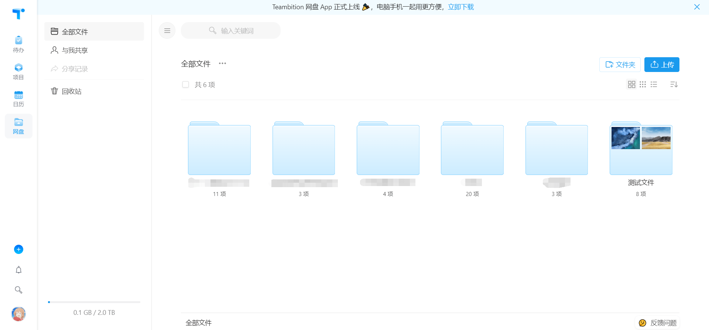
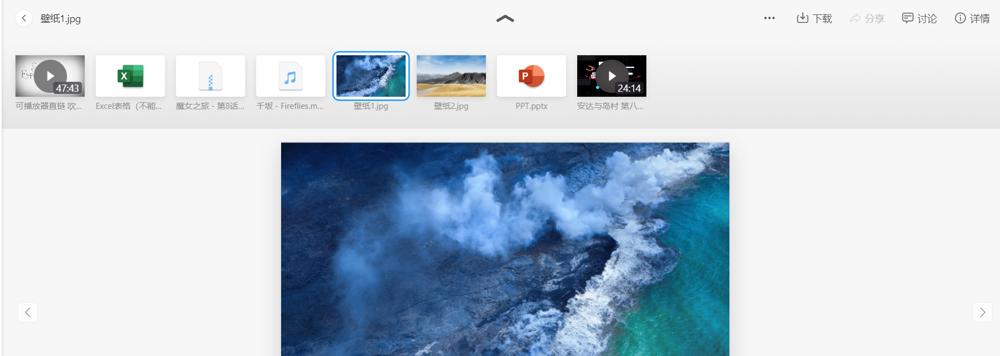
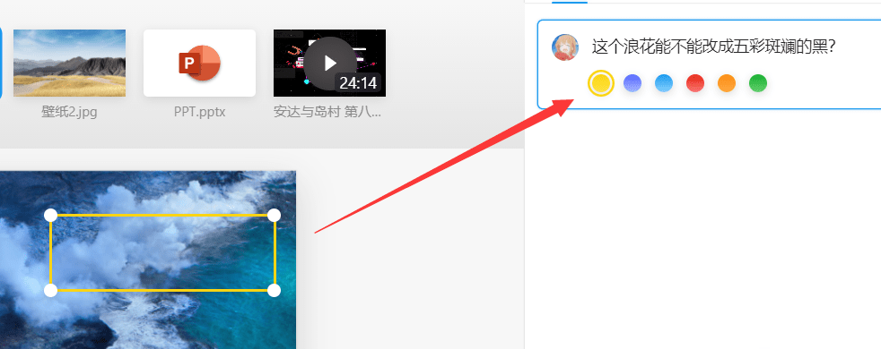
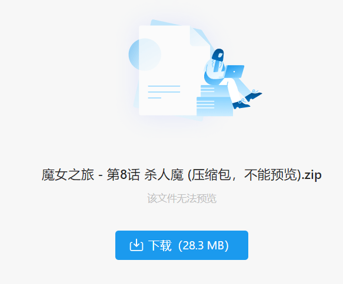
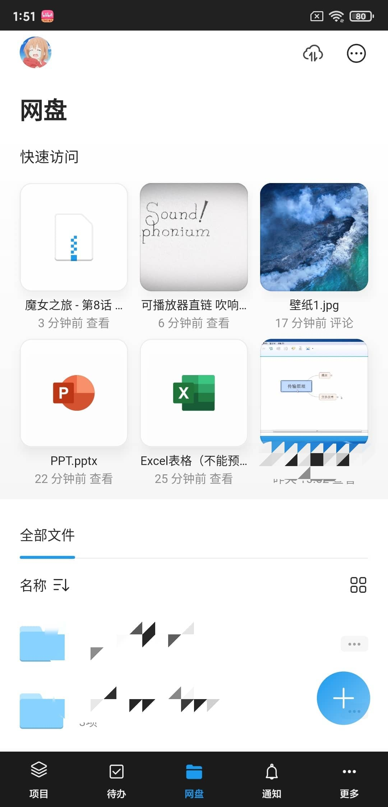
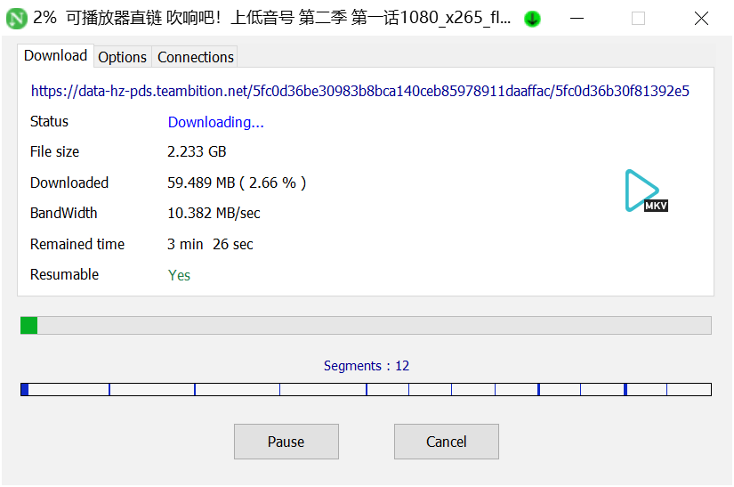
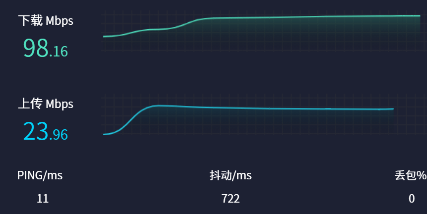
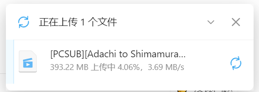
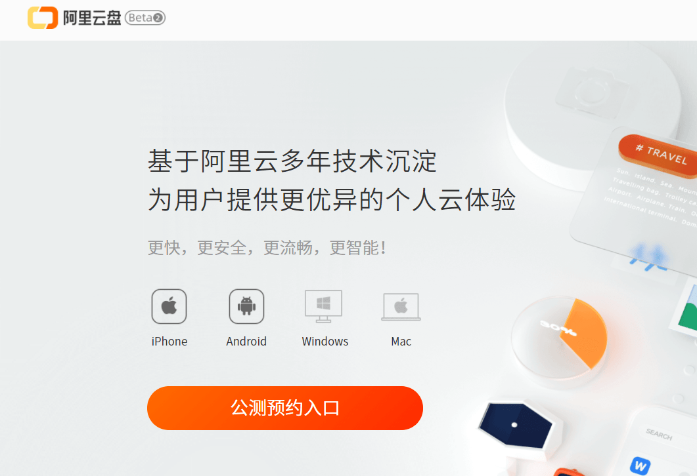

**2020 年 11 月 30 日**，在我几乎快要遗忘掉阿里的这款 Teambition 网盘的内测时，一封欢迎信带着这枚金徽章从天而降。恍然大悟，原来是我**9 月 8 号**那天报名参加了这款网盘的内测，真没想到这么久了还记得我。

> 很抱歉这封信来迟了。这段时间，有些进展超出预期，有些没有尽如人意，好在我们已经顺利推出了「[手机端](https://www.teambition.com/apps?to=magmablock%40qq.com&node=&biz_type=&crm_mtn_tracelog_template=2001776881&crm_mtn_tracelog_task_id=cf9b0516-c7bc-45a4-a52b-196dafe4260b&crm_mtn_tracelog_from_sys=service_wolf-web&crm_mtn_tracelog_log_id=24110832622&from=teambition%40service.alibaba.com)」和「[网页版](https://account.teambition.com/login?appName=Teamedia&app_id=5eb8f5284c54a4ef2b85552a&next_url=https%3A%2F%2Fpan.teambition.com&utm_content=teamedia&utm_term=pan&ignoreAppStartPage=true&to=magmablock%40qq.com&node=&biz_type=&crm_mtn_tracelog_template=2001776881&crm_mtn_tracelog_task_id=cf9b0516-c7bc-45a4-a52b-196dafe4260b&crm_mtn_tracelog_from_sys=service_wolf-web&crm_mtn_tracelog_log_id=24110832622&from=teambition%40service.alibaba.com)」，终于是时候邀请你加入内测了 🎉
>
> 你的专属邀请码是：\[hidden type="background" tip="你知道的太多了"\]**没了，我已经用过了**\[/hidden\]，已为你扩容至 **2T**。
>
> 需要说明的是，产品目前还是个新生儿，会有一些成长的烦恼，比如功能不完备，或者稳定性上闹点小情绪，有时可能影响正常使用，还请你多多包涵。
>
> 产品内设有「反馈问题」入口，欢迎随时拍砖，我们会认真看完，并且付诸于优化改进。如同在第一封信中所说，希望给大家带来惊喜和愉悦的使用体验，请你帮助我们一起改进。
>
> 现在就开始你的内测之旅吧，愿你有一段精彩的时光。

好家伙，我直接好家伙，既然是免费的为何不嫖？**2T 永久网盘空间，还承诺永久不限速**，听起来是真的香。登录老早就注册过的账号，满怀期待的输入邀请码，嚯，2T 空间到手了。

---

目前用了有一星期多，感觉体验还不错。这里简单评测一下，不过毕竟是测试版，未来的成品效果不太清楚能不能和这里的体验完全一样。毕竟不是所有软件都能始终用爱发电。

### 界面、功能

#### 网页端

网页版的界面非常干净，干净到让人感觉缺少了一些功能。刚开始使用的时候甚至莫名其妙的在一个文件夹里搞出来两个同名的文件，看来还是有不少 BUG 的。

上传了一些常见文件，不过大部分都不能正常在线使用。Teambition 是一个办公效率套件，那么办公场景中最常见的文档使用起来怎么样呢？答案是不能用。至少是我目前不能用...

看起来是直接使用的微软 Office 在线预览服务，但是不知道什么 BUG 微软那边似乎是访问不到文件的...Word、Excel 和 Powerpoint 均是如此。我换过好几部设备，看来开发仍然未完成呐。

最最常见的几种图片格式，是可以在线预览的。多个图片屏幕顶部会出现一个选单，有点类似 Mac OS。图片可以直接使用鼠标框选一块区域，屏幕右侧就会出现一个讨论栏。这个功能感觉类似于在线文档中的讨论功能，可以给设计师指指点点。据官方宣传，这个网盘还能保存文件历史版本。大概能用于那种甲方让设计师改了一通后，突然又觉得最初的那个版本好了的奇妙场景。值得一提的是，这个圈圈点点的功能视频也是可以用的。

不过就视频的支持而言，我放置了一个 x264、mp4 格式的视频和一个 x265、mkv、**多声轨**的视频，前者播放一切正常，后者则满是 BUG。网页端的在线预览是不能更改播放的声轨的，同时，mkv 的视频播放起来感觉也卡卡的，并且进度条成了摆设，一碰就黑屏...不过我是不是有些难为这个办公用的网盘了？

这次我又整了个 zip 压缩包上去，本以为他会像大部分网盘一样提供在线预览内容的功能，没想到...

我还没有做好解压，你还是先下载吧.jpg

这个说实话有些小失望，毕竟这算是网盘标配的功能了。不过看了看那个\[内测版\]的标识和我 2T 的空间...嗯，没什么不满意的了。

喜闻乐见的一件事：分享功能在我进入内测之后，就始终是不开放状态。发生甚么事了？怎么回事？我一看，原来是有年轻人，不讲盘德，分享了些不该分享的东西，

> 各位产品体验官，
>
> 如你们所见，「分享」可能要暂时关闭一段时间，起因是，我们很遗憾地发现，内测期间有用户利用 Teambition 网盘分享违规文件。
>
> 虽然没有造成严重影响，但是警钟敲响了。为了网盘健康长久的发展，避免后期因为个别用户的不当行为牵连其他用户正常使用，我们必须彻底解决这个问题，所以，我们决定暂停分享功能并且立即升级安全能力。

因为这个原因，有些可惜至今未能体验到分享功能的魅力。不过，吾爱有人开发出来了一个 Teambition 网盘的目录程序，大概就是登录你的账号后，获取文件夹的结构和文件的直链，用网页发布出来。

这样就能实现分享了，这个程序以后可以找时间写一篇单独的文章。我试着搭建了一个，可以点击下方的链接试一试：

[https://share.magma.ink/s/49f68126-e0bb-4cbd-82b2-46453716d9bd](https://share.magma.ink/s/49f68126-e0bb-4cbd-82b2-46453716d9bd)

#### 手机 App（安卓体验）

Teambition 有手机 App，内置了网盘功能。不过比起网页，App 的网盘，基本就只能上传下载个文件...

<figure>

<figcaption>

看起来十分像一个网页嵌入到了 App

</figcaption>

</figure>

打开了快速访问后，App 网盘首页会显示最近访问的文件。右下角可以上传相册，文件，以及新建文件夹。

点击视频文件，手机端倒也能播放，不过似乎是把古老安卓内置的媒体播放器给整上去了。

不过，比起这些小毛病，更要命的是你会发现 App 里面**找不到移动或复制这两个功能**...所以说目前想要移动文件，还是乖乖的打开网页吧。我只能说开发加油！

### 阿里家的宽带太快了！

作为一个网盘，最重要的几个硬性指标就是上传、下载快不快，以及空间大不大。阿里入局网盘之前，某度网盘的下载速度想必大家都有过体验。Teambition 这款网盘号称不限速，那么他现在的速度怎么样呢？直接上图：

这是下载，使用到了多线程的下载工具，下载速度直冲宽带顶峰。

10MB/s，使用电信 100M 宽带，2.4GWifi 连接。

<figure>

<figcaption>

这是网络测速的结果，实际下载很少有服务器能跑到这个速度，不过看起来 Teambition 的网盘做到了。

</figcaption>

</figure>

上传也很快，跑的比测速还快。

据说更大的宽带也能跑满，基本上是有多少就能到多少，这点是真的很厉害。不过这样整，钱也是花花地流啊，内测期间资金充足，未来这款软件终归是要盈利的啊，该怎么样才能维持这种高速呢，确实要打一个大大的问号。关于收费政策，官方是这么说的：

> **收费政策**
>
> 1**、Teambition 网盘未来商业收费模式是怎样的？**
>
> 产品现在处于内测期，收费细则尚未确定，考虑到问询用户较多，我们就商业化方向给大家一个「交代」：
>
> 1）拟按照空间大小收取费用，功能完全开放，也不会接入广告
>
> 2）始终比同类产品更优惠
>
> 能够制定较友好的收费策略并且保持长期运营，是因为我们并不倚赖「个人网盘」这个产品实现盈利；Teambition 是一个工作学习套件，有着非常丰富的产品矩阵，并且面向个人和企业推出不同产品。
>
> 2**、 能否支持淘金币、支付宝积分兑换？**
>
> 未来可以，这些权益在我们的规划之中。

---

**Teambition 网盘官方网页：[https://www.teambition.com/products/pan](https://www.teambition.com/products/pan)**

总之，阿里入局网盘，打破了百度一家独大的场面。多年前网盘大战，百度靠着烧钱打下市场，耗死了没钱的其他选手，稳坐网盘之王的地位，而这次这一场面终于能有所改观了。阿里除了 Teambition 网盘这款倾向于协作办公的网盘，同时还推出了另一款名为阿里云盘的个人向网盘产品，链接在这里，据说体验也不错：[https://aliyundrive.com/](https://aliyundrive.com/)。

如果你喜欢这篇文章，欢迎讨论~
