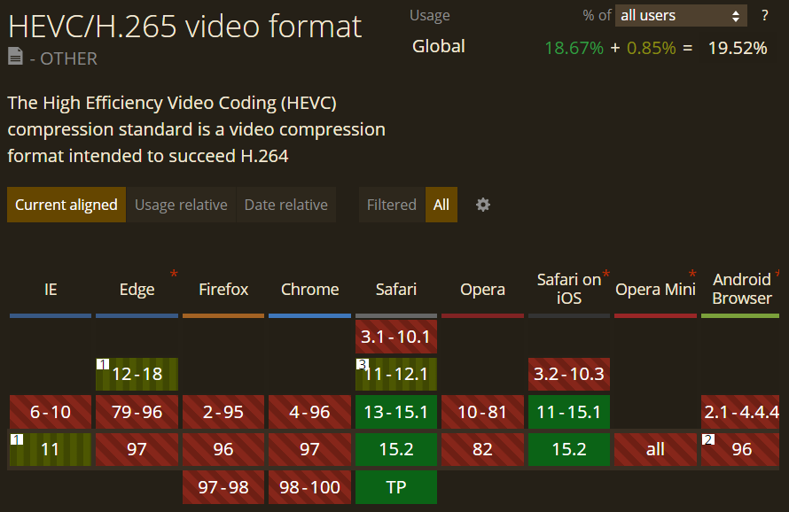
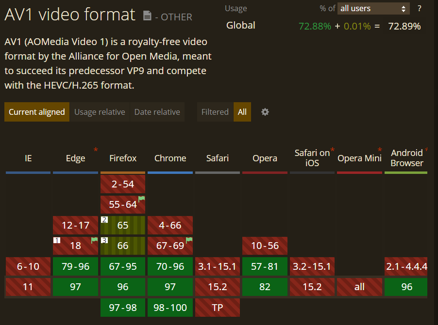
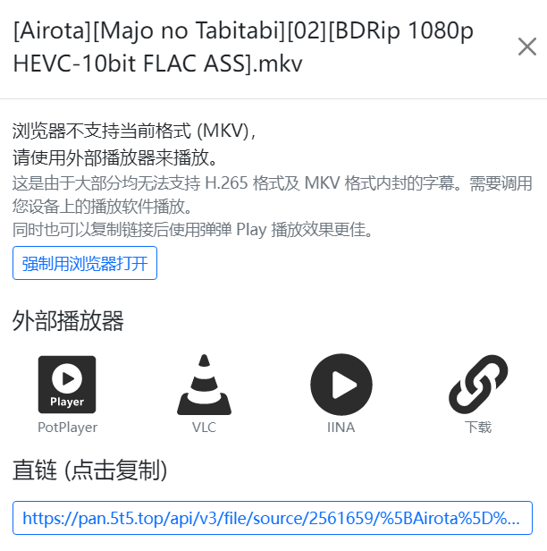

<figure>

<figcaption>

配图

</figcaption>

</figure>

# 背景

**HEVC / H.265** 是新一代的视频压缩标准，相比 AVC / H.264，它的一大特色是能在更高的画质下保持更低的文件体积，这对视听行业的未来——4K，乃至 8K 都至关重要。而仅在 1080P 下，HEVC / H.265 也有着十分优秀的表现。这一编码标准已经被监控安防、视听等行业广泛运用。

但目前，主流的浏览器，像是 Chrome 或 FireFox， 均不支持在浏览器内硬件解码 HEVC。这是因为在 HEVC / H.265 技术的背后，正有着数个组织或公司正在收取其专利费。高昂的专利授权费用使得 Google 等公司不再计划推进这项技术。2015 年，谷歌、微软 Mozilla 和思科等多家大型 IT 公司发起了开放媒体联盟，计划创建一个名为 AV1 的开放免费编解码器，至今已经取得了不少成果。但也因为以上原因，HEVC 基本无望受到各大浏览器的青睐。

AV1 相比 HEVC 拥有着更多优势——免费、比 HEVC 更上一层的压缩比，在海外的主流内容平台如 YouTube 、Netflix 被采用，其正被视为挑战 HEVC 的强有力对手。这一局面，造就了 Chrome / Edge、FireFox (AV1 阵营) 和 Safari (HEVC 阵营) 对编码格式支持的不同：

- HEVC / H.265

- AV1

# 那为什么还要从浏览器播放 HEVC？

研究这个方法主要是因为近一段时间在制作一个私人的番剧库。国内的番剧字幕组或压制组，目前主要偏好的编码格式便是 AVC / H.264 和 HEVC / H.265。同时，由于 HEVC 编码的资源，通常会和内封 ASS 字幕一起打包到 MKV 内，因此浏览器完全无法胜任这类资源的播放。

最开始的想法是自己用开源的解码库制作一个带有播放能力的软件。但实际上我只会一点点 Js，根本不可能实现。深入学习打算看看其他大的视频平台是如何处理类似的问题的，了解到视频云。视频云是一种各大云厂商提供给你的服务，你可以将任意格式编码的视频上传到云，由服务器来为你转码成兼容性最佳的 AVC / H.264 编码格式，这样就能实现在任何地方播放。但这是一个商业性质的解决方案，转码成本贵的飞起，更不用说每个月把视频存储在云上的收费......

后来又了解到 B 站的解决方案。B 站今年来推行 HEVC 格式，到目前，所有上传的视频都会被二压成 HEVC、AVC 两种编码，使用 FLV 和 DASH 格式封装。根据 B 站视频云技术在 LiveVideoStackCon2019 上的分享，B 站 2018 年全站 H.265 的流量占比已超过 50%，预计 2019 年末单日 H.265 流量占比将会达到 80%左右。今年是 2022 年，这个比例应该会更加成熟。那么，这是如何做到的呢？答案是软解。上面提到的所有支持/不支持，都是建立在硬解（GPU 解码）的基础上的。而与之相对的是软解（CPU 解码）。软解由于其解码过程完全由软件控制，因此拥有非常强的兼容性，但是性能也会更差。同样，软解则需要开发人员更高的技术力，而不是单纯的使用硬件提供的接口。

不过我也深知个人的能力和技术有限，社区内也没有比较完善好友的开源软解库（也可能是我没找到）。遂放弃软解这一条路。并且除了 HEVC 编码，同样被封装在 MKV 内的还有 ASS 特效字幕。目前浏览器中能够通过 JS 实现字幕显示，ASS 渲染倒是有相关的解决方案：[weizhenye/ASS: A JavaScript ASS subtitle format renderer](https://github.com/weizhenye/ASS)，但是由于是 MKV，ASS 内封于文件，仅在浏览器内解出字幕再渲染，想想难度应该就不小...

# URL Protocol

由于种种困难，我们无法实现在浏览器内完成解码到渲染的全部工作。最好的方法还是脱离浏览器，拥抱兼容性强、性能高、更加稳定的本地播放器。经过一段时间的探索，我发现了 **URL Protocol** —— 自定义协议调用本地软件的一个浏览器通用协议。

早年有使用过迅雷的网友应该都见过这样一种链接：thunder://xxxxxx。这是迅雷的一种链接和协议，在浏览器中打开“thunder://” 即可直接打开迅雷下载。它就像 ”magnet:?xt=”、“ed2k://” 甚至是 QQ 加群的链接一样，是一种能够调用本地程序的协议，被绝大多数浏览器所支持。那么，如何注册这一种协议呢？实际上很简单，只需要在注册表中添加几个键值对即可，添加后浏览器就能够识别自定义的协议前缀，并且通过命令行调用的方式启动应用并且传递参数。如果你感兴趣你的电脑上都有哪些软件可以被浏览器打开的话，可以打开注册表编辑器，查找一下\[HKEY_CURRENT_USER\]主键下的哪些目录包含“URL Protocol”这个键。我发现了比较奇妙的是有一个 [calculator://](//)，可以直接打开 Windows 上的计算器。具体添加的教程网上也有很多，这里不再赘述。

# 解决方法

目前，Windows 平台已知的支持 URL Protocol 的播放器，是 PotPlayer。使用 potplayer:// + URL 即可直接调用 PotPlayer 播放，十分好用。示例：[PotPlayer 打开 \[Airota\]\[Majo no Tabitabi\]\[12\]\[BDRip 1080p HEVC-10bit FLAC ASS\].mkv](//pan.5t5.top/api/v3/file/source/2561669/%5BAirota%5D%5BMajo%20no%20Tabitabi%5D%5B12%5D%5BBDRip%201080p%20HEVC-10bit%20FLAC%20ASS%5D.mkv?sign=OXvk8d9qwg2dncDGs2F--zBvTglsRiW3P6w38tNT3sU%3D%3A0)。VLC Media Player 的桌面版不知为什么并没有此功能，但 GitHub 上有作者制作了一个补丁，这个项目也是一个很好的 URL Protocol 例子：

[GitHub](https://github.com/ "Github")

[stefansundin/vlc-protocol](https://github.com/stefansundin/vlc-protocol)

Android 和 iOS 端的 VLC 倒是支持了这一功能，使用 vlc:// + URL 即可实现调用。示例： [移动端 VLC 打开 \[Airota\]\[Majo no Tabitabi\]\[12\]\[BDRip 1080p HEVC-10bit FLAC ASS\].mkv](//pan.5t5.top/api/v3/file/source/2561669/%5BAirota%5D%5BMajo%20no%20Tabitabi%5D%5B12%5D%5BBDRip%201080p%20HEVC-10bit%20FLAC%20ASS%5D.mkv?sign=OXvk8d9qwg2dncDGs2F--zBvTglsRiW3P6w38tNT3sU%3D%3A0)。Mac 平台似乎 IINA 是能够支持这一功能的。很可惜，目前我还没有找到一个能够在所有主流平台上使用、兼容性强、性能高还支持浏览器调用的播放器，如果有知道的 dalao 欢迎在评论区敲我~

# 效果

学了一个多月 JavaScript，目前我已在浏览器内达成了如上图所示的效果。当播放的媒体是 MKV 格式时，会自动提示浏览器不支持，然后提供数个外部播放器的启动按钮。昨天还新增加了一个直链复制的功能，通过 clipboard.js 实现，如果有机会再水一篇这个库的使用（

# 参考

[为什么在浏览器不支持 H265 视频播放 - 井凉一一 - 博客园 (cnblogs.com)](https://www.cnblogs.com/bagexiaowenti/p/12698311.html)

[哔哩哔哩 H.265 编码器在直播和点播的实践和应用 - 哔哩哔哩 (bilibili.com)](https://www.bilibili.com/read/cv5980220?from=articleDetail)

[weizhenye/ASS: A JavaScript ASS subtitle format renderer (github.com)](https://github.com/weizhenye/ASS)

[利用 URL Protocol 实现网页调用本地应用程序\_只要踏出一步，路就在前方——zssure-CSDN 博客\_网页打开本地程序](https://blog.csdn.net/zssureqh/article/details/25828683)
