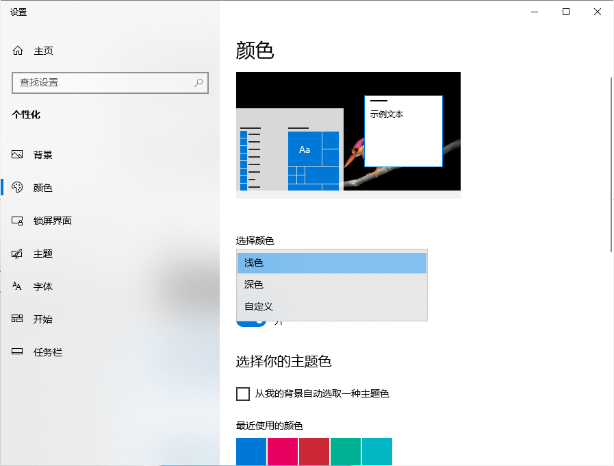
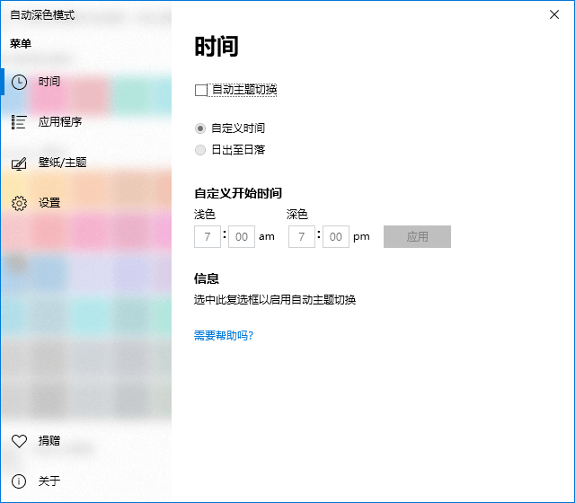

Windows 10 早在 18 年 10 月的版本就已经支持了 Dark Mode，中文翻译即为深色模式。打开深色模式后，系统的大部分界面和支持的软件都将改变为深色配色。如果在夜间或者暗光环境下使用电脑，视觉疲劳会降得更低。

但是这个功能直到两年后的今天还不支持自动开关，如果你想要打开或者关闭深色模式，那么就必须要打开**设置 > 个性化 > 颜色 > 选择颜色**，而且每开关都要进行一次。不愧是微软，各种产品总能给人一种半成品的感觉。

官方的产品不完美，那就要靠社区自己造轮子。在 Github 上，有一款名为 Windows Auto Night Mode 的开源程序，目前已经非常完善，支持多语言，拥有你可能需要的全部功能。

软件目前已经支持**根据时间、基于地理位置的日出日落时间**来更换深色、浅色模式，同时也能同时更改不同模式下的对应壁纸。软件体积很小，安装包也只有 5M 左右，关闭界面后，所有的定时任务实际上都是**调用 Windows 任务计划**完成的，大概可以理解为没有后台占用。

如果你有 Windows 10 系统的平板、笔记本等可移动电脑，这款软件就显得尤为有用了。简单好用，支持中文，一次设置，长期有效。如果再配合 Chrome 浏览器的 [Dark Reader](https://github.com/Armin2208/Windows-Auto-Night-Mode/wiki/Dark-Mode-for-Webbrowser) 插件（浏览器的插件商店也可以找到，但是这个插件会明显增加性能消耗），从此夜间使用电脑将不再刺眼。

下载地址（[蓝奏云](https://magma.lanzous.com/ifK18grou2j)|[Github](https://github.com/Armin2208/Windows-Auto-Night-Mode/releases)|[百度网盘 eqmg](https://pan.baidu.com/s/1mif0R60JWHPG7IzXXM2Bqw)）
