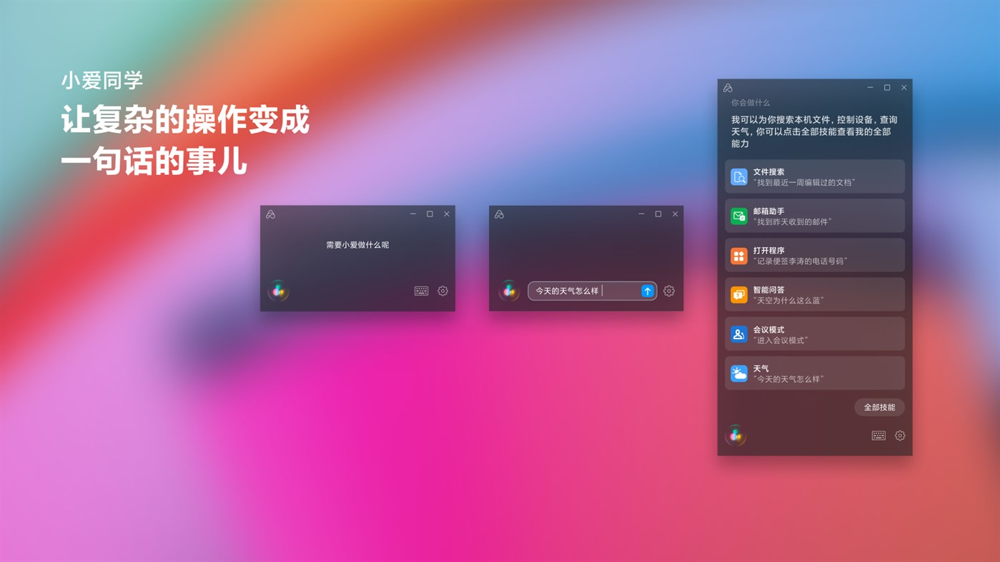
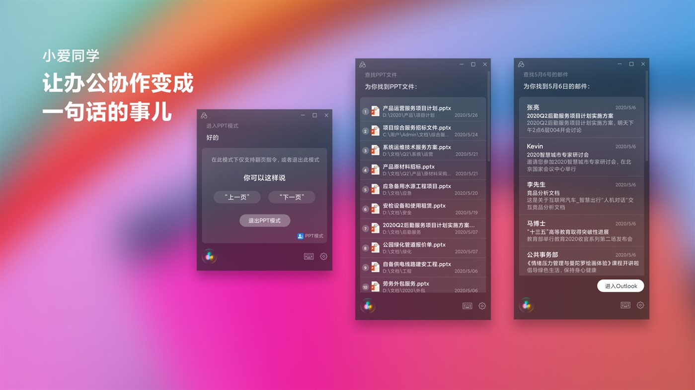
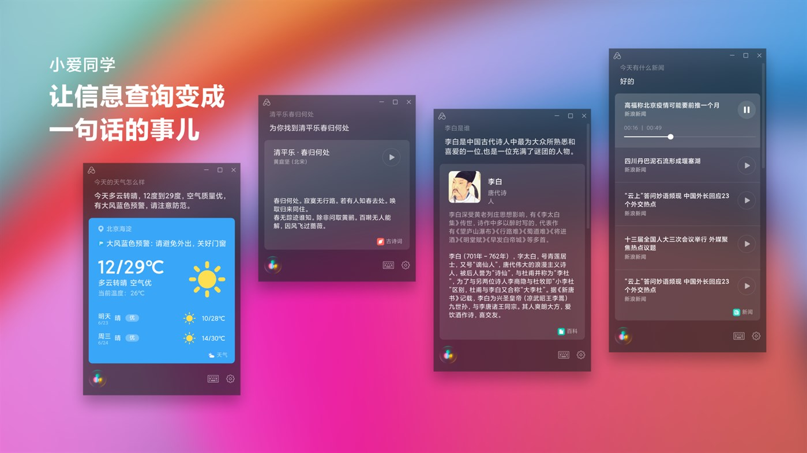
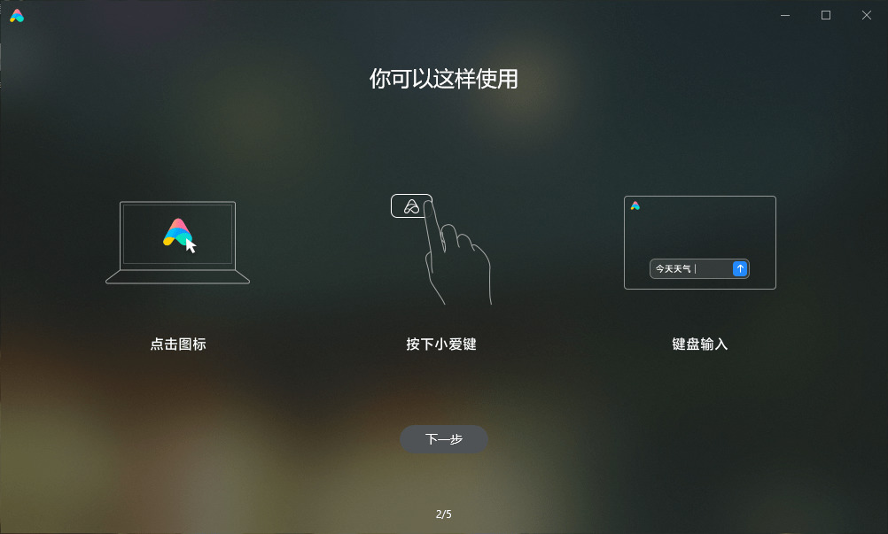
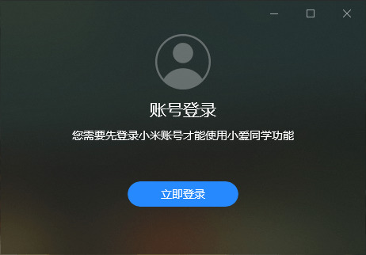
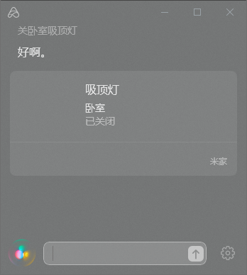

- 
- 
- 
- 

## 推荐理由

这里放这个主要是因为小爱同学的 UWP 版在 Microsoft Store 大陆区没有上架，直接搜索是搜不到的。  
这里提供香港特别行政区的商店链接，点击即可在应用商店下载！

只需要登录小米账号即可开始使用了，从此在 Windows 端也能控制米家和其他智能家居设备！没有麦克风的话是可以打字的。

不过目前对于 Windows 软件控制适配情况并不是特别好，建议有智能家居的同学使用~

- 
- 
- 

[下载地址](https://www.microsoft.com/zh-cn/p/%E5%B0%8F%E7%88%B1%E5%90%8C%E5%AD%A6/9mw76kfhnz0c?activetab=pivot:overviewtab#)

## 介绍

小爱同学是小米人工智能助理。她能帮你查找文件、搜索邮件、打开程序、播放演示文档、控制智能设备，还可以查天气、讲笑话，并陪你聊天。 小爱同学仅支持：RedmiBook Pro 14 、 RedmiBook Pro 15 查找文件：按照名称、日期类型搜索电脑中文件 打开程序：通过语音打开系统中已安装程序 播放演示文档：进入 PPT 模式后，无需唤醒词，直接语音控制翻页 还支持控制智能设备、查询天气、看百科信息、并陪你聊天
