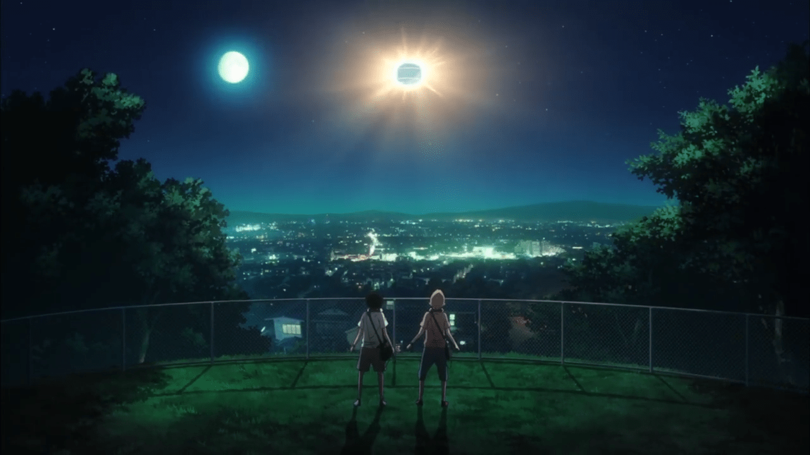
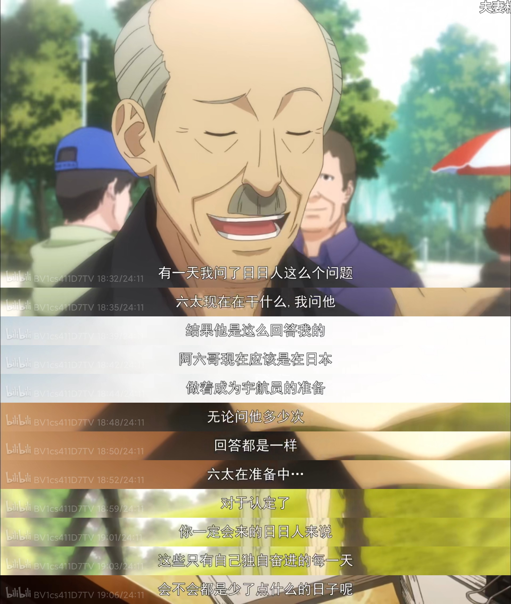
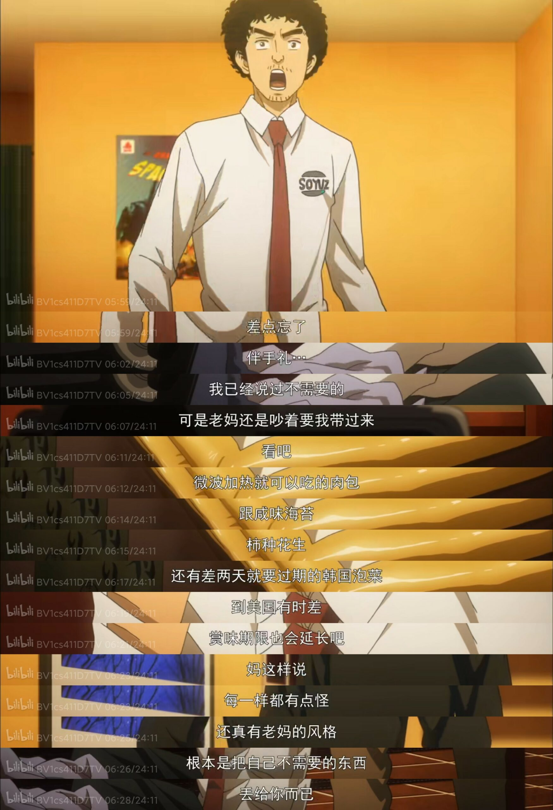

\*随着观看进度的增加，本文可能会有数次更新。（大概）  
本文的内容本来是写在《追番日记》的，但是写完发现，字数多到已经把其他卡片挤到不知道哪去了。故开此文，这应该是我博客第一篇长篇漫评。\[hide\]射墨狂喜\[/hide\]

“来自十年前的宝藏”：本作受好友射墨的多次推荐，在已有十四部未看完番剧的前提下开始补番...很少看 2015 年以前的番剧，但这部作品让我眼前一亮，现已加入每日补番套餐。目前看了四话，励志、探索类老番的爱好者一定不能错过~现已给出 5.5 分主观评分。

## 第一次评：关于星空和宇宙...

2021 年 5 月 20 日

关于星空和宇宙，从古至今人们就未曾停止对其向往。古时候我们仰望星空，创造出嫦娥与银河的神话，并希望有一天能飞向天空。随着科学技术的进步，这一梦想终于得以实现，我们的目光与志向也愈来愈远大。

这是我追过的第二部关于宇宙题材的番剧，之前是《恋爱小行星》，一部以社团为背景的科普向轻百合作品。在动画工房的加持下，整部作品渲染了一片令人神往的星空，还有些浪漫的柑橘味。看完《恋爱小行星》的那段时间，我经常会在天气晴朗的夜空下仰望宇宙。虽然只能看到寥寥几颗星，但是心已经飞向星空。那一刻便可体会到天文学的浪漫所在。

<figure>

<figcaption>

《恋爱小行星》的 ED：[真中仓](https://zh.moegirl.org.cn/%E7%9C%9F%E4%B8%AD%E8%8B%8D)与[木之幡米拉](https://zh.moegirl.org.cn/%E6%9C%A8%E4%B9%8B%E5%B9%A1%E7%B1%B3%E6%8B%89)

</figcaption>

</figure>

《宇宙兄弟》也是一部以宇宙为题材的动画。南波兄弟小时候在野外探险时遇到一个闪着金光的不明飞行物，便立下一起成为宇航员的誓约。数十年后，弟弟日日人达成誓言当上了宇航员，而哥哥六太却被公司开除，成了无业游民。某天，日日人给六太寄去的一封电子邮件，使得原本消沉度日的六太振作起来，并决定重新面对梦想、朝目标迈进。

这是一部感情线细腻，人物形象塑造更加优秀的作品：让我们感动，触动我们心灵的点，往往就是埋藏在日常中的一处处小细节。两兄弟小时候一起在夜空下探险的回忆、六太与贤治在面试时的不同表现、或是宇航员相片长廊中男主独自思索的心理活动细节，都让能观众感受到真实的人物形象和角色心境。对男主六太的描写中，也经常会出现一种急刹车却恰到好处的幽默：目前我仅仅看到第四话，但是却能真实感受到男主想上天的决心。

<video controls>
  <source src="/videos/宇宙兄弟片段.mp4" type="video/mp4" />
</video>

↑ 男主在宇航员相片长廊中的思索片段。

顺便一提，应该还是年代太久了，中文互联网上这部番剧的信息和讨论度已经很低了...B 站的确有版权，但看的人不多，萌百甚至没有这部番的词条。在这里立下一个?Flag，找个时间我来建立一下词条。

## 第二次评：星空令人神往，但星空下的故事也让人感动

### 第五话 有所欠缺的每一天

就像男主六太强迫症的性格一样，这部动画，总是在一些细节处安插亲情的细节，打动人心。

在潜移默化中感受到亲情与爱。

南波形容日日人是一个“脑子里缺颗螺丝钉的人”，但通过后续剧情的暗示表露，日日人缺的“这颗钉”，也许就是六太的陪伴。

“微波加热就可以吃的肉包跟咸味海苔、柿种花生、还有差两天就要过期的韩国泡菜...”动画对于两兄弟的老妈描写实际上并不多的，基本都是通过其他角色的几句台词带过。但同样也塑造了一个有些烦人但仍然关心着孩子的形象。就像我们每个人的老妈一样，简单而真实。

---

写的不怎么好 x 待续
