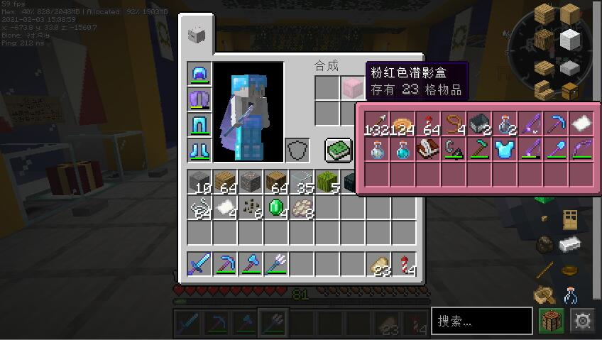

已过时的界面

**3.0 版本已发布，点击前往最新的文章 [Magma 简单整合 3.0](https://magma.ink/magma-fabric-3/)**

> 适用于  Zth  系服务器，一切遵从原版习惯，没有复杂而混乱的功能；基础的模组却一个不少，一切都是你熟悉的样子。
>
> 这个整合包是因为发现群里没有简洁的符合原版直觉的  1.16.5  整合包而制作的。我上一个版本的整合包还停留在  1.14.4，说实在有一点点旧了。
>
> 作为一个老强迫症，这个包有许多细节上的特点。希望能做到上手即用的体验。

## 下载地址

**下载后请进行一次更新（为了省去多次打包上传的繁琐）**

[满速下载](https://www.yuque.com/magma/board/oldmc#kYG6R)

## 注意事项

- **一些快捷键被修改了，请参考 > [快捷键](https://www.yuque.com/magma/fabric/ndu7kc)**
- 整合包自带 Java ，**换用其他 Java 可能会导致不兼容产生的故障**。[换用 HMCL](https://www.yuque.com/magma/fabric/zso7ry)
- 投影 Litematica、录像 Peplay Mod 默认禁用，如有需要可启用。[如何启用？](https://www.yuque.com/docs/share/65942aef-ef4a-4e95-bf71-c388d701a119?) [如何安装录像模组？](https://www.yuque.com/magma/fabric/gy1dm6)
- 包内内置了 Voxelmap 和 Xaero 小地图。默认开启前者。[如何更换？](https://www.yuque.com/magma/fabric/thx37k)
- [帮助文档](https://www.yuque.com/magma/fabric)

## 功能简介

### 客户端升级

为了预防整合包发布后出现 BUG，或者方便后期更新模组、游戏版本，本整合增加了更新功能（手动自选更新）。仅需一键\[ref\]在启动更新程序时需要您同意授权管理员权限，实际上是两键。本功能仅支持 Windows 系统，暂不支持 Linux 和 MacOS。\[/ref\]即可检查更新。

### 全汉化的强迫症

<figure>

<figcaption>

文图无关

</figcaption>

</figure>

某些模组由于各种原因仅支持英文，直接安装后虽然能使用但是中英混合的游戏界面也非常令人不爽。Magma 通过资源包等方式\[ref\]通过资源包、万用汉化 MOD 进行汉化，部分模组则直接修改了包。卸载模组汉化包和万用汉化 MOD 将直接影响汉化效果。\[/ref\]尽量将游戏中能使用到的所有界面全部进行汉化，全部都是方块字，这下舒服了。

<figure>

- 
- 

<figcaption>

两个栗子

</figcaption>

</figure>

### 容器标签

见图，你可以很快捷的打开周围的容器。这在翻找物品的时候也许会有用。

### 尽量不影响体验的性能优化

因为 Magma 使用的配置目前比较差（奔腾 G3260+750Ti+4G ddr3 1333），因此优化一定是必不可少的。

- Optifine\[ref\]暂时未使用钠 Sodium，因为此 mod 在我使用时并不稳定且帧数低于 Optifine\[/ref\]
- 动态 FPS\[ref\]下载页提供的版本由于失误默认未开启此功能，请下载后进行一次更新\[/ref\]
- 平滑启动
- 锂元素
- Fabric Zero

<figure>

<figcaption>

16 视距，未锁帧，在一个相对不错的画面效果下的帧数（153）

</figcaption>

</figure>

无论是什么客户端，还是推荐低配 CPU，尽量锁帧在 60-80（或显示器刷新率）。不然会白白浪费 CPU 的运算资源。

支持后台降低帧率，避免低配后台使用其他软件时卡顿整个电脑。

### 雨雪不再惹人眼花

### 服务器相关的几个小功能

### 聊天头像

### 很多细节的微调...

<figure>

<figcaption>

调整过的 REI 界面

</figcaption>

</figure>

<figure>

<figcaption>

潜影盒预览界面即使靠近屏幕边缘也不会出界

</figcaption>

</figure>

<figure>

<figcaption>

尽量防止聊天栏遮挡视野

</figcaption>

</figure>

<figure>

<figcaption>

按下 H+C 可以打开 Minihud 设置

</figcaption>

</figure>

### 内置了很多？？？

<figure>

<figcaption>

会在启动的时候乱叫

</figcaption>

</figure>

<figure>

<figcaption>

全部“你知道吗”的列表 在 PCL/hints.txt 里面。看不清？下载下来就看得清了（？）

</figcaption>

</figure>

## 模组列表

