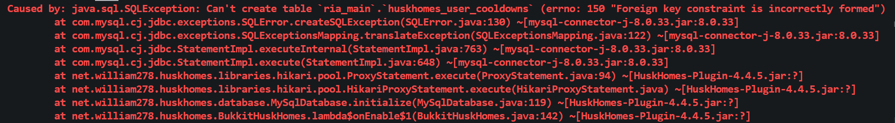
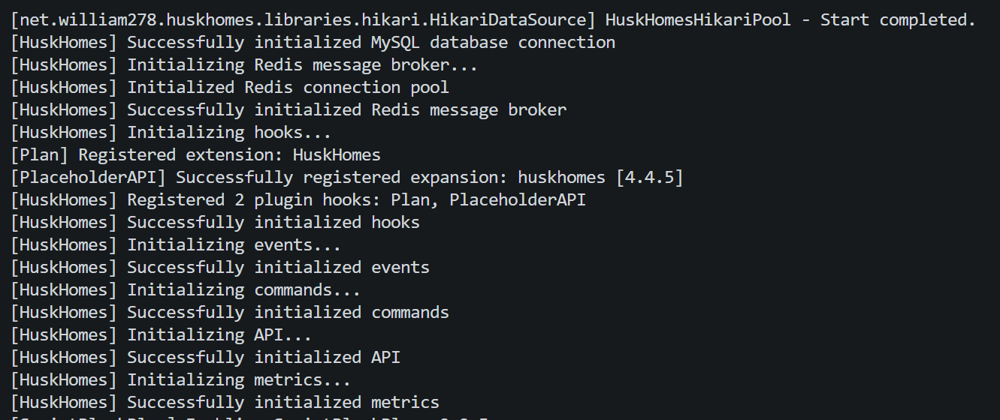

在今日，考虑将我所维护的 Minecraft 服务器（Zth）的 HuskHomes 插件从 3.2.1 升级到最新版（4.x）。本以为这次升级能够平滑过渡。但是在升级时数据库遇见了表结构无法创建的错误：



无法创建表 huskhomes_user_cooldowns，由于 Foreign key constraint is incorrectly formed。

根据错误调用栈，我们去看 HuskHomes 的源码，可以找到出错的代码：

```
final String[] databaseSchema = getSchemaStatements(String.format("database/%s_schema.sql", flavor));
            try (Statement statement = connection.createStatement()) {
                for (String tableCreationStatement : databaseSchema) {
                    statement.execute(tableCreationStatement);
                }
            } catch (SQLException e) {
                throw new IllegalStateException("Failed to create database tables. Make sure you're running MySQL v8.0+"
                        + "and that your connecting user account has privileges to create tables.", e);
            }
```

[这段代码](https://github.com/WiIIiam278/HuskHomes/blob/e2c9a52911a06f597d5bcbbe5effde5d0a4b16c4/common/src/main/java/net/william278/huskhomes/database/MySqlDatabase.java#L122C17-L122C17)是插件初始化数据库时所执行的一段代码，用于将作者已经写好的 SQL 语句全部执行一遍，我们根据 getSchemaStatements 方法，可以找到作者的 .sql 脚本位于 common/src/main/resources/database 下。

继续查找，由于是创建冷却时间表时出现了错误，我们可以推断[这条语句](https://github.com/WiIIiam278/HuskHomes/blob/e2c9a52911a06f597d5bcbbe5effde5d0a4b16c4/common/src/main/resources/database/mysql_schema.sql#L43)是错误的原因：

```
# Create the cooldowns table if it does not exist
CREATE TABLE IF NOT EXISTS `%cooldowns_table%`
(
    `id`              integer      NOT NULL AUTO_INCREMENT,
    `player_uuid`     char(36)     NOT NULL,
    `type`            varchar(255) NOT NULL,
    `start_timestamp` datetime     NOT NULL DEFAULT CURRENT_TIMESTAMP,
    `end_timestamp`   datetime     NOT NULL,

    PRIMARY KEY (`id`),
    FOREIGN KEY (`player_uuid`) REFERENCES `%players_table%` (`uuid`) ON DELETE CASCADE ON UPDATE CASCADE
) CHARACTER SET utf8
  COLLATE utf8_unicode_ci;
```

这张要创建的表带有一个外键约束，他是 ``FOREIGN KEY (`player_uuid`)``，关联了玩家表的 `uuid`。它将 `player_uuid` 列与 `huskhomes_users` 表中的 `uuid` 列关联起来。这意味着 `player_uuid` 列的值必须在 `huskhomes_users` 表中存在，并且如果 `huskhomes_users` 表中的相应记录被删除或更新，这些变更也会在 `huskhomes_user_cooldowns` 表中进行级联操作。

询问 ChatGPT，外键创建不成功，一般有以下几种情况：

> 这个错误可能有几个可能的原因：
>
> 1. **数据类型不匹配**：外键列和引用列的数据类型必须匹配。确保 `player_uuid` 列的数据类型与 `huskhomes_users` 表中的 `uuid` 列的数据类型完全一致。
> 2. **被引用表不存在**：如果 `huskhomes_users` 表不存在，那么外键无法引用它。确保 `huskhomes_users` 表存在并具有相应的 `uuid` 列。
> 3. **引用列不是主键**：外键通常引用的是其他表的主键列。如果 `huskhomes_users` 表中的 `uuid` 列不是主键，你需要确保它有一个唯一索引。
> 4. **字符集和排序规则不匹配**：外键相关的表的字符集和排序规则需要匹配。如果字符集或排序规则不匹配，外键可能创建失败。
> 5. **引擎不支持外键**：某些存储引擎可能不支持外键约束，你需要确保使用的存储引擎支持外键。
>
> 请检查上述因素，尤其是确保数据类型、表的存在与结构，以及字符集和排序规则的匹配。如果问题仍然存在，请提供更多细节，我将尽力帮助你解决这个问题。

逐个排查，发现是字符集出现了问题。现存的表使用了 `utf8mb4`，而本次新建的表使用了 `utf8`。

在 MySQL 中，`utf8` 并非真正的 utf8，而 `utf8mb4` 才是真正的 utf8。这是由于一些 MySQL 的历史原因。不过不知道为什么 HuskHomes 却选用了非标准的 `utf8`。更奇怪的是，查阅 HuskHomes 更早的版本，其也没有创建过 `utf8mb4` 的表，那我现存的表的字符集是哪来的？想不通这个问题。很有可能是在什么时候被修改了。

总之，要解决这次升级创建不了表的问题，我们需要手动为 HuskHomes 创建新的表，并且使用 `utf8mb4` 字符集：

```
CREATE TABLE IF NOT EXISTS `huskhomes_user_cooldowns`
(
    `id`              integer      NOT NULL AUTO_INCREMENT,
    `player_uuid`     char(36)     NOT NULL,
    `type`            varchar(255) NOT NULL,
    `start_timestamp` datetime     NOT NULL DEFAULT CURRENT_TIMESTAMP,
    `end_timestamp`   datetime     NOT NULL,

    PRIMARY KEY (`id`),
    FOREIGN KEY (`player_uuid`) REFERENCES `huskhomes_users` (`uuid`) ON DELETE CASCADE ON UPDATE CASCADE
) CHARACTER SET utf8mb4
  COLLATE utf8mb4_general_ci;
```

然后我们就可以看到此表已经手动创建成功：


重启服务端，新版的 HuskHomes 启动成功：


