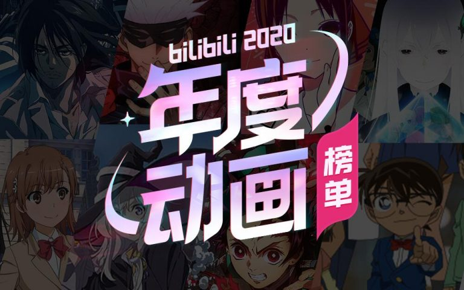

#bilibili2020 年度动画榜单##咒术回战##进击的巨人#

不得不说，每年的番剧动画都会有不少感动人心的好作品，追番的快乐之一也许就是和无数的动画同好一同见证这盛况吧

2020 年，在疫情的冲击下，我们依然看见了一部部向我们阐述着关于梦想、友情、爱情的动画作品。我们从中收获了无数欢笑与泪水，也透过屏幕看到了这个世界的五彩斑斓。在这不平凡的一年里，动画中的那些青春热血与光怪陆离，给了我们面对现实的力量和勇气。相信只要坚持这份对于动画的热爱，我们眼中的世界将永远明亮动人。（摘自结束语）

《进击的巨人 最终季》、《咒术回战》、《Re：0 第二季》、《超电磁炮 T》和《魔女之旅》获得 B 站 2020 年最受欢迎新番排名前五；

《咒术回战》、《公主连结》、《异度侵入》、《地缚少年花子君》和《太怕痛就全点防御力凉了》获得年度热门前五；

艾伦·耶格尔（巨人）、御坂美琴（超电磁炮）、利威尔·阿克曼（巨人）、伊雷娜（魔女之旅）和五条悟（咒术回战）分别取得 2020 年年度动画角色前五名；

《辉夜第三季》、《EVA 新剧场版》、《史莱姆第二季》、《刀剑进击篇》和《京吹三年生篇》分别取得 2021 最受期待动画前五名；

《迪迦·奥特曼》、《泽塔·奥特曼》和《巴啦啦小魔仙》取得历代特摄前三；

【bilibili2020 年度动画榜单】[https://www.bilibili.com/blackboard/AOY2020_ranking_list.html](https://www.bilibili.com/blackboard/AOY2020_ranking_list.html)

PS：我的追番日记 [https://magma.ink/fan](https://magma.ink/fan)
