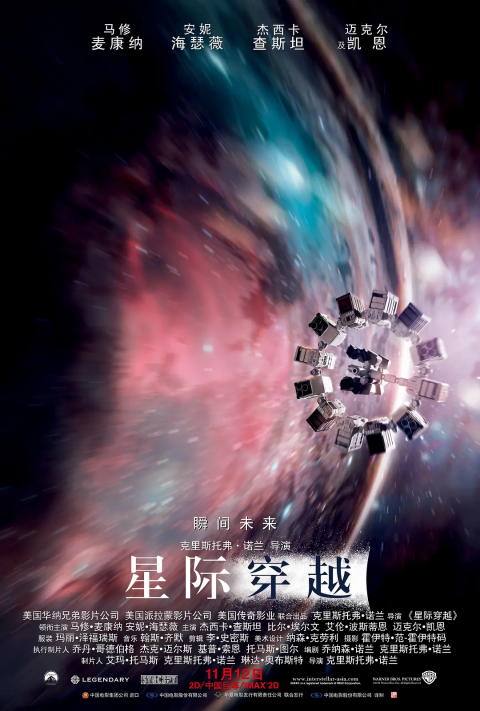

\[alert\]这里还是个半成品都不算的草稿——可以看看姊妹界面：《[追番日记](https://magma.ink/fan/)》\[/alert\]

**已记录电影 \[label\]共计部\[/label\] \[label\]日本部\[/label\] \[label\]中国大陆部\[/label\]**

- ✅**已看完**。
- ⏸**已搁置或放弃。**

- ?**是日本动画电影、番剧剧场版**。
- ⭐**评价、**?**超爱、?推荐**

## 2021 年

### 星际穿越 Interstellar (2014)

> ⭐**6 ?科幻、亲情**

[科幻](https://movie.douban.com/tag/%E7%A7%91%E5%B9%BB) [太空](https://movie.douban.com/tag/%E5%A4%AA%E7%A9%BA) [宇宙](https://movie.douban.com/tag/%E5%AE%87%E5%AE%99) [美国](https://movie.douban.com/tag/%E7%BE%8E%E5%9B%BD) [人性](https://movie.douban.com/tag/%E4%BA%BA%E6%80%A7) [亲情](https://movie.douban.com/tag/%E4%BA%B2%E6%83%85) [震撼](https://movie.douban.com/tag/%E9%9C%87%E6%92%BC) [冒险](https://movie.douban.com/tag/%E5%86%92%E9%99%A9)

近未来的地球黄沙遍野，小麦、秋葵等基础农作物相继因枯萎病灭绝，人类不再像从前那样仰望星空，放纵想象力和灵感的迸发，而是每日在沙尘暴的肆虐下倒数着所剩不多的光景。在家务农的前 NASA 宇航员库珀（马修·麦康纳 Matthew McConaughey 饰）接连在女儿墨菲（麦肯吉·弗依 Mackenzie Foy 饰）的书房发现奇怪的重力场现象，随即得知在某个未知区域内前 NASA 成员仍秘密进行一个拯救人类的计划。多年以前土星附近出现神秘虫洞，NASA 借机将数名宇航员派遣到遥远的星系寻找适合居住的星球。在布兰德教授（迈克尔·凯恩 Michael Caine 饰）的劝说下，库珀忍痛告别了女儿，和其他三名专家教授女儿艾米莉亚·布兰德（安妮·海瑟薇 Anne Hathaway 饰）、罗米利（大卫·吉雅西 David Gyasi 饰）、多伊尔（韦斯·本特利 Wes Bentley 饰）搭乘宇宙飞船前往目前已知的最有希望的三颗星球考察。  
　　他们穿越遥远的星系银河，感受了一小时七年光阴的沧海桑田，窥见了未知星球和黑洞的壮伟与神秘。在浩瀚宇宙的绝望而孤独角落，总有一份超越了时空的笃定情怀将他们紧紧相连…… [© 豆瓣](https://movie.douban.com/help/movie#t0-qs)

[观看预告片](https://www.bilibili.com/video/av69911483) | [哔哩哔哩](https://www.douban.com/link2/?url=https%3A%2F%2Fwww.bilibili.com%2Fbangumi%2Fplay%2Fss28585%3Fbsource%3Ddouban&subtype=8&type=online-video&link2key=3d6c7c73d1) | [豆瓣](https://movie.douban.com/subject/1889243/)
