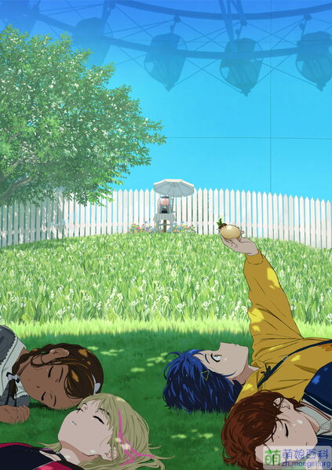
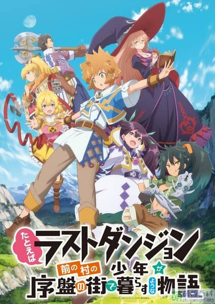
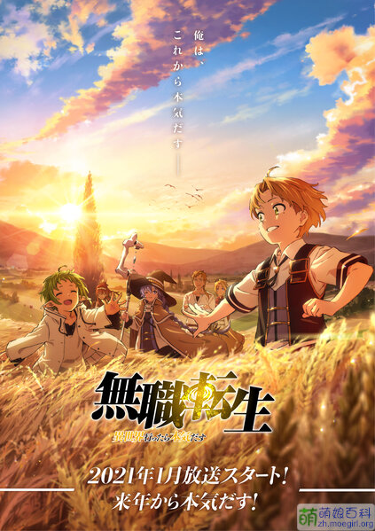

### 奇蛋物语 / WONDER EGG PRIORITY【连载】⏩

> ⭐**5.5 超出预期** ?**一月宝藏 **?**推荐**
>
> 番剧尚未完结，评分可能会浮动。

\[sc name=fanc 1=21 年 1 月新番 2=原创 原案 野岛伸司 3=CloverWorks 4=奇幻 5=战斗 6=心理 4c=red alert=可能含不宜内容\]

五星就放在这了，希望能稳当的走下去

B 站找一月番时偶然发现的宝物~感觉有些像声之形，也是部原创番。第一话看完给我一种耳目一新的感觉~据说原案之前是拍日剧的，怪不得看起来有一股轻日剧的味道。目前看起来，也许是心理治愈题材吧~

刀刀刀刀刀

- **连载中，每周二更新**
- \[sc name="fanb" f=奇蛋物语\]

```
[su_image_carousel source="media: ####" max_width="80%" crop="3:4" spacing="no" align="center" dots="no" autoplay="0" image_size="full"][sc name="fanbili" title="" mark="" fan="" from="" type="" origin="" produced="" 1="" 2="" 3="" 4="" 5="" alert="" start="" end=""]
```

# 2021 年 - 1 月 冬季

## 连载中


### 奇蛋物语 / WONDER EGG PRIORITY

⭐**5.5 超出预期** ?**一月宝藏** **?\*\***推荐\*\*  
\[sc name=fanlabel 1=21 年 1 月新番 2=原创 原案 野岛伸司 3=CloverWorks 4=奇幻 5=战斗 6=心理 4c=red alert=可能含不宜内容\]  
[百科](https://zh.moegirl.org.cn/%E5%A5%87%E8%9B%8B%E7%89%A9%E8%AF%AD#%E5%8A%A8%E7%94%BB%E7%89%88)｜[Bangumi](http://bgm.tv/subject_search/%E5%A5%87%E8%9B%8B%E7%89%A9%E8%AF%AD) | [B 站](https://search.bilibili.com/all?keyword=%E5%A5%87%E8%9B%8B%E7%89%A9%E8%AF%AD)｜[AGE 动漫](https://www.agefans.net/search?query=%E5%A5%87%E8%9B%8B%E7%89%A9%E8%AF%AD)

[看不懂《_奇蛋物语_》？你进来，我这就让你懂！](https://www.bilibili.com/video/BV1Lp4y1p75s?from=search&seid=7632719779988846048)  
[有变化，有意外，有亮点——一月新番《_奇蛋物语_》](https://www.bilibili.com/video/BV1V54y1Y7Yy?from=search&seid=7632719779988846048)  
[【6 月】*奇蛋物语*  特别篇 放送決定 PV【MCE 汉化组】](https://www.bilibili.com/video/BV1LK4y1S7YV?from=search&seid=7632719779988846048)

\[su_image_carousel source="media: 1851" max_width="80%" crop="3:4" spacing="no" align="center" dots="no" autoplay="0" image_size="full"\]\[sc name="fanbili" title="无职转生～到了异世界就拿出真本事～ (前半)" mark="**⭐5** **超出预期** ??**推荐**" fan="无职转生" from="21 年 1 月新番" type=轻小说改编 origin= produced="" 1=异世界 2=冒险 3=成长 4=奇幻 5="" alert="可能不能被所有人接受" more=""\]

```
无职转生#02线稿&成片对比片段
```



### 好比是最终迷宫前的少年到新手村生活一般的故事

**⭐3.5 不及预期** / 值得一看  
\[label\]来源 21 年 1 月新番\[/label\] \[label\]轻小说改 KADOKAWA\[/label\] \[label\]动画 STUDIO BIND\[/label\] \[label\]异世界\[/label\] \[label\]冒险\[/label\] \[label\]成长\[/label\] \[label\]奇幻\[/label\] \[label color=orange\]ℹ️ 可能不能被所有人接受。\[/label\]  
[百科](https://zh.moegirl.org.cn/%E5%A5%87%E8%9B%8B%E7%89%A9%E8%AF%AD#%E5%8A%A8%E7%94%BB%E7%89%88)｜[Bangumi](http://bgm.tv/subject_search/%E5%A5%87%E8%9B%8B%E7%89%A9%E8%AF%AD) | [B 站](https://search.bilibili.com/all?keyword=%E5%A5%87%E8%9B%8B%E7%89%A9%E8%AF%AD)｜[AGE 动漫](https://www.agefans.net/search?query=%E5%A5%87%E8%9B%8B%E7%89%A9%E8%AF%AD)


### 好比是最终迷宫前的少年到新手村生活一般的故事 1

**⭐3.5 不及预期** / 值得一看  
\[label\]来源 21 年 1 月新番\[/label\] \[label\]轻小说改 KADOKAWA\[/label\] \[label\]动画 STUDIO BIND\[/label\] \[label\]异世界\[/label\] \[label\]冒险\[/label\] \[label\]成长\[/label\] \[label\]奇幻\[/label\] \[label color=orange\]ℹ️ 可能不能被所有人接受。\[/label\]  
[百科](https://zh.moegirl.org.cn/%E5%A5%87%E8%9B%8B%E7%89%A9%E8%AF%AD#%E5%8A%A8%E7%94%BB%E7%89%88)｜[Bangumi](http://bgm.tv/subject_search/%E5%A5%87%E8%9B%8B%E7%89%A9%E8%AF%AD)  
[B 站](https://search.bilibili.com/all?keyword=%E5%A5%87%E8%9B%8B%E7%89%A9%E8%AF%AD)｜[AGE 动漫](https://www.agefans.net/search?query=%E5%A5%87%E8%9B%8B%E7%89%A9%E8%AF%AD)



### 无职转生～到了异世界就拿出真本事～ (前半)1

**⭐5** **超出预期** ??**推荐**  
\[label\]来源 21 年 1 月新番\[/label\] \[label\]轻小说改 KADOKAWA\[/label\] \[label\]动画 STUDIO BIND\[/label\] \[label\]异世界\[/label\] \[label\]冒险\[/label\] \[label\]成长\[/label\] \[label\]奇幻\[/label\] \[label color=orange\]ℹ️ 可能不能被所有人接受。\[/label\]  
[](https://zh.moegirl.org.cn/%E5%A5%87%E8%9B%8B%E7%89%A9%E8%AF%AD#%E5%8A%A8%E7%94%BB%E7%89%88)[B 站港澳台](https://www.bilibili.com/bangumi/play/ss37762) | [AGE 动漫](https://www.agefans.net/detail/20200012) |  
[](https://zh.moegirl.org.cn/%E5%A5%87%E8%9B%8B%E7%89%A9%E8%AF%AD#%E5%8A%A8%E7%94%BB%E7%89%88)[B 站](https://www.bilibili.com/bangumi/play/ss36168)[已下架](https://www.bilibili.com/bangumi/play/ss36168) | [萌娘百科](https://zh.moegirl.org.cn/%E6%97%A0%E8%81%8C%E8%BD%AC%E7%94%9F%EF%BD%9E%E5%88%B0%E4%BA%86%E5%BC%82%E4%B8%96%E7%95%8C%E5%B0%B1%E6%8B%BF%E5%87%BA%E7%9C%9F%E6%9C%AC%E4%BA%8B%EF%BD%9E#%E5%8A%A8%E7%94%BB%E7%89%88) | [Bangumi](http://bgm.tv/subject/277554)

[_无职转生_#02 线稿&成片对比片段](https://www.bilibili.com/video/BV1vX4y1K7tt?from=search&seid=17424784560302882899)


### 奇蛋物语 / WONDER EGG PRIORITY1

⭐**5.5 超出预期** ?**一月宝藏 **?**推荐**  
\[sc name=fanlabel 1=21 年 1 月新番 2=原创 原案 野岛伸司 3=CloverWorks 4=奇幻 5=战斗 6=心理 4c=red alert=可能含不宜内容\]  
[百科](https://zh.moegirl.org.cn/%E5%A5%87%E8%9B%8B%E7%89%A9%E8%AF%AD#%E5%8A%A8%E7%94%BB%E7%89%88)｜[Bangumi](http://bgm.tv/subject_search/%E5%A5%87%E8%9B%8B%E7%89%A9%E8%AF%AD)  
[B 站](https://search.bilibili.com/all?keyword=%E5%A5%87%E8%9B%8B%E7%89%A9%E8%AF%AD)｜[AGE 动漫](https://www.agefans.net/search?query=%E5%A5%87%E8%9B%8B%E7%89%A9%E8%AF%AD)

[看不懂《_奇蛋物语_》？你进来，我这就让你懂！](https://www.bilibili.com/video/BV1Lp4y1p75s?from=search&seid=7632719779988846048)  
[有变化，有意外，有亮点——一月新番《_奇蛋物语_》](https://www.bilibili.com/video/BV1V54y1Y7Yy?from=search&seid=7632719779988846048)  
[【6 月】*奇蛋物语*  特别篇 放送決定 PV【MCE 汉化组】](https://www.bilibili.com/video/BV1LK4y1S7YV?from=search&seid=7632719779988846048)


### 奇蛋物语 / WONDER EGG PRIORITY1

⭐**5.5 超出预期** ?**一月宝藏 **?**推荐**  
\[sc name=fanlabel 1=21 年 1 月新番 2=原创 原案 野岛伸司 3=CloverWorks 4=奇幻 5=战斗 6=心理 4c=red alert=可能含不宜内容\]  
[百科](https://zh.moegirl.org.cn/%E5%A5%87%E8%9B%8B%E7%89%A9%E8%AF%AD#%E5%8A%A8%E7%94%BB%E7%89%88)｜[Bangumi](http://bgm.tv/subject_search/%E5%A5%87%E8%9B%8B%E7%89%A9%E8%AF%AD)  
[B 站](https://search.bilibili.com/all?keyword=%E5%A5%87%E8%9B%8B%E7%89%A9%E8%AF%AD)｜[AGE 动漫](https://www.agefans.net/search?query=%E5%A5%87%E8%9B%8B%E7%89%A9%E8%AF%AD)

[看不懂《_奇蛋物语_》？你进来，我这就让你懂！](https://www.bilibili.com/video/BV1Lp4y1p75s?from=search&seid=7632719779988846048)  
[有变化，有意外，有亮点——一月新番《_奇蛋物语_》](https://www.bilibili.com/video/BV1V54y1Y7Yy?from=search&seid=7632719779988846048)  
[【6 月】*奇蛋物语*  特别篇 放送決定 PV【MCE 汉化组】](https://www.bilibili.com/video/BV1LK4y1S7YV?from=search&seid=7632719779988846048)


### 无职转生～到了异世界就拿出真本事～ (前半)1

**⭐5** **超出预期** ??**推荐**  
\[label\]来源 21 年 1 月新番\[/label\] \[label\]轻小说改 KADOKAWA\[/label\] \[label\]动画 STUDIO BIND\[/label\] \[label\]异世界\[/label\] \[label\]冒险\[/label\] \[label\]成长\[/label\] \[label\]奇幻\[/label\] \[label color=orange\]ℹ️ 可能不能被所有人接受。\[/label\]  
[](https://zh.moegirl.org.cn/%E5%A5%87%E8%9B%8B%E7%89%A9%E8%AF%AD#%E5%8A%A8%E7%94%BB%E7%89%88)[B 站港澳台](https://www.bilibili.com/bangumi/play/ss37762) | [AGE 动漫](https://www.agefans.net/detail/20200012) |  
[](https://zh.moegirl.org.cn/%E5%A5%87%E8%9B%8B%E7%89%A9%E8%AF%AD#%E5%8A%A8%E7%94%BB%E7%89%88)[B 站](https://www.bilibili.com/bangumi/play/ss36168)[已下架](https://www.bilibili.com/bangumi/play/ss36168) | [萌娘百科](https://zh.moegirl.org.cn/%E6%97%A0%E8%81%8C%E8%BD%AC%E7%94%9F%EF%BD%9E%E5%88%B0%E4%BA%86%E5%BC%82%E4%B8%96%E7%95%8C%E5%B0%B1%E6%8B%BF%E5%87%BA%E7%9C%9F%E6%9C%AC%E4%BA%8B%EF%BD%9E#%E5%8A%A8%E7%94%BB%E7%89%88) | [Bangumi](http://bgm.tv/subject/277554)

[_无职转生_#02 线稿&成片对比片段](https://www.bilibili.com/video/BV1vX4y1K7tt?from=search&seid=17424784560302882899)


### 好比是最终迷宫前的少年到新手村生活一般的故事 1

**⭐3.5 不及预期** / 值得一看  
\[label\]来源 21 年 1 月新番\[/label\] \[label\]轻小说改 KADOKAWA\[/label\] \[label\]动画 STUDIO BIND\[/label\] \[label\]异世界\[/label\] \[label\]冒险\[/label\] \[label\]成长\[/label\] \[label\]奇幻\[/label\] \[label color=orange\]ℹ️ 可能不能被所有人接受。\[/label\]  
[百科](https://zh.moegirl.org.cn/%E5%A5%87%E8%9B%8B%E7%89%A9%E8%AF%AD#%E5%8A%A8%E7%94%BB%E7%89%88)｜[Bangumi](http://bgm.tv/subject_search/%E5%A5%87%E8%9B%8B%E7%89%A9%E8%AF%AD)  
[B 站](https://search.bilibili.com/all?keyword=%E5%A5%87%E8%9B%8B%E7%89%A9%E8%AF%AD)｜[AGE 动漫](https://www.agefans.net/search?query=%E5%A5%87%E8%9B%8B%E7%89%A9%E8%AF%AD)


### 好比是最终迷宫前的少年到新手村生活一般的故事 1

**⭐3.5 不及预期** / 值得一看  
\[label\]来源 21 年 1 月新番\[/label\] \[label\]轻小说改 KADOKAWA\[/label\] \[label\]动画 STUDIO BIND\[/label\] \[label\]异世界\[/label\] \[label\]冒险\[/label\] \[label\]成长\[/label\] \[label\]奇幻\[/label\] \[label color=orange\]ℹ️ 可能不能被所有人接受。\[/label\]  
[百科](https://zh.moegirl.org.cn/%E5%A5%87%E8%9B%8B%E7%89%A9%E8%AF%AD#%E5%8A%A8%E7%94%BB%E7%89%88)｜[Bangumi](http://bgm.tv/subject_search/%E5%A5%87%E8%9B%8B%E7%89%A9%E8%AF%AD)  
[B 站](https://search.bilibili.com/all?keyword=%E5%A5%87%E8%9B%8B%E7%89%A9%E8%AF%AD)｜[AGE 动漫](https://www.agefans.net/search?query=%E5%A5%87%E8%9B%8B%E7%89%A9%E8%AF%AD)
