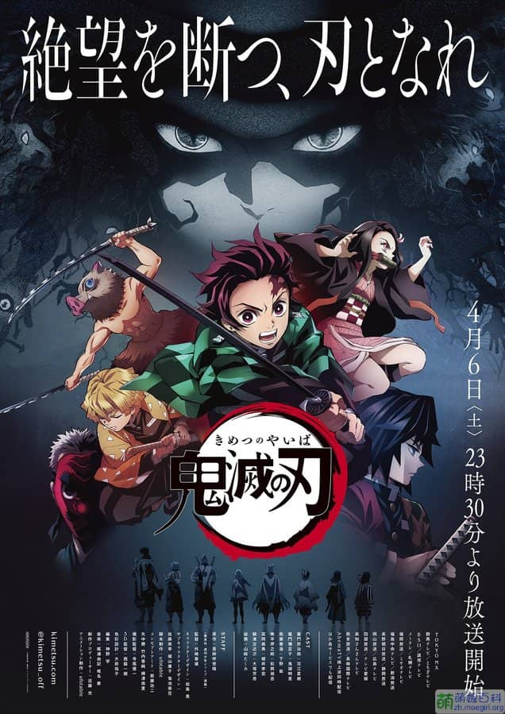

---

**上一部分：[2020 中半](https://magma.ink/fan20b#foot)**

### **POP TEAM EPIC**（**POP 子与 PIPI 美的日常**）✅

> **⭐3 可能不适合圈外人**

\[label color=orange\]ℹ️ 含有部分不宜内容，可能不能被所有人接受。\[/label\] \[label\]来源 [电脑糕](http://diannaogao.magma.ink)推荐\[/label\] \[label\]漫画改\[/label\] \[label\]动画 神风动画\[/label\] \[label\]搞笑\[/label\] \[label\]梗\[/label\] \[label\]日常大概\[/label\] \[label\]霸权自称\[/label\] \[label\]神经病\[/label\] \[label\]\*作\[/label\] \[label\]AC 部警告\[/label\] \[label\]恋爱这个可以有\[/label\] \[label\]？？？？？？\[/label\]

屑番... 这是一部全程都在玩梗的番，搞怪猎奇，有大量影视作品、番剧动画、游戏、日本文化生活相关的梗的搞笑短剧。能看懂的能 Get 到笑点，不懂的话就会全程蒙。

- 2020 6 补完
- [萌娘百科](https://zh.moegirl.org.cn/POP_TEAM_EPIC)

### **境界的彼方**✅

> **⭐4.5 还行**

\[label\]来源 京阿尼作品列表\[/label\] \[label\]轻小说改 KA Esuma 文库\[/label\] \[label\]京都动画\[/label\] \[label\]恋爱\[/label\] \[label\]奇幻\[/label\]

- 2020 6 补完
- [萌娘百科](https://zh.moegirl.org.cn/%E5%A2%83%E7%95%8C%E7%9A%84%E5%BD%BC%E6%96%B9)

### **虚构推理**✅

> **⭐3.5 一般**

\[label\]来源 哔哩哔哩推荐\[/label\] \[label\]动画 NAS\[/label\] \[label\]轻小说改 讲谈社\[/label\] \[label\]恋爱\[/label\] \[label\]推理\[/label\] \[label\]奇幻\[/label\]

- 2020 5-7 补完
- [萌娘百科](https://zh.moegirl.org.cn/%E8%99%9A%E6%9E%84%E6%8E%A8%E7%90%86)

### **鬼灭之刃 ✅**

<figure>

<figcaption>

日版主视觉图

</figcaption>

</figure>

> **⭐5 值得一看\*\***?\***\*战斗、励志类推荐**

\[label\]来源 哔哩哔哩推荐\[/label\] \[label\]动画制作 ufotable\[/label\] \[label\]原作 集英社《周刊少年 Jump》\[/label\] \[label\]战斗\[/label\] \[label\]励志\[/label\] \[label\]热血\[/label\]

- 剧场版**《**鬼灭之刃 无限列车篇》 官方 pv 定档 2020 年 10 月 16 日（日本）
- 第一季 2020 年 5 月至 6 月 补完 全 24 话
- [萌娘百科](https://mzh.moegirl.org.cn/%E9%AC%BC%E7%81%AD%E4%B9%8B%E5%88%83) | [B 站会员独播](https://www.bilibili.com/bangumi/play/ss26801/)

.

### **异度侵入 ID:INVADED✅**

> **⭐5.5 值得一看\*\*\*\***?**\*\***推理类必看作品\*\*

\[label\]来源 [电脑糕](http://diannaogao.magma.ink)推荐\[/label\] \[label\]动画制作 NAZ\[/label\] \[label\]原创动画\[/label\] \[label\]推理\[/label\] \[label\]科幻\[/label\] \[label\]悬疑\[/label\]

<figure>

<figcaption>

[本年新番榜](https://magma.ink/fanshare-2020/) #4

</figcaption>

</figure>

这个是真的推理番，科幻主题，在一月季度中有相当大的讨论度，目前已破一亿播放。据说这十几集制作了八年，对推理感兴趣的话强推！

- 2020 5 补完
- [Bangumi](http://bgm.tv/subject/285776) | [萌娘百科](https://zh.moegirl.org.cn/ID:INVADED)

### **地缚少年花子君**✅\*\*\*\*

> ⭐**5 值得一看\*\***?\***\*恋爱、魔幻系推荐**

\[label\]来源 20 年 1 月新番补\[/label\] \[label\]动画 Lerche\[/label\] \[label\]漫画改\[/label\] \[label\]恋爱\[/label\] \[label\]校园\[/label\] \[label\]奇幻\[/label\]

<figure>

<figcaption>

[本年新番榜](https://magma.ink/fanshare-2020/) #9

</figcaption>

</figure>

超甜恋爱番，画面继承了原作漫画的独特艺术感。推荐喜欢看恋爱的女生看，漫画也很不错。

- 2020 5 补完
- [萌娘百科](https://zh.moegirl.org.cn/%E5%9C%B0%E7%BC%9A%E5%B0%91%E5%B9%B4%E8%8A%B1%E5%AD%90%E5%90%9B#%E5%8B%95%E7%95%AB%E7%89%88)

### **小林家的龙女仆 ✅**

> **⭐4.5 值得一看\*\*\*\***?**\*\***日常系推荐\*\*

\[label\]来源 哔哩哔哩推荐\[/label\] \[label\]原作 双叶社《月刊 Action》\[/label\] \[label\]京都动画\[/label\] \[label\]日常\[/label\] \[label\]喜剧\[/label\]

日常喜剧，推荐一看！温暖轻松的轻日常超现实喜剧，京阿尼入坑作！本以为在[京阿尼大火事件](https://zh.moegirl.org.cn/2019%E5%B9%B47%E6%9C%8818%E6%97%A5%E4%BA%AC%E9%83%BD%E5%8A%A8%E7%94%BB%E7%AC%AC%E4%B8%80%E5%B7%A5%E4%BD%9C%E5%AE%A4%E7%BA%B5%E7%81%AB%E4%BA%8B%E4%BB%B6)和新冠疫情的影响第二季会遥遥无期，没想到这么快就来了！

[萌娘百科](https://zh.moegirl.org.cn/%E5%B0%8F%E6%9E%97%E5%AE%B6%E7%9A%84%E9%BE%99%E5%A5%B3%E4%BB%86#%E5%8A%A8%E7%94%BB%E7%89%88) | [B 站会员独播](https://www.bilibili.com/bangumi/media/md5800/)

### **天使降临到我身边！**✅\*\*\*\*

> ⭐**5 值得一看**?**超爱?日常、萌系猛男必看**

\[label color=pink\]来源 哔哩哔哩推荐\[/label\] \[label color=orange\]漫画改 一迅社《Comic 百合姬》\[/label\] \[label color=red\]动画工房\[/label\] \[label color=blue\]萌系牢饭三部曲\[/label\] \[label color=green\]日常\[/label\] \[label color=yellow\]轻百合\[/label\]

**虽然不知道，但是我最喜欢[宫姐](/%E6%98%9F%E9%87%8E%E5%AE%AB%E5%AD%90)了！** 分かんないけど、みゃ姉が一番好き！

**你知道嘛？| 本作中的 [星野日向](https://zh.moegirl.org.cn/%E6%98%9F%E9%87%8E%E6%97%A5%E5%90%91) 是我使用头像最多、时间最长、\[hidden tip="你知道的太多了" type="background"\]**最喜欢**\[/hidden\]的角色**

- 2020 5 补完
- [萌娘百科](https://zh.moegirl.org.cn/%E5%A4%A9%E4%BD%BF%E9%99%8D%E4%B8%B4%E5%88%B0%E4%BA%86%E6%88%91%E8%BA%AB%E8%BE%B9!) | [B 站会员独播](https://www.bilibili.com/bangumi/play/ss26291/) | 【哔哩哔哩】[天使降临到我身边 NCOP&NCED\[BD1080P+\]](https://www.bilibili.com/video/av47912203?p=1)

不知道说什么，来一首《[気ままな天使たち](https://zh.moegirl.org.cn/%E8%87%AA%E7%94%B1%E8%87%AA%E5%9C%A8%E7%9A%84%E5%A4%A9%E4%BD%BF%E4%BB%AC)》吧！

### **龙王的工作！**✅\*\*\*\*

> ⭐**4.5 值得一看?**萝莉爱好者**励志系推荐**

\[label\]来源 哔哩哔哩推荐\[/label\] \[label\]轻小说改\[/label\] \[label\]动画制作 project No.9\[/label\] \[label\]萌系牢饭三部曲\[/label\] \[label\]励志\[/label\] \[label\]喜剧\[/label\]

本作以萝莉作为卖点，吸引了无数宅男。**但深入细看本作，其并非像许多人印象中那样是一部彻头彻尾的萝莉番。**作品对主角[雏鹤爱](https://mzh.moegirl.org.cn/%E9%9B%8F%E9%B9%A4%E7%88%B1)将棋技艺的成长刻画描写可谓淋漓尽致。同时，动画版的配乐由[川井宪次](https://mzh.moegirl.org.cn/%E5%B7%9D%E4%BA%95%E5%AE%AA%E6%AC%A1)完成，曾参与电影《叶问》，动画《[寒蝉鸣泣之时](https://mzh.moegirl.org.cn/%E5%AF%92%E8%9D%89%E9%B8%A3%E6%B3%A3%E4%B9%8B%E6%97%B6)》等多部知名作品的配乐。在恰到好处的音乐中，即使观众完全不了解本作的主题：日本将棋，也能在每一场如战争般的比赛中发出“妙啊”的赞叹。你可能没听说过这部番剧，但是[雏鹤爱](https://mzh.moegirl.org.cn/%E9%9B%8F%E9%B9%A4%E7%88%B1)的表情包和头像，以及相关的梗你肯定见过。  
是我比较喜欢的类型之一，日常+喜剧+励志+恋爱（尽管第一季剧情没体现）。  
推荐补一补，B 站免费。

- 2020 4 补完

（[萌娘百科](https://mzh.moegirl.org.cn/%E9%BE%99%E7%8E%8B%E7%9A%84%E5%B7%A5%E4%BD%9C) | [B 站免费](https://m.bilibili.com/bangumi/play/ss21554)）

### **埃罗芒阿老师**✅\*\*\*\*

> ⭐**4 不错**

\[label\]来源 哔哩哔哩相关二创\[/label\] \[label\]动画制作 A-1 Pictures\[/label\] \[label\]轻小说改\[/label\] \[label\]恋爱\[/label\] \[label\]喜剧\[/label\] \[label\]后宫\[/label\]

也许是万恶之源，自此之后进入了大量补番的状态。（有生之年不知道能不能等到第二季）

- 2020 4 补完

---

**下一部分：[2019 以前](https://magma.ink/fanold/)**
