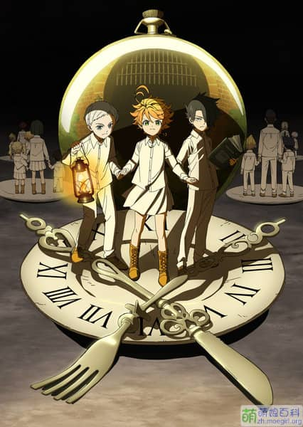

---

**上一部分：[2020 下半](https://magma.ink/fan20c#foot)**

### **宇崎学妹想要玩！**✅

> ⭐**4 还行**

\[label\]来源 20 年 7 月新番\[/label\] \[label\]漫画改\[/label\] \[label\]动画 ENGI\[/label\] \[label\]喜剧\[/label\] \[label\]恋爱\[/label\]

- **已公布第二期制作决定！**
- 2020 年 9 月 26 日 已追完
- 2020 年七月新番 连载中（已完结） 每周五更新
- [萌娘百科](https://zh.moegirl.org.cn/%E5%AE%87%E5%B4%8E%E9%85%B1%E6%83%B3%E8%A6%81%E7%8E%A9%E8%80%8D%EF%BC%81) | [B 站大会员](https://www.bilibili.com/bangumi/media/md28229231)

### **学园孤岛 ✅**

> ⭐**4.5 值得一看**

\[label\]来源 芳文社作品列表\[/label\] \[label\]15 年 7 月\[/label\] \[label\]漫画改 芳文社\[/label\]  \[label\]丧尸\[/label\] \[label\]动画 Lerche\[/label\] \[label\]致郁\[/label\] \[label\]校园\[/label\] \[label\]萌系\[/label\] \[label\]末日\[/label\]

很有特点的一部作品，虽然有点掉 san...

- 2020 年 9 月 21 日 已补完 全 12 话
- 2020 年 9 月 13 日 开始补番
- [萌娘百科](https://zh.moegirl.org.cn/%E5%AD%A6%E5%9B%AD%E5%AD%A4%E5%B2%9B) | [B 站免费](https://www.bilibili.com/bangumi/play/ss2592/?from=search&seid=7997560714151607179)

### **轻音少女 K-ON!! (第二季)✅**

> ⭐**6 不可错过**?**超爱\*\***?\***\*萌系、日常系推荐** **经典日常系番剧**
>
> 不可错过的必看经典！

\[label\]来源 已追作品续作\[/label\] \[label\]2010 年 4 月番\[/label\] \[label\]漫画改 芳文社\[/label\] \[label\]动画制作 京都动画\[/label\] \[label\]监督 山田尚子\[/label\] \[label color=red\]日常**?**\[/label\] \[label\]音乐\[/label\]

**无论走到哪里，我们都是放課後ティータイム**！

- 第二季 2020 年 9 月 17 日 补番完成 ！TV 版全 41 话共计 40 天陪伴，K-ON！
  - 2020 年 9 月 14 日  **TV 第二季最终话放送十周年**！（2010 年 9 月 14 日 - 2020 年 9 月 14 日）
- 第二季 2020 年 8 月 22 日 开始补番 以每日一话的进度前进，尚未中断。
- [《七张图讲完轻音主线》台词截图](https://magma.ink/k-on-7/) | [萌娘百科](https://zh.moegirl.org.cn/%E8%BD%BB%E9%9F%B3%E5%B0%91%E5%A5%B3) | [B 站会员](https://www.bilibili.com/bangumi/play/ss1173/?from=search&seid=10696752780201574147)正版 | [AGE 动漫](https://www.agefans.tv/play/20100019)在线观看 | [樱花动漫](http://m.imomoe.ai/view/5827.html)在线观看

### **中二病也要谈恋爱！恋 ✅**

> ⭐**5 值得一看\*\***?\***\*喜剧、恋爱推荐**

\[label\]来源 已追作品续作\[/label\] \[label\]京都动画\[/label\] \[label\]轻小说改 KA Esuma 文库\[/label\] \[label\]喜剧\[/label\] \[label\]恋爱\[/label\] \[label\]校园\[/label\] \[label\]中二病\[/label\]

- 【第二季】2020 年 9 月 11 日 完结撒六花！
- 【第二季】2020 年 8 月 30 日 开始补番

### **中二病也要谈恋爱**✅

> ⭐**5 值得一看\*\***?\***\*喜剧、恋爱推荐**

\[label\]来源 京阿尼作品列表\[/label\] \[label\]京都动画\[/label\] \[label\]轻小说改 KA Esuma 文库\[/label\] \[label\]喜剧\[/label\] \[label\]恋爱\[/label\] \[label\]校园\[/label\] \[label\]中二病\[/label\]

- 【第一季】2020 年 8 月 30 日 补完
- 【第一季】2020 年 7 月 暂停 番剧太多了
- 【第一季】2020 年 6 月 开始看
- [萌娘百科](https://zh.moegirl.org.cn/%E4%B8%AD%E4%BA%8C%E7%97%85%E4%B9%9F%E8%A6%81%E8%B0%88%E6%81%8B%E7%88%B1)

### **约定的梦幻岛 ✅**

> ⭐**5.5 值得一看\*\***?\***\*推理类推荐**

\[label\]来源 萌百偶遇\[/label\] \[label\]漫画改 集英社《周刊少年 JUMP》\[/label\] \[label\]动画制作 CloverWorks\[/label\] \[label\]智斗\[/label\] \[label\]漫画改\[/label\] \[label\]励志\[/label\] \[label\]19 年 1 月番\[/label\]

- 2020 年 9 月 3 日 已补完！
- 2020 年 8 月 每天下午班里一块看
- [萌娘百科](https://zh.moegirl.org.cn/%E7%BA%A6%E5%AE%9A%E7%9A%84%E6%A2%A6%E5%B9%BB%E5%B2%9B#%E5%8A%A8%E7%94%BB%E7%89%88) | [B 站会员](https://www.bilibili.com/bangumi/play/ep259758)

### **轻音少女 K-ON! (第一季)✅**

> ⭐**6** **不可错过**?**超爱\*\***?\***\*萌系、日常系推荐?经典日常系番剧**
>
> 不可错过的必看经典！

\[label\]来源 京阿尼作品列表、哔哩哔哩推荐\[/label\] \[label\]09 年 4 月番\[/label\] \[label\]漫画改 芳文社\[/label\] \[label\]动画制作 京都动画\[/label\] \[label\]监督 山田尚子\[/label\] \[label color=red\]日常**?**\[/label\] \[label\]音乐\[/label\]

- 第一季 2020 年 8 月 21 日 补完 全 12 话 + 番外 2 话
- 第一季 2020 年 8 月 9 日 开始补番
- [萌娘百科](https://zh.moegirl.org.cn/%E8%BD%BB%E9%9F%B3%E5%B0%91%E5%A5%B3) | [B 站会员](https://www.bilibili.com/bangumi/play/ss1172/?from=search&seid=10696752780201574147)正版 | [AGE 动漫](https://www.agefans.tv/play/20090010)在线观看 | [樱花动漫](http://m.imomoe.ai/view/4992.html)在线观看

### **玉子爱情故事**?✅

> ⭐**5 值得一看**

\[label\]来源 已追作品续作\[/label\] \[label\]动画 京都动画\[/label\] \[label\]监督 山田尚子\[/label\] \[label\]剧本 吉田玲子\[/label\] \[label\]恋爱\[/label\]

- 剧场版 玉子爱情故事 2020 年 8 月 7 日 补完
- 剧场版 玉子爱情故事 2020 年 8 月 6 日 看了 24 分钟
- [萌娘百科](https://zh.moegirl.org.cn/%E7%8E%89%E5%AD%90%E5%B8%82%E5%9C%BA#%E5%89%A7%E5%9C%BA%E7%89%88%E5%8A%A8%E7%94%BB)

### **女高中生的虚度日常**✅

> ⭐**5 值得一看\*\***?\***\*日常、喜剧类推荐**

\[label\]来源 哔哩哔哩推荐\[/label\] \[label\]漫画改\[/label\] \[label\]动画制作：Passione\[/label\] \[label\]喜剧\[/label\] \[label\]日常\[/label\] \[label\]校园\[/label\]

**“那个 我想说件很厉害的事”**

推荐！如果你也喜欢日常番，那么这是一部你一定不能错过的作品。这部番剧从田中和朋友的高中生活讲起，真实展现了你我日常中各种搞笑无厘头的片段，搞笑之余，也能从中发现自己的影子。同时，本片对”成长“这一主题并没有过多的辞藻，一切变化尽在不言之中。

- 2020 年 8 月 13 日 补完！
- 2020 年 8 月 补番中
- [B 站会员](https://www.bilibili.com/bangumi/media/md28221415/?from=search&seid=5732231514756553617) | [萌娘百科](https://zh.moegirl.org.cn/%E5%A5%B3%E9%AB%98%E4%B8%AD%E7%94%9F%E7%9A%84%E8%99%9A%E5%BA%A6%E6%97%A5%E5%B8%B8)

### **玉子市场**✅

> ⭐**5 值得一看\*\***?\***\*日常、治愈推荐**

\[label\]来源 京阿尼作品列表\[/label\] \[label\]动画 京都动画\[/label\] \[label\]原创动画\[/label\]\[label\]监督 山田尚子\[/label\] \[label\]治愈\[/label\] \[label\]日常\[/label\]

很有爱的一部日常喜剧番～很有京阿尼轻音的特点！

- TV 动画 2020 年 8 月 6 日 补完
- TV 动画 2020 年 7 月 - 8 月 补番中
- [萌娘百科](https://zh.moegirl.org.cn/%E7%8E%89%E5%AD%90%E5%B8%82%E5%9C%BA)

### **齐木楠雄的灾难 等一系列作品 ✅**

**（含 4 部全 56 话 1344 分钟）**

> ⭐**5 值得一看**?**日常、喜剧类推荐**

\[label\]来源 好友推荐\[/label\] \[label\]漫画改 集英社《周刊少年 JUMP》\[/label\] \[label\]动画制作 J.C.STAFF\[/label\] \[label\]喜剧\[/label\] \[label\]日常\[/label\] \[label\]校园\[/label\]

拥有超能力？也可能是灾难！粉毛的齐木楠雄从出生就拥有各种常人梦寐以求的超能力，但是这也惹出了不少乱子。集英社《周刊少年 JUMP》人气经典漫画，像大多数的《JUMP》漫画那样，本作故事中也暗含着不少对青春少年们常有的友情和成长的心情描写，搞笑的背后藏着不少感动。动画版因为人气火爆，收到重视，一共做了 56 话，1344 分钟的时长，基本上全部漫画剧情都进行了动画化，不用担心不够看（实际上这么长也不够看）

- **始动篇** 2020 年 8 月 19 日 完结！全五十六话 （第一二季一天两话）近一个月时间的欢乐，完结撒花，感谢陪伴！
- **始动篇** 2020 年 8 月 14 日 开始
- **完结篇** 2020 年 8 月 12 日 补完
- **完结篇** 2020 年 8 月 12 日 开始
- **第二季** 2020 年 8 月 11 日（0 点）补完！
- **第二季** 2020 年 7 月 开始
- **第一季** 2020 7 补完
- [萌娘百科](https://mzh.moegirl.org.cn/%E9%BD%90%E6%9C%A8%E6%A5%A0%E9%9B%84%E7%9A%84%E7%81%BE%E9%9A%BE) | [B 站会员](https://search.bilibili.com/bangumi?keyword=%E9%BD%90%E6%9C%A8%E6%A5%A0%E9%9B%84%E7%9A%84%E7%81%BE%E9%9A%BE)

### **NEW GAME!! ✅**

> **⭐5.5 值得一看?超爱\*\***?\***\*萌系、**轻百合优秀作品\*\*\*\*

\[label\]来源 已追作品续作\[/label\] \[label\]漫画改 芳文社\[/label\] \[label\]动画工房\[/label\] \[label\]萌系\[/label\] \[label\]职场\[/label\] \[label\]轻百合\[/label\]

期待！第三季有望~不过应该是有生之年了

- 漫画 持续追更中！目前在八十话前后
- 动画第二季 2020 年 8 月 5 日 补完
- 动画第二季 2020 年 7 月 24 日 开补
- [萌娘百科](https://mzh.moegirl.org.cn/NEW_GAME!) | [B 站免费](https://www.bilibili.com/bangumi/play/ss5027/) | [A 站免费](https://www.acfun.cn/bangumi/aa5025182_0_330338) | [原作漫画(动漫之家)](https://manhua.dmzj.com/newgame/) | [腾讯 VIP](http://m.v.qq.com/cover/t/t2n662xtx8gef1h.html?vid=l0026l5abfj)

### **Re：从零开始的异世界生活 第二季**⏸

> **无评分\*\***?\***\*异世界、奇幻类推荐 知名出圈作品**

\[label\]来源 已追作品续作\[/label\]

- 20 年 7 月 **放弃** 四年了 剧情忘完了 以后再补吧

.

### **工作细胞**✅

> ⭐**5 值得一看**?**优秀科普类作品**

\[label\]来源 未知\[/label\] \[label\]讲谈社《月刊少年天狼星》\[/label\] \[label\]动画 david production\[/label\] \[label\]科普\[/label\] \[label\]战斗\[/label\]

- 第二季 2020 年 预定
- 第一季 2020 年 7 月 23 日 补完
  - 中途因未知原因暂停，受[2020 年疫情](https://baike.baidu.com/item/2020%E5%B9%B4%E6%96%B0%E5%9E%8B%E5%86%A0%E7%8A%B6%E7%97%85%E6%AF%92%E7%96%AB%E6%83%85/24278151)在家开始的补番热潮的影响——2020 年暑假初才将本作补完，这也是 2019 年唯一的一部番剧动画。
- 第一季 2019 年 开始追

### **NEW GAME! ✅**

> **⭐5 值得一看\*\***?\***\*超爱\*\***?\***\*萌系、**轻百合优秀作品\*\*\*\*

\[label\]来源 哔哩哔哩推荐\[/label\] \[label\]漫画改 芳文社\[/label\] \[label\]动画工房\[/label\] \[label\]萌系\[/label\] \[label\]日常\[/label\] \[label\]轻百合\[/label\]

职场新人凉风青叶，高中毕业后进入学生时期就梦寐以求的游戏公司，开始了职场生涯。在从小崇拜的设计师光和诸位前辈的照顾下，逐渐获得了成年人的成熟和稳重。她能否制作出内心中最满意的游戏呢？

- 动画第一季 2020 年 7 月 23 日 补完
- [萌娘百科](https://mzh.moegirl.org.cn/NEW_GAME!) | [B 站免费](https://www.bilibili.com/bangumi/play/ss5027/) | [A 站免费](https://www.acfun.cn/bangumi/aa5025182_0_330338) | [原作漫画(动漫之家)](https://manhua.dmzj.com/newgame/) | [优酷免费](https://m.youku.com/alipay_video/id_XMTYzMjkxOTQyNA==.html) | [腾讯 VIP](http://m.v.qq.com/cover/h/hdk2c5cvu5nlhaa.html?vid=g00269cjduv)

### **日常**✅

> **⭐6 **值得一看?**超爱**?**日常系推荐**
>
> [Bgm](http://bgm.tv/subject/9912) **8.4**  [豆瓣](https://movie.douban.com/subject/4848701/) **9.4** [B 站](https://www.bilibili.com/bangumi/media/md844/) **9.9** **超高分好评如潮！**

\[label\]来源 京阿尼作品列表\[/label\] \[label\]京都动画\[/label\] \[label\]漫画 2006-2015 改\[/label\] \[label\]2011 年 4 月\[/label\] \[label\]喜剧\[/label\] \[label\]日常\[/label\] \[label\]治愈\[/label\]

**我们所经历的每个平凡的日常，也许就是连续发生的奇迹。**日々私たちが過ごしている日常は、実は、奇跡の連続なのかもしれない。

早期经典日常喜剧，也许开创了一个时代（？）

- 2020 6-7 补完
- [萌娘百科](https://zh.moegirl.org.cn/%E6%97%A5%E5%B8%B8)|[B 站会员独播](https://www.bilibili.com/bangumi/media/md844/)

**下一部分：[2020 上半](https://magma.ink/fan20a)**
