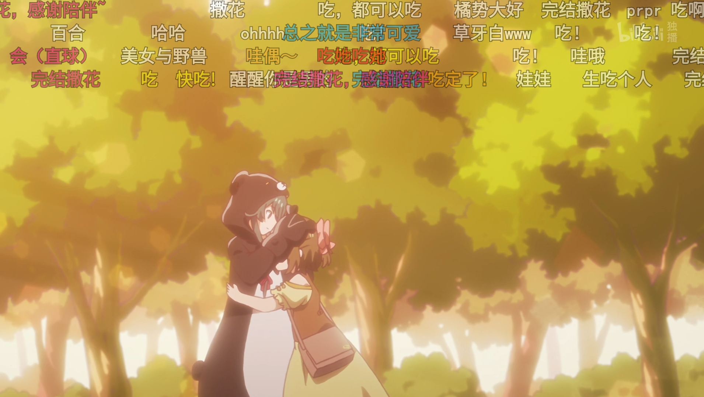
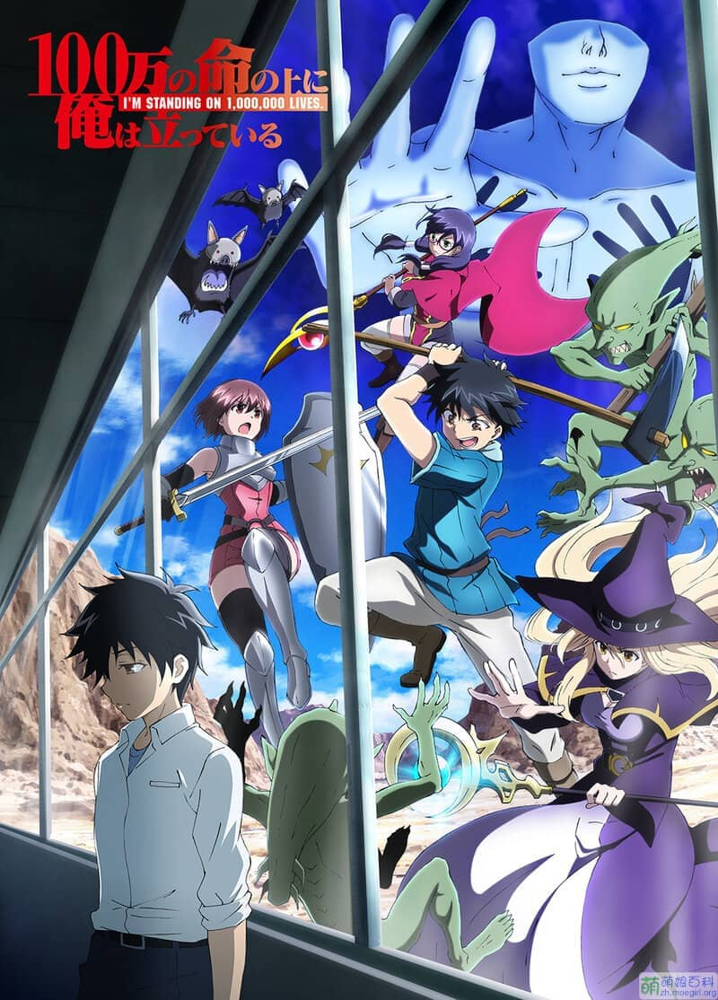
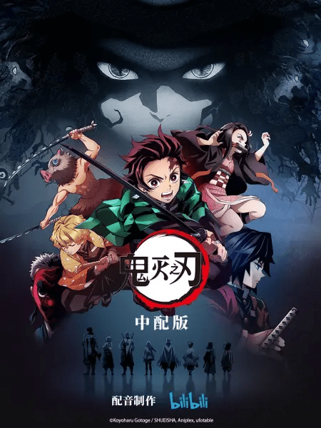

---

**上一部分：[2021 上半](https://magma.ink/fan#foot)**

## **2020 年**（46 部）

2020 年是我追番的第一年，也是动画对我的价值观改变深刻的一年。由于年初的一次偶然机会，我踏入了这个独特而美好的虚幻世界，学到了很多关于影视的文化和知识，收获了不少感动，但同时也发现身边不少人对 “日本动漫” 和 “二次元” 有着不小的误解。在这一年中了解了许多构思新颖且质量优秀的作品，他们有的剑走偏锋但仍然弘扬着 “友情、努力、胜利” 的正能量，有的动用最朴素的画笔记录着我们每个人日常生活中的闪光，还有的构建出一个个幻想异世界让观众体验一把从未有过的奇幻冒险，这里并非是国内某些媒体所炒作的 “乌烟瘴气的不良之地”。同时在这里也希望国创动画能加快创新，出现更多与日本动画匹敌的好作品！

2020 年是真正入坑的一年。受[新冠病毒疫情](https://baike.baidu.com/item/2020%E5%B9%B4%E6%96%B0%E5%9E%8B%E5%86%A0%E7%8A%B6%E7%97%85%E6%AF%92%E7%96%AB%E6%83%85/24278151)的影响，寒假顺延近百天。无聊时在哔哩哔哩客户端推荐中看到了\[hidden type="blur"\]万恶之源\[/hidden\]：《埃罗芒阿老师》的相关二创视频，\[hidden type="blur"\]从此走上了不归路\[/hidden\]。

### 魔女之旅 ✅

> ⭐**5.5** **值得一看**?**超爱?旅行题材、萌系白毛控推荐**

\[label\]来源 20 年 10 月新番\[/label\] \[label\]小说改\[/label\] \[label\]动画制作 C2C\[/label\] \[label\]奇幻旅行\[/label\] \[label\]喜剧\[/label\] \[label\]萌系\[/label\] \[label\]轻百合\[/label\]

<figure>

<figcaption>

本年新番榜 1(个人)

</figcaption>

</figure>

**"操纵扫帚的是一位美丽的少女。她身穿漆黑长袍且头戴三角帽，灰色的发丝随风摇曳。具有如此美貌的她究竟是谁？没错，就是我。"可爱中带着一丝“屑”的伊蕾娜被观众们戏称为“屑魔女”。本番凭借着女主独特的性格、连连不断的喜剧剧情和美丽的风景在十月番中取得了不小的关注度。喜欢旅行和看风景的话一定不要错过，整体质量还是挺棒的。**

画面制作很棒，女主属于那种腹黑又可爱的，还是白毛，懂得都懂.jpg 有点中世纪风，满世界旅行，即使只看风景也挺好的

第五话看完了，心情非常舒畅啊。尽管三四话剧情有点致郁，但是整篇动画的画风，色彩，特效，人物动作，配乐，都可以算一流了，差不多能盖过这些小问题。旅行题材的番剧，视听体验好才是真好。

完结撒花！?大概是本季度（10 月）**个人心目中最强之作**了

- 已完结 ✅
- **连载中, 每周五 21:30 更新，正在追番**
- [萌娘百科](https://mzh.moegirl.org.cn/%E9%AD%94%E5%A5%B3%E4%B9%8B%E6%97%85)｜[B 站](https://m.bilibili.com/bangumi/play/ss34412)

### **在魔王城说晚安 ✅**

> ⭐**5.5 表现优秀**?**超爱?喜剧类推荐**

\[label\]来源 20 年 10 月新番\[/label\] \[label\]漫画改 小学馆\[/label\] \[label\]动画 动画工房\[/label\] \[label\]喜剧\[/label\] \[label\]魔幻\[/label\] \[label\]萌系\[/label\]

<figure>

<figcaption>

本年新番榜 2

</figcaption>

</figure>

“这都是为了睡个安稳觉，原谅我。”\--栖夜莉丝公主

很不错啊！喜剧番节奏很棒，OP 太洗脑了，有当年小埋那个感觉了｜这是一个人类公主占领魔王城关于睡眠的故事，老少皆宜，值得一看，siya——

- 2020 年 12 月 22 日 **已完结 ✅**
- **连载中，每周二 2:00 更新，正在追**
- [萌娘百科](https://mzh.moegirl.org.cn/%E5%9C%A8%E9%AD%94%E7%8E%8B%E5%9F%8E%E8%AF%B4%E6%99%9A%E5%AE%89) | [B 站连载中](https://www.bilibili.com/bangumi/play/ss34407)

### 无能的奈奈（无能力者娜娜）✅

> ⭐**5 值得一看**

\[label\]来源 20 年 10 月新番\[/label\] \[label\]漫画改 SQUARE ENIX\[/label\] \[label\]动画制作 Bridge\[/label\] \[label\]智斗\[/label\] \[label\]推理\[/label\] \[label color="red"\]越看越精彩\[/label\]

<figure>

<figcaption>

本年新番榜 3

</figcaption>

</figure>

绝对不是单纯的推理番，这十三集里剧情反转的次数难以想象，你永远不会猜到接下来会发生什么，远远超出我最开始的预期！结尾对我来说是 2020 年末的一把大刀...虽然剧情演绎非常棒，但是还是难受

- 已完结
- **连载中, 每周日 22:00 更新，**正在追番\*\*\*\*
- [萌娘百科](https://mzh.moegirl.org.cn/%E6%97%A0%E8%83%BD%E5%8A%9B%E8%80%85%E5%A8%9C%E5%A8%9C)｜[B 站连载中](https://m.bilibili.com/bangumi/play/ep339899)

### **安达与岛村（樱与抱月）**✅

> **⭐5 超出预期 **?**百合类推荐**

\[label\]来源 20 年 10 月新番\[/label\] \[label\]小说改 电击文库\[/label\] \[label\]动画 手冢 Production\[/label\] \[label\]百合\[/label\] \[label\]日常\[/label\] \[label\]校园\[/label\]

<figure>

<figcaption>

本年新番榜 7

</figcaption>

</figure>

真 · 百合，恋爱是主线，质量挺不错的，但是我有点受不住这种纯百合... 我可能还是适合芳文社和百合姬风格的轻百合 (更新)：越看越上头，你们不结婚很难收场啊啊啊啊啊啊啊

- 12 月 29 日 追完
- **11 月 27 日 B 站惨遭下架--果然没能撑到完结啊**
- **连载中，每周五 15:00 更新 **正在追番\*\*\*\*
- [萌娘百科](https://zh.moegirl.org.cn/安达与岛村)

### **熊熊勇闯异世界 ✅**

> **⭐4 不及预期?萌系推荐**

\[label\]来源 20 年 10 月新番\[/label\] \[label\]动画 EMT SQUARED\[/label\] \[label\]轻小说改\[/label\] \[label\]异世界\[/label\] \[label\]萌系\[/label\] \[label\]战斗*大概*\[/label\] \[label\]轻松\[/label\]

<figure>

<figcaption>

本年新番榜 8

</figcaption>

</figure>

女主神装穿越异世界的故事，很合适喜欢嗑萌系、?轻百合的观众～可可爱爱，新表情包预定！

感觉改编的有些剧情有些离谱，改的有些像子供向。甚至出现了一话流水线+意义不明的神奇操作...

萌系龙傲天，异世界番。喜欢萌系可以看看，但是由于动画制作组神奇操作，中间有几集剧情很差。

- 2020 年 12 月 23 日 已完结 ✅ **已公布第二季制作决定**
- **连载中, 每周三 21:30 更新，**正在追\*\*\*\*
- [萌娘百科](https://zh.moegirl.org.cn/%E7%86%8A%E7%86%8A%E5%8B%87%E9%97%AF%E5%BC%82%E4%B8%96%E7%95%8C) | [B 站连载中](https://www.bilibili.com/bangumi/play/ss34410)

### **我立于百万生命之上 ✅**

> ⭐**4.5 不错**

\[label\]来源 20 年 10 月新番\[/label\] \[label\]漫画改 讲谈社《别册少年 Magazine》\[/label\] \[label\]动画 MAHO FILM\[/label\]\[label\]异世界\[/label\] \[label\]游戏\[/label\]

<figure>

<figcaption>

本年新番榜 6

</figcaption>

</figure>

本作品由人气漫画改编，据说原作剧情还不错，但由于资金不足等重重问题，动画质量不足粉丝预期。甚至出现了一人原画的奇观...目前**B 站评分**已经跌破九分，有点可惜｜ 11 月 14 日：呀，跌到 7.4 分了｜第十一话制作组整了个活...总之这部番虽然比较穷，画面质量差，但是剧情演绎都还不错，观感尚可。

- 2020 年 12 月 19 日 已追完，已公布第二期制作决定！✅
- **连载中 **正在追番\*\*\*\*

[萌娘百科](https://zh.moegirl.org.cn/%E6%88%91%E7%AB%8B%E4%BA%8E%E7%99%BE%E4%B8%87%E7%94%9F%E5%91%BD%E4%B9%8B%E4%B8%8A) | [B 站连载中](https://www.bilibili.com/bangumi/play/ss34433/)

### **满溢的水果挞**✅

> ⭐**3.5 不及预期**
>
> 小众向，卖肉严重...不太推荐

\[label\]来源 20 年 10 月新番\[/label\] \[label\]漫画改 芳文社\[/label\] \[label\]动画 feel\[/label\] \[label\]轻百合\[/label\] \[label\]偶像\[/label\]

这，，感觉经费很吃紧啊，第一集效果都不咋样 后期可别翻车了

诶，你还别说，这番一直都挺稳当，倒也没有出现什么问题。手绘 LIVE 做得还挺不错\[表情\]\[表情\]

- 12 月 30 日 已追完
- **连载中, 每周一 21:30 更新 **正在追番\*\*\*\*

[萌娘百科](https://zh.moegirl.org.cn/满溢的水果挞)

### **成神之日**✅

> ⭐**4 不及预期**

\[label\]来源 20 年 10 月新番\[/label\] \[label color="red"\]Key 社\[/label\] \[label color="orange"\]动画 P.A.WORKS\[/label\] \[label color="green"\]原创动画\[/label\] \[label color="red"\]催泪\[/label\] \[label\]日常\[/label\] \[label color="orange"\]喜剧\[/label\] \[label color="red"\]⚠ 严重高开低走\[/label\]

目前开局剧情很不错，不过我已经感觉到刀了?，接着追吧

第九话：如果麻技准做个普通的喜剧日常番也许口碑也不错。。。感觉要翻车

第十话：感觉一言难尽 这集的情感渲染不怎么到位…画面镜头很多 但剧情过的太快了 没被刀到.. 还有两话，麻子不知道能不能把坑补回来了

第十一话：麻技准在开播前说：“《成神之日》是以世界上让人最难过的作品为目标制作的。”现在看来，某种意义上也的确挺令人难过。情感渲染不到位，再加上监督对剧情的删改，导致观众完全无法理解角色的行为以及想法。看来这一次麻子又翻车了。如果这部番是一个半年番，也许上述问题会有所改观，可惜没有如果。

完结：最终还是毫无悬念的结束了——总之，放送前本作的宣传带给观众的期望值过高，然而到了后半部分节奏还是太快，问题不断，完全没有传达出想要表达的内容...这部番留下了两个梗，麻将回的“无限立直”和对最终翻车结局的“这不比成神之日催泪？”。不过这个剧情实际上和麻技准自己有很多相似之处，可以去看看 B 站评论区的解读。大佬们的解读不比成神之日催泪？

- 12 月 29 日 已追完。
- **连载中 每周日 00：30 更新，**正在追番\*\*\*\*
- [萌娘百科](https://mzh.moegirl.org.cn/%E6%88%90%E7%A5%9E%E4%B9%8B%E6%97%A5) | [B 站](https://m.bilibili.com/bangumi/play/ss34402)

### **总之就是非常可爱 ✅**

> ⭐**4 还行**

\[label\]来源 20 年 10 月新番\[/label\] \[label\]漫画改 小学馆《周刊少年 Sunday》\[/label\] \[label\]动画 Seven Arcs\[/label\] \[label\]喜剧\[/label\] \[label\]恋爱\[/label\] \[label\]日常\[/label\]

我们仍未知道作者究竟经历了什么总之就是非常可爱

有点不及预期。。。在十月新番预热时本作在 B 站曾以“很甜的十月新番”和“过 50 万追番才能揭晓”的方式预热，提前获得了大量关注，开播几话后播放量就破千万了，目前经常冲上热度榜一。但目前实际水平个人觉得赶不上同期其他新番。不过当恋爱喜剧看看还是挺酸的

- 2020 年 12 月 20 日 **已追完**✅
- **连载中 **正在追番\*\*\*\*

[萌娘百科](https://zh.moegirl.org.cn/%E6%80%BB%E4%B9%8B%E5%B0%B1%E6%98%AF%E9%9D%9E%E5%B8%B8%E5%8F%AF%E7%88%B1) | [B 站连载中](https://www.bilibili.com/bangumi/play/ss34230/)

### 此花亭奇谭 ✅

> **⭐5.5 **?**超出预期/治愈良作**

\[label\]来源 哔哩哔哩推荐\[/label\] \[label\]漫画改\[/label\] \[label color=red\]动画制作 Lerche\[/label\] \[label color=orange\]题材 ⛩️ 日本神话\[/label\] \[label color=red\]**?**治愈\[/label\] \[label color=red\]萌系\[/label\] \[label color=orange\]轻百合\[/label\]

Lerche 动画制作，本来以为只是普通的萌系番，但看下来才发现是一部常有深度的治愈良作。就好像冬日里的一杯热茶，简单地温暖着我们那颗被现实磨平棱角的内心，却又不像乏味的鸡汤文一样闪着腻味的油光。力推（顺便提一下，经费很充足，片尾曲做了**五首**，分别对应春夏秋冬和最终话。画面精良，很有特色的萌系治愈）

\[su_quote cite="柚" url="https://zh.moegirl.org.cn/%E6%9F%9A(%E6%AD%A4%E8%8A%B1%E4%BA%AD%E5%A5%87%E8%B0%AD)#"\]世间万物就这样与我们毫无关联地独自变化；一眨眼，一低头，景色就会立刻不一样。没有觉察到这一点的话，就感觉很可惜呢。\[/su\_quote\]

- 已追完 ✅
- 2020 年 11 月 20 日 第三话 开始补番

[萌娘百科](https://zh.moegirl.org.cn/%E6%AD%A4%E8%8A%B1%E4%BA%AD%E5%A5%87%E8%B0%AD#%E5%8A%A8%E7%94%BB%E7%89%88)｜[B 站免费](https://www.bilibili.com/bangumi/media/md6425/)

### **恋爱小行星**✅

> ⭐**5.5 值得一看?超爱**?**萌系、轻百合优秀作品**

\[label\]来源 20 年 1 月新番补\[/label\] \[label\]漫画改 芳文社\[/label\] \[label color=red\]动画 动画工房\[/label\] \[label color=orange\]题材 天文＆地理\[/label\] \[label color=green\]社团\[/label\] \[label color=red\]**?**萌系\[/label\] \[label color=orange\]**?**轻百合\[/label\]

<figure>

<figcaption>

本年新番榜 5

</figcaption>

</figure>

一月的一部小众些的番剧，在萌系日常、轻百合分类里算是质量不错的作品。推荐**有过一定追番经验**并且喜欢上述分类的同学观赏~ 另外一提，本作在我心目中很完美的诠释了什么是“**星空**美学”

- 2020 年 11 月 20 日 补完（全 12 话+KiraKira 增刊号 ×12）
- 2020 年 11 月 6 日 重新开始补番
- 2020 5 已**放弃**，未来可能会重补

[萌娘百科](https://mzh.moegirl.org.cn/%E6%81%8B%E7%88%B1%E5%B0%8F%E8%A1%8C%E6%98%9F)｜[B 站会员](https://www.bilibili.com/bangumi/media/md28224128/)

### **鬼灭之刃中配版 ⏸**

\[label\]来源 已追作品衍生\[/label\] \[label\]动画制作 ufotable\[/label\] \[label\]原作 集英社《周刊少年 Jump》\[/label\] \[label\]战斗\[/label\] \[label\]励志\[/label\] \[label\]热血\[/label\]

- 2020 年 10 月 02 日开始更新。不定期看（≈ 二刷）

[萌娘百科](https://mzh.moegirl.org.cn/%E9%AC%BC%E7%81%AD%E4%B9%8B%E5%88%83)

.

### **ANIMAYELL!**✅

> ⭐**4 不错**
>
> 动工的动画制作的很不错...就是剧情略平淡

\[label\]来源 米神的剪辑（米神老二次元了）\[/label\] \[label\]漫改 芳文社\[/label\] \[label\]动画制作 动画工房\[/label\] \[label\]萌系\[/label\] \[label\]校园\[/label\] \[label\]运动\[/label\] \[label\]社团\[/label\]

- 2020 年 11 月 9 日 补完
- 2020 年 10 月 23 日 开始补番

[萌娘百科](https://zh.moegirl.org.cn/Anima_Yell!)｜[B 站大会员](https://www.bilibili.com/bangumi/media/md139392/)

### **少女终末旅行 ✅**

> ⭐**5 值得一看?末日主题推荐**

\[label\]来源 [电脑糕](http://diannaogao.magma.ink)推荐\[/label\] \[label\]漫画改\[/label\] \[label\]动画 白狐社\[/label\] \[label\]末日\[/label\] \[label\]萌系*大概*\[/label\] \[label\]反战*大概*\[/label\]

看了之后有些压抑...怎么说呢，即使是简单和无虑的日常，但表现的却是战争的残酷和人类文明的没落，令人心疼

- 2020 年 10 月 22 日 补完
- 2020 年 10 月 15 日 京吹完结后开始日补
- 2020 年 10 月 4 日 第三话

[萌娘百科](https://mzh.moegirl.org.cn/少女终末旅行) | [B 站免费](https://www.bilibili.com/bangumi/play/ss6463/)

### **吹响吧！上低音号 第二季 ✅**

> ⭐**6** **不可错过**?**超爱?励志系推荐**
>
> 京阿尼又一良心力作！（待补完后评价）

\[label\]来源 已追作品续作\[/label\] \[label\]小说改 宝岛社\[/label\] \[label\]动画制作 京都动画\[/label\] \[label\]音乐\[/label\] \[label\]励志\[/label\] \[label\]校园\[/label\] \[label\]轻百合\[/label\]

- 第二季 2020 年 10 月 14 日 补完！
- 第二季 2020 年 10 月 2 日 开始补番

[吹响吧！上低音号 专题](https://magma.ink/%e5%90%b9%e5%93%8d%e5%90%a7%ef%bc%81%e4%b8%8a%e4%bd%8e%e9%9f%b3%e5%8f%b7-%e7%b3%bb%e5%88%97/) | [萌娘百科](https://zh.moegirl.org.cn/%E5%90%B9%E5%93%8D!%E4%B8%8A%E4%BD%8E%E9%9F%B3%E5%8F%B7) | [B 站免费](https://www.bilibili.com/bangumi/play/ep28919)|[(持续更新) 京都动画描绘的美好梦想世界](https://magma.ink/kapic/)

### **花开伊吕波 ✅**

> ⭐**5 值得一看\*\***?\***\*治愈系推荐**
>
> 花开何时

\[label\]来源 哔哩哔哩推荐\[/label\] \[label color="orange"\]P.A.WORKS 十周年纪念作\[/label\] \[label color="green"\]原创动画\[/label\] \[label color="red"\]治愈\[/label\] \[label\]励志\[/label\]

- 2020 年 10 月 14 日 TV 版已补完
- 2020 年 9 月 20 日 开始补番
- [萌娘百科](https://zh.moegirl.org.cn/%E8%8A%B1%E5%BC%80%E4%BC%8A%E5%90%95%E6%B3%A2) |[B 站免费](https://www.bilibili.com/bangumi/play/ss845/)

### **吹响吧！上低音号 ✅**

> ⭐**6 不可错过?超爱\*\***?\***\*励志系推荐**
>
> 京阿尼又一良心力作！（待补完后评价）

\[label\]来源 京阿尼作品列表\[/label\] \[label\]小说改 宝岛社\[/label\] \[label\]动画 京都动画\[/label\] \[label\]音乐\[/label\] \[label\]励志\[/label\] \[label\]校园\[/label\] \[label\]轻百合\[/label\]

- 第一季 2020 年 10 月 1 日 补完
- 第一季 2020 年 9 月 18 日 （[轻音少女](https://magma.ink/k-on)TV 版补完后）开始补番
- [萌娘百科](https://zh.moegirl.org.cn/%E5%90%B9%E5%93%8D!%E4%B8%8A%E4%BD%8E%E9%9F%B3%E5%8F%B7) | [B 站免费](https://www.bilibili.com/bangumi/play/ep28919)|[(持续更新) 京都动画描绘的美好梦想世界](https://magma.ink/kapic/)

**下一部分：[2020 中半](https://magma.ink/fan20b)**
