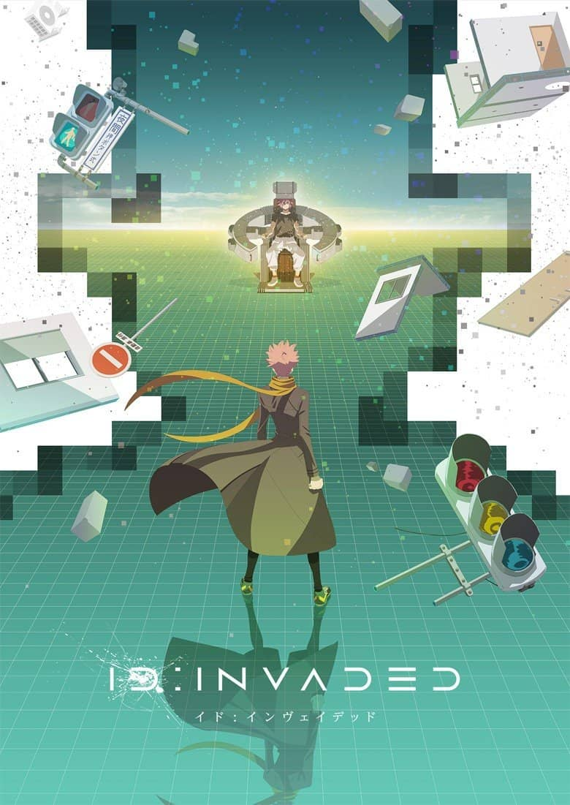

### **玉子市场**✅

> ⭐**5 值得一看\*\***?\***\*日常、治愈推荐**

\[label\]来源 京阿尼作品列表\[/label\] \[label\]动画 京都动画\[/label\] \[label\]原创动画\[/label\]\[label\]监督 山田尚子\[/label\] \[label\]治愈\[/label\] \[label\]日常\[/label\]

很有爱的一部日常喜剧番～很有京阿尼轻音的特点！

- TV 动画 2020 年 8 月 6 日 补完
- TV 动画 2020 年 7 月 - 8 月 补番中
- [萌娘百科](https://zh.moegirl.org.cn/%E7%8E%89%E5%AD%90%E5%B8%82%E5%9C%BA)

### **齐木楠雄的灾难 等一系列作品 ✅**

**（含 4 部全 56 话 1344 分钟）**

> ⭐**5 值得一看**?**日常、喜剧类推荐**

\[label\]来源 好友推荐\[/label\] \[label\]漫画改 集英社《周刊少年 JUMP》\[/label\] \[label\]动画制作 J.C.STAFF\[/label\] \[label\]喜剧\[/label\] \[label\]日常\[/label\] \[label\]校园\[/label\]

拥有超能力？也可能是灾难！粉毛的齐木楠雄从出生就拥有各种常人梦寐以求的超能力，但是这也惹出了不少乱子。集英社《周刊少年 JUMP》人气经典漫画，像大多数的《JUMP》漫画那样，本作故事中也暗含着不少对青春少年们常有的友情和成长的心情描写，搞笑的背后藏着不少感动。动画版因为人气火爆，收到重视，一共做了 56 话，1344 分钟的时长，基本上全部漫画剧情都进行了动画化，不用担心不够看（实际上这么长也不够看）

- **始动篇** 2020 年 8 月 19 日 完结！全五十六话 （第一二季一天两话）近一个月时间的欢乐，完结撒花，感谢陪伴！
- **始动篇** 2020 年 8 月 14 日 开始
- **完结篇** 2020 年 8 月 12 日 补完
- **完结篇** 2020 年 8 月 12 日 开始
- **第二季** 2020 年 8 月 11 日（0 点）补完！
- **第二季** 2020 年 7 月 开始
- **第一季** 2020 7 补完
- [萌娘百科](https://mzh.moegirl.org.cn/%E9%BD%90%E6%9C%A8%E6%A5%A0%E9%9B%84%E7%9A%84%E7%81%BE%E9%9A%BE) | [B 站会员](https://search.bilibili.com/bangumi?keyword=%E9%BD%90%E6%9C%A8%E6%A5%A0%E9%9B%84%E7%9A%84%E7%81%BE%E9%9A%BE)

### **NEW GAME!! ✅**

> **⭐5.5 值得一看?超爱\*\***?\***\*萌系、**轻百合优秀作品\*\*\*\*

\[label\]来源 已追作品续作\[/label\] \[label\]漫画改 芳文社\[/label\] \[label\]动画工房\[/label\] \[label\]萌系\[/label\] \[label\]职场\[/label\] \[label\]轻百合\[/label\]

期待！第三季有望~不过应该是有生之年了

- 漫画 持续追更中！目前在八十话前后
- 动画第二季 2020 年 8 月 5 日 补完
- 动画第二季 2020 年 7 月 24 日 开补
- [萌娘百科](https://mzh.moegirl.org.cn/NEW_GAME!) | [B 站免费](https://www.bilibili.com/bangumi/play/ss5027/) | [A 站免费](https://www.acfun.cn/bangumi/aa5025182_0_330338) | [原作漫画(动漫之家)](https://manhua.dmzj.com/newgame/) | [腾讯 VIP](http://m.v.qq.com/cover/t/t2n662xtx8gef1h.html?vid=l0026l5abfj)

### **Re：从零开始的异世界生活 第二季**⏸

> **无评分\*\***?\***\*异世界、奇幻类推荐 知名出圈作品**

\[label\]来源 已追作品续作\[/label\]

- 20 年 7 月 **放弃** 四年了 剧情忘完了 以后再补吧

.

### **工作细胞**✅

> ⭐**5 值得一看**?**优秀科普类作品**

\[label\]来源 未知\[/label\] \[label\]讲谈社《月刊少年天狼星》\[/label\] \[label\]动画 david production\[/label\] \[label\]科普\[/label\] \[label\]战斗\[/label\]

- 第二季 2020 年 预定
- 第一季 2020 年 7 月 23 日 补完
  - 中途因未知原因暂停，受[2020 年疫情](https://baike.baidu.com/item/2020%E5%B9%B4%E6%96%B0%E5%9E%8B%E5%86%A0%E7%8A%B6%E7%97%85%E6%AF%92%E7%96%AB%E6%83%85/24278151)在家开始的补番热潮的影响——2020 年暑假初才将本作补完，这也是 2019 年唯一的一部番剧动画。
- 第一季 2019 年 开始追

### **NEW GAME! ✅**

> **⭐5 值得一看\*\***?\***\*超爱\*\***?\***\*萌系、**轻百合优秀作品\*\*\*\*

\[label\]来源 哔哩哔哩推荐\[/label\] \[label\]漫画改 芳文社\[/label\] \[label\]动画工房\[/label\] \[label\]萌系\[/label\] \[label\]日常\[/label\] \[label\]轻百合\[/label\]

职场新人凉风青叶，高中毕业后进入学生时期就梦寐以求的游戏公司，开始了职场生涯。在从小崇拜的设计师光和诸位前辈的照顾下，逐渐获得了成年人的成熟和稳重。她能否制作出内心中最满意的游戏呢？

- 动画第一季 2020 年 7 月 23 日 补完
- [萌娘百科](https://mzh.moegirl.org.cn/NEW_GAME!) | [B 站免费](https://www.bilibili.com/bangumi/play/ss5027/) | [A 站免费](https://www.acfun.cn/bangumi/aa5025182_0_330338) | [原作漫画(动漫之家)](https://manhua.dmzj.com/newgame/) | [优酷免费](https://m.youku.com/alipay_video/id_XMTYzMjkxOTQyNA==.html) | [腾讯 VIP](http://m.v.qq.com/cover/h/hdk2c5cvu5nlhaa.html?vid=g00269cjduv)

### **日常**✅

> **⭐6 **值得一看?**超爱**?**日常系推荐**
>
> [Bgm](http://bgm.tv/subject/9912) **8.4**  [豆瓣](https://movie.douban.com/subject/4848701/) **9.4** [B 站](https://www.bilibili.com/bangumi/media/md844/) **9.9** **超高分好评如潮！**

\[label\]来源 京阿尼作品列表\[/label\] \[label\]京都动画\[/label\] \[label\]漫画 2006-2015 改\[/label\] \[label\]2011 年 4 月\[/label\] \[label\]喜剧\[/label\] \[label\]日常\[/label\] \[label\]治愈\[/label\]

**我们所经历的每个平凡的日常，也许就是连续发生的奇迹。**日々私たちが過ごしている日常は、実は、奇跡の連続なのかもしれない。

早期经典日常喜剧，也许开创了一个时代（？）

- 2020 6-7 补完
- [萌娘百科](https://zh.moegirl.org.cn/%E6%97%A5%E5%B8%B8)|[B 站会员独播](https://www.bilibili.com/bangumi/media/md844/)

### **POP TEAM EPIC**（**POP 子与 PIPI 美的日常**）✅

> **⭐3 可能不适合圈外人**

\[label color=orange\]ℹ️ 含有部分不宜内容，可能不能被所有人接受。\[/label\] \[label\]来源 [电脑糕](http://diannaogao.magma.ink)推荐\[/label\] \[label\]漫画改\[/label\] \[label\]动画 神风动画\[/label\] \[label\]搞笑\[/label\] \[label\]梗\[/label\] \[label\]日常大概\[/label\] \[label\]霸权自称\[/label\] \[label\]神经病\[/label\] \[label\]\*作\[/label\] \[label\]AC 部警告\[/label\] \[label\]恋爱这个可以有\[/label\] \[label\]？？？？？？\[/label\]

屑番... 这是一部全程都在玩梗的番，搞怪猎奇，有大量影视作品、番剧动画、游戏、日本文化生活相关的梗的搞笑短剧。能看懂的能 Get 到笑点，不懂的话就会全程蒙。

- 2020 6 补完
- [萌娘百科](https://zh.moegirl.org.cn/POP_TEAM_EPIC)

### **境界的彼方**✅

> **⭐4.5 还行**

\[label\]来源 京阿尼作品列表\[/label\] \[label\]轻小说改 KA Esuma 文库\[/label\] \[label\]京都动画\[/label\] \[label\]恋爱\[/label\] \[label\]奇幻\[/label\]

- 2020 6 补完
- [萌娘百科](https://zh.moegirl.org.cn/%E5%A2%83%E7%95%8C%E7%9A%84%E5%BD%BC%E6%96%B9)

### **虚构推理**✅

> **⭐3.5 一般**

\[label\]来源 哔哩哔哩推荐\[/label\] \[label\]动画 NAS\[/label\] \[label\]轻小说改 讲谈社\[/label\] \[label\]恋爱\[/label\] \[label\]推理\[/label\] \[label\]奇幻\[/label\]

- 2020 5-7 补完
- [萌娘百科](https://zh.moegirl.org.cn/%E8%99%9A%E6%9E%84%E6%8E%A8%E7%90%86)

### **鬼灭之刃 ✅**

<figure>

<figcaption>

日版主视觉图

</figcaption>

</figure>

> **⭐5 值得一看\*\***?\***\*战斗、励志类推荐**

\[label\]来源 哔哩哔哩推荐\[/label\] \[label\]动画制作 ufotable\[/label\] \[label\]原作 集英社《周刊少年 Jump》\[/label\] \[label\]战斗\[/label\] \[label\]励志\[/label\] \[label\]热血\[/label\]

- 剧场版**《**鬼灭之刃 无限列车篇》 官方 pv 定档 2020 年 10 月 16 日（日本）
- 第一季 2020 年 5 月至 6 月 补完 全 24 话
- [萌娘百科](https://mzh.moegirl.org.cn/%E9%AC%BC%E7%81%AD%E4%B9%8B%E5%88%83) | [B 站会员独播](https://www.bilibili.com/bangumi/play/ss26801/)

.

### **异度侵入 ID:INVADED✅**

> **⭐5.5 值得一看\*\*\*\***?**\*\***推理类必看作品\*\*

\[label\]来源 [电脑糕](http://diannaogao.magma.ink)推荐\[/label\] \[label\]动画制作 NAZ\[/label\] \[label\]原创动画\[/label\] \[label\]推理\[/label\] \[label\]科幻\[/label\] \[label\]悬疑\[/label\]

<figure>

<figcaption>

[本年新番榜](https://magma.ink/fanshare-2020/) #4

</figcaption>

</figure>

这个是真的推理番，科幻主题，在一月季度中有相当大的讨论度，目前已破一亿播放。据说这十几集制作了八年，对推理感兴趣的话强推！

- 2020 5 补完
- [Bangumi](http://bgm.tv/subject/285776) | [萌娘百科](https://zh.moegirl.org.cn/ID:INVADED)

### **地缚少年花子君**✅\*\*\*\*

> ⭐**5 值得一看\*\***?\***\*恋爱、魔幻系推荐**

\[label\]来源 20 年 1 月新番补\[/label\] \[label\]动画 Lerche\[/label\] \[label\]漫画改\[/label\] \[label\]恋爱\[/label\] \[label\]校园\[/label\] \[label\]奇幻\[/label\]

<figure>

<figcaption>

[本年新番榜](https://magma.ink/fanshare-2020/) #9

</figcaption>

</figure>

超甜恋爱番，画面继承了原作漫画的独特艺术感。推荐喜欢看恋爱的女生看，漫画也很不错。

- 2020 5 补完
- [萌娘百科](https://zh.moegirl.org.cn/%E5%9C%B0%E7%BC%9A%E5%B0%91%E5%B9%B4%E8%8A%B1%E5%AD%90%E5%90%9B#%E5%8B%95%E7%95%AB%E7%89%88)

### **小林家的龙女仆 ✅**

> **⭐4.5 值得一看\*\*\*\***?**\*\***日常系推荐\*\*

\[label\]来源 哔哩哔哩推荐\[/label\] \[label\]原作 双叶社《月刊 Action》\[/label\] \[label\]京都动画\[/label\] \[label\]日常\[/label\] \[label\]喜剧\[/label\]

日常喜剧，推荐一看！温暖轻松的轻日常超现实喜剧，京阿尼入坑作！本以为在[京阿尼大火事件](https://zh.moegirl.org.cn/2019%E5%B9%B47%E6%9C%8818%E6%97%A5%E4%BA%AC%E9%83%BD%E5%8A%A8%E7%94%BB%E7%AC%AC%E4%B8%80%E5%B7%A5%E4%BD%9C%E5%AE%A4%E7%BA%B5%E7%81%AB%E4%BA%8B%E4%BB%B6)和新冠疫情的影响第二季会遥遥无期，没想到这么快就来了！

[萌娘百科](https://zh.moegirl.org.cn/%E5%B0%8F%E6%9E%97%E5%AE%B6%E7%9A%84%E9%BE%99%E5%A5%B3%E4%BB%86#%E5%8A%A8%E7%94%BB%E7%89%88) | [B 站会员独播](https://www.bilibili.com/bangumi/media/md5800/)

### **天使降临到我身边！**✅\*\*\*\*

> ⭐**5 值得一看**?**超爱?日常、萌系猛男必看**

\[label color=pink\]来源 哔哩哔哩推荐\[/label\] \[label color=orange\]漫画改 一迅社《Comic 百合姬》\[/label\] \[label color=red\]动画工房\[/label\] \[label color=blue\]萌系牢饭三部曲\[/label\] \[label color=green\]日常\[/label\] \[label color=yellow\]轻百合\[/label\]

**虽然不知道，但是我最喜欢[宫姐](/%E6%98%9F%E9%87%8E%E5%AE%AB%E5%AD%90)了！** 分かんないけど、みゃ姉が一番好き！

**你知道嘛？| 本作中的 [星野日向](https://zh.moegirl.org.cn/%E6%98%9F%E9%87%8E%E6%97%A5%E5%90%91) 是我使用头像最多、时间最长、\[hidden tip="你知道的太多了" type="background"\]**最喜欢**\[/hidden\]的角色**

- 2020 5 补完
- [萌娘百科](https://zh.moegirl.org.cn/%E5%A4%A9%E4%BD%BF%E9%99%8D%E4%B8%B4%E5%88%B0%E4%BA%86%E6%88%91%E8%BA%AB%E8%BE%B9!) | [B 站会员独播](https://www.bilibili.com/bangumi/play/ss26291/) | 【哔哩哔哩】[天使降临到我身边 NCOP&NCED\[BD1080P+\]](https://www.bilibili.com/video/av47912203?p=1)

不知道说什么，来一首《[気ままな天使たち](https://zh.moegirl.org.cn/%E8%87%AA%E7%94%B1%E8%87%AA%E5%9C%A8%E7%9A%84%E5%A4%A9%E4%BD%BF%E4%BB%AC)》吧！
